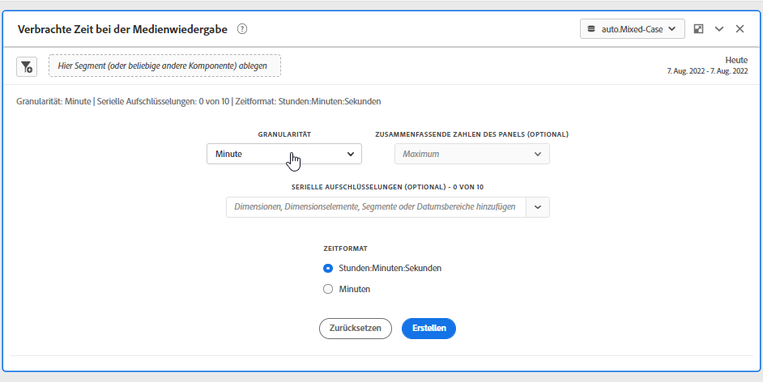
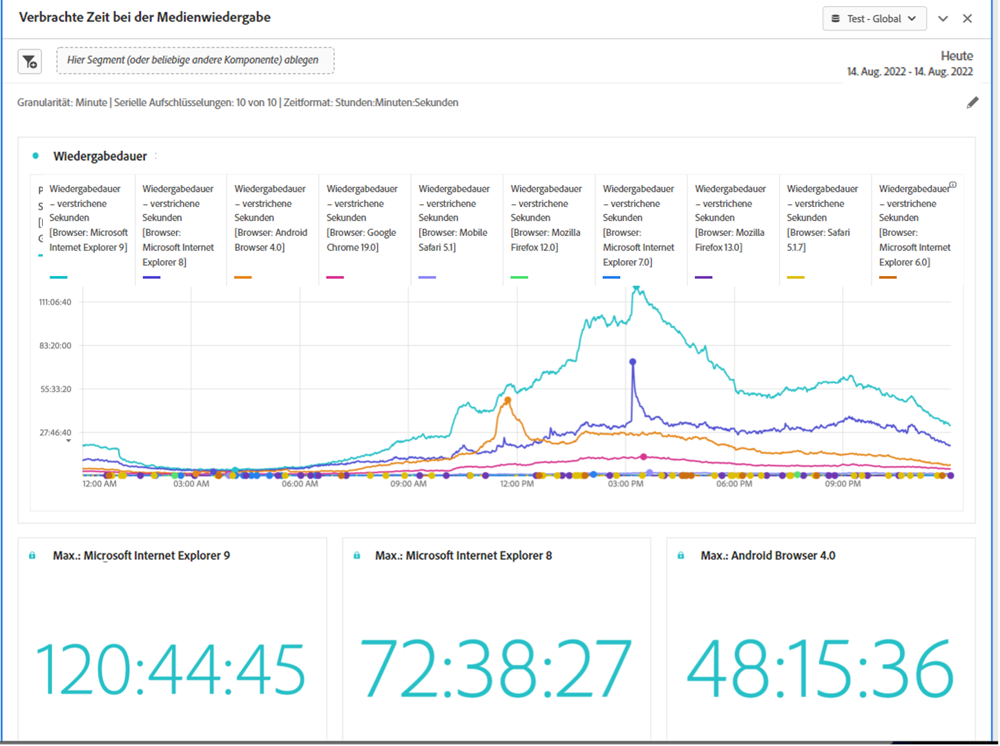

# Panel „Verbrachte Zeit bei der Medienwiedergabe“

In Analysis Workspace entspricht die Wiedergabedauer der Zeit, die mit der Anzeige Ihrer Medien-Streams zu einem bestimmten Zeitpunkt verbracht wurde. Er umfasst Pause, Puffer und Startzeit.

Das Panel „Verbrachte Zeit bei der Medienwiedergabe“ ermöglicht die Analyse der Medienwiedergabe im Zeitverlauf und bietet Details zu Spitzenzeiten, in denen besonders viele gleichzeitige Aufrufe stattfanden, sowie die Möglichkeit von Aufschlüsselungen und Vergleichen.

Media Analytics-Kunden können die Wiedergabedauer analysieren, um wertvolle Einblicke in die Qualität von Inhalten und die Interaktion mit Betrachtern zu erhalten und bei der Fehlerbehebung oder Planung in Bezug auf Volumen oder Größe zu helfen.

Die Wiedergabedauer kann Ihnen dabei helfen, Folgendes zu verstehen:

* Wo Spitzengleichzeitigkeit auftrat

* Wo es zu Abbrüchen kam

Im Folgenden finden Sie eine Videoübersicht zu diesem Bedienfeld

>[!VIDEO](https://video.tv.adobe.com/v/338699)

## Verwenden des Bedienfelds &quot;Besuchszeit für Medienwiedergabe&quot;

1. Wechseln Sie zu einer Report Suite mit aktivierten Media Analytics-Komponenten.

1. Wählen Sie das Bedienfeldsymbol ganz links aus und ziehen Sie dann das Bedienfeld in Ihr Analysis Workspace-Projekt.

1. Fahren Sie mit den folgenden Abschnitten fort, um das Bedienfeld Besuchszeit für Medienwiedergabe anzupassen

   * [Panel-Eingaben](#panel-inputs)
   * [Panel-Ausgabe](#panel-output)

## Panel-Eingaben {#Input}

Sie können das Panel „Verbrachte Zeit bei der Medienwiedergabe“ mithilfe der folgenden Eingabeeinstellungen konfigurieren:

| Einstellung | Beschreibung |
|---|---|
| Datumsbereich der Bedienfelder | Der Datumsbereich des Panels ist standardmäßig „Heute“. Sie können ihn so verändern, dass Sie einen einzelnen Tag oder viele Monate auf einmal betrachten können. Diese Visualisierung ist auf 1440 Datenzeilen beschränkt (z. B. 24 Stunden bei einer Granularität auf Minutenebene). Wenn eine Kombination aus Datumsbereich und Granularität zu mehr als 1440 Zeilen führt, wird die Granularität automatisch reduziert, um den vollständigen Datumsbereich zu erlauben. |
| Granularität | Die Standardeinstellung für die Granularität ist „Minute“. Diese Visualisierung ist auf 1440 Datenzeilen beschränkt (z. B. 24 Stunden bei einer Granularität auf Minutenebene). Wenn eine Kombination aus Datumsbereich und Granularität zu mehr als 1440 Zeilen führt, wird die Granularität automatisch reduziert, um den vollständigen Datumsbereich zu erlauben. |
| Zusammenfassende Zahlen der Bedienfelder | Um Details zu Datum und Uhrzeit für die verbrachte Zeit bei der Medienwiedergabe anzuzeigen, steht eine zusammenfassende Zahl zur Verfügung. Das Maximum zeigt Details zu Spitzenzeiten von gleichzeitigen Aufrufen an. Das Minimum zeigt Details zum Tiefpunkt an. In der Summe wird die gesamte Wiedergabezeit für diese Auswahl dargestellt. Im Panel wird standardmäßig nur der maximale Wert angezeigt. Sie können dies jedoch ändern, sodass das Minimum, die Summe oder eine beliebige Kombination der drei Werte angegeben wird. Wenn Sie Aufschlüsselungen verwenden, wird jeweils eine Zusammenfassungsnummer angezeigt. |
| Serienaufschlüsselung | Optional können Sie Ihre Visualisierung nach Filtern, Dimensionen, Dimensionselementen oder Datumsbereichen aufschlüsseln.
– Sie können bis zu 10 Zeilen auf einmal ansehen. Aufschlüsselungen sind auf eine einzelne Ebene beschränkt.

– Beim Ziehen einer Dimension werden die oberen Dimensionselemente automatisch anhand des im Panels ausgewählten Datumsbereichs ausgewählt.
– Ziehen Sie zum Vergleichen von Datumsbereichen zwei oder mehr Datumsbereiche in den Filter für die Aufschlüsselung der Serie. |
| Zeitformat | Sie können die Wiedergabedauer entweder in Stunden:Minutes:Sekunden (Standard) oder in Minuten anzeigen (in Ganzzahlen, auf 0,5 aufgerundet). |
| Anzeige der Datumsreihe | Wenn Sie mindestens zwei Datumsbereichsfilter als Serienaufschlüsselungen platziert haben, sehen Sie die Option, entweder Überlagerung (Standard) oder sequenziell auszuwählen. Bei der Überlagerung werden die Linien mit einem gemeinsamen X-Achsen-Beginn gezeigt, sodass sie parallel laufen, während bei der Sequenz die Linien mit ihrem jeweiligen X-Achsen-Beginn dargestellt werden. Wenn die Daten aufgerollt werden (z. B. Filter 1 endet um 20:44 Uhr und Filter 2 um 20:45 Uhr), werden die Zeilen nacheinander angezeigt. |

## Standardansicht

## Panel-Ausgabe {#Output}

Das Panel „Verbrachte Zeit bei der Medienwiedergabe“ gibt ein Liniendiagramm und zusammenfassende Zahlen zurück, die Details zur maximalen Wiedergabedauer, minimalen Wiedergabedauer und/oder der Summe der Wiedergabedauer enthalten. Oben im Bedienfeld wird eine Zusammenfassungszeile angezeigt, die Sie an die ausgewählten Bedienfeldeinstellungen erinnert.

Sie können das Bedienfeld jederzeit bearbeiten oder erneut erstellen, indem Sie oben rechts auf den Stift zum Bearbeiten klicken.

Wenn Sie Serienaufschlüsselung ausgewählt haben, wird für jeden der folgenden Punkte eine Zeile im Liniendiagramm und eine Zusammenfassungsnummer angezeigt:

### Datenquelle

Die einzige Metrik, die in diesem Panel verwendet werden kann, ist „Wiedergabedauer“.

| Metrik | Beschreibung |
|---|---|
| Wiedergabedauer | Summe der Stunden:minutes:Sekunden (oder Minuten) des Inhalts, der während der ausgewählten Granularität betrachtet wurde, einschließlich Pausen, Pufferung und der Zeit bis zum Start. |

## Häufig gestellte Fragen (FAQ)

| Frage | Antwort |
|---|---|
| Wo ist die Freiformtabelle? Wie kann ich die Datenquelle anzeigen? | 

Die Freiformtabelle ist in dieser Ansicht nicht verfügbar. Um die Datenquelle herunterzuladen, klicken Sie mit der rechten Maustaste auf das Liniendiagramm und laden Sie die CSV-Datei herunter.
 |
| 
Warum hat sich meine Granularität verändert?
 | 
Diese Visualisierung ist auf 1440 Datenzeilen beschränkt (z. B. 24 Stunden bei einer Granularität auf Minutenebene). Wenn die Kombination aus Datumsbereich und Granularität mehr als 1440 Zeilen ergibt, wird die Granularität automatisch aktualisiert, um den vollständigen Datumsbereich zu erfassen.

Wenn Sie von einem größeren auf einen kleineren Datumsbereich wechseln, wird die Granularität auf das niedrigste zulässige Detail aktualisiert, sobald der Datumsbereich geändert wird. Um eine höhere Granularität zu sehen, bearbeiten Sie das Bedienfeld und erstellen Sie es erneut.
 |
| 

Wie vergleiche ich Videonamen, Filter, Inhaltstypen usw.
 | 
Um diese in einer einzigen Visualisierung zu vergleichen, ziehen Sie Filter, Dimensionen oder bestimmte Dimensionselemente in den Filter für die Serienaufschlüsselung.

Die Ansicht ist auf 10 Aufschlüsselungen beschränkt. Um mehr als 10 ansehen zu können, müssen Sie mehrere Bedienfelder verwenden.
 |
| Wie vergleiche ich Datumsbereiche? | Um Datumsbereiche in einer einzigen Visualisierung zu vergleichen, verwenden Sie die Serienaufschlüsselungen, indem Sie zwei oder mehr Datumsbereiche in das Panel ziehen. Diese Datumsbereiche setzen den Datumsbereich des Bedienfelds außer Kraft. |
| Wie ändere ich den Visualisierungstyp? | 

Dieses Bedienfeld ermöglicht nur die Linienvisualisierung für die Zeitreihen.
 |
| Kann ich die Anomalieerkennung ausführen? | 

Nein. Die Anomalieerkennung ist für dieses Panel nicht verfügbar.
 |
