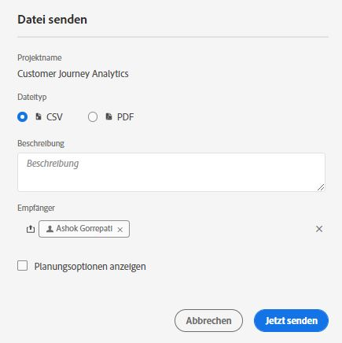
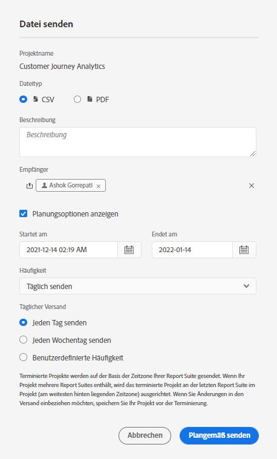

# Planen von Projekten

Über das Menü **Freigeben** in Workspace können Sie Analysis Workspace-Projekte per E-Mail an ausgewählte Empfänger senden. Dateien können im CSV- oder PDF-Format gesendet werden.

## Datei jetzt senden {#now}

So senden Sie eine Datei sofort per E-Mail an die Empfänger:

1. Klicken Sie auf **Freigeben > Datei jetzt senden**.
1. Geben Sie den Dateityp an (CSV oder PDF).
1. (Optional) Fuegen Sie eine Beschreibung hinzu, die in der E-Mail enthalten sein wird, um die empfangene Datei zu erklären.
1. Fügen Sie Empfänger oder Gruppen hinzu. E-Mail-Adressen können auch eingegeben werden.
1. (Nur für Kunden von Health Care Shield) Geben Sie ein Kennwort an. Siehe Abschnitt Kennwortschutz für terminierte Berichte .
1. Klicken Sie auf **Jetzt senden**.
1. (Optional) Klicken Sie auf **Planungsoptionen anzeigen**, um einen Zeitplan für den Versand festzulegen.

## Datei planmäßig senden {#schedule}

So senden Sie eine Datei basierend auf einem wiederkehrenden Zeitplan per E-Mail an die Empfänger:

1. Klicken Sie auf **Freigeben > Datei planmäßig senden**.
1. Geben Sie den Dateityp an (CSV oder PDF).
1. (Optional) Fuegen Sie eine Beschreibung hinzu, die in der E-Mail enthalten sein wird, um die empfangene Datei zu erklären.
1. Fügen Sie Empfänger oder Gruppen hinzu. E-Mail-Adressen können auch eingegeben werden.
1. (Nur für Kunden von Health Care Shield) Geben Sie ein Kennwort an. Siehe Abschnitt Kennwortschutz für terminierte Berichte .
1. Geben Sie den Datumsbereich an, über den anhand des Zeitplans gesendet werden soll, indem Sie die Einstellungen „Start am“ und „Ende am“ ändern. Das Enddatum muss innerhalb eines Jahres ab dem Tag liegen, an dem der Zeitplan erstellt oder geändert wurde.
1. Geben Sie die Versandhäufigkeit an. Jede Häufigkeit ermöglicht unterschiedliche Anpassungen.
1. Klicken Sie auf **Planmäßig senden**.

## Manager für geplante Projekte {#manager}

Geplante Analysis Workspace-Projekte können unter **Analytics > Komponenten > Geplante Projekte** verwaltet werden.

Im Manager für geplante Projekte können wiederkehrende Projektzeitpläne bearbeitet und gelöscht werden. Suchen Sie in der Suchleiste oder mithilfe der Filteroptionen in der linken Leiste nach einem Zeitplan. Sie können nach Tag, genehmigten Zeitplänen, Inhabern und mehr filtern.

Die folgenden Aktionen werden im Manager für geplante Projekte häufig ausgeführt:

| Aktion | Beschreibung |
|---|---|
| **Zeitplan bearbeiten** | Klicken Sie auf den Titel des Zeitplans, um seine Versandeinstellungen zu aktualisieren. |
| **Zeitplan löschen** | Wählen Sie das geplante Projekt in der Liste aus und klicken Sie dann im Menü auf „Löschen“. Dadurch wird der ausgewählte Zeitplan für das Projekt gelöscht. Das Projekt selbst wird nicht gelöscht. |
| **Tags hinzufügen** | Wählen Sie das geplante Projekt in der Liste aus und wählen Sie dann „Taggen“ oder „Genehmigen“ aus, um Ihre Zeitpläne zu organisieren und die Suche zu vereinfachen. |
| **Fehlgeschlagene Zeitpläne anzeigen** | Navigieren Sie zur linken Leiste > „Andere Filter“ > „Fehlgeschlagen“, um Zeitpläne anzuzeigen, die fehlgeschlagen sind. |
| **Abgelaufene Zeitpläne anzeigen** | Navigieren Sie zur linken Leiste > „Andere Filter“ > „Abgelaufen“, um Zeitpläne anzuzeigen, die abgelaufen sind. Klicken Sie auf den Titel des Zeitplans, um einen neuen Versandplan einzurichten. |
| **Zeitplan-ID anzeigen** | Navigieren Sie oben rechts zu den Spaltenoptionen und fügen Sie der Tabelle die Spalte „Zeitplan-ID“ hinzu. Die Zeitplan-ID ist oft zum Debugging nützlich. |

Im Manager für geplante Projekte werden die Elemente angezeigt, die von einem bestimmten Benutzer erstellt wurden. Wenn das Benutzerkonto in der Anwendung deaktiviert wird, werden alle geplanten Bereitstellungen gestoppt.

## Kennwortschutz für ein geplantes Projekt {#password}

>[!NOTE]
>
>Die Option zum Kennwortschutz für ein terminiertes Projekt wird nur für CJA-Kunden angezeigt, die die [Gesundheitsschild](https://experienceleague.adobe.com/docs/blueprints-learn/architecture/vertical-blueprints/healthcare-vertical.html%3Flang%3Den) Add-On-Produkt.

Adobe verwendet das Kennwort zum Verschlüsseln geplanter Projekte, unabhängig davon, ob sie im .pdf- oder .csv-Format gesendet werden.

Nachdem Ihr Unternehmen die SKU des Gesundheitsschilds erworben und dafür aktiviert hat, wird die Aufforderung zur Erstellung eines Kennworts für ein geplantes Projekt unter zwei Bedingungen angezeigt:

* Wenn jemand ein neues geplantes Projekt erstellt.

* Wenn ein vorhandenes terminiertes Projekt kurz vor dem Senden steht. Das aktuell geplante Projekt wird deaktiviert, bis der Kennwortschutz eingerichtet ist. Der Eigentümer des geplanten Projekts erhält zu diesem Zweck eine E-Mail.

### Passwortanforderungen

Die Passwortanforderungen entsprechen dem Adobe-Standard und erfordern mindestens 8 Zeichen mit einer Nummer und einem Sonderzeichen.

### Neues geplantes Projekt

1. Nachdem Sie Ihr Projekt gespeichert haben, gehen Sie zu &quot;Freigeben&quot;> &quot;Datei jetzt senden&quot;oder zu &quot;Freigeben&quot;> &quot;Datei planmäßig senden&quot;.
1. Befolgen Sie die Anweisungen oben unter Datei jetzt freigeben oder Datei planmäßig freigeben .

### Vorhandenes terminiertes Projekt

Vor dem Zeitpunkt, zu dem ein Projekt geplant ist, erhält der Projekteigentümer eine E-Mail wie die folgende:

1. Melden Sie sich wieder bei Customer Journey Analytics an.
1. Klicken **[!UICONTROL Geplantes Projekt anzeigen]**.
1. Im **[!UICONTROL Geplantes Projekt bearbeiten]** eingeben und ein Kennwort erneut eingeben.
1. Teilen Sie den Empfängern des geplanten Projekts (nur) dieses Kennwort mit.

