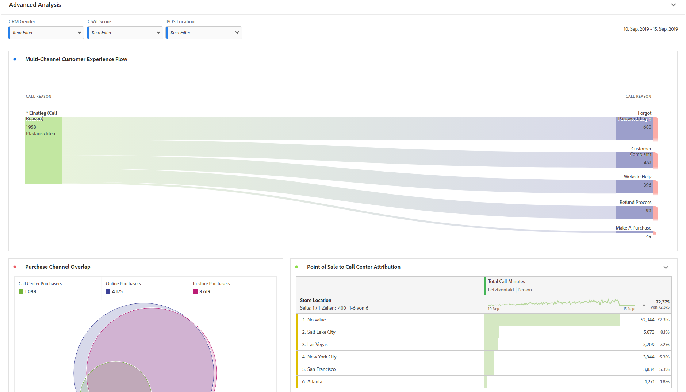
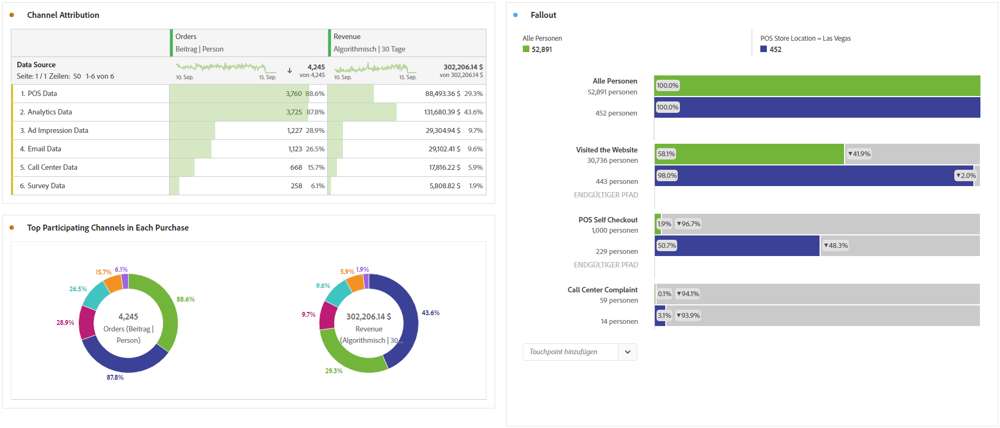

# Erweiterte Analyse durchführen

>[!NOTE]
>
>Dies ist die Dokumentation zu Analysis Workspace in Customer Journey Analytics. Seine Funktionen unterscheiden sich geringfügig von denen in [Analysis Workspace im herkömmlichen Adobe Analytics](https://docs.adobe.com/content/help/de-DE/analytics/analyze/analysis-workspace/home.html). [Weitere Informationen ...](/help/getting-started/cja-aa.md)

Die erweiterte Analyse nutzt Funktionen wie [Flussdiagramme, [Attribution IQ](/help/analysis-workspace/attribution/overview.md), [Trichteranalysen](/help/analysis-workspace/visualizations/fallout/fallout-flow.md) und [Dimensionsaufschlüsselungen](/help/components/dimensions/t-breakdown-fa.md).](/help/analysis-workspace/visualizations/c-flow/flow.md)

