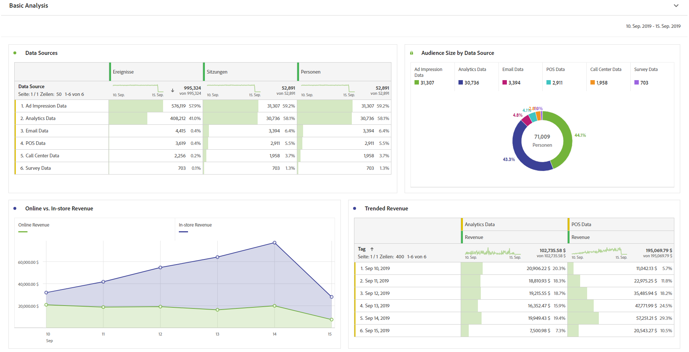

# Grundlegende Analyse durchführen

Nachdem Sie Verbindungen und Datenansichten erstellt haben, nutzen Sie die leistungsstarken und flexiblen Funktionen von Analysis Workspace, um Ihre eingebrachten Daten zu analysieren. Experimentieren Sie und schließen Sie Dimensionen und Metriken ein, ändern Sie Attributionseinstellungen für Dimensionen und Metriken, Anzeigenamen, Zeitzone und Sitzungseinstellungen usw.

Im Folgenden finden Sie ein Beispiel für grundlegende Visualisierungen in Arbeitsbereich. Sie können zum Beispiel

* einen Rangbericht erstellen, der anzeigt, welche Datenquellen die meisten Ereignisse, Sitzungen und Personen aufweisen,

* einen Trend-Bericht über Online- und In-Store-Umsätze erstellen, in dem die beiden Datenquellen im Zeitverlauf verglichen werden.

* Zeigen Sie die Zielgruppengröße anhand von Datenquellen an, z. B. Daten zu Ad-Impressions, Customer Journey Analytics-Daten, E-Mail-Daten, POS-Daten, Callcenter-Daten und Umfragedaten.

