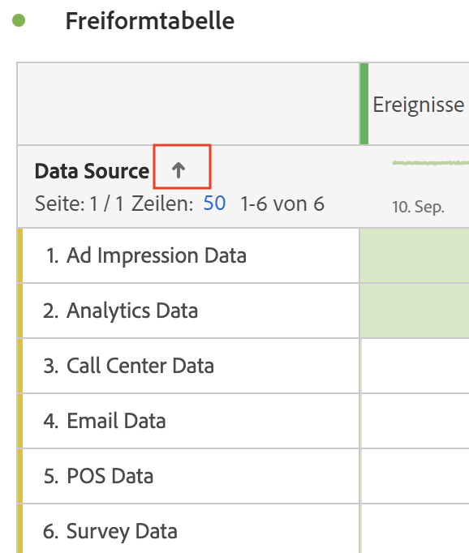

# Tabellen filtern und sortieren

Freiformtabellen in Analysis Workspace bilden die Grundlage für die interaktive Datenanalyse. Daher können sie Tausende von Informationszeilen enthalten. Das Filtern und Sortieren der Daten kann ein wichtiger Teil der effizienten Aufdeckung der wichtigsten Informationen sein.

<!--The following video covers filter and sort options in Analysis Workspace, in addition to pagination options:

>[!VIDEO](https://video.tv.adobe.com/v/23968)-->

## Tabellen filtern {#section_36E92E31442B4EBCB052073590C1F025}

Mit Filtern in Analysis Workspace können Sie die wichtigsten Informationen aufdecken.

So filtern Sie Daten in Freiformtabellen:

1. Bewegen Sie in einer Freiformtabelle den Mauszeiger über die Spalte, die die Daten enthält, die Sie filtern möchten. <!--only some types of columns show the filter... Which? Just Dimensions?-->

1. Wählen Sie die **Filter** angezeigt.

   

1. Im [!UICONTROL **Suchbegriff oder -satz**] ein Wort oder eine Wortgruppe angeben, nach dem/der Sie filtern möchten. Es werden nur Zeilen angezeigt, die das Wort oder den genauen Wortlaut enthalten.

1. (Optional) Um nach verschiedenen Kriterien oder nach mehreren Kriterien zu filtern, wählen Sie [!UICONTROL **Erweitert anzeigen**].

   Die folgenden Optionen sind verfügbar

   | Option | Funktion |
   |---------|----------|
   | [!UICONTROL **Nicht angegeben einschließen (keine)**] | Aktivieren Sie diese Option, um Daten in der Tabelle anzuzeigen, die nicht in eine der Dimensionen der Tabelle fallen. <!--what is this?--> |
   | [!UICONTROL **Übereinstimmung**] | 
Auswählen [!UICONTROL **Wenn alle Kriterien erfüllt sind**] um nur Daten anzuzeigen, die alle angegebenen Kriterien erfüllen. Diese Option führt normalerweise zu verfeinerten Daten.
 
Auswählen [!UICONTROL **Wenn ein Kriterium erfüllt ist**] um Daten anzuzeigen, die eines der von Ihnen angegebenen Filterkriterien erfüllen. Diese Option führt normalerweise zu weniger detaillierten Daten.
 |
   | [!UICONTROL **Kriterien**] | 
Wählen Sie aus den folgenden Filteroptionen aus:

(Auswahl [!UICONTROL **Zeile hinzufügen**] , um mehrere Filterkriterien hinzuzufügen. Die Option, die Sie im [!UICONTROL **Übereinstimmung**] bestimmt, ob alle oder eines der hinzugefügten Kriterien erfüllt sein müssen.)
<ul><li>
[!UICONTROL **Enthält die Wortgruppe**]: Nur Daten, die den von Ihnen angegebenen Satz enthalten, werden in die gefilterten Ergebnisse aufgenommen. Die Wörter müssen in der im Feld [!UICONTROL **Suchbegriff- oder Satzfeld**].
Dies ist die Standardeinstellung bei einer einfachen Suche.

</li><li>
[!UICONTROL **Enthält beliebige Begriffe**]: Nur Daten, die ein oder mehrere Wörter aus der von Ihnen angegebenen Wortgruppe enthalten, werden in die gefilterten Ergebnisse aufgenommen. 
</li><li>
[!UICONTROL **Enthält alle Begriffe**]: Nur Daten, die alle Wörter aus dem von Ihnen angegebenen Satz enthalten, werden in die gefilterten Ergebnisse aufgenommen. Die Wörter müssen nicht in der im Feld [!UICONTROL **Suchbegriff- oder Satzfeld**].
</li><li>
[!UICONTROL **Enthält keinen Begriff**]: Nur Daten, die keines der Wörter aus der von Ihnen angegebenen Wortgruppe enthalten, werden in die gefilterten Ergebnisse aufgenommen. 
</li><li>
[!UICONTROL **Enthält keine Wortgruppe**]: Nur Daten, die nicht den von Ihnen angegebenen genauen Wortlaut enthalten, werden in die gefilterten Ergebnisse aufgenommen. Die Wörter müssen in der im Feld [!UICONTROL **Suchbegriff- oder Satzfeld**].
</li><li>
[!UICONTROL **Gleich**]: Nur Daten, die genau mit der von Ihnen angegebenen Wortgruppe übereinstimmen, werden in die gefilterten Ergebnisse aufgenommen. 
</li><li>
[!UICONTROL **Ist nicht gleich**]: Nur Daten, die nicht genau mit der von Ihnen angegebenen Wortgruppe übereinstimmen, werden in die gefilterten Ergebnisse aufgenommen. 
</li><li>
[!UICONTROL **Beginnt mit**]: Nur Daten, die mit dem von Ihnen angegebenen Wort oder exakten Satz beginnen, werden in die gefilterten Ergebnisse aufgenommen. 
</li><li>
[!UICONTROL **Endet in**]: Nur Daten, die mit dem von Ihnen angegebenen Wort oder exakten Satz enden, werden in die gefilterten Ergebnisse aufgenommen. 
</li></ul> |
   | [!UICONTROL **Elemente immer ausschließen**] | Geben Sie den Namen der Elemente an, die Sie aus den gefilterten Daten ausschließen möchten. |

1. Auswählen [!UICONTROL **Anwenden**] , um die Daten zu filtern.

   Die **Filter** icon  blauer wird angezeigt, wenn ein Filter auf die Tabelle angewendet wird.

## Tabellen sortieren

Sie können die Daten einer Freiformtabelle nach jeder Spalte in Analysis Workspace sortieren, die entweder eine Dimension oder eine Metrik ist.

Symbol für einen Abwärtspfeil  ist in der Kopfzeile der Spalte sichtbar, nach der die Daten derzeit sortiert werden.

1. Klicken Sie in einer beliebigen Freiformtabelle in Analysis Workspace auf den Pfeil neben dem Namen der Dimension oder Metrik.

   Beachten Sie beim Sortieren Folgendes:

   * Der Nach-unten-Pfeil sortiert in absteigender Reihenfolge und der Nach-oben-Pfeil (Standard) in aufsteigender Reihenfolge.
   * Sie können Dimensionen alphabetisch oder numerisch sortieren. Beispielsweise können Sie in einem Workflow nummerierte Schritte verwenden und nach der Schrittnummer sortieren. Eine datumsbezogene Dimension kann nach Datum sortiert werden. Oder Sie können Datenquellen alphabetisch sortieren, wie in der folgenden Abbildung dargestellt.

   

