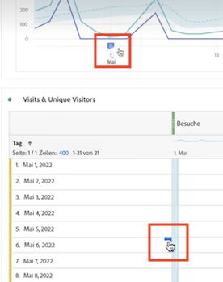
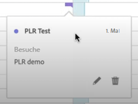
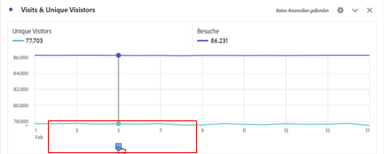
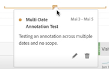
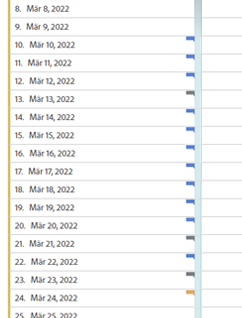
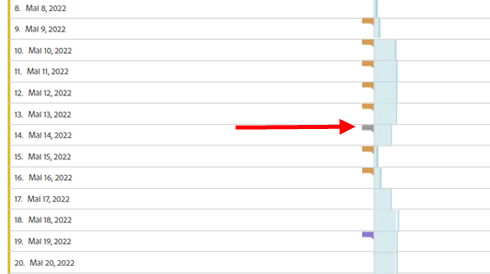
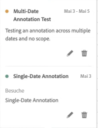
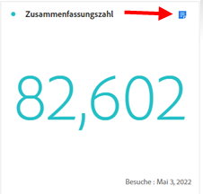
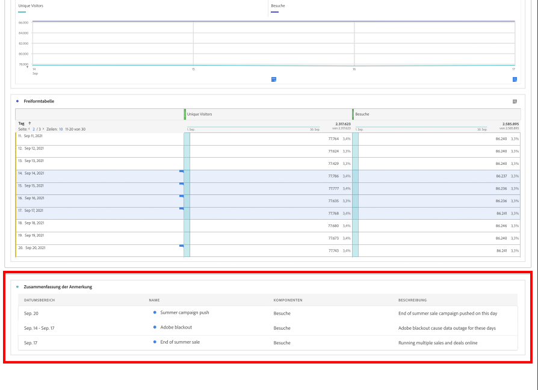
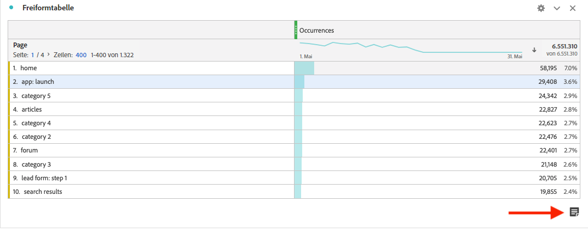

# Anzeigen von Anmerkungen

>[!NOTE]
>
>Diese Funktion wird derzeit eingeschränkt getestet.

Anmerkungen werden je nachdem, ob sie sich über einen einzelnen Tag oder einen Datumsbereich erstrecken, etwas unterschiedlich angezeigt.

## Anzeigen von Anmerkungen in Liniendiagrammen oder Tabellen

| Datum | Erscheinungsbild |
| --- | --- |
| **Einzeltag** | 
Wenn Sie den Mauszeiger über die Anmerkung bewegen, können Sie deren Details anzeigen, sie durch Auswahl des Stiftsymbols bearbeiten oder sie löschen:
  |
| **Datumsbereich** | Das Symbol ändert sich, und wenn Sie den Mauszeiger darüber bewegen, wird der Datumsbereich angezeigt.

Wenn Sie sie im Liniendiagramm auswählen, werden die Anmerkungsmetadaten angezeigt und Sie können sie bearbeiten oder löschen:
In einer Tabelle wird an jedem Datum im Datumsbereich ein Symbol angezeigt.
 |
| **Überlappende Anmerkungen** | An Tagen mit mehr als einer Anmerkung wird das Symbol grau dargestellt.

Wenn Sie den Mauszeiger über das graue Symbol bewegen, werden alle überlappenden Anmerkungen angezeigt:
 |

## Anzeigen von Anmerkungen in einem Zusammenfassungsdiagramm

## Anzeigen von Anmerkungen in einer PDF-Datei

Da Symbole in einer PDF-Datei nicht auf den Mauszeiger reagieren können, enthält diese Datei (nach dem Export) am unteren Rand eines Bedienfelds Anmerkungen zu Erklärungen. Siehe folgendes Beispiel:

## Anzeigen von Anmerkungen, die nicht auf Daten basieren

Manchmal sind Anmerkungen nicht an ein Datum gebunden, sondern an eine bestimmte Dimension. In diesem Fall werden sie nur in einer Zusammenfassungsanmerkung in der rechten unteren Ecke angezeigt. Siehe folgendes Beispiel:

