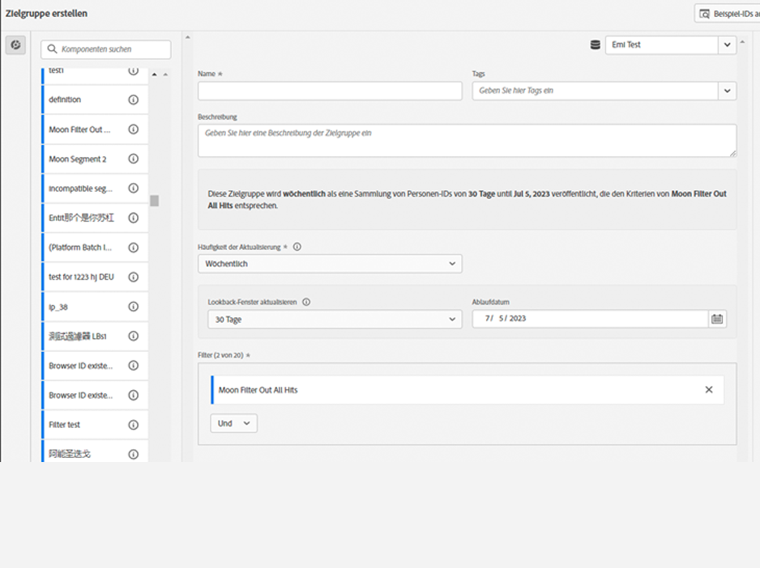
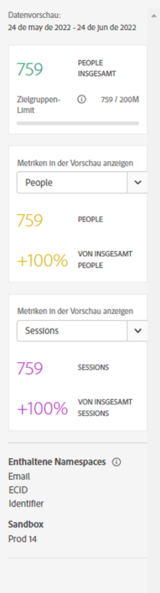
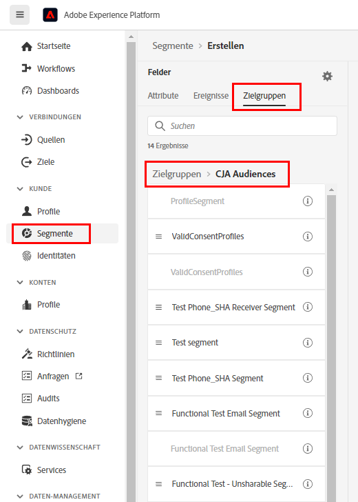

# Erstellen und Veröffentlichen von Zielgruppen

In diesem Abschnitt wird beschrieben, wie Sie Zielgruppen, die in Customer Journey Analytics (CJA) identifiziert wurden, im [Echtzeit-Kundenprofil](https://experienceleague.adobe.com/docs/experience-platform/profile/home.html?lang=de) in Adobe Experience Platform erstellen und veröffentlichen, um Targeting und Personalisierung durchzuführen.

Lesen Sie diese [Übersicht](/help/components/audiences/audiences-overview.md), um sich mit dem Konzept der CJA-Zielgruppen vertraut zu machen.

## Zielgruppe erstellen {#create}

1. Bei der Erstellung von Zielgruppen stehen Ihnen drei Möglichkeiten zur Verfügung:

   | Erstellungsmethode | Details |
   | --- | --- |
   | Über das Hauptmenü **[!UICONTROL Komponenten] > [!UICONTROL Zielgruppen]**: | Die Seite „Zielgruppen-Manager“ wird geöffnet. Klicken Sie auf **[!UICONTROL Zielgruppe erstellen]**. [!UICONTROL Audience Builder] wird geöffnet. |
   | Über eine Freiformtabelle: | Klicken Sie mit der rechten Maustaste auf ein Element in einer Freiformtabelle und wählen Sie **[!UICONTROL Zielgruppe aus einer Auswahl erstellen]** aus. Mit dieser Methode wird der Filter vorab mit der Dimension oder dem Dimensionselement ausgefüllt, die bzw. das Sie in der Tabelle ausgewählt haben. |
   | Über die Benutzeroberfläche zur Erstellung/Bearbeitung von Filtern: | Markieren Sie das Kästchen **[!UICONTROL Zielgruppe über diesen Filter erstellen]**. Mit dieser Methode wird der Filter vorab ausgefüllt. |

   {style=&quot;table-layout:auto&quot;}

1. Erstellen Sie die Zielgruppe.

   Konfigurieren Sie diese Einstellungen. Danach können Sie die Zielgruppe veröffentlichen.

   

   | Einstellung | Beschreibung |
   | --- | --- |
   | [!UICONTROL Name] | Der Name der Zielgruppe. |
   | [!UICONTROL Tags] | Alle Tags, die Sie der Zielgruppe aus organisatorischen Gründen zuweisen möchten. Sie können ein bereits vorhandenes Tag verwenden oder ein neues eingeben. |
   | [!UICONTROL Beschreibung] | Fügen Sie der Zielgruppe eine Beschreibung hinzu, um sie von anderen leicht unterscheiden zu können. |
   | [!UICONTROL Häufigkeit der Aktualisierung] | Die Häufigkeit, mit der Sie die Zielgruppe aktualisieren möchten.<ul><li>Sie können eine einmalige Zielgruppe (Standard) erstellen, die nicht aktualisiert werden muss. Dies könnte beispielsweise bei bestimmten einmaligen Kampagnen der Fall sein.</li><li>Sie können auch andere Aktualisierungsintervalle auswählen. Für alle Aktualisierungsfrequenzen gilt je nach Ihrer CJA-Berechtigung eine Beschränkung von 75 oder 150 Zielgruppen.</li></ul> |
   | Ablaufdatum | Wann die Aktualisierung der Zielgruppe beendet ist. Der Standardwert liegt bei 1 Jahr ab dem Erstellungsdatum. Vor der Beendigung der Zielgruppen-Aktualisierung erhält der Administrator ähnlich wie bei der Beendigung von geplanten Berichten einen Monat vor Ablauf der Zielgruppe eine E-Mail. |
   | Lookback-Fenster aktualisieren | Gibt an, wie weit Sie im Datenfenster bei der Erstellung dieser Zielgruppe zurückgehen möchten. Die Höchstdauer beträgt 90 Tage. |
   | [!UICONTROL Einmaliger Datumsbereich] | Datumsbereich, in dem die einmalige Zielgruppe veröffentlicht werden soll. |
   | [!UICONTROL Filter] | Filter sind die Hauptauswahloptionen für die Zielgruppe. Sie können bis zu 20 Filter hinzufügen. Diese Filter können mit `And`- oder `Or`-Operatoren verbunden werden. |
   | [!UICONTROL Beispiel-IDs anzeigen] | Beispiel für IDs in dieser Zielgruppe. Verwenden Sie die Suchleiste, um nach Beispiel-IDs zu suchen. |

   {style=&quot;table-layout:auto&quot;}

1. Interpretieren Sie die Datenvorschau.

   Die Zielgruppenvorschau wird in der rechten Leiste angezeigt. Sie ermöglicht eine zusammengefasste Analyse der von Ihnen erstellten Zielgruppe.

   

   | Vorschaueinstellung | Beschreibung |
   | --- | --- |
   | [!UICONTROL Datenvorschau]-Fenster | Der Datumsbereich für die Zielgruppe. |
   | [!UICONTROL Personen insgesamt] | Die Gesamtzahl der Personen in dieser Zielgruppe. Sie kann bis zu 20 Millionen Personen umfassen. Wenn Ihre Zielgruppe mehr als 20 Millionen Personen umfasst, müssen Sie die Zielgruppengröße verringern, bevor Sie sie veröffentlichen können. |
   | [!UICONTROL Zielgruppen-Limit] | Zeigt an, wie weit diese Zielgruppe vom Limit von 20 Millionen entfernt ist. |
   | [!UICONTROL Geschätzte Zielgruppenrendite] | Diese Einstellung ist nützlich für das Retargeting von Kunden in dieser Zielgruppe, die zu Ihrer Site zurückkehren. (Mit anderen Worten, werden diese in diesem Datensatz erneut angezeigt.) 
Hier können Sie den Zeitraum (nächste 7 Tage, nächste 2 Wochen, nächsten Monat) für die geschätzte Anzahl der Kunden auswählen, die möglicherweise zurückkehren. |
   | [!UICONTROL Voraussichtliche Rückkehr] | Mit dieser Zahl erhalten Sie eine geschätzte Anzahl an wiederkehrenden Kunden über den von Ihnen aus der Dropdown-Liste ausgewählten Zeitraum. Für die Vorhersage dieser Zahl wird die historische Abwanderungsrate für diese Zielgruppe herangezogen. |
   | [!UICONTROL Metriken in der Vorschau anzeigen] | Mit dieser Einstellung können Sie bestimmte Metriken betrachten, um festzustellen, ob diese Zielgruppe in dieser Metrik unverhältnismäßig stark vertreten ist, z. B. in [!UICONTROL Umsatz] oder [!UICONTROL Durchschnittliche Besuchszeit pro Site]. Damit erhalten Sie eine aggregierte Zahl für die Metrik sowie den Prozentsatz der Gesamtzahl. Sie können eine beliebige Metrik auswählen, die in Ihrer Datenansicht verfügbar ist. |
   | [!UICONTROL Enthaltene Namespaces] | Die spezifischen Namespaces, die mit den Personen in Ihrer Zielgruppe verknüpft sind. Beispiele sind ECID, CRM-ID, E-Mail-Adressen usw. |
   | [!UICONTROL Sandbox] | Die [Experience Platform-Sandbox](https://experienceleague.adobe.com/docs/experience-platform/sandbox/home.html?lang=de), in der sich diese Zielgruppe befindet. Wenn Sie diese Zielgruppe in Platform veröffentlichen, können Sie sie nur innerhalb dieser Sandbox verwenden. |

   {style=&quot;table-layout:auto&quot;}

1. Überprüfen Sie Ihre Zielgruppenkonfiguration und klicken Sie auf **[!UICONTROL Veröffentlichen]**.

   Nach erfolgreicher Veröffentlichung erhalten Sie eine Bestätigungsnachricht, dass die Zielgruppe veröffentlicht wurde. Es dauert nur ein bis zwei Minuten, bis diese Zielgruppe in Experience Platform angezeigt wird. (Selbst für Zielgruppen mit Millionen von Personen dauert es normalerweise weniger als 5 Minuten.)

1. Klicken Sie in derselben Nachricht auf **[!UICONTROL Zielgruppe in AEP anzeigen]**. Sie gelangen zur [Segment-Benutzeroberfläche](https://experienceleague.adobe.com/docs/experience-platform/segmentation/ui/overview.html?lang=de) in Adobe Experience Platform. Weitere Informationen finden Sie unten.

## Verwenden von CJA-Zielgruppen in Experience Platform {#audiences-aep}

CJA nimmt jetzt alle Namespace- und ID-Kombinationen aus Ihrer veröffentlichten Zielgruppe und überträgt sie in das Echtzeit-Kundenprofil. CJA sendet die Zielgruppe an Experience Platform, wobei die primäre Identität auf den Wert festgelegt ist, der bei der Verbindungskonfiguration als Personen-ID ausgewählt wurde.

Das Echtzeit-Kundenprofil untersucht dann jede Namespace/ID-Kombination und sucht nach einem passenden Profil. Ein Profil ist im Grunde eine Gruppe verknüpfter Namespaces, IDs und Geräte. Wenn ein Profil gefunden wird, werden der Namespace und die ID zu den anderen IDs in diesem Profil als Segmentzugehörigkeits-Attribut hinzugefügt. Jetzt kann beispielsweise „user@adobe.com“ auf allen Geräten und Kanälen als Ziel ausgewählt werden. Wenn kein Profil gefunden wird, wird ein neues erstellt.

Sie können CJA-Zielgruppen in Platform anzeigen. Gehen Sie dazu zu **[!UICONTROL Segmente]** > **[!UICONTROL Segmente erstellen]** > Registerkarte **[!UICONTROL Zielgruppen]** > **[!UICONTROL CJA-Zielgruppen]**.

Sie können CJA-Zielgruppen in die Segmentdefinition für AEP-Segmente ziehen.

## Was passiert, wenn eine benutzende Person nicht mehr Mitglied einer Zielgruppe in CJA ist? {#no-member}

In diesem Fall wird ein Exit-Ereignis von CJA an Experience Platform gesendet.

## Was passiert, wenn Sie eine Zielgruppe in Customer Journey Analytics löschen? {#delete}

Wenn eine CJA-Zielgruppe gelöscht wird, wird sie nicht mehr in der Experience Platform-Benutzeroberfläche angezeigt. In Platform werden jedoch keine mit dieser Zielgruppe verknüpften Profile gelöscht.

## Nächste Schritte

* Um diese Zielgruppe zu verwalten, navigieren Sie zur [Verwaltungs-Benutzeroberfläche](/help/components/audiences/manage.md).
