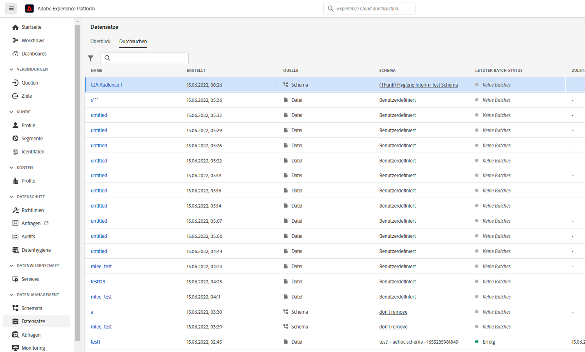

# Erstellen und Veröffentlichen von Zielgruppen

>[!NOTE]
>
>Diese Funktion ist derzeit in [begrenzte Tests](/help/release-notes/releases.md).

In diesem Thema wird beschrieben, wie Sie Zielgruppen erstellen und veröffentlichen, die in Customer Journey Analytics (CJA) in [Echtzeit-Kundenprofil](https://experienceleague.adobe.com/docs/experience-platform/profile/home.html?lang=de) in Adobe Experience Platform für Kunden-Targeting und Personalisierung.

Lesen Sie dies [Übersicht](/help/components/audiences/audiences-overview.md) sich mit dem Konzept der CJA-Zielgruppen vertraut zu machen.

## Zielgruppe erstellen

1. Zur Erstellung von Zielgruppen haben Sie drei Möglichkeiten:

   | Erstellungsmethode | Details |
   | --- | --- |
   | Aus der Hauptrolle **[!UICONTROL Komponenten] > [!UICONTROL Zielgruppen]** Menü | Die Seite &quot;Zielgruppen-Manager&quot;wird geöffnet. Klicken **[!UICONTROL Zielgruppe erstellen]** und [!UICONTROL Audience Builder] geöffnet. |
   | Aus einer Freiformtabelle | Klicken Sie mit der rechten Maustaste auf ein Element in einer Freiformtabelle und wählen Sie **[!UICONTROL Erstellen einer Zielgruppe aus einer Auswahl]**. Mit dieser Methode wird der Filter vorab mit der Dimension oder dem Dimensionselement ausgefüllt, die bzw. das Sie in der Tabelle ausgewählt haben. |
   | Über die Benutzeroberfläche zur Erstellung/Bearbeitung von Filtern | Markieren Sie das Kästchen mit der Angabe **[!UICONTROL Erstellen einer Zielgruppe aus diesem Filter]**. Mit dieser Methode wird der Filter vorab ausgefüllt. |

   {style=&quot;table-layout:auto&quot;}

1. Erstellen Sie die Zielgruppe.

   Konfigurieren Sie diese Einstellungen, bevor Sie die Zielgruppe veröffentlichen können.

   

   | Einstellung | Beschreibung |
   | --- | --- |
   | [!UICONTROL Name] | Der Name der Zielgruppe. |
   | [!UICONTROL Tags] | Alle Tags, die Sie der Zielgruppe für organisatorische Zwecke zuweisen möchten. Sie können ein bereits vorhandenes Tag verwenden oder ein neues eingeben. |
   | [!UICONTROL Beschreibung] | Fügen Sie eine gute Beschreibung der Zielgruppe hinzu, um sie von anderen zu unterscheiden. |
   | [!UICONTROL Häufigkeit der Aktualisierung] | Die Häufigkeit, mit der Sie die Zielgruppe aktualisieren möchten.<ul><li>Sie können eine einmalige Zielgruppe (Standard) erstellen, die nicht aktualisiert werden muss. Dies wäre beispielsweise bei bestimmten einmaligen Kampagnen hilfreich.</li><li>Sie können auch andere Aktualisierungsintervalle auswählen. Für die 4-Stunden-Frequenz gibt es eine Beschränkung von 150 Zielgruppen, da diese Aktualisierungsrate sehr verarbeitungsintensiv ist. Für andere Intervalle gibt es keine maximale Anzahl von Zielgruppen.</li></ul> |
   | Ablaufdatum | Wann die Aktualisierung der Audience beendet wird. Der Standardwert liegt bei 1 Jahr ab dem Erstellungsdatum. Das Auslaufen von Zielgruppen wird ähnlich wie das Auslaufen geplanter Berichte behandelt - der Administrator erhält einen Monat vor Ablauf der Zielgruppe eine E-Mail. |
   | Lookback-Fenster aktualisieren | Gibt an, wie weit Sie im Datenfenster bei der Erstellung dieser Audience zurückgehen möchten. Die maximale ist 90 Tage. |
   | [!UICONTROL Einmaliger Datumsbereich] | Datumsbereich, in dem die einmalige Zielgruppe veröffentlicht werden soll. |
   | [!UICONTROL Filter] | Filter sind die Haupteingaben für die Zielgruppe. Sie können bis zu 20 Filter hinzufügen. Diese Filter können mit `And` oder `Or` Operatoren. |
   | [!UICONTROL Beispiel-IDs anzeigen] | Beispiel für IDs in dieser Zielgruppe. Verwenden Sie die Suchleiste, um nach Beispiel-IDs zu suchen. |

   {style=&quot;table-layout:auto&quot;}

1. Interpretieren Sie die Datenvorschau.

   Die Zielgruppenvorschau wird in der rechten Leiste angezeigt. Dies ermöglicht eine erweiterte Analyse der von Ihnen erstellten Audience.

   

   | Vorschaueinstellung | Beschreibung |
   | --- | --- |
   | [!UICONTROL Datenvorschau] Fenster | Der Datumsbereich für die Zielgruppe. |
   | [!UICONTROL Personen insgesamt] | Zusammenfassende Anzahl der Personen in dieser Zielgruppe. Es kann bis zu 100 Millionen Menschen umfassen. Wenn Ihre Zielgruppe mehr als 100 Millionen Benutzer umfasst, müssen Sie die Zielgruppengröße verringern, bevor Sie sie veröffentlichen können. |
   | [!UICONTROL Zielgruppen-Limit] | Zeigt an, wie weit diese Zielgruppe von der Beschränkung von 100 Millionen entfernt ist. |
   | [!UICONTROL Geschätzte Zielgruppenrendite] | Diese Einstellung ist nützlich für das Retargeting von Kunden in dieser Zielgruppe, die zu Ihrer Site zurückkehren. (Mit anderen Worten, die werden in diesem Datensatz erneut angezeigt.) 
Hier können Sie den Zeitraum (nächste 7 Tage, nächste 2 Wochen, nächsten Monat) für die geschätzte Anzahl der Kunden auswählen, die möglicherweise zurückkehren. |
   | [!UICONTROL Voraussichtliche Rückkehr] | Mit dieser Zahl erhalten Sie eine geschätzte Anzahl an wiederkehrenden Kunden über den von Ihnen aus der Dropdownliste ausgewählten Zeitraum. Wir sehen uns die historische Abwanderungsrate für diese Zielgruppe an, um diese Zahl vorherzusagen. |
   | [!UICONTROL Metriken in der Vorschau anzeigen] | Mit dieser Einstellung können Sie bestimmte Metriken betrachten, um zu sehen, ob diese Zielgruppe zu dieser Metrik einen unverhältnismäßig hohen Beitrag leistet, z. B.[!UICONTROL Umsatz]&#39; or &#39;[!UICONTROL Durchschnittliche Besuchszeit pro Site]&quot;. Es gibt Ihnen die aggregierte Anzahl der Metriken sowie den Prozentsatz der Gesamtanzahl, die sie darstellt. Sie können eine beliebige Metrik auswählen, die in Ihrer Datenansicht verfügbar ist. |
   | [!UICONTROL Enthaltene Namespaces] | Die spezifischen Namespaces, die mit den Personen in Ihrer Zielgruppe verknüpft sind. Beispiele sind ECID, CRM-ID, E-Mail-Adressen usw. |
   | [!UICONTROL Sandbox] | Die [Experience Platformen-Sandbox](https://experienceleague.adobe.com/docs/experience-platform/sandbox/home.html?lang=de) in der sich diese Zielgruppe befindet. Wenn Sie diese Zielgruppe in Platform veröffentlichen, können Sie sie nur innerhalb der Grenzen dieser Sandbox verwenden. |

   {style=&quot;table-layout:auto&quot;}

1. Überprüfen Sie Ihre Zielgruppenkonfiguration und klicken Sie auf **[!UICONTROL Veröffentlichen]**.

   Wenn alles gut gelaufen ist, erhalten Sie eine Bestätigungsnachricht, dass die Zielgruppe veröffentlicht wurde.

1. Klicken **[!UICONTROL Anzeigen der Zielgruppe in AEP]** innerhalb derselben Nachricht und Sie gelangen zum [Segmentbenutzeroberfläche](https://experienceleague.adobe.com/docs/experience-platform/segmentation/ui/overview.html?lang=de) in Adobe Experience Platform. Weitere Informationen finden Sie unten.

## Verwenden von CJA-Zielgruppen in Experience Platform

CJA nimmt jetzt alle Namespace- und ID-Kombinationen aus Ihrer veröffentlichten Zielgruppe und streamt sie in das Echtzeit-Kundenprofil. RTCP untersucht dann jede Namespace/ID-Kombination und sucht nach einem Profil, zu dem sie gehören kann. Wenn sie eine findet, werden der Namespace und die ID zu den anderen IDs in diesem Profil als Segmentmitgliedsattribut hinzugefügt. Jetzt kann beispielsweise &quot;user@adobe.com&quot;über alle seine Geräte und Kanäle hinweg als Ziel ausgewählt werden. Wenn kein Profil gefunden wird, wird ein neues erstellt.

Sie können CJA-Zielgruppen in Platform anzeigen, indem Sie **[!UICONTROL Segmente]** > **[!UICONTROL Segmente erstellen]** > **[!UICONTROL Zielgruppen]** tab > **[!UICONTROL CJA-Zielgruppen]**.

Sie können CJA-Zielgruppen in die Segmentdefinition für AEP-Segmente ziehen.

Wenn Sie sich dafür entscheiden, diese Zielgruppe in den AEP Data Lake zu exportieren, wird sie als Datensatz angezeigt, der der XDM Individual Profile Schema Class entspricht:

## Nächste Schritte

* Um diese Zielgruppe zu verwalten, navigieren Sie zum [Management-Benutzeroberfläche](/help/components/audiences/manage.md).
