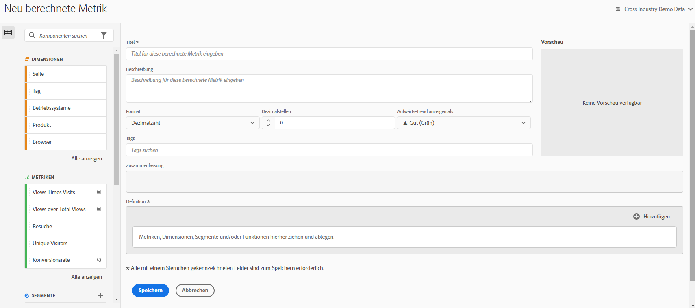

# Metriken erstellen

Der Generator für berechnete Metriken bietet eine Arbeitsfläche, in der Sie Dimensionen, Metriken, Filter und Funktionen per Drag-and-Drop verschieben können, um benutzerdefinierte Metriken basierend auf Container-Hierarchielogik, Regeln und Operatoren zu erstellen. Mit diesem integrierten Entwicklungstool können Sie einfache berechnete Metriken oder komplexe, erweiterte berechnete Metriken erstellen und speichern.

Sie erreichen den Generator für berechnete Metriken auf verschiedene Arten:

* Öffnen Sie ein Projekt in Analysis Workspace und klicken Sie auf **[!UICONTROL + Neu]** > **[!UICONTROL Metrik erstellen]**.
* Gehen Sie in [!DNL Analytics] zu **[!UICONTROL Komponenten]** > **[!UICONTROL Berechnete Metriken]**.

* Klicken Sie oben im [Manager für berechnete Metriken](/help/components/calc-metrics/cm-workflow/cm-manager.md) auf **[!UICONTROL + Hinzufügen]** oder

* gehen Sie zu **[!UICONTROL Analytics]** > **[!UICONTROL Berichte]**, öffnen Sie einen beliebigen Bericht und klicken Sie auf das Metrikensymbol , um die Metrikenleiste aufzurufen. Klicken Sie dann auf **[!UICONTROL Hinzufügen]**.

## Komponenten der Benutzeroberfläche {#ui-components}

| Feld | Beschreibung |
| --- | --- |
| Anrede/Titel | Ein Name für die Metrik ist obligatorisch. Sie können nur benannte Metriken speichern. |
| Beschreibung | Geben Sie der Metrik eine benutzerfreundliche Beschreibung, um ihren Zweck anzugeben und sie von ähnlichen Metriken zu unterscheiden. Die Beschreibung wird auch in Berichten angezeigt. Sie sollten die Formel NICHT in die Beschreibung aufnehmen. Erläutern Sie stattdessen, wofür diese Metrik verwendet werden sollte und wofür nicht. (Die Formel wird unter der Überschrift „Zusammenfassung“ generiert, während Sie die Metrik erstellen. Daher müssen Sie die Formel nicht noch der Beschreibung hinzufügen.) |
| Format | Hier können Sie zwischen „Dezimal“, „Zeit“, „Prozent“ und „Währung“ wählen. |
| Dezimalstellen | Zeigt an, wie viele Dezimalstellen im Bericht angezeigt werden. Sie können maximal 10 Dezimalstellen angeben. |
| Aufwärts-Trend anzeigen als...  | Diese Einstellung für die Metrikpolarität legt fest, ob Analytics einen Aufwärtstrend in der Metrik als positiv (grün) oder negativ (rot) betrachten soll. Dementsprechend wird ein steigendes Diagramm des Berichts grün oder rot angezeigt. |
| Währung | Die Basiswährung für diese Datenansicht. |
| Tags | Anhand von Tagging können Metriken praktisch organisiert werden. Alle Benutzer können Tags erstellen und eines oder mehrere Tags auf eine Metrik anwenden. Sie sehen Tags jedoch nur für die Segmente, deren Inhaber Sie sind oder die für Sie freigegeben wurden. Welche Arten von Tags sollten Sie erstellen? Hier finden Sie einige Vorschläge für nützliche Tags:<ul><li>Auf Teamnamen basierende Tags wie Social Marketing, Mobile Marketing</li><li>Projekt-Tags (Analyse-Tags) wie Entrypage-Analyse</li><li>Kategorie-Tags: Männer, Region</li><li>Workflow-Tags: Genehmigung ausstehend, kuratiert für (einen bestimmten Geschäftsbereich).</li></ul> |
| Zusammenfassung | Die Formel unter [!UICONTROL Zusammenfassung] wird jedes Mal, wenn Sie die Metrikdefinition ändern, aktualisiert. Diese Formel wird außerdem in der Metrikleiste links angezeigt, wenn Sie mit der Maus auf eine Metrik zeigen und auf das Symbol klicken. |
| Definition | Hierhin ziehen Sie die Metriken/berechneten Metriken, Filter und/oder Funktionen, um die berechnete Metrik zu erstellen. Wenn Sie eine berechnete Metrik hierhin ziehen, wird die zugehörige Metrikdefinition automatisch eingeblendet. Sie können Definitionen mit Containern verschachteln. Im Gegensatz zu Segmentcontainern funktionieren diese Container allerdings wie ein mathematischer Ausdruck und bestimmen die Reihenfolge der Vorgänge. |
| Operator | [!UICONTROL Geteilt durch] ist der Standardoperator. Darüber hinaus gibt es die Operatoren +, - und x. |
| Vorschau | Ermöglicht einen schnellen Einblick in potenzielle Fehler. Die Vorschau deckt die letzten 90 Tage ab. So können Sie schnell einschätzen, ob Sie die richtigen Komponenten für die Metrik ausgewählt haben. Bei einem unerwarteten Ergebnis müssten Sie die Metrikdefinition noch einmal genauer prüfen. |
| Produktkompatibilität | Über die Produktkompatibilität können Sie sehen, ob die Metrik mit vollständig verarbeiteten Daten kompatibel ist. |
| Fügen Sie | Sie können Container und statische Nummern zu den Definitionen aller Arten berechneter Metriken hinzufügen. Für erweiterte berechnete Metriken können Sie auch Filter und Funktionen hinzufügen.<ul><li>Container funktionieren wie mathematische Ausdrücke und bestimmen die Reihenfolge der Vorgänge. Jedes Element in einem Container wird also vor dem nächsten Vorgang verarbeitet.</li><li>Wenn Sie ein Segment in einen Container ziehen, werden alle Elemente in diesem Container segmentiert. (Nur erweiterte berechnete Metriken)</li><li>Sie können mehrere Filter in einem Container stapeln.</li></ul> |
| Zahnradsymbol (Metriktyp, Attribution) | Wenn Sie das Zahnradsymbol neben einer Metrik auswählen, können Sie den Metriktyp und die Attributionsmodelle angeben. |
| + Neu | Ermöglicht Ihnen die Erstellung einer neuen Komponente, z. B. eines neuen Filters (Sie werden zum Filter Builder geleitet). |
| Suchkomponenten | Mit dieser Suchleiste können Sie nach Dimensionen, Metriken, Segmenten (nur erweiterte berechnete Metriken) und Funktionen (nur erweiterte berechnete Metriken) suchen. |
| Liste von Dimensionen | Zum Erstellen eines einfachen Filters (im Filter Builder) müssen Sie den Generator für berechnete Metriken nicht verlassen. So können Sie z. B., anstatt „Seite = Homepage“ einzugeben, das Element „Seite“ hereinziehen und „Homepage“ direkt im Generator für berechnete Metriken auswählen. So profitieren Sie von einem deutlich optimierten Arbeitsablauf bei der Erstellung gefilterter berechneter Metriken. |
| Liste von Metriken | Metriken sind in drei Kategorien eingeteilt:<ul><li>Standardmetriken</li><li>Berechnete Metriken</li><li>Metrikvorlagen – unten in der Liste.</li></ul>Wenn Sie mit dem Mauszeiger auf eine Metrik zeigen, wird das Infosymbol rechts neben der Metrik angezeigt. Durch Klicken auf dieses Symbol erhalten Sie die folgenden Informationen:<ul><li>Die Formel für die Berechnung der Metrik.</li><li>Ein Vorschautrend der Metrik.</li><li>Ein Bearbeitungssymbol (Bleistift) oben rechts, über das Sie zum Generator für berechnete Metriken gelangen, wo Sie diese berechnete Metrik bearbeiten können.</li></ul> |
| Liste von Filtern | (Nur erweiterte berechnete Metriken) Wenn Sie Administrator sind, zeigt Ihnen diese Liste alle in Ihrem Anmeldeunternehmen erstellten Filter an. Wenn Sie kein Administrator sind, zeigt diese Liste die Filter an, deren Eigentümer Sie sind, sowie die Filter, die für Sie freigegeben wurden. |
| Liste von Funktionen | (Nur erweiterte berechnete Metriken) Funktionen werden in zwei Listen aufgeteilt: Einfach (am häufigsten verwendet) und Erweitert. |
| Datenansicht-Auswahlhilfe | Mit diesem Selektor (oben rechts) können Sie zu einer anderen Datenansicht wechseln. |

