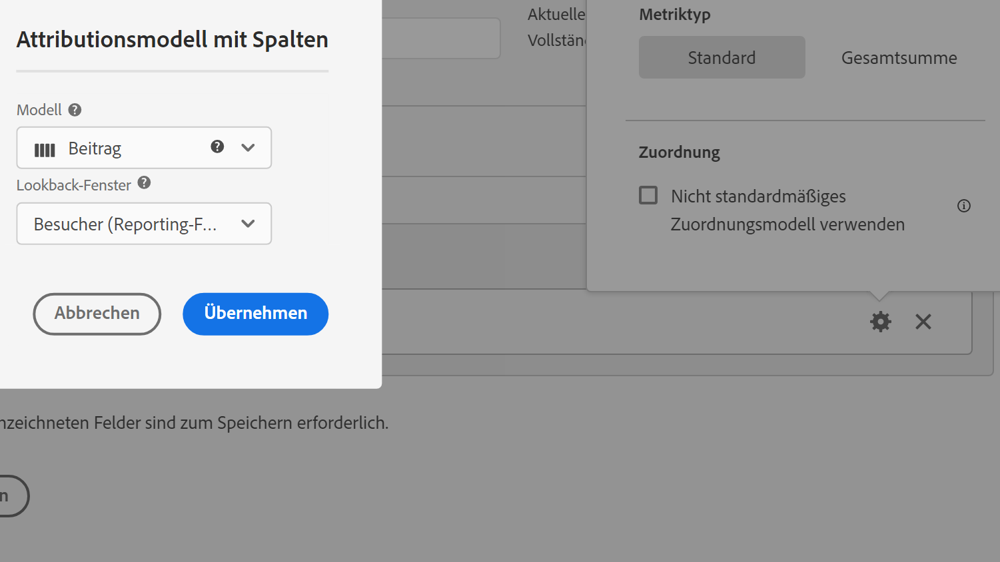

# Metriktyp und Attribution

Wenn Sie das Zahnradsymbol neben einer Metrik auswählen, können Sie den Metriktyp und das Attributionsmodell angeben.

## Metriktyp

So legen Sie den Metriktyp beim Erstellen einer berechneten Metrik fest:

1. Wählen Sie das Zahnradsymbol neben der Metrik aus, deren Typ Sie auswählen möchten.

   

1. Wählen Sie aus den folgenden Optionen:

   | Metriktyp | Definition |
   |---|---|
   | Standard | Diese Metriken sind dieselben, die auch in der Standard-[!DNL Analytics]-Berichterstellung verwendet werden. Wenn eine Formel aus einer einzelnen Standardmetrik besteht, zeigt sie die gleichen Daten wie das nicht berechnete Metrikgegenstück an. Standardmetriken eignen sich zum Erstellen berechneter Metriken, die speziell für die einzelnen Einzelposten gelten. Beispiel: [Bestellungen]/[Besuche] teilt die Bestellungen für diesen Einzelposten durch die Anzahl der Besuche für den Posten. |
   | Gesamtsumme | Verwenden Sie in jedem Zeileneintrag die Gesamtsumme für den Berichtszeitraum. Wenn eine Formel aus einer einzelnen Gesamtmetrik bestand, wird für jeden Zeileneintrag dieselbe Gesamtsumme angezeigt. Gesamtmetriken sind nützlich für die Erstellung berechneter Metriken, die mit den Gesamtdaten der Site vergleichen. Beispiel: [Bestellungen]/[Gesamtbesuche] zeigt den Anteil der Bestellungen für ALLE Site-Besuche und nicht nur die Besuche für den speziellen Zeileneintrag. |

## Attribution

Informationen zur Attribution in Customer Journey Analytics finden Sie unter [Einstellungen der Attribution-Komponente](/help/data-views/component-settings/attribution.md).
