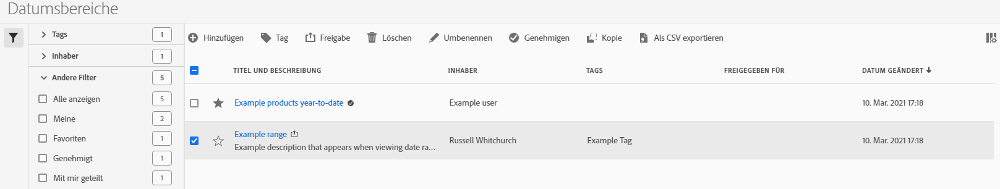

# Verwalten von Datumsbereichen

Verwenden Sie den Datumsbereichs-Manager, um Datumsbereiche freizugeben, umzubenennen oder zu löschen. So greifen Sie auf den Datumsbereichs-Manager zu:

1. Melden Sie sich mit Ihren Adobe ID-Anmeldeinformationen bei [analytics.adobe.com](https://analytics.adobe.com) an.
1. Navigieren Sie zu [!UICONTROL Komponenten] > [!UICONTROL Datumsbereiche].

## Benutzeroberfläche

Der Datumsbereichs-Manager umfasst die folgenden Optionen:

* **Hinzufügen**: Neuen Datumsbereich hinzufügen. Weitere Informationen finden Sie unter [Erstellen eines Datumsbereichs](create.md).
* **Suche nach Titel**: Suchen nach einem Datumsbereich nach Titel. Die Ergebnisse werden anhand des hier eingegebenen Texts gefiltert.
* **Filtern**: Filtern Sie Datumsbereiche mithilfe der linken Spalte. Sie können nach benutzerdefiniertem Tag, Inhaber, von Ihnen erstellten Inhalten, Ihren Favoriten, genehmigten oder für Sie freigegebenen Inhalten filtern. Sie können auch nach gewünschten Filtern suchen.
* **Favorit**: Klicken Sie auf das  neben einem Datumsbereich, um ihn zu Ihren Favoriten hinzuzufügen.
* **Spalten anpassen**: Klicken Sie auf das Symbol , um Spalten im Datumsbereich-Manager ein- oder auszublenden.

Aktivieren Sie das Kontrollkästchen neben einem oder mehreren Datumsbereichen, um weitere Optionen anzuzeigen.

* **Tag**: Wendet ein Tag auf alle ausgewählten Datumsbereiche an. Mit Tags können Sie Datumsbereiche ordnen und mithilfe der linken Spalte filtern.
* **Freigeben**: Gibt einen Datumsbereich für andere Experience Cloud-Benutzer frei. Wenn Sie Produkt-Administrator sind, können Sie Inhalte auch für die gesamte Organisation oder für alle Gruppen freigeben. Datumsbereiche, die für andere Benutzer in Ihrer Organisation freigegeben sind, enthalten das Symbol  neben dem Titel.
* **Löschen**: Ausgewählte(n) Datumsbereich(e) dauerhaft löschen.
* **Umbenennen**: Wenn ein einzelner Datumsbereich ausgewählt ist, können Sie den Titel ändern.
* **Genehmigen**: Wenn Sie Produktadministrator sind, können Sie einem Datumsbereich einen Genehmigungsstempel hinzufügen. Genehmigte Datumsbereiche informieren Benutzer in Ihrer Organisation, dass sie „offiziell“ sind, was sie von Datumsbereichen unterscheidet, die von anderen Benutzern in Ihrer Organisation erstellt wurden. Genehmigte Datumsbereiche enthalten das Symbol  neben dem Titel.
* **Genehmigung aufheben**: Wenn Sie Produktadministrator sind und einen bereits genehmigten Datumsbereich auswählen, können Sie die Genehmigung aufheben.
* **Kopieren**: Erstellt einer Kopie des/der ausgewählten Datumsbereichs/Datumsbereiche. Beim Kopieren von Datumsbereichen wird „`(Copy)`“ am Ende des Titels der neu kopierten Datumsbereiche angehängt.
* **Als CSV exportieren**: Exportiert alle ausgewählten Datumsbereiche in eine CSV-Datei. Die Spalten in der resultierenden CSV-Datei enthalten alle im Datumsbereichs-Manager sichtbaren Spalten.
