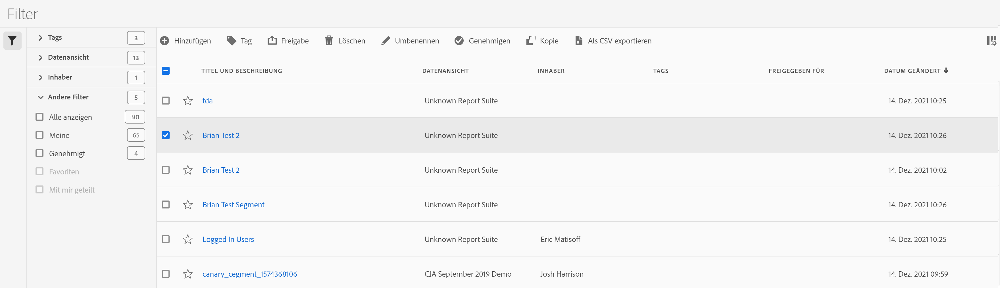

# Filter verwalten

Der Filter-Manager bietet viele Angebote zum Kuratieren von Filtern, wie Freigeben, Taggen, Genehmigen, Kopieren, Löschen und Markieren als Favoriten.

Der Filter-Manager zeigt Ihnen alle Filter, die sich in Ihrem Besitz befinden und für Sie freigegeben wurden. Benutzer auf Administratorebene können alle Filter der Organisation anzeigen. Dieser Überblick stellt die Benutzeroberfläche und die Funktionen des Filter-Managers vor.

Rufen Sie den Filter-Manager auf, indem Sie in der oberen Navigation zu **[!UICONTROL Kunden-Journey-Analyse]** > **[!UICONTROL Komponenten]** > **[!UICONTROL Filter]** wechseln.

## Filter Manager-Benutzeroberfläche

| # | Funktion der Benutzeroberfläche | Beschreibung |
|---|---|---|
| 1 | Werkzeugleiste für die Filterverwaltung | Diese Werkzeugleiste wird angezeigt, sobald Sie einen Filter aktivieren. Über diese Werkzeugleiste können die meisten Verwaltungsaufgaben erledigt werden. |
| 2 | Kontrollkästchen | Aktivieren Sie einen Filter, um ihn zu verwalten. |
| 4 | Favoriten | Wenn Sie auf den Stern neben einem Filter klicken, wird der Stern gelb und der Filter als Favorit markiert. |
| 5 | Titel und Beschreibung | Werden durch den Filtergenerator bereitgestellt. Klicken Sie auf den Titel-Link, um den Titel und die Beschreibung zu bearbeiten. Dadurch gelangen Sie zurück zum Filtergenerator. |
| 7 | Inhaber | Zeigt an, wer Inhaber des Filters ist. Wenn Sie kein Administrator sind, können Sie nur Filter sehen, deren Inhaber Sie sind, sowie Filter, die für Sie freigegeben wurden. |
| 8 | Tags (in der Spaltenauswahl nicht aktiviert, weshalb die Spalte nicht angezeigt wird) | Tags, die entweder durch Sie oder durch Personen, die einen Filter für Sie freigegeben haben, auf den Filter angewendet wurden. |
| 9 | Freigegeben für | Zeigt Personen oder Gruppen (nur Administrator) oder „Alle“ (nur Administrator) an, für die Sie den Filter freigegeben haben. |
| 10 | Änderungsdatum | Zeigt das Datum der letzten Änderung des Filters an. |
| 11 | Spaltenauswahl | (Oben rechts) Hier können Sie auswählen, welche Spalten im Filter-Manager angezeigt werden sollen. |
| 12 | Gemeinsam-Symbol | Gibt an, dass dieser Filter von Ihnen oder für Sie freigegeben wurde. |
| 13 | Freigegeben-Symbol | Gibt an, dass dieser Filter durch einen Administrator genehmigt wurde. |
| 14 | Andere Filter | Hier können Sie Filter nach Tags, Ansichten, Inhabern und anderen anzeigen (Alle anzeigen, Meine, Für mich freigegeben, Genehmigt, Favoriten). |

## Filter planen

Wenn Sie sich etwas Zeit für die Planung von Filtern widmen, verbessert sich die Wahrscheinlichkeit, dass diese für Ihr Unternehmen nützlich sein werden und dass die Anzahl der Mitarbeiter kontrolliert wird.

* Bedenken Sie die Zielgruppe: Wer wird ihn benutzen? Für wen werden Sie er freigeben? Welche Personengruppe wird diesen Filter benutzen und wie sollte er demnach getaggt werden? Dies erfordert auch eine gute Filterbeschreibung. Die Beschreibung sollte mindestens die folgenden Fragen beantworten:

   * Wofür ist dieser Filter nützlich?

   * Wann sollte dieser Filter benutzt werden?

* Legen Sie den Filterumfang fest. Welcher [Filter-Container](/help/components/filters/filters-overview.md) stellt den Umfang am besten dar? Benutzen Sie den kleinstmöglichen Container.

* Entscheiden Sie, welche Elemente und welche Werte in die Filterdefinition aufgenommen werden.

* Überlegen Sie, wie der Genehmigungsprozess verlaufen soll. Wird eine einzelne Person die Filter prüfen und genehmigen oder wird dies die Entscheidung einer Kommission sein?

* Definieren Sie Ihre Filter mit Blick auf eine Filterbibliothek, die Unternehmensbenutzern die Möglichkeit gibt, Teile oder Komponenten von Filtern modular zu stapeln und wiederzuverwenden. Welche „Module“ müssen Sie definieren, um diese Bibliothek zu realisieren?

### Filter taggen

Durch das Taggen von Filtern können Sie diese im Filter-Manager organisieren. Alle Benutzer können Tags für Filter erstellen und einen oder mehrere Tags auf einen Filter anwenden. Sie sehen Tags jedoch nur für die Filter, deren Inhaber Sie sind oder die für Sie freigegeben wurden.

Welche Arten von Tags sollten Sie erstellen? Hier finden Sie einige Vorschläge für nützliche Tags:

* Auf Teamnamen basierende Tags wie Social Marketing, Mobile Marketing

* Projekt-Tags (Analyse-Tags) wie Entrypage-Analyse

* Kategorie-Tags: Männer, Region

* Workflow-Tags: Genehmigung ausstehend, kuratiert für (einen bestimmten Geschäftsbereich).

Taggen eines Filters:

1. Aktivieren Sie im Filter-Manager das Kontrollkästchen neben dem Filter, den Sie taggen möchten. Die Werkzeugleiste für die Filterverwaltung wird angezeigt.

1. Klicken Sie auf **[!UICONTROL Taggen]** und

   * wählen Sie entweder ein vorhandenes Tag aus oder

   * Geben Sie einen neuen Tag-Namen ein und drücken Sie **[!UICONTROL die Eingabetaste]**.

1. Klicken Sie erneut auf **[!UICONTROL Tag]**, um den Filter zu taggen.

Das Tag wird jetzt in der Spalte „Tags“ angezeigt. (Klicken Sie oben rechts auf das Zahnradsymbol, um Ihre Spalten zu verwalten.)
Sie können unter **[!UICONTROL Filter > Tags]** auch nach Tags filtern.

### Filter genehmigen

Im Filter-Manager können Sie einen Workflow einrichten, der das Genehmigen von Filtern für verschiedene Anwendungsebenen, für bestimmte Abteilungen oder Gruppen umfasst und mit den Berichtserstellungsrichtlinien übereinstimmt.

So wird ein Filter als genehmigt gekennzeichnet:

1. Aktivieren Sie im Filter-Manager das Kontrollkästchen links neben dem Filtertitel.

1. Klicken Sie in der Aufgabe der Filterverwaltung auf **[!UICONTROL Genehmigen]**.

1. Erwägen Sie, die genehmigten Filter für Ihr Unternehmen freizugeben.

1. Klicken Sie auf **[!UICONTROL OK]**.

   Beachten Sie, dass in der Liste neben dem Filter ein Genehmigungssymbol angezeigt wird:

   

1. Sie können die Genehmigung eines genehmigten Filters auch aufheben, indem Sie auf **[!UICONTROL Nicht genehmigen]** klicken.

### Filter freigeben

Abhängig von Ihren Berechtigungen können Sie Filter für Ihre gesamte Organisation, Gruppen oder einzelne Benutzer freigeben.

| Administrator | Nicht-Administrator |
|---|---|
| Kann Filter für alle, für Gruppen und für Benutzer freigeben. Weitere Informationen finden Sie in der [Dokumentation zu Admin Console](https://helpx.adobe.com/de/enterprise/using/manage-products-and-profiles.html). | Kann Filter nur für einzelne Benutzer freigeben. |

Wann sollten Filter für das gesamte Unternehmen und wann nur für eine Benutzergruppe oder einzelne Benutzer freigegeben werden? Im Folgenden finden Sie einige Best Practices, an denen Sie sich orientieren können:

* Geben Sie als Administrator einen Filter für alle frei, wenn er für das gesamte Unternehmen von Nutzen ist und von jedem problemlos verwendet werden kann. In diesem Fall sollten Sie den Filter eventuell auch genehmigen.

* Geben Sie als Administrator einen Filter für ein bestimmtes Produktprofil frei, wenn der Filter für das entsprechende Team einen Geschäftswert bietet. Führen Sie für diesen Filtertyp keine offizielle Genehmigung durch.

* Geben Sie als Administrator oder als einzelner Benutzer einen Filter für andere einzelne Benutzer frei, um einen Filter zu prüfen und zu validieren. Wenn er sich als nicht nützlich erweist, kann er verworfen werden. Führen Sie für diesen Filtertyp keine offizielle Genehmigung durch.

Freigeben eines Filters:

1. Aktivieren Sie im Filter-Manager das Kontrollkästchen neben dem Filter, den Sie freigeben möchten.

1. Klicken Sie in der Symbolleiste für die Filterverwaltung auf **[!UICONTROL Freigeben]**.

1. Wenn Sie Administrator sind, können Sie „Alle“ oder Gruppen und Benutzer in Ihrer Organisation auswählen. Als Nicht-Administrator sehen Sie nur einzelne Benutzer. Benutzen Sie das Suchfeld, um nach Gruppen oder Benutzern zu suchen. Klicken Sie auf **[!UICONTROL Freigabe]**. Neben dem Filter wird das Freigabesymbol angezeigt: 

1. Sie können nach für Sie freigegebenen Filtern filtern, indem Sie „Filter“ > „Weitere Filter“ > „Für mich freigegeben“ verwenden.

### Filter als Favoriten markieren

Die Kennzeichnung von Filtern als Favoriten ist eine weitere Möglichkeit, sie für eine einfache Verwendung zu organisieren.

1. Klicken Sie im Filter-Manager auf den Stern neben allen Filtern, die Sie als Favoriten kennzeichnen möchten. Der Stern wird gelb, wenn Sie ihn auswählen.

1. Sie können unter „Filter“ > „Weitere Filter“ > „Favoriten“ nach Favoriten filtern.
