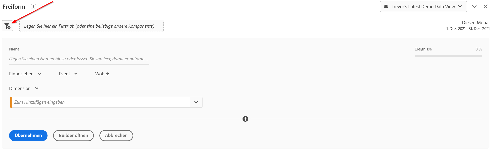
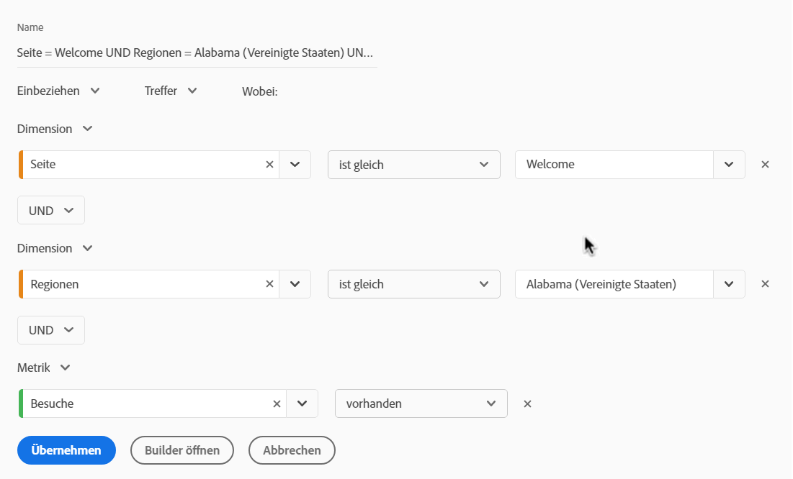
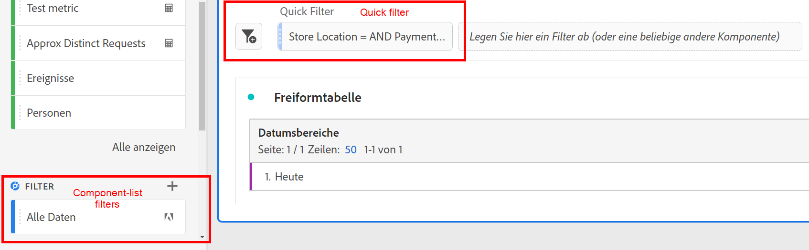
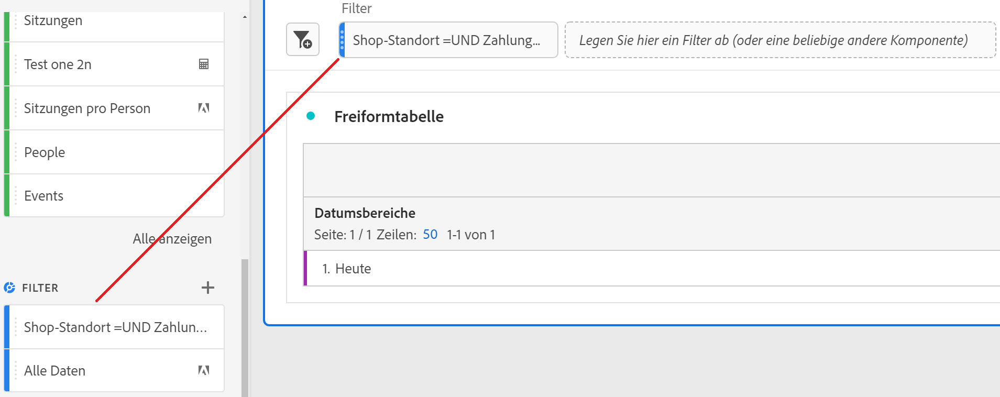
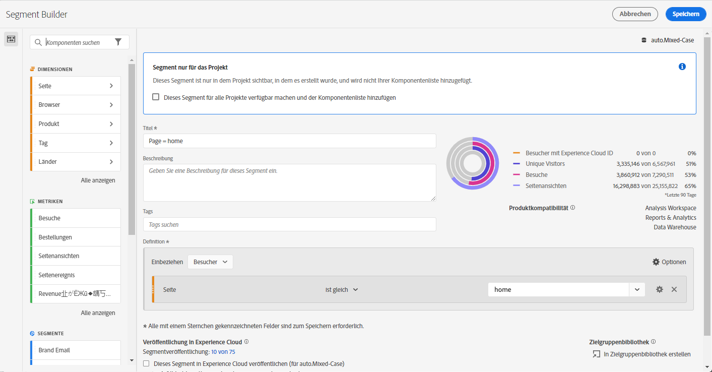

# Schnellfilter

Sie können innerhalb eines Projekts Schnellfilter erstellen, um die Komplexität des vollständigen [Filtergenerators](/help/components/filters/create-filters.md) zu umgehen. Schnellfilter

* Werden nur auf [Projektebene](https://experienceleague.adobe.com/docs/analytics-platform/using/cja-components/cja-filters/quick-filters.html?lang=de#project-only) angewendet.
* Lassen bis zu 3 Regeln zu
* Können keine verschachtelten Container oder sequenziellen Regeln aufnehmen

Einen Vergleich der Möglichkeiten von Schnellfiltern mit vollständigen Komponentenlistenfiltern finden Sie [hier](/help/components/filters/filters-overview.md).

Im Folgenden finden Sie ein Video zu Schnellfiltern (beachten Sie, dass stattdessen der Begriff „Schnellsegmente“ verwendet wird.) Die Funktionalität ist jedoch dieselbe.

>[!VIDEO](https://video.tv.adobe.com/v/341466/?quality=12&learn=on)

## Voraussetzungen {#prereqs}

Jeder kann einen Schnellfilter erstellen. Sie benötigen jedoch die Berechtigung „Filtererstellung“ in [Adobe Admin Console](https://experienceleague.adobe.com/docs/analytics/admin/admin-console/permissions/summary-tables.html?lang=de#analytics-tools), um die Schnellfilter speichern oder in Segment Builder öffnen zu können.

## Erstellen von Schnellfiltern {#create}

Klicken Sie in einer Freiformtabelle auf das „+“-Symbol für den Filter im Kopf des Bedienfelds:

| Einstellung | Beschreibung |
| --- | --- |
| [!UICONTROL Name] | Der Standardname eines Filters ist eine Kombination der Regelnamen im Filter. Sie können für den Filter einen benutzerfreundlicheren Namen wählen. |
| [!UICONTROL Ein-/Ausschließen] | Sie können Komponenten in Ihrer Filterdefinition entweder ein- oder ausschließen, aber nicht beides. |
| [!UICONTROL Treffer-/Besuchs-/Besucher-Container] | Schnellfilter enthalten nur einen [Filter-Container](https://experienceleague.adobe.com/docs/analytics-platform/using/cja-components/cja-filters/filters-overview.html?lang=de#filter-containers), mit dem Sie eine Dimension/Metrik/einen Datumsbereich in den Filter einbeziehen (oder daraus ausschließen) können. [!UICONTROL Besucher] enthält übergreifende Daten, die für den Besucher über Besuche und Seitenansichten hinweg spezifisch sind. Mit einen Container [!UICONTROL Besuch] können Sie Regeln für die Aufschlüsselung der Besucherdaten auf der Grundlage der Besuche festlegen und mit einem Container [!UICONTROL Treffer] können Sie die Besucherinformationen auf der Grundlage der einzelnen Seitenaufrufe aufschlüsseln. Der Standard-Container ist [!UICONTROL Treffer]. |
| [!UICONTROL Komponenten] (Dimension/Metrik/Datumsbereich) | Definieren Sie bis zu 3 Regeln, indem Sie Komponenten (Dimensionen, Metriken, Datumsbereiche oder Dimensionswerte) hinzufügen. Es gibt 3 Möglichkeiten, die richtige Komponente zu finden:<ul><li>Beginnen Sie mit der Eingabe. Der [!UICONTROL Schnellfilter-Generator] findet automatisch die entsprechende Komponente.</li><li>Verwenden Sie die Dropdown-Liste, um die Komponente zu finden.</li><li>Per Drag-and-Drop aus der der linken Leiste ziehen.</li></ul> |
| [!UICONTROL Operator] | Verwenden Sie das Dropdown-Menü, um Standardoperatoren und Operatoren des Typs [!UICONTROL Distinct Count] zu finden. Siehe [Filteroperatoren](operators.md). |
| Plus (+)-Zeichen | Eine weitere Regel hinzufügen |
| AND/OR-Kriterien | Sie können den Regeln „AND“- oder „OR“-Kriterien hinzufügen, aber „AND“- und „OR“-Werte können nicht in einer Filterdefinition gemischt werden. |
| [!UICONTROL Übernehmen] | Diesen Filter auf das Bedienfeld an. Wenn der Filter keine Daten enthält, werden Sie gefragt, ob Sie fortfahren möchten. |
| [!UICONTROL Builder öffnen] | Zeigt den Filtergenerator an. Nachdem Sie den Filter im Filter-Builder gespeichert oder angewendet haben, wird er nicht mehr als „Schnellfilter“ betrachtet. Er wird Teil der Komponentenlisten-Filterbibliothek. |
| [!UICONTROL Abbrechen] | Bricht diesen Schnellfilter ab – er wird nicht angewendet. |
| [!UICONTROL Datumsbereich] | Der Validator verwendet den Datumsbereich des Bedienfelds für die Datensuche. Jeder Datumsbereich, der in einem Schnellfilter angewendet wird, überschreibt jedoch den Datumsbereich des Bedienfelds oben im Bedienfeld. |
| Vorschau (oben rechts) | Hiermit können Sie sehen, ob Sie über einen gültigen Filter verfügen und wie breit der Filter ist. Stellt eine Aufschlüsselung des Datensatzes dar, die Sie erwarten können, wenn Sie diesen Filter anwenden. Sie erhalten möglicherweise einen Hinweis, der anzeigt, dass dieser Filter keine Daten enthält. In diesem Fall können Sie weiterarbeiten oder aber die Filterdefinition ändern. |

Im Folgenden finden Sie ein Beispiel für einen Filter, der Dimensionen und Metriken kombiniert:

Der Filter wird oben angezeigt. Beachten Sie die Seitenleiste mit blauen Streifen im Gegensatz zur blauen Seitenleiste für Filter auf Komponentenebene auf der linken Seite der Filterbibliothek.

## Bearbeiten von Schnellfiltern {#edit}

1. Bewegen Sie den Mauszeiger über den Schnellfilter und wählen Sie das Stiftsymbol aus.
1. Bearbeiten Sie die Filterdefinition oder den Filternamen.
1. Klicken Sie auf [!UICONTROL Anwenden].

## Speichern von Schnellfiltern {#save}

Sie können Schnellfilter entweder im [!UICONTROL Schnellfilter-Generator] oder im [!UICONTROL Filtergenerator] speichern.

>[!IMPORTANT]
>Nachdem Sie den Filter gespeichert oder angewendet haben, können Sie ihn nicht mehr im Schnellfilter-Generator, sondern nur noch im regulären Filtergenerator bearbeiten.

### Speichern im Schnellfilter-Generator {#save2}

1. Wenn Sie den Schnellfilter angewendet haben, halten Sie den Mauszeiger darüber und wählen Sie das Infosymbol („i“) aus.
1. Klicken Sie auf **[!UICONTROL Für alle Projekte verfügbar machen und der Komponentenliste hinzufügen]**.
1. (Optional) Benennen Sie den Filter um.
1. Klicken Sie auf **[!UICONTROL Speichern]**.

Beachten Sie, wie sich die Seitenleiste des Filters von gestreiftem Blau zu einem helleren Blau ändert. Er wird jetzt in der Komponentenliste in der linken Leiste angezeigt.

### Im Filtergenerator speichern {#save3}

1. Bewegen Sie den Mauszeiger über den Schnellfilter und wählen Sie das Infosymbol („i“) aus.
1. Wählen Sie **[!UICONTROL Filter speichern]**
1. Belassen Sie den Namen unverändert oder benennen Sie den Filter um.

   Gehen Sie zurück zum Arbeitsbereich. Wie Sie sehen, verfügt der Filter jetzt über eine Seitenleiste in einem helleren Blau. Dies bedeutet, dass er nicht mehr im Schnellfilter-Generator bearbeitet/geöffnet werden kann. Und durch Speichern wird er Teil der Komponentenliste.

   

Nachdem Sie den Filter angewendet haben, können Sie ihn Ihrer Liste der Filterkomponenten hinzufügen und für alle Ihre Projekte verfügbar machen.

1. Bewegen Sie den Mauszeiger über den gespeicherten Filter und wählen Sie das Stiftsymbol aus.

1. Beachten Sie dieses Dialogfeld oben im Filtergenerator:

   

1. Aktivieren Sie das Kontrollkästchen neben **[!UICONTROL Alle Projekte verfügbar machen und der Komponentenliste hinzufügen]**.
1. Klicken Sie auf **[!UICONTROL Speichern]**.
1. Der Filter wird jetzt in der Liste der Filterkomponenten für alle Ihre Projekte angezeigt.
1. Sie können auch den Filter auch für andere Personen in Ihrer Organisation [freigeben](/help/components/filters/manage-filters.md).

## Was sind reine Projektfilter? {#project-only}

Reine Projektfilter sind Filter, die nur auf das aktuelle Projekt angewendet werden, in dem sie erstellt wurden. Sie sind nicht in anderen Projekten verfügbar und können nicht für andere Benutzer freigegeben werden. Sie sind für die schnelle Untersuchung Ihrer Daten vorgesehen, ohne dass ein Filter in der linken Leiste erstellt und gespeichert werden muss. Schreibgeschützte Filter können in der Dropzone des Bedienfelds entweder mit Schnellfiltern oder [Ad-hoc-Filter](/help/components/filters/ad-hoc-filters.md).

Wenn Sie einen reinen Projektfilter im [!UICONTROL Filter-Generator] öffnen, wird eine Benachrichtigung nur für Projekte angezeigt. Wenn Sie die Option „Diesen Filter verfügbar machen...“ nicht aktivieren und auf **[!UICONTROL ANWENDEN]** klicken, bleibt das Segment ein reiner Projektfilter.

>[!NOTE]
>
>Wenn Sie einen Schnellfilter vom Filter-Generator anwenden, kann er nicht mehr im [!UICONTROL Schnellfilter-Generator] geöffnet werden.

Wenn Sie die Option „Diesen Filter verfügbar machen...“ aktivieren und auf **[!UICONTROL SPEICHERN]** klicken, wird der Filter in der Komponentenliste der linken Leiste für die Verwendung in anderen Projekten verfügbar. Er kann auch für andere Benutzer über den Filter-Manager freigegeben werden.

