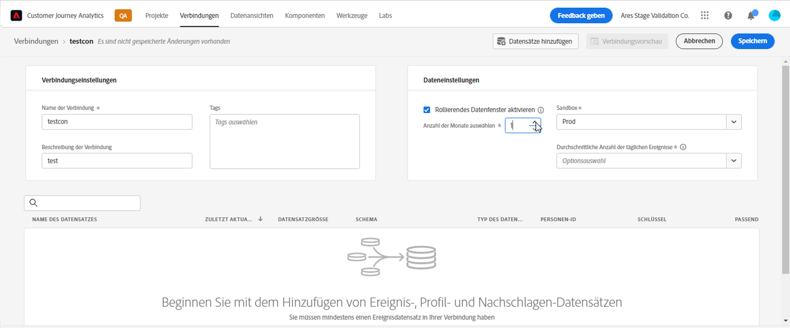
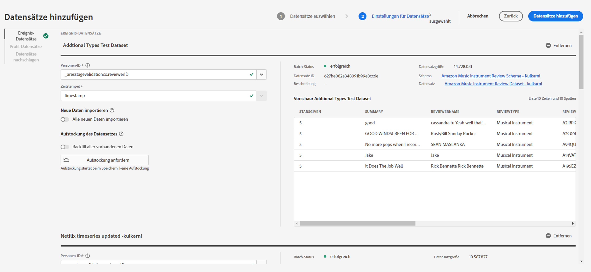
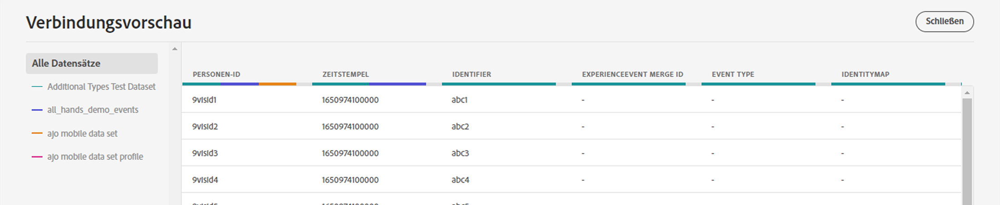
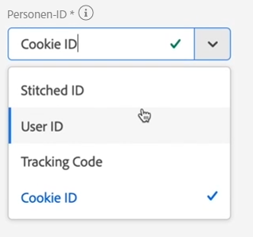
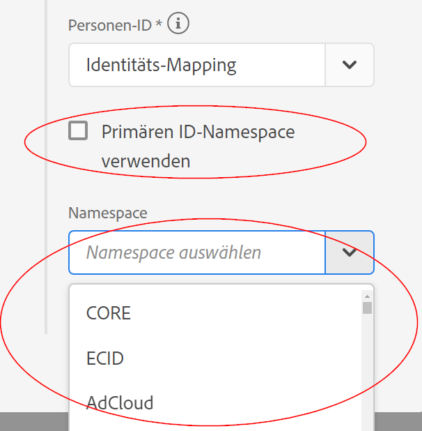

# Verbindung herstellen

Im Mai 2022 wird in Customer Journey Analytics (CJA) ein neuer Workflow für Verbindungen gestartet. Im Folgenden finden Sie einen Überblick über die neuen Funktionen:

* Sie können bei der Erstellung der Verbindung ein rollierendes Fenster zur Datenaufbewahrung aktivieren.
* Sie können Datensätze zu einer Verbindung hinzufügen und daraus entfernen. (Wenn Sie einen Datensatz entfernen, wird er aus der Verbindung entfernt und wirkt sich auf alle zugehörigen Datenansichten und zugrunde liegenden Analysis Workspace-Projekte aus.)
* Sie können Aufstockungsdaten pro Datensatz aktivieren und anfordern.
* Sie können Datensätze bearbeiten, z. B. um eine weitere Aufstockung anzufordern.
* Sie können vorhandene Daten pro Datensatz importieren.

## Erstellen und Konfigurieren der Verbindung {#create-connection}

1. Klicken Sie in Customer Journey Analytics auf die Registerkarte Verbindungen .
1. Klicken Sie auf Neue Verbindung erstellen .

   

1. Konfigurieren Sie die Verbindungseinstellungen.

   | Einstellung | Beschreibung |
   | --- | --- |
   | Name der Verbindung | Geben Sie einen eindeutigen Namen für die Verbindung ein. |
   | Beschreibung der Verbindung | Beschreiben Sie den Zweck dieser Verbindung. |
   | Sandbox | Wählen Sie eine Sandbox in Experience Platform aus, die die Datensätze enthält, zu denen Sie eine Verbindung herstellen möchten.<p>Adobe Experience Platform bietet [Sandboxes](https://experienceleague.adobe.com/docs/experience-platform/sandbox/home.html?lang=de) bereit, die eine einzelne Platform-Instanz in separate virtuelle Umgebungen aufteilen, um die Entwicklung und Weiterentwicklung von Programmen für digitale Erlebnisse zu erleichtern. Sandboxes können sich als &quot;Datensilos&quot;mit Datensätzen vorstellen. Sandboxes dienen der Steuerung des Zugriffs auf Datensätze.<p>Nachdem Sie die Sandbox ausgewählt haben, werden in der linken Leiste alle Datensätze in der Sandbox angezeigt, aus denen Sie abrufen können. |
   | Rollierendes Datenfenster aktivieren | Mit dieser Einstellung können Sie die Aufbewahrung von CJA-Daten als rollierendes Fenster in Monaten (1 Monat, 3 Monate, 6 Monate usw.) auf Verbindlichkeitsebene definieren.<p>Die Datenaufbewahrung basiert auf Zeitstempeln für Ereignis-Datensätze und gilt nur für Ereignis-Datensätze. Für Profil- oder Lookup-Datensätze gibt es keine rollierende Datenfenstereinstellung, da keine entsprechenden Zeitstempel vorhanden sind. Wenn Ihre Verbindung jedoch Profil- oder Lookup-Datensätze enthält (neben einem oder mehreren Ereignis-Datensätzen), werden diese Daten für denselben Zeitraum beibehalten.<p> Der Hauptvorteil besteht darin, dass Sie nur Daten speichern oder Berichte dazu erstellen, die anwendbar und nützlich sind, und ältere Daten löschen, die nicht mehr nützlich sind. Dies hilft Ihnen, Ihre vertraglichen Beschränkungen einzuhalten und das Risiko bezüglich Kostendeckung zu reduzieren. |
   | Hinzufügen von Datensätzen (siehe unten) | Fügen Sie Datensätze hinzu, wenn in Ihrer Datensatzliste keine Datensätze erscheinen. |
   | Datensatzname | Wählen Sie einen oder mehrere Datensätze aus, die Sie in Customer Journey Analytics abrufen möchten, und klicken Sie auf **[!UICONTROL Hinzufügen]**.<p>(Wenn Sie viele Datensätze zur Auswahl haben, können Sie über die Suchleiste Datensätze suchen über der Liste der Datensätze nach den richtigen suchen.) |
   | Letzte Aktualisierung | Nur für Ereignis-Datensätze wird diese Einstellung automatisch auf das standardmäßige Zeitstempelfeld von ereignisbasierten Schemata in Experience Platform gesetzt. &quot;K. A.&quot;bedeutet, dass dieser Datensatz keine Daten enthält. |
   | Schema | Dies ist das [Schema](https://experienceleague.adobe.com/docs/experience-platform/xdm/schema/composition.html?lang=de), auf dessen Grundlage der Datensatz in Adobe Experience Platform erstellt wurde. |
   | Typ des Datensatzes | Für jeden Datensatz, den Sie dieser Verbindung hinzugefügt haben, legt Customer Journey Analytics den Datensatztyp automatisch anhand der eingehenden Daten fest. Es gibt 3 verschiedene Datensatztypen: Ereignis-, Profil- und Such-Daten. Eine Erläuterung der Datensatztypen finden Sie in der unten stehenden Tabelle. |
   | Personen-ID | Wählen Sie eine Personen-ID aus der Dropdown-Liste der verfügbaren Identitäten aus. Diese Identitäten wurden im Datensatzschema in Experience Platform definiert. Weitere Informationen zur Verwendung von Identity Map als Personen-ID finden Sie weiter unten.<p>WICHTIG: Wenn keine Personen-IDs zur Auswahl stehen, bedeutet das, dass eine oder mehrere Personen-IDs im Schema nicht definiert wurden. In [diesem Videos](https://www.youtube.com/watch?v=G_ttmGl_LRU) sehen Sie, wie Sie eine Identität in Experience Platform definieren. |
   | Schlüssel | Nur für Lookup-Datensätze (z. B. _id). |
   | Übereinstimmender Schlüssel | Nur für Lookup-Datensätze (z. B. _id). |
   | Neue Daten importieren | Auf Ein oder Aus einstellen. |
   | Aufstockungsdaten |  |
   | Aufstockungsstatus | Gibt an, ob Aufstockungsdaten verarbeitet werden. |

## Hinzufügen und Konfigurieren von Datensätzen {#add-dataset}

Mit dem neuen Workflow können Sie beim Erstellen einer Experience Platform einen Verbindungsdatensatz hinzufügen.

1. Klicken Sie im Dialogfeld Verbindungsparameter auf **[!UICONTROL Hinzufügen von Datensätzen]**.
1. Wählen Sie einen oder mehrere Datensätze aus und klicken Sie auf **[!UICONTROL Nächste]**.

   Beachten Sie, dass mindestens ein Ereignis-Datensatz Teil der Verbindung sein muss.
1. Konfigurieren Sie nun die Datensätze einzeln.

   

   | Einstellung | Beschreibung |
   | --- | --- |
   | Personen-ID | Wählen Sie eine Personen-ID aus der Dropdown-Liste der verfügbaren Identitäten aus. Diese Identitäten wurden im Datensatzschema in Experience Platform definiert. Weitere Informationen zur Verwendung von Identity Map als Personen-ID finden Sie weiter unten.<p>Wenn keine Personen-IDs zur Auswahl stehen, bedeutet das, dass eine oder mehrere Personen-IDs im Schema nicht definiert wurden. In diesem Videos sehen Sie, wie Sie eine Identität in Experience Platform definieren. |
   | Zeitstempel | Nur für Ereignis-Datensätze wird diese Einstellung automatisch auf das standardmäßige Zeitstempelfeld von ereignisbasierten Schemata in Experience Platform gesetzt. |
   | Neue Daten importieren | Wählen Sie diese Option aus, wenn Sie eine fortlaufende Verbindung herstellen möchten. Damit fließen alle neuen Daten-Batches, die zu den Datensätzen in dieser Verbindung hinzugefügt werden, automatisch in Arbeitsbereich ein. Kann auf Ein oder Aus eingestellt werden. |
   | Aufstockung des Datensatzes | Klicken **[!UICONTROL Aufstockung anfordern]** , um historische Daten aufzustocken.<ul><li>Sie können jeden Datensatz einzeln aufstocken.</li><li>Neue Daten, die einem Datensatz in der Verbindung hinzugefügt werden, werden priorisiert, sodass diese neuen Daten die geringste Latenz aufweisen.</li><li>Alle (historischen) Aufstockungsdaten werden langsamer importiert. Die Latenz wird durch die Anzahl der historischen Daten beeinflusst, die Sie haben.</li><li>Adobe Analytics Source Connector importiert Daten aus bis zu 13 Monaten unabhängig von ihrer Größe.</li></ul> |
   | Aufstockungsstatus | Mögliche Statusindikatoren sind:<ul><li>Erfolgreich</li><li>X Verarbeitung der Aufstockung(n)</li><li>Aus</li></ul> |
   | Datensatz-ID | Diese ID wird automatisch generiert. |
   | Beschreibung | Die Beschreibung, die diesem Datensatz bei seiner Erstellung gegeben wurde. |
   | Datensatzgröße | Die Größe des Datensatzes. |
   | Schema | Dies ist das Schema, auf dessen Grundlage der Datensatz in Adobe Experience Platform erstellt wurde. |
   | Datensatz | Der Name des Datensatzes. |
   | Vorschau: `<dataset name>` | Vorschau des Datensatzes mit den Spalten Datum, Kennung und Kennung . |
   | Entfernen | Entfernen Sie diesen Datensatz aus der Verbindung. |

## Verbindungsvorschau {#preview}

Um die von Ihnen erstellte Verbindung in der Vorschau anzuzeigen, klicken Sie auf **[!UICONTROL Verbindungsvorschau]** im Dialogfeld Verbindungseinstellungen.



Diese Vorschau enthält eine Reihe von Spalten, die die Verbindungskonfiguration auflisten. Welche Spaltentypen angezeigt werden, hängt von Ihren individuellen Datensätzen ab.

## Datensatztypen {#dataset-types}

Für jeden Datensatz, den Sie dieser Verbindung hinzugefügt haben, [!UICONTROL Customer Journey Analytics] legt den Datensatztyp anhand der eingehenden Daten automatisch fest.

>[!IMPORTANT]
>
>Sie müssen mindestens einen Ereignis-Datensatz als Teil einer Verbindung hinzufügen.

Es gibt 3 verschiedene Datensatztypen: [!UICONTROL Ereignis]-, [!UICONTROL Profil]- und [!UICONTROL Such]-Daten.

| Typ des Datensatzes | Beschreibung | Zeitstempel | Schema | Personen-ID |
|---|---|---|---|---|
| [!UICONTROL Ereignis] | Daten, die zeitliche Ereignis darstellen (z. B. Webbesuche, Interaktionen, Transaktionen, PoS-Daten, Umfragedaten, Ad-Impression-Daten usw.). Dies können beispielsweise typische Clickstream-Daten mit einer Kunden-ID oder einer Cookie-ID und einem Zeitstempel sein. Bei Ereignisdaten können Sie entscheiden, welche ID als Personen-ID verwendet wird. | Wird automatisch auf das standardmäßige Zeitstempelfeld von ereignisbasierten Schemata in [!UICONTROL Experience Platform] gesetzt. | Jedes integrierte oder benutzerdefinierte Schema, das auf einer XDM-Klasse mit dem Verhalten „Zeitreihen“ basiert. Beispiele sind „XDM-Erlebnisereignis“ oder „XDM-Entscheidungsereignis“. | Sie können auswählen, welche Personen-ID Sie einbeziehen möchten. Für jedes in Experience Platform definierte Datensatzschema kann ein eigener Satz von einer oder mehreren Identitäten definiert und mit einem Identitäts-Namespace verknüpft werden. Jede dieser Optionen kann als Personen-ID verwendet werden. Beispiele sind Cookie-ID, zugeordnete ID, Benutzer-ID, Trackingcode usw. |
| [!UICONTROL Suche] | Diese Daten werden verwendet, um nach Werten oder Schlüsseln in Ihren Ereignis- oder Profildaten zu suchen. Beispielsweise können Sie Suchdaten hochladen, die numerische IDs in Ihren Ereignisdaten Produktnamen zuordnen. Siehe [diesen Verwendungsfall](/help/use-cases/b2b.md) für ein Beispiel. | Nicht angegeben | Jedes integrierte oder benutzerdefinierte Schema, das auf einer XDM-Klasse mit dem Verhalten „Eintrag“ basiert, mit Ausnahme der Klasse „XDM-Individuelles Profil“. | Nicht angegeben |
| [!UICONTROL Profil] | Daten, die auf Ihre Besucher, Benutzer oder Kunden in den [!UICONTROL Ereignis]-Daten angewendet werden. Sie können beispielsweise CRM-Daten zu Ihren Kunden hochladen. | Nicht angegeben | Jedes integrierte oder benutzerdefinierte Schema, das auf der Klasse „XDM-Individuelles Profil“ basiert. | Sie können auswählen, welche Personen-ID Sie einbeziehen möchten. Für jeden in [!DNL Experience Platform] definierten Datensatz ist ein eigener Satz von einer oder mehreren definierten Personen-IDs definiert, z. B. Cookie-ID, zugeordnete ID, Benutzer-ID, Trackingcode usw.<br>**Hinweis**: Wenn Sie eine Verbindung erstellen, die Datensätze mit unterschiedlichen IDs enthält, wird dies in der Berichterstellung berücksichtigt. Um Datensätze zusammenzuführen, müssen Sie dieselbe Personen-ID verwenden. |

## Identity Map als Personen-ID verwenden {#id-map}

In Customer Journey Analytics kann jetzt Identity Map für Personen-ID verwendet werden. Identity Map ist eine Map-Datenstruktur, mit der Schlüssel-/Wert-Paare hochgeladen werden können. Die Schlüssel sind Identity-Namespaces und der Wert ist eine Struktur, die den Identitätswert enthält. Die Identity Map ist für jede hochgeladene Zeile/jedes hochgeladene Ereignis vorhanden und wird für jede Zeile entsprechend aufgefüllt.

Die Identity Map ist für jeden Datensatz verfügbar, der ein auf der [ExperienceEvent XDM](https://experienceleague.adobe.com/docs/experience-platform/xdm/home.html?lang=de)-Klasse basierendes Schema verwendet. Wenn Sie einen solchen Datensatz für eine CJA-Verbindung auswählen, können Sie entweder ein Feld als primäre ID oder die Identity Map auswählen:



Wenn Sie Identity Map auswählen, erhalten Sie zwei zusätzliche Konfigurationsoptionen:

| Option | Beschreibung |
|---|---|
| [!UICONTROL Primären ID-Namespace verwenden] | Dadurch wird CJA angewiesen, die Identität pro Zeile in der Identity Map zu finden, die mit dem Attribut „primär=wahr“ markiert ist, und diese als Personen-ID für diese Zeile zu verwenden. Dies bedeutet, dass dies der Primärschlüssel ist, der in Experience Platform zur Partitionierung verwendet wird. Er ist auch der Hauptkandidat für die Verwendung als Besucher-ID in CJA (je nachdem, wie der Datensatz in einer CJA-Verbindung konfiguriert ist). |
| [!UICONTROL Namespace] | (Diese Option ist nur verfügbar, wenn Sie den primären Identity-Namespace nicht verwenden.) Identity-Namespace sind eine Komponente des [Adobe Experience Platform Identity Service](https://experienceleague.adobe.com/docs/experience-platform/identity/namespaces.html?lang=de), die als Indikatoren für den Kontext dient, auf den sich eine Identität bezieht. Wenn Sie einen Namespace angeben, sucht CJA in der Identity Map jeder Zeile nach diesem Namespace-Schlüssel und verwendet die Identität unter diesem Namespace als Personen-ID für diese Zeile. Da CJA die Datensätze in allen Zeilen nicht vollständig scannen kann, um festzustellen, welche Namespaces tatsächlich vorhanden sind, werden alle möglichen Namespaces in der Dropdown-Liste aufgeführt. Sie müssen wissen, welche Namespaces in den Daten angegeben sind. Dies kann nicht automatisch erkannt werden. |

### Identity Map-Randfälle {#id-map-edge}

In dieser Tabelle werden die beiden Konfigurationsoptionen angezeigt, wenn Randfälle vorhanden sind, und wie sie behandelt werden:

| Option | In der Identity Map sind keine IDs vorhanden | Es wurden keine IDs als primär markiert | Es wurden mehrere IDs als primär markiert | Es wurde eine einzelne ID als primär markiert | Ungültiger Namespace mit einer als primär markierten ID |
|---|---|---|---|---|---|
| **[!UICONTROL Primären ID-Namespace verwenden] aktiviert** | Die Zeile wird aus CJA gelöscht. | Die Zeile wird aus CJA gelöscht, da keine primäre ID angegeben wurde. | Alle unter allen Namespaces als primär markierten IDs werden in eine Liste extrahiert. Sie werden dann alphabetisch sortiert. Bei dieser neuen Sortierung wird der erste Namespace mit seiner ersten ID als Personen-ID verwendet. | Die als primär markierte einzelne ID wird als Personen-ID verwendet. | Obwohl der Namespace möglicherweise ungültig ist (in AEP nicht vorhanden), verwendet CJA die primäre ID unter diesem Namespace als Personen-ID. |
| **[!UICONTROL Spezifischer Identity Map-Namespace] ausgewählt** | Die Zeile wird aus CJA gelöscht. | Alle IDs unter dem ausgewählten Namespace werden in eine Liste extrahiert und die erste wird als Personen-ID verwendet. | Alle IDs unter dem ausgewählten Namespace werden in eine Liste extrahiert und die erste wird als Personen-ID verwendet. | Alle IDs unter dem ausgewählten Namespace werden in eine Liste extrahiert und die erste wird als Personen-ID verwendet. | Alle IDs unter dem ausgewählten Namespace werden in eine Liste extrahiert und die erste wird als Personen-ID verwendet. (Bei der Erstellung der Verbindung kann nur ein gültiger Namespace ausgewählt werden. Daher ist es nicht möglich, einen ungültigen Namespace/eine ungültige ID als Personen-ID zu verwenden.) |

### Berechnen der durchschnittlichen Anzahl von täglichen Ereignissen

Diese Berechnung muss für jeden Datensatz in der Verbindung durchgeführt werden.

1. Wechseln Sie zu [Adobe Experience Platform Query Services](https://experienceleague.adobe.com/docs/experience-platform/query/home.html?lang=de) und erstellen Sie eine neue Abfrage.

   Die Abfrage würde wie folgt aussehen: 

   ```
   Select AVG(A.total_events) from (Select DISTINCT COUNT (*) as total_events, date(TIMESTAMP) from analytics_demo_data GROUP BY 2 Having total_events>0) A;
   ```

   In diesem Beispiel ist „analytics_demo_data“ der Name des Datensatzes.

1. Führen Sie die `Show Tables`-Abfrage aus, um alle in Adobe Experience Platform vorhandenen Datensätze anzuzeigen.
