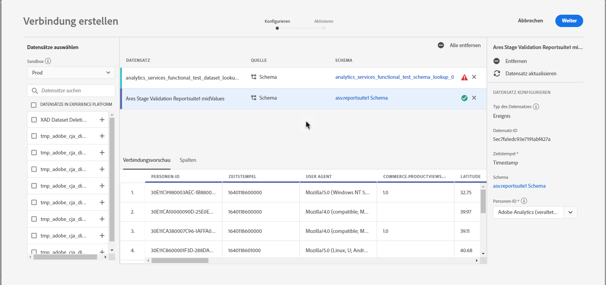

# Erstellen einer Verbindung

Mithilfe einer Verbindung können Sie Datensätze aus Adobe Experience Platform in Workspace integrieren. Um einen Bericht über Plattformdatensätze zu erstellen, müssen Sie zunächst eine Verbindung zwischen Datensätzen in Platform und Workspace herstellen.

Klicken Sie [hier](https://docs.adobe.com/content/help/en/platform-learn/tutorials/cja/connecting-customer-journey-analytics-to-data-sources-in-platform.html) , um eine Videoübersicht zu erhalten.

>[!IMPORTANT] Sie können mehrere Plattformdatasets zu einer einzigen Verbindung kombinieren.

1. Go to [https://analytics.adobe.com](https://analytics.adobe.com).

1. Click the **[!UICONTROL Connections]** tab.

1. Klicken Sie **[!UICONTROL Create new connection]** oben rechts.

1. Die linke Leiste zeigt alle Datensätze in der Plattform an, aus denen Sie ziehen können. Wählen Sie einen oder mehrere Datensätze aus, die Sie in Customer Journey Analytics abrufen möchten, und klicken Sie auf **[!UICONTROL Add]**. (Wenn Sie viele Datensätze auswählen können, können Sie über die Suchleiste über der Liste der Datensätze nach den richtigen Datensätzen suchen.)

1. Anschließend legt Customer Journey Analytics für jeden Datensatz, den Sie zu dieser Verbindung hinzugefügt haben, den Dataset-Typ automatisch anhand der Daten fest, die eingehen. Es gibt 3 verschiedene Datensatztypen: Ereignisdaten, Profildaten und Suchdaten.

   | Typ des Datensatzes | Beschreibung | Zeitstempel | Schema | Personen-ID |
   |---|---|---|---|---|
   | Ereignis- | Daten, die Ereignisse in der Zeit darstellen (z. B. Webbesuche, Interaktionen, Transaktionen, POS-Daten, Umfragedaten, Anzeigenimpressionsdaten usw.). Dies sind typische Clickstream-Daten mit einer Kunden-ID oder einer Cookie-ID und einem Zeitstempel. Mit Ereignisdaten können Sie die gewünschte ID verwenden. | Wird auf Zeitstempel eingestellt. | Das Plattformschema, auf dem dieser Datensatztyp basiert. | nicht angegeben |
   | Suche | Entspricht einer Classifications-Datei. Diese Daten werden zum Nachschlagen von Werten oder Schlüsseln in Ihren Ereignis- oder Profildaten verwendet. Sie können beispielsweise Suchdaten hochladen, die numerische IDs in Ihren Ereignisdaten Produktnamen zuordnen. | nicht angegeben | Das Plattformschema, auf dem dieser Datensatztyp basiert. | nicht angegeben |
   | Profil | Analog zu Kundenattributen - für nicht veränderliche und nicht zeitliche Attribute. Daten, die in den Ereignisdaten auf Ihre Besucher, Benutzer oder Kunden angewendet werden. Sie können beispielsweise CRM-Daten zu Ihren Kunden hochladen. | nicht angegeben | Das Plattformschema, auf dem dieser Datensatztyp basiert. | Sie können auswählen, welche Person-ID Sie einbeziehen möchten. Jeder Datensatz, der in der Adobe Experience Platform definiert wird, verfügt über einen eigenen Satz von einer oder mehreren Personen-IDs, wie z. B. Cookie-ID, Stitched ID, Benutzer-ID, Rückverfolgungscode usw. **IDNote **: Wenn Sie eine Verbindung erstellen, die Datensätze mit unterschiedlichen IDs enthält, wird dies in der Berichterstellung widergespiegelt. Um Datasets wirklich zusammenzuführen, müssen Sie dieselbe Person-ID verwenden. |

1. Klicken Sie auf **[!UICONTROL Next]**.

1. Legen Sie im Dialogfeld &quot;Verbindung erstellen&quot;die folgenden Einstellungen fest:

   | Feld | Beschreibung |
   |---|---|
   | Name | Geben Sie der Verbindung einen beschreibenden Namen. Die Verbindung kann nicht ohne Namen gespeichert werden. |
   | Beschreibung | Fügen Sie weitere Details hinzu, um diese Verbindung von anderen zu unterscheiden. |
   | Größe | Die kollektive Größe der Datensätze in der Datenverbindung. |
   | Datensätze | Die in dieser Verbindung enthaltenen Datensätze. |
   | Daten-Streaming | Um mit dem Streaming der Daten für diese Verbindung zu beginnen, aktivieren Sie das Datenstreaming. Wenn das Datenstreaming für diese Verbindung aktiviert ist, wird Ihrem Konto die Datenmenge in Rechnung gestellt, die diese Verbindung streaming. (Beachten Sie, dass Sie das Datenstreaming auch im Connections Manager aktivieren können.) |

1. Klicken Sie auf **[!UICONTROL Save]**. Wenn Sie diese Verbindung speichern, passiert Folgendes:

   * Sie ziehen alle historischen Daten von Platform für alle Datensätze ein, die in dieser Verbindung vorhanden sind.
   * Wenn Sie das Streaming aktiviert haben, stellen Sie eine ständige Verbindung her, sodass neue Daten, die den Datasets in dieser Verbindung hinzugefügt werden, automatisch in Workspace fließen.

Der nächste Schritt im Workflow besteht darin, eine Datenansicht zu [erstellen](/help/data-views/create-dataview.md).
