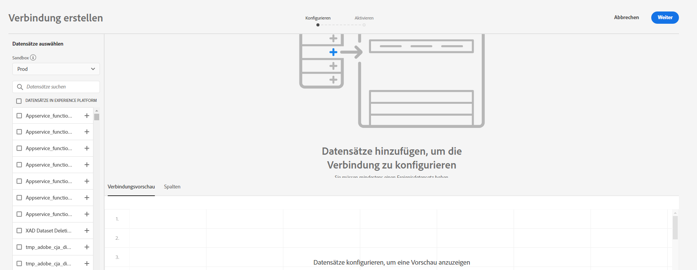

# Verbindung herstellen

Mit einer Verbindung können Sie Datensätze von [!DNL Adobe Experience Platform] in [!UICONTROL Workspace] integrieren. Um über [!DNL Experience Platform]-Datensätze zu berichten, müssen Sie zunächst eine Verbindung zwischen den Datensätzen in [!DNL Experience Platform] und [!UICONTROL Workspace] herstellen.

Eine Videoübersicht finden Sie [hier](https://docs.adobe.com/content/help/en/platform-learn/tutorials/cja/connecting-customer-journey-analytics-to-data-sources-in-platform.html).

>[!IMPORTANT]
>
>Sie können mehrere [!DNL Experience Platform]-Datensätze zu einer Verbindung zusammenfassen.

## Sandbox und Datensätze auswählen

1. Gehen Sie zu [https://analytics.adobe.com](https://analytics.adobe.com).

1. Klicken Sie auf die Registerkarte **[!UICONTROL Verbindungen]**.

1. Klicken Sie oben rechts auf **[!UICONTROL Neue Verbindung erstellen]**.

   

1. Wählen Sie eine Sandbox in Experience Platform aus, die die Datensätze enthält, zu denen Sie eine Verbindung herstellen möchten.

   Adobe Experience Platform bietet [Sandboxes](https://docs.adobe.com/content/help/de-DE/experience-platform/sandbox/home.html) bereit, die eine einzelne Platform-Instanz in separate virtuelle Umgebungen aufteilen, um die Entwicklung und Weiterentwicklung von Programmen für digitale Erlebnisse zu erleichtern. Sandboxes können als „Datensilos“ mit Datensätzen betrachtet werden. Sandboxes dienen zur Steuerung des Zugriffs auf Datensätze.  Nachdem Sie die Sandbox ausgewählt haben, werden in der linken Leiste alle Datensätze in der Sandbox angezeigt, aus denen Sie abrufen können.

   >[!IMPORTANT]
   >
   >Sie können nicht auf Daten über mehrere Sandboxen zugreifen, d. h. Sie können nur Datensätze kombinieren, die sich in derselben Sandbox befinden.

1. Wählen Sie einen oder mehrere Datensätze aus, die Sie in [!UICONTROL Customer Journey Analytics] abrufen möchten, und klicken Sie auf **[!UICONTROL Hinzufügen]**.

   (Wenn Sie viele Datensätze zur Auswahl haben, können Sie über die Suchleiste **[!UICONTROL Datensätze suchen]** über der Liste der Datensätze nach den richtigen suchen.)

## Datensatz konfigurieren

Auf der rechten Seite können Sie jetzt den Datensatz/die Datensätze konfigurieren, den/die Sie hinzugefügt haben.

1. **[!UICONTROL Datensatztyp]**: [!UICONTROL Customer Journey Analytics] legt für jeden Datensatz, den Sie dieser Verbindung hinzugefügt haben, automatisch den Datensatztyp anhand der eingehenden Daten fest.

   Es gibt 3 verschiedene Datensatztypen: [!UICONTROL Ereignis]-, [!UICONTROL Profil]- und [!UICONTROL Such]-Daten.

   | Typ des Datensatzes | Beschreibung | Zeitstempel | Schema | Personen-ID |
   |---|---|---|---|---|
   | [!UICONTROL Ereignis] | Daten, die zeitliche Ereignis darstellen (z. B. Webbesuche, Interaktionen, Transaktionen, POS-Daten, Umfragedaten, Ad-Impression-Daten usw.). Dies können beispielsweise typische Clickstream-Daten mit einer Kunden-ID oder einer Cookie-ID und einem Zeitstempel sein. Bei Ereignisdaten können Sie entscheiden, welche ID als Personen-ID verwendet wird. | Wird automatisch auf das standardmäßige Zeitstempelfeld von ereignisbasierten Schemata in [UICONTROL Experience Platform] gesetzt. | Jedes integrierte oder benutzerdefinierte Schema, das auf einer XDM-Klasse mit dem Verhalten „Zeitreihen“ basiert. Beispiele sind „XDM-Erlebnisereignis“ oder „XDM-Entscheidungsereignis“. | Sie können auswählen, welche Personen-ID Sie einbeziehen möchten. Für jedes in Experience Platform definierte Datensatzschema kann ein eigener Satz von einer oder mehreren Identitäten definiert und mit einem Identitäts-Namespace verknüpft werden. Jede dieser Optionen kann als Personen-ID verwendet werden. Beispiele sind Cookie-ID, zugeordnete ID, Benutzer-ID, Trackingcode usw. |
   | [!UICONTROL Suche] | (Entspricht einer Classifications-Datei im traditionellen Adobe Analytics.) Diese Daten werden verwendet, um nach Werten oder Schlüsseln in Ihren Ereignis- oder Profildaten zu suchen. Beispielsweise können Sie Suchdaten hochladen, die numerische IDs in Ihren Ereignisdaten Produktnamen zuordnen. Siehe [dieser Verwendungsfall](/help/use-cases/b2b.md) für ein Beispiel. | nicht angegeben | Jedes integrierte oder benutzerdefinierte Schema, das auf einer XDM-Klasse mit dem Verhalten „Eintrag“ basiert, mit Ausnahme der Klasse „XDM-Individuelles Profil“. | nicht angegeben |
   | [!UICONTROL Profil] | Analog zu [!UICONTROL Kundenattributen] – für unveränderliche und nicht-zeitliche Attribute. Daten, die auf Ihre Besucher, Benutzer oder Kunden in den [!UICONTROL Ereignis]-Daten angewendet werden. Sie können beispielsweise CRM-Daten zu Ihren Kunden hochladen. | nicht angegeben | Jedes integrierte oder benutzerdefinierte Schema, das auf der Klasse „XDM-Individuelles Profil“ basiert. | Sie können auswählen, welche Personen-ID Sie einbeziehen möchten. Für jeden in [!DNL Experience Platform] definierten Datensatz ist ein eigener Satz von einer oder mehreren definierten Personen-IDs definiert, z. B. Cookie-ID, zugeordnete ID, Benutzer-ID, Trackingcode usw. **Hinweis:** Wenn Sie eine Verbindung erstellen, die Datensätze mit unterschiedlichen IDs enthält, wird dies in der Berichterstellung berücksichtigt. Um Datensätze zusammenzuführen, müssen Sie dieselbe Personen-ID verwenden. |

1. **[!UICONTROL Datensatz-ID]**: Diese ID wird automatisch generiert.

1. **[!UICONTROL Zeitstempel]**: Inhalt hier hinzufügen.

1. **[!UICONTROL Schema]**: Dies ist das [Schema](https://docs.adobe.com/content/help/de-DE/experience-platform/xdm/schema/composition.html), auf dessen Grundlage der Datensatz in Adobe Experience Platform erstellt wurde.

1. **[!UICONTROL Personen-ID]**: Wählen Sie eine Personen-ID aus der Dropdown-Liste der verfügbaren Identitäten aus. Diese Identitäten wurden im Datensatzschema in Experience Platform definiert. Weitere Informationen zur Verwendung von Identity Map als Personen-ID finden Sie weiter unten.

   >[!IMPORTANT]
   >
   >Wenn keine Personen-IDs zur Auswahl stehen, bedeutet das, dass eine oder mehrere Personen-IDs im Schema nicht definiert wurden. In [diesem Videos](https://youtu.be/G_ttmGl_LRU) sehen Sie, wie Sie eine Identität in Experience Platform definieren.

1. Klicken Sie auf **[!UICONTROL Weiter]**, um das Dialogfeld [!UICONTROL Verbindung aktivieren] aufzurufen.

### Identity Map als Personen-ID verwenden

In Customer Journey Analytics kann jetzt Identity Map für Personen-ID verwendet werden. Identity Map ist eine Map-Datenstruktur, mit der Schlüssel-/Wert-Paare hochgeladen werden können. Die Schlüssel sind Identity-Namespaces und der Wert ist eine Struktur, die den Identitätswert enthält. Die Identity Map ist für jede hochgeladene Zeile/jedes hochgeladene Ereignis vorhanden und wird für jede Zeile entsprechend aufgefüllt.

Die Identity Map ist für jeden Datensatz verfügbar, der ein auf der [ExperienceEvent XDM](https://docs.adobe.com/content/help/de-DE/experience-platform/xdm/home.html)-Klasse basierendes Schema verwendet. Wenn Sie einen solchen Datensatz für eine CJA-Verbindung auswählen, können Sie entweder ein Feld als primäre ID oder die Identity Map auswählen:

Wenn Sie Identity Map auswählen, erhalten Sie zwei zusätzliche Konfigurationsoptionen:

| Option | Beschreibung |
|---|---|
| [!UICONTROL Primären ID-Namespace verwenden] | Dadurch wird CJA angewiesen, die Identität pro Zeile in der Identity Map zu finden, die mit dem Attribut „primär=wahr“ markiert ist, und diese als Personen-ID für diese Zeile zu verwenden. Dies bedeutet, dass dies der Primärschlüssel ist, der in Experience Platform zur Partitionierung verwendet wird. Er ist auch der Hauptkandidat für die Verwendung als Besucher-ID in CJA (je nachdem, wie der Datensatz in einer CJA-Verbindung konfiguriert ist). |
| [!UICONTROL Namespace] | (Diese Option ist nur verfügbar, wenn Sie den primären Identity-Namespace nicht verwenden.) Identity-Namespace sind eine Komponente des [Adobe Experience Platform Identity Service](https://docs.adobe.com/content/help/de-DE/experience-platform/identity/namespaces.html), die als Indikatoren für den Kontext dient, auf den sich eine Identität bezieht. Wenn Sie einen Namespace angeben, sucht CJA in der Identity Map jeder Zeile nach diesem Namespace-Schlüssel und verwendet die Identität unter diesem Namespace als Personen-ID für diese Zeile. Da CJA die Datensätze in allen Zeilen nicht vollständig scannen kann, um festzustellen, welche Namespaces tatsächlich vorhanden sind, werden alle möglichen Namespaces in der Dropdown-Liste aufgeführt. Sie müssen wissen, welche Namespaces in den Daten angegeben sind. Dies kann nicht automatisch erkannt werden. |

### Identity Map-Randfälle

In dieser Tabelle werden die beiden Konfigurationsoptionen angezeigt, wenn Randfälle vorhanden sind, und wie sie behandelt werden:

| Option | In der Identity Map sind keine IDs vorhanden | Es wurden keine IDs als primär markiert | Es wurden mehrere IDs als primär markiert | Es wurde eine einzelne ID als primär markiert | Ungültiger Namespace mit einer als primär markierten ID |
|---|---|---|---|---|---|
| **„Primären ID-Namespace verwenden“ aktiviert** | Die Zeile wird aus CJA gelöscht. | Die Zeile wird aus CJA gelöscht, da keine primäre ID angegeben wurde. | Alle unter allen Namespaces als primär markierten IDs werden in eine Liste extrahiert. Sie werden dann alphabetisch sortiert. Bei dieser neuen Sortierung wird der erste Namespace mit seiner ersten ID als Personen-ID verwendet. | Die als primär markierte einzelne ID wird als Personen-ID verwendet. | Obwohl der Namespace möglicherweise ungültig ist (in AEP nicht vorhanden), verwendet CJA die primäre ID unter diesem Namespace als Personen-ID. |
| **Spezifischer Identity Map-Namespace ausgewählt** | Die Zeile wird aus CJA gelöscht. | Alle IDs unter dem ausgewählten Namespace werden in eine Liste extrahiert und die erste wird als Personen-ID verwendet. | Alle IDs unter dem ausgewählten Namespace werden in eine Liste extrahiert und die erste wird als Personen-ID verwendet. | Alle IDs unter dem ausgewählten Namespace werden in eine Liste extrahiert und die erste wird als Personen-ID verwendet. | Alle IDs unter dem ausgewählten Namespace werden in eine Liste extrahiert und die erste wird als Personen-ID verwendet. (Bei der Erstellung der Verbindung kann nur ein gültiger Namespace ausgewählt werden. Daher ist es nicht möglich, einen ungültigen Namespace/eine ungültige ID als Personen-ID zu verwenden.) |

## Verbindung aktivieren

1. Definieren Sie die folgenden Einstellungen, um eine Verbindung zu aktivieren:

   | Option | Beschreibung |
   |---|---|
   | [!UICONTROL Verbindung benennen] | Geben Sie der Verbindung einen beschreibenden Namen. Die Verbindung kann nicht ohne Namen gespeichert werden. |
   | [!UICONTROL Beschreibung] | Fügen Sie weitere Details hinzu, um diese Verbindung von anderen zu unterscheiden. |
   | [!UICONTROL Datensätze] | Die in dieser Verbindung enthaltenen Datensätze. |
   | [!UICONTROL Automatisch ab heute alle neuen Datensätze in dieser Verbindung importieren.] | Wählen Sie diese Option aus, wenn Sie eine fortlaufende Verbindung herstellen möchten. Damit fließen alle neuen Daten-Batches, die zu den Datensätzen in dieser Verbindung hinzugefügt werden, automatisch in [!UICONTROL Workspace] ein. |
   | [!UICONTROL Alle vorhandenen Daten importieren] | Wenn Sie diese Option auswählen und die Verbindung speichern, werden alle vorhandenen (historischen) Daten von [!DNL Experience Platform] für alle Datensätze importiert, die sich in dieser Verbindung befinden. In Zukunft werden für alle neuen Datensätze, die dieser gespeicherten Verbindung hinzugefügt werden, auch alle vorhandenen historischen Daten automatisch importiert.  **Beachten Sie, dass diese Einstellung nach dem Speichern dieser Verbindung nicht mehr geändert werden kann.** |

   **Bedenken Sie Folgendes:**

   * Wenn die kumulative Größe der historischen Daten für alle Datensätze in der Verbindung 1,5 Milliarden Zeilen überschreitet, wird eine Fehlermeldung angezeigt, dass Sie diese Menge an historischen Daten nicht importieren können. Wenn Sie jedoch einen Datensatz mit 1 Milliarde Zeilen historischer Daten hinzufügen und diese Daten importieren würden, und eine Woche später einen weiteren Datensatz derselben Größe hinzufügen und seine historischen Daten importieren würden, würde dies funktionieren.
   * Neue Daten, die einem Datensatz in der Verbindung hinzugefügt werden, werden priorisiert, sodass diese Daten die geringste Latenz aufweisen.
   * Alle (historischen) Aufstockungsdaten werden langsamer importiert.

1. Klicken Sie auf **[!UICONTROL Speichern]**.

Der nächste Schritt im Workflow ist das [Erstellen einer Datenansicht](/help/data-views/create-dataview.md).
