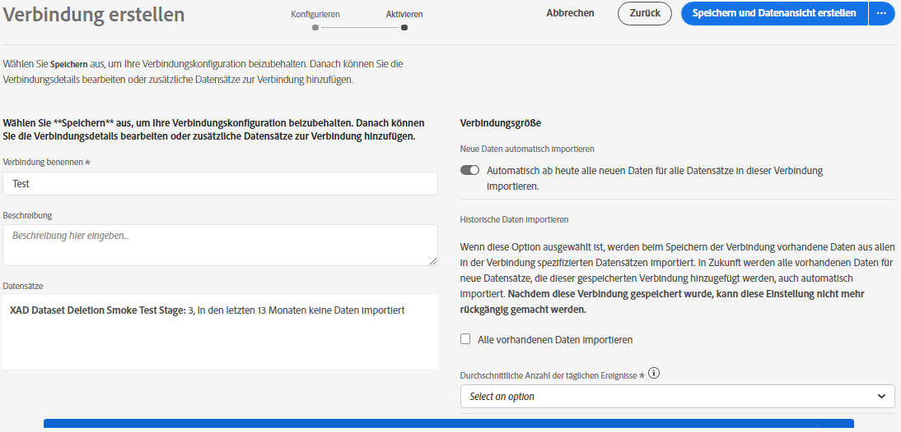

# Verbindung erstellen

Mit einer Verbindung können Sie Datensätze von [!DNL Adobe Experience Platform] in integrieren [!UICONTROL Workspace]. Um über [!DNL Experience Platform] Datensätze zu berichten, müssen Sie zunächst eine Verbindung zwischen Datensätzen in und herstellen [!DNL Experience Platform][!UICONTROL Workspace].

Klicken Sie [hier](https://docs.adobe.com/content/help/en/platform-learn/tutorials/cja/connecting-customer-journey-analytics-to-data-sources-in-platform.html) , um eine Videoübersicht zu erhalten.

>[!IMPORTANT] Sie können mehrere [!DNL Experience Platform] Datensätze zu einer einzigen Verbindung kombinieren.

1. Wechseln Sie zu [https://analytics.adobe.com](https://analytics.adobe.com).

1. Click the **[!UICONTROL Connections]** tab.

1. Klicken Sie **[!UICONTROL Create new connection]** oben rechts.

1. Die linke Leiste zeigt alle Datensätze an, aus [!DNL Experience Platform] denen Sie ziehen können. Wählen Sie einen oder mehrere Datensätze aus, in die Sie ziehen möchten, [!UICONTROL Customer Journey Analytics] und klicken Sie auf **[!UICONTROL Add]**. (Wenn Sie viele Datensätze auswählen können, können Sie über die Suchleiste oberhalb der Liste der Datensätze nach den richtigen Datensätzen suchen.)

1. Dann wird für jeden Datensatz, den Sie zu dieser Verbindung hinzugefügt haben, [!UICONTROL Customer Journey Analytics] automatisch der Datensatztyp basierend auf den Daten festgelegt, die eingehen. Es gibt 3 verschiedene Datensatztypen: [!UICONTROL Event] Daten, [!UICONTROL Profile] Daten und [!UICONTROL Lookup] Daten.

   | Typ des Datensatzes | Beschreibung | Zeitstempel | Schema | Personen-ID |
   |---|---|---|---|---|
   | [!UICONTROL Event-Schema] | Jedes integrierte oder benutzerdefinierte Schema, das auf einer XDM-Klasse mit dem Verhalten &quot;Zeitreihen&quot;basiert. Beispiele sind &quot;XDM Experience Ereignis&quot;oder &quot;XDM Decision Ereignis&quot;.  Daten, die zeitliche Ereignis darstellen (z. B. Webbesuche, Interaktionen, Transaktionen, POS-Daten, Daten zur Umfrage, Daten zu Anzeigenimpressionen usw.). Dies können beispielsweise typische Clickstream-Daten mit einer Kunden-ID oder einer Cookie-ID und einem Zeitstempel sein. Bei Ereignis-Daten haben Sie die Flexibilität, welche ID als Personen-ID verwendet wird. | Wird automatisch auf das Standardzeitstempelfeld von Ereignis-basierten Schemas in der [UICONTROL Experience Platform]eingestellt. | Das [UICONTROL Experience Platform] -Schema, auf dem dieser Datensatztyp basiert. | Sie können auswählen, welche Person-ID Sie einbeziehen möchten. Jedes in der Erlebnisplattform definierte DataSet-Schema kann einen eigenen Satz einer oder mehrerer Identitäten definieren und mit einem Identitäts-Namensraum verknüpft sein. Jede dieser Optionen kann als Personen-ID verwendet werden. Beispiele sind Cookie-ID, zugewiesene ID, Benutzer-ID, Rückverfolgungscode usw. |
   | [!UICONTROL Lookup-Schema] | Jedes integrierte oder benutzerdefinierte Schema, das auf einer XDM-Klasse mit dem Verhalten &quot;Record&quot;basiert, mit Ausnahme der Klasse &quot;XDM Individuelles Profil&quot;. Entspricht einer Classifications-Datei. Diese Daten werden zum Nachschlagen von Werten oder Schlüsseln in Ihren Ereignis- oder Profil-Daten verwendet. Sie können beispielsweise Suchdaten hochladen, die numerische IDs in Ihren Ereignis-Daten Produktnamen zuordnen. | nicht angegeben | Das [!DNL Experience Platform] Schema, auf dem dieser Datensatztyp basiert. | nicht angegeben |
   | [!UICONTROL Profile-Schema] | Jedes integrierte oder benutzerdefinierte Schema, das auf der Klasse &quot;XDM Individuelles Profil&quot;basiert.  Analog zu [!UICONTROL Customer Attributes] - für nicht ändernde und nicht zeitliche Attribute. Daten, die auf Ihre Besucher, Benutzer oder Kunden in den [!UICONTROL Event] Daten angewendet werden. Sie können beispielsweise CRM-Daten zu Ihren Kunden hochladen. | nicht angegeben | Das [!DNL Experience Platform] Schema, auf dem dieser Datensatztyp basiert. | Sie können auswählen, welche Person-ID Sie einbeziehen möchten. Jeder Datensatz, der in der definiert ist, [!DNL Experience Platform] verfügt über einen eigenen Satz von einer oder mehreren Personen-IDs, wie z. B. Cookie-ID, Stitched ID, Benutzer-ID, Rückverfolgungscode usw. **IDNote **: Wenn Sie eine Verbindung erstellen, die Datensätze mit unterschiedlichen IDs enthält, wird dies vom Berichte übernommen. Um Datasets wirklich zusammenzuführen, müssen Sie dieselbe Person-ID verwenden. |

1. Durch Klicken **[!UICONTROL Next]** gelangen Sie zum [!UICONTROL Create Connection] Dialogfeld.

   

1. Legen Sie im [!UICONTROL Create Connection] Dialogfeld die folgenden Einstellungen fest:

   | Feld | Beschreibung |
   |---|---|
   | [!UICONTROL Name Connection] | Geben Sie der Verbindung einen beschreibenden Namen. Die Verbindung kann nicht ohne Namen gespeichert werden. |
   | [!UICONTROL Description] | Hinzufügen detailliertere Informationen, um diese Verbindung von anderen zu unterscheiden. |
   | [!UICONTROL Datasets] | Die in dieser Verbindung enthaltenen Datensätze. |
   | [!UICONTROL Automatically import all new datasets in this connection, beginning today.] | Wählen Sie diese Option, wenn Sie eine fortlaufende Verbindung herstellen möchten, damit neue Datenstapel, die zu den Datensätzen in dieser Verbindung hinzugefügt werden, automatisch in [!UICONTROL Workspace]fließen. |
   | [!UICONTROL Import all existing data] | Wenn Sie diese Option auswählen und die Verbindung speichern, werden alle vorhandenen (historischen) Daten aus [!DNL Experience Platform] allen Datensätzen, die in dieser Verbindung vorhanden sind, importiert. Künftig werden auch alle vorhandenen historischen Daten für neue Datensätze, die zu dieser gespeicherten Verbindung hinzugefügt werden, automatisch importiert.  **Beachten Sie, dass diese Einstellung nach dem Speichern dieser Verbindung nicht mehr geändert werden kann.** |

   **Bedenken Sie Folgendes:**

   * Wenn die kumulative Größe der historischen Daten für alle Datensätze in der Verbindung 1,5 Milliarden Zeilen überschreitet, zeigt eine Fehlermeldung an, dass Sie diese Menge an historischen Daten nicht importieren können. Wenn Sie jedoch einen Datensatz mit 1 Milliarde Zeilen historischer Daten hinzufügen und diese Daten importieren würden, und eine Woche später einen weiteren Datensatz derselben Größe hinzufügen und seine historischen Daten importieren würden, würde dies funktionieren.
   * Neue Daten, die einem Datensatz in der Verbindung hinzugefügt werden, werden priorisiert, sodass diese Daten die niedrigste Latenz aufweisen.
   * Sämtliche Aufstockungsdaten (historische Daten) werden langsamer importiert.

1. Klicken Sie auf **[!UICONTROL Save]**.

Der nächste Schritt im Workflow besteht darin, eine Ansicht [zu](/help/data-views/create-dataview.md)erstellen.
