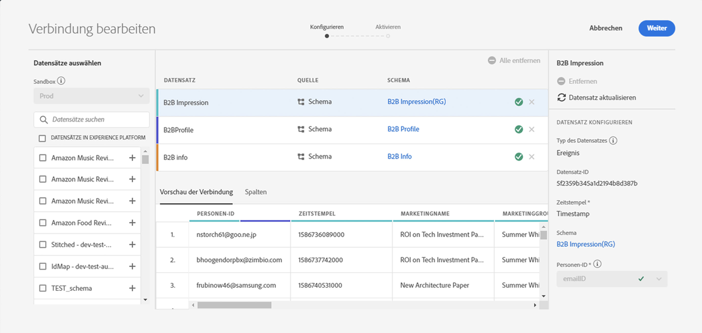
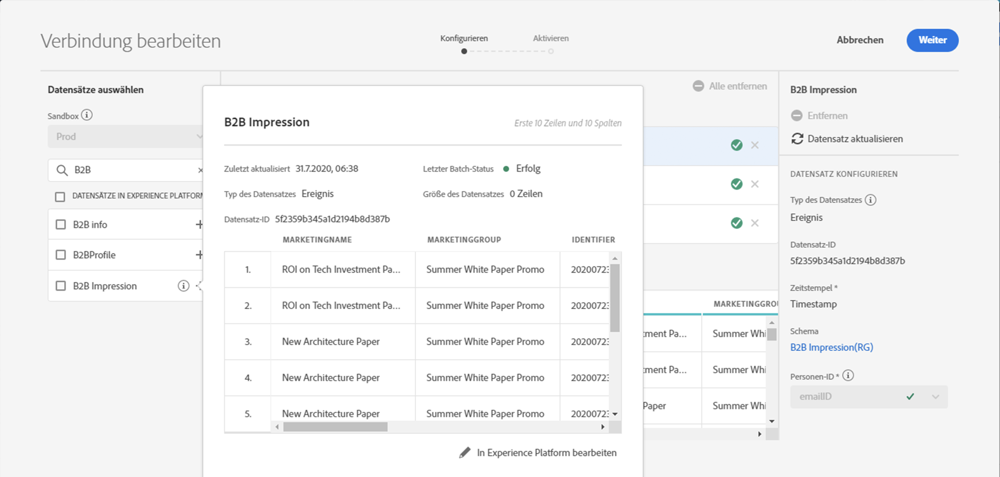
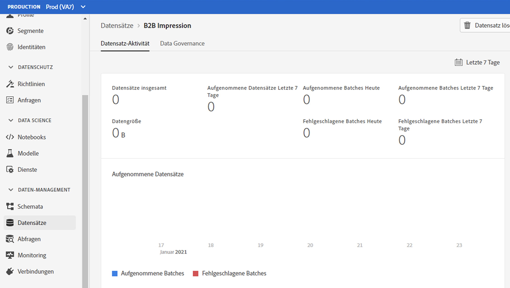
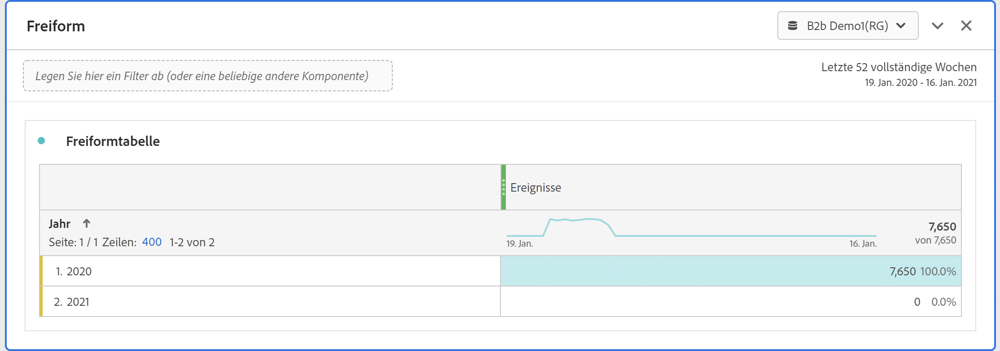
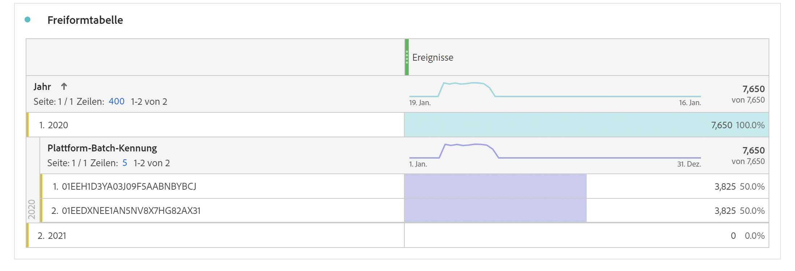

# Geschätzte Verbindungsgröße

Möglicherweise müssen Sie wissen, wie viele Datenzeilen Sie derzeit in [!UICONTROL Customer Journey Analytics] haben. In diesem Thema erfahren Sie, wie Sie Berichte zur aktuellen Verwendung von [!UICONTROL Customer Journey Analytics] erstellen.

1. Klicken Sie unter [!UICONTROL Customer Journey Analytics] auf die Registerkarte **[!UICONTROL Verbindungen]**.
1. Wählen Sie im Bildschirm [!UICONTROL Verbindung bearbeiten] eine Verbindung aus, für die Sie die Nutzung/Verbindungsgröße festlegen möchten.

   

1. Wählen Sie in der linken Leiste einen Datensatz aus, der Ihr Teil der Verbindung ist. In diesem Fall handelt es sich um den Datensatz &quot;B2B-Impression&quot;.

   

1. Klicken Sie auf das blaue Symbol (i) neben dem Namen. Der Datensatz enthält 3,8.000 Zeilen/Ereignisse. Klicken Sie außerdem für die genaue Anzahl der Zeilen unter der Tabelle &quot;Vorschau&quot;auf **[!UICONTROL In Experience Platform bearbeiten]**. Dadurch werden Sie zu den Datensätzen in [!UICONTROL Adobe Experience Platform] umgeleitet.

   

1. Beachten Sie, dass die Datensätze für diesen Datensatz insgesamt 3,83 KB betragen, wobei die Größe der Daten 388,59 KB beträgt.****

1. Wiederholen Sie die Schritte 1 bis 5 für andere Datensätze in Ihrer Verbindung und addieren Sie die Anzahl der Datensätze/Zeilen. Die letzte aggregierte Nummer ist die Nutzungsmetrik Ihrer Verbindung. Dies ist die Anzahl der Zeilen der Datensätze Ihrer Verbindung, die Sie von [!UICONTROL Adobe Experience Platform] aufnehmen werden.

## Bestimmen der Anzahl der aufgenommenen Zeilen

Die Anzahl der tatsächlich in [!UICONTROL Customer Journey Analytics] erfassten Ereignis hängt von Ihren Verbindungskonfigurationseinstellungen ab. Wenn Sie außerdem die falsche Personen-ID ausgewählt haben oder diese ID für einige Zeilen in den Datensätzen nicht verfügbar ist, ignorieren [!UICONTROL Customer Journey Analytics] diese Zeilen. Gehen Sie wie folgt vor, um die eigentlichen Zeilen der Ereignis zu ermitteln:

1. Nachdem Sie die Verbindung gespeichert haben, erstellen Sie eine Ansicht der gleichen Verbindung ohne Filter.
1. Erstellen Sie ein Workspace-Projekt und wählen Sie die richtige Ansicht der Daten aus. Erstellen Sie eine Freiformtabelle und ziehen Sie die Metrik **[!UICONTROL Ereignis]** mit der Dimension **[!UICONTROL Jahr]** per Drag &amp; Drop. Wählen Sie einen ausreichend großen Datumsbereich aus Ihrem Datumsauswahlkalender aus, um alle Daten in Ihrer Verbindung einzuschließen. Auf diese Weise können Sie die Anzahl der Ereignis sehen, die in [!UICONTROL Customer Journey Analytics] aufgenommen werden.

   

   >[!NOTE]
   >
   >Auf diese Weise können Sie sehen, wie viele Ereignis aus dem Dataset Ihrer Ereignis aufgenommen werden. Es enthält keine Profil- und Nachschlagetyp-Datensätze. Führen Sie die Schritte 1 bis 3 unter &quot;Geschätzte Verbindungsgröße&quot;für Profil- und Nachschlagetaten aus und addieren Sie die Zahlen, um die Gesamtanzahl der Zeilen für diese Verbindung abzurufen.

## Diskrepanzen diagnostizieren

In einigen Fällen können Sie bemerken, dass die Gesamtanzahl der von Ihrer Verbindung erfassten Ereignis sich von der Anzahl der Zeilen im Datensatz in [!UICONTROL Adobe Experience Platform] unterscheidet. In diesem Beispiel hat der Datensatz &quot;B2B-Impression&quot;7650 Zeilen, der Datensatz enthält jedoch 3830 Zeilen in [!UICONTROL Adobe Experience Platform]. Es gibt mehrere Gründe, warum Diskrepanzen auftreten können, und die folgenden Schritte können zur Diagnose unternommen werden:

1. Schlüsseln Sie diese Dimension nach **[!UICONTROL Plattform-Dataset-ID]** auf und Sie werden zwei Datensätze mit derselben Größe, aber unterschiedlichen **[!UICONTROL Plattform-Dataset-IDs]** bemerken. Jeder Datensatz enthält 3825 Datensätze. Das bedeutet, dass [!UICONTROL Customer Journey Analytics] 5 Datensätze aufgrund fehlender Personen-IDs oder fehlender Zeitstempel ignoriert hat:

   

1. Wenn Sie außerdem [!UICONTROL Adobe Experience Platform] einchecken, gibt es keinen Datensatz mit der ID &quot;5f21c12b732044194bffc1d0&quot;. Daher hat jemand diesen Datensatz bei der Erstellung der ersten Verbindung aus [!UICONTROL Adobe Experience Platform] gelöscht. Später wurde es erneut zu [!UICONTROL Customer Journey Analytics] hinzugefügt, aber eine andere [!UICONTROL Plattform-Dataset-ID] wurde von [!UICONTROL Adobe Experience Platform] generiert.

   Lesen Sie mehr über die Implikationen von Dataset und Verbindungslöschung[ in ](https://experienceleague.adobe.com/docs/analytics-platform/using/cja-overview/cja-faq.html?lang=en#implications-of-deleting-data-components)Customer Journey Analytics[!UICONTROL  und ]Adobe Experience Platform[!UICONTROL .]
