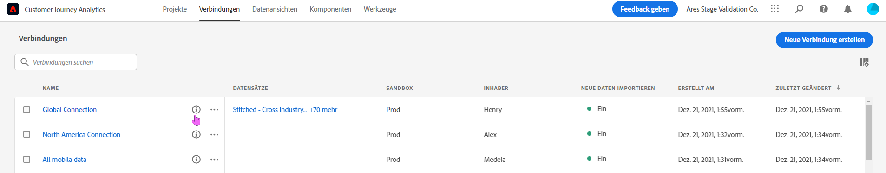
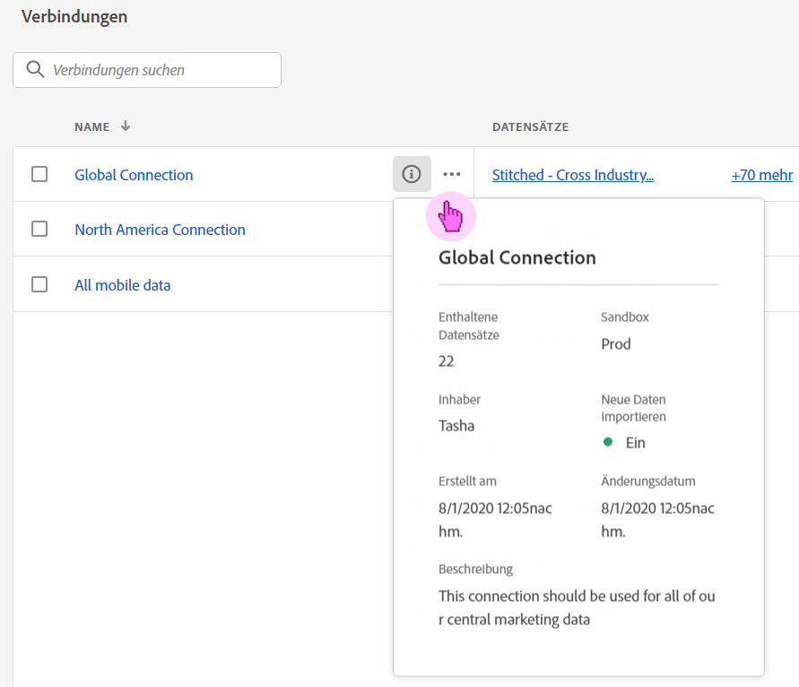
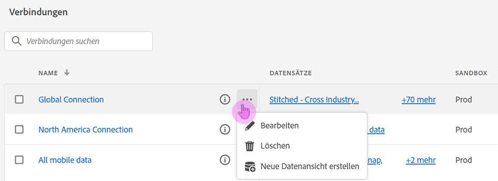
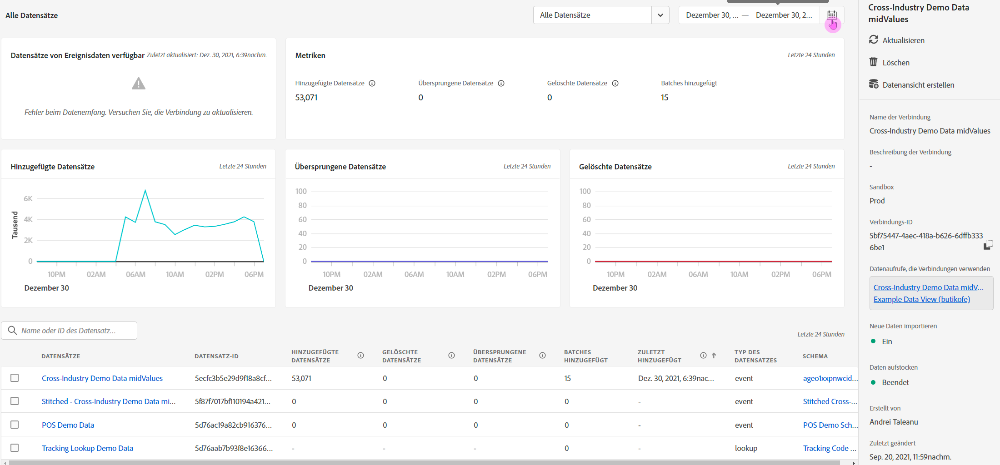

# Verbindungen verwalten

Nachdem Benutzer mit Administratorenrechten [eine oder mehrere Verbindungen erstellt haben](/help/connections/create-connection.md), können sie diese im [!UICONTROL Verbindungs-Manager] verwalten. Das neueste Update für das Verbindungserlebnis bietet zwei wichtige Funktionen auf der Seite „Verbindungsdetails“, die weiter unten auf dieser Seite beschrieben werden:

* Damit können Sie den **Status der Datensätze Ihrer Verbindung und des Aufnahmevorgangs** überprüfen. Mit dieser Statusprüfung erfahren Sie, wann Ihre Daten verfügbar sind, damit Sie in Analysis Workspace mit der Analyse beginnen können.

* Damit können Sie **alle Datendiskrepanzen identifizieren**, die aufgrund einer Fehlkonfiguration entstanden sind bzw. entstehen. Fehlen Zeilen? Wenn ja, welche Zeilen fehlen und warum? Haben Sie Verbindungen falsch konfiguriert und dadurch das Fehlen von Daten in Customer Journey Analytics verursacht?

>[!NOTE]
> Diese Funktion ist ab dem 10. August 2021 allgemein verfügbar.

## Verbindungs-Manager {#connections-manager}

Der Verbindungs-Manager ermöglicht Ihnen Folgendes:

* Lassen Sie sich alle Verbindungen auf einen Blick anzeigen, einschließlich Eigentümer, Sandbox und des Zeitpunkts der Erstellung und Änderung.
* Lassen Sie sich alle Datensätze in einer Verbindung anzeigen.
* Status einer Verbindung überprüfen.
* eine Verbindung löschen.
* eine Verbindung umbenennen.
* eine Datenschicht aus einer Verbindung erstellen.

| Einstellung | Beschreibung |
| --- | --- |
| [!UICONTROL Name] | Der Anzeigename der Verbindung. Wenn Sie auf den Hyperlink-Namen klicken, gelangen Sie zur Seite „Verbindungsdetails“, die unten beschrieben wird. |
| Verbindungsinformationen | Klicken Sie auf das Informationssymbol neben dem Verbindungsnamen, um die folgenden Informationen anzuzeigen:  |
| Verbindung bearbeiten | Klicken Sie auf die Auslassungszeichen (…) neben dem Verbindungsnamen und dann auf [!UICONTROL Bearbeiten]. Weitere Informationen finden Sie weiter unten unter „Bearbeiten einer Verbindung“. |
| eine Verbindung löschen | Klicken Sie auf die Auslassungszeichen (…) neben dem Verbindungsnamen und dann auf [!UICONTROL Löschen]. Weitere Informationen finden Sie weiter unten unter der Überschrift „Löschen von Verbindungen“. |
| Datenansicht erstellen | Klicken Sie auf die Auslassungszeichen (…) neben dem Verbindungsnamen und dann auf [!UICONTROL Datenansicht erstellen]. Diese Aktion erstellt eine neue Datenansicht, die auf dieser Verbindung basiert. [Weitere Infos](https://experienceleague.adobe.com/docs/analytics-platform/using/cja-dataviews/data-views.html?lang=de) |
| [!UICONTROL Datensätze] | Die Datensätze, die Teil der Verbindung sind. Sie können auf den Hyperlink klicken, um alle Datensätze in der Verbindung anzuzeigen. Wenn Sie auf einen Datensatz klicken, wird dieser Datensatz in Adobe Experience Platform in einer neuen Registerkarte geöffnet. |
| [!UICONTROL Sandbox] | Die [Sandbox von Adobe Experience Platform](https://experienceleague.adobe.com/docs/experience-platform/sandbox/home.html?lang=de), aus der diese Verbindung ihre Datensätze zieht. Diese Sandbox wurde beim erstmaligen Erstellen der Verbindung ausgewählt. Sie kann nicht geändert werden. |
| [!UICONTROL Inhaber] | Die Person, die die Verbindung hergestellt hat. |
| [!UICONTROL Importieren von Datensätzen] | Hiermit können Sie das sogenannte „Daten-Streaming“ aktivieren oder deaktivieren. |
| [!UICONTROL Erstellt am] | Das Datum, an dem die Verbindung erstmalig erstellt wurde. |
| [!UICONTROL Zuletzt geändert] | Das Datum, an dem die Verbindung zuletzt aktualisiert wurde. |

### Verbindungen löschen {#connections-delete}

Nur Administratoren haben die Berechtigung, eine Verbindung zu löschen. Diese Aktion wird nur für Administratoren angezeigt.

1. Klicken Sie auf die Auslassungspunkte (…) neben dem Verbindungsnamen.
1. Klicken Sie auf [!UICONTROL Löschen].

Wenn Sie eine Verbindung in [!UICONTROL Customer Journey Analytics] löschen, wird eine Fehlermeldung angezeigt, die auf Folgendes hinweist:

* Datenansichten, die basierend auf der gelöschten Verbindung erstellt wurden, funktionieren nicht mehr.
* Ebenso funktionieren alle Workspace-Projekte nicht mehr, die von den Datenansichten der gelöschten Verbindung abhängig sind.

[Weitere Informationen](/help/getting-started/cja-deletion.md) zu den Auswirkungen von Löschungen.

### Suchen nach einer Verbindung oder einem Datensatz

Sie können über die Suchleiste oben unter dem Titel [!UICONTROL Verbindungen] nach Verbindungen suchen.

### Sortieren von Verbindungen

Sie können Verbindungen sortieren, indem Sie auf jede Spaltenüberschrift klicken und sie nach oben oder unten sortieren.

## Seite „Verbindungsdetails“ {#connection-detail}

Auf der neuen Seite „Verbindungsdetails“ erhalten Sie einen sehr detaillierten Überblick über den Status einer Verbindung.

Damit können Sie:

* Überprüfen Sie den Status der Datensätze Ihrer Verbindung und des Aufnahmevorgangs.
* Identifizieren Sie Konfigurationsprobleme, die zu übersprungenen oder gelöschten Datensätzen führen.
* Finden Sie heraus, wann die Daten für das Reporting verfügbar sind.

Im Folgenden werden Widgets und Einstellungen erläutert:

| Widget/Einstellung | Beschreibung |
| --- | --- |
| Datensatz-Auswahl | Ermöglicht die Auswahl eines Datensatzes oder aller Datensätze in der Verbindung. Datensätze können nicht mehrmals ausgewählt werden. Die Standardeinstellung ist [!UICONTROL Alle Datensätze]. |
| Kalender/Datumsbereiche | Der Datumsbereich gibt an, wann Sie der Verbindung Daten hinzugefügt haben. Alle Standardkalendervorgaben sind enthalten. Sie können den Datumsbereich anpassen, es werden jedoch keine benutzerdefinierten Datumsbereiche in der Dropdown-Liste angezeigt. |
| Widget [!UICONTROL Verfügbare Datensätze] | Stellt die Gesamtzahl der für das Reporting verfügbaren Zeilen dar, und das **für die gesamte Verbindung**. Diese Anzahl ist unabhängig von Kalendereinstellungen. Sie ändert sich, wenn Sie einen Datensatz aus der Datensatzauswahl auswählen, oder durch die Auswahl eines Datensatzes in der Tabelle. (Beachten Sie, dass es eine Latenz von 1–2 Stunden gibt, bis die Daten nach dem Hinzufügen in Berichten angezeigt werden.) |
| Widget [!UICONTROL Metriken] | Fasst die hinzugefügten/übersprungenen/gelöschten Datensätze sowie die Anzahl der hinzugefügten Stapel **für den ausgewählten Datensatz und den ausgewählten Datumsbereich** zusammen. |
| Widget [!UICONTROL Hinzugefügte Datensätze] | Gibt an, wie viele Zeilen im ausgewählten Zeitraum **für den ausgewählten Datensatz und Datumsbereich** hinzugefügt wurden. Wird alle zehn Minuten aktualisiert. |
| Widget [!UICONTROL Übersprungene Datensätze] | Gibt an, wie viele Zeilen im ausgewählten Zeitraum **für den ausgewählten Datensatz und Datumsbereich** übersprungen wurden. Gründe für das Überspringen von Datensätzen sind: fehlende Zeitstempel, fehlende Personen-ID usw. Wird alle zehn Minuten aktualisiert. |
| Widget [!UICONTROL Gelöschte Datensätze] | Gibt an, wie viele Zeilen im ausgewählten Zeitraum **für den ausgewählten Datensatz und Datumsbereich** gelöscht wurden. Beispielsweise könnte jemand einen Datensatz in Experience Platform gelöscht haben. Wird alle zehn Minuten aktualisiert. |
| Datensatz-Suchfeld | Sie können nach Datensatznamen oder [!UICONTROL Datensatz-ID] suchen. |
| [!UICONTROL Datensätze] | Zeigt die Datensätze an, die Teil der Verbindung sind. Sie können auf den Hyperlink klicken, um alle Datensätze in der Verbindung anzuzeigen. |
| [!UICONTROL Datensatz-ID] | Diese ID wird automatisch von Adobe Experience Platform generiert. |
| [!UICONTROL Batches] | Gibt an, wie viele Datenstapel zu diesem Datensatz hinzugefügt wurden. |
| [!UICONTROL Zuletzt hinzugefügt] | Zeigt den Zeitstempel für den zuletzt zu diesem Datensatz hinzugefügten Stapel an. |
| [!UICONTROL Typ des Datensatzes] | Der Datensatztyp für diesen Datensatz kann [!UICONTROL Ereignis], [!UICONTROL Suche] oder [!UICONTROL Profil] sein. [Weitere Infos](https://experienceleague.adobe.com/docs/analytics-platform/using/cja-connections/create-connection.html?lang=de#configure-dataset) |
| Schema | Das Adobe Experience Platform-Schema, auf dem die Datensätze in dieser Verbindung basieren. |
| **Rechte Leiste auf Verbindungsebene** |  |
| [!UICONTROL Aktualisieren] | Aktualisieren Sie die Verbindung, damit kürzlich hinzugefügte Datensätze angezeigt werden. |
| [!UICONTROL Löschen] | Löschen Sie diese Verbindung. |
| [!UICONTROL Datenansicht erstellen] | Erstellen Sie eine neue Datenansicht auf Grundlage dieser Verbindung. [Weitere Infos](https://experienceleague.adobe.com/docs/analytics-platform/using/cja-dataviews/data-views.html?lang=en) |
| [!UICONTROL Name der Verbindung] | Zeigt den Anzeigenamen der Verbindung an. |
| [!UICONTROL Beschreibung der Verbindung] | Zeigt eine detailliertere Beschreibung an, die idealerweise den Zweck dieser Verbindung beschreibt. |
| [!UICONTROL Personen-ID] | Zeigt eine Identität an, die im Datensatzschema in Experience Platform definiert wurde. Das ist die [!UICONTROL Personen-ID], die Sie bei der Erstellung der Verbindung ausgewählt haben. Wenn Sie eine Verbindung erstellen, die Datensätze mit unterschiedlichen IDs enthält, wird dies beim Reporting berücksichtigt. Um Datensätze zusammenzuführen, müssen Sie dieselbe [!UICONTROL Personen-ID] verwenden. |
| [!UICONTROL Sandbox] | Die [Sandbox von Adobe Experience Platform](https://experienceleague.adobe.com/docs/experience-platform/sandbox/home.html?lang=en), aus der diese Verbindung ihre Datensätze abruft. Diese Sandbox wurde beim erstmaligen Erstellen der Verbindung ausgewählt. Sie kann nicht geändert werden. |
| [!UICONTROL Verbindungs-ID] | Diese ID wird in Adobe Experience Platform vom System generiert. |
| [!UICONTROL Kennung der IMS-Organisation] | Die [Organisations-ID](https://experienceleague.adobe.com/docs/core-services/interface/administration/organizations.html?lang=de), die Ihrem bereitgestellten Experience Cloud-Unternehmen zugeordnet ist. Zuvor als „Unternehmensanmeldung“ bezeichnet. |
| [!UICONTROL Datenaufrufe, die Verbindungen verwenden] | Listet alle Datenansichten auf, die diese Verbindung verwenden. |
| [!UICONTROL Neue Daten importieren] | Gibt an, ob den historischen Daten (Aufstockung) neue Datenstapel hinzugefügt werden sollen oder nicht. |
| **Rechte Leiste auf Datensatzebene** |  |
| [!UICONTROL Beschreibung des Datensatzes] | Beschreibt die Parameter der einzelnen Datensätze in dieser Verbindung. |
| [!UICONTROL Verfügbare Datensätze] | Stellt die Gesamtzahl der Zeilen dar, die für diesen Datensatz in dem im Kalender ausgewählten Zeitraum aufgenommen wurden. Es gibt keine Latenz im Hinblick darauf, ab wann die Daten nach dem Hinzufügen in Berichten angezeigt werden. (Allerdings ist beim Erstellen einer brandneuen Verbindung eine [Latenz](https://experienceleague.adobe.com/docs/analytics-platform/using/cja-overview/cja-faq.html?lang=de#3.Daten in Customer Journey Analytics importieren) vorhanden. |
| [!UICONTROL Hinzugefügte Datensätze] | Wie viele Zeilen im ausgewählten Zeitraum hinzugefügt wurden. |
| [!UICONTROL Übersprungene Datensätze] | Wie viele Zeilen während der Aufnahme im ausgewählten Zeitraum übersprungen wurden. |
| [!UICONTROL Fehler bei übersprungenen Datensätzen] | Der Grund, warum Datensätze übersprungen wurden, wird hier angegeben. Gründe hierfür können fehlende Zeitstempel, fehlende Personen-ID usw. sein. |
| [!UICONTROL Aufgenommene Batches] | Wie viele Datenstapel diesem Datensatz hinzugefügt wurden. |
| [!UICONTROL Zuletzt hinzugefügt] | Der Zeitpunkt, zu dem der letzte Stapel hinzugefügt wurde. |
| [!UICONTROL Typ des Datensatzes] | Entweder [!UICONTROL Ereignis], [!UICONTROL Suche] oder [!UICONTROL Profil]. [Weitere Infos](https://experienceleague.adobe.com/docs/analytics-platform/using/cja-connections/create-connection.html?lang=en#configure-dataset) |
| [!UICONTROL Schema] | Das Adobe Experience Platform-Schema, auf dem dieser Datensatz basiert. |
| [!UICONTROL Datensatz-ID] | Diese ID wird in Adobe Experience Platform vom System generiert. |
| [!UICONTROL Aufstockungsdaten] | Aufstockungsdaten (historische Daten) werden in drei Status verfolgt: [!UICONTROL In der Warteschlange], [!UICONTROL In Bearbeitung] (mit angegebenem Fortschrittsprozentsatz) und [!UICONTROL Abgeschlossen]. |

### Verbindung bearbeiten

Ermöglicht es Administratoren, die Verbindung zu bearbeiten. Wählen Sie eine Verbindung aus und klicken Sie dann auf [!UICONTROL Verbindung bearbeiten], um zu diesem Dialogfeld zu gelangen. Hier können Sie Folgendes tun:

* Starten und Beendes des Imports neuer Daten. Dieser Prozess wurde früher als „Daten-Streaming“ bezeichnet.
* eine Verbindung umbenennen.
