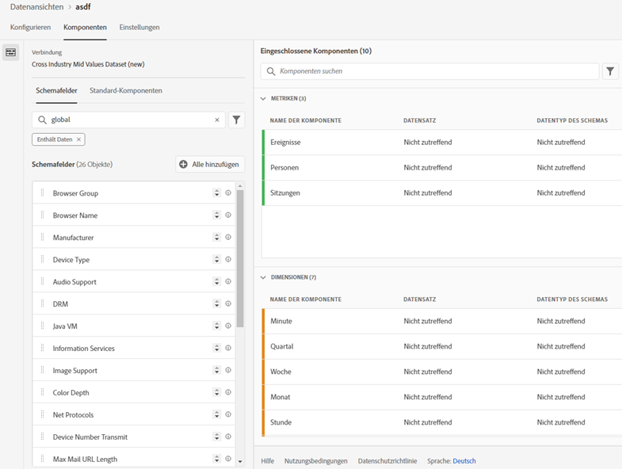
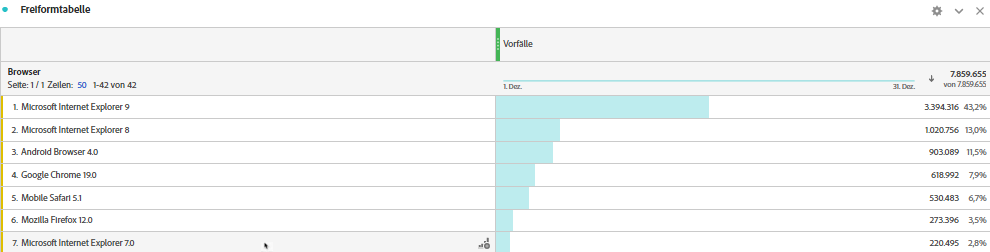

# Hinzufügen von Standardsuchen zu Ihren Datensätzen

>[!IMPORTANT]
>Standardsuchvorgänge sind nur für Analytics Data Connector-Datenquellen in Customer Journey Analytics verfügbar. Sie können sie mit standardmäßigen Adobe Analytics-Implementierungen, mit dem [Adobe Experience Platform Web SDK](https://experienceleague.adobe.com/docs/experience-platform/edge/home.html?lang=de) oder mit den Datenerfassungs-APIs von Experience Platform verwenden.

Anhand von Standardsuchen (auch als von Adobe bereitgestellte Suchen bekannt) kann Customer Journey Analytics Berichte zu bestimmten Dimensionen/Attributen erstellen, die nicht für sich genommen, aber bei der Verknüpfung mit anderen Daten nützlich sind. Dies können beispielsweise Attribute von Smartphones oder Tablets und Attribute von Betriebssystem- und Browser-Dimensionen wie etwa die Versionsnummern von Browsern sein. Eine „Standardsuche“ ist ähnlich wie ein Such-Datensatz. Standardsuchen sind auf alle Experience Cloud-Organisationen anwendbar. Sie werden automatisch auf alle Ereignis-Datensätze angewendet, die bestimmte XDM-Schemafelder enthalten (die jeweiligen Felder finden Sie unten). Für jeden Schema-Speicherort, den Adobe klassifiziert, gibt es einen Datensatz für die Standardsuche.

Im herkömmlichen Adobe Analytics werden diese Dimensionen eigenständig angezeigt. In Customer Journey Analytics hingegen müssen Sie diese Dimensionen beim Erstellen von Datenansichten aktiv einbeziehen. Im Verbindungs-Workflow wählen Sie einen Datensatz aus, der mit einem Schlüssel für die Standardsuche gekennzeichnet ist. In der Datenansichts-Benutzeroberfläche werden automatisch alle Dimensionen der Standardsuche einbezogen, die für Berichte verfügbar sind. Die Lookup-Dateien werden automatisch aktualisiert und stehen für alle Regionen und Accounts zur Verfügung. Sie werden in regionsspezifischen Organisationen gespeichert, die dem Kunden zugeordnet sind.

## Verwenden von Standardsuchen mit Adobe Data Connector-Datensätzen

Datensätze für die Standardsuche werden zum Zeitpunkt der Berichterstellung automatisch angewendet. Wenn Sie Analytics Data Connector verwenden und eine Dimension einbringen, für die Adobe eine Standardsuche bereitstellt, wird diese Standardsuche automatisch angewendet. Wenn ein Ereignis-Datensatz XDM-Felder enthält, können Standardsuchen darauf angewendet werden.

<!--
### Specific IDs that need to be populated

The following IDs need to be populated in the specific XDM mixins for this functionality to work:

* Environment Details Mixin – device/typeID value populated - Must match Device Atlas IDs and will populate device data.
* Adobe Analytics ExperienceEvent Template Mixin or Adobe Analytics ExperienceEvent Full Extension Mixin with analytics/environment/browserIDStr and analytics/environment/operatingSystemIDStr. Both must match the Adobe IDs and  populate browser and OS data, respectively.

You need these mixins with the three IDs populated (device/typeID, environment/browserIDStr, and environment/operatingSystemIDStr). The lookup dimensions will then be pulled automatically by CJA and will be available in the Data View.

The catch here is that they can only populate those IDs today if they have a direct relationship with Device Atlas. They are Device Atlas IDs, and they provide an API to allow a customer to look them up. This is a significant hurdle, and we may just want to take the reference to this capability out of the product documentation until we have a productized way to expose the Device Atlas ID lookup functionality.
-->

### Verfügbare Standardsuchfelder

* `browser`
   * `browser`, `group_id`, `id`
* `browser_group`
   * `browser_group`, `id`
* `os`
   * `os`, `group_id`, `id`
* `os_group`
   * `os_group`, `id`
* `mobile_audio_support - multi`
* `mobile_color_depth`
* `mobile_cookie_support`
* `mobile_device_name`
* `mobile_device_number_transmit`
* `mobile_device_type`
* `mobile_drm - multi`
* `mobile_image_support - multi`
* `mobile_information_services`
* `mobile_java_vm - multi`
* `mobile_mail_decoration`
* `mobile_manufacturer`
* `mobile_max_bookmark_url_length`
* `mobile_max_browser_url_length`
* `mobile_max_mail_url_length`
* `mobile_net_protocols - multi`
* `mobile_os`
* `mobile_push_to_talk`
* `mobile_screen_height`
* `mobile_screen_size`
* `mobile_screen_width`
* `mobile_video_support - multi`

## Bericht zu Dimensionen der Standardsuche

Um einen Bericht zu den Dimensionen der Standardsuche zu erstellen, müssen Sie diese hinzufügen, wenn Sie eine Datenansicht in Customer Journey Analytics erstellen:

Anschließend werden die Suchdaten in Arbeitsbereich angezeigt:

