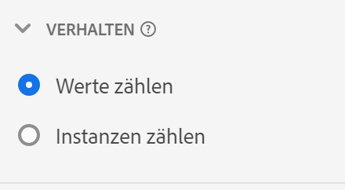
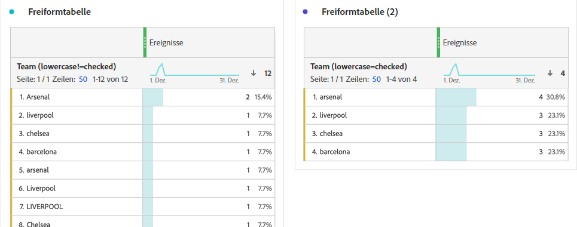

# Verhaltens-Komponenteneinstellungen

Verhaltenseinstellungen sind sowohl für Dimensionen als auch für Metriken verfügbar. Die verfügbaren Einstellungen hängen vom Komponententyp und Schemadatentyp ab.

## Verhaltenseinstellungen für Dimensionen

| Einstellung | Beschreibung |
| --- | --- |
| [!UICONTROL Kleinbuchstaben] | Dedupliziert Zeilen mit demselben Wert, aber unterschiedlicher Groß-/Kleinschreibung. Wenn diese Option aktiviert ist, werden alle Instanzen einer Dimension mit demselben Wert als Kleinbuchstaben gemeldet. Ihre Daten enthalten beispielsweise die Werte `"liverpool"`, `"Liverpool"` und `"LIVERPOOL"` in einer Zeichenfolgendimension. Wenn [!UICONTROL Kleinbuchstaben] aktiviert ist, werden alle drei Werte zu `"liverpool"` kombiniert. Wenn diese Option deaktiviert ist, werden alle drei Werte als unterschiedlich behandelt. |

>[!NOTE]
>
>Wenn Sie [!UICONTROL Kleinbuchstaben] für eine Such-Datensatzdimension aktivieren, können für dieselbe Kennung mehrere Suchwerte vorhanden sein. In diesem Fall verwendet CJA den ersten gesammelten ASCII-Wert (Werte in Großbuchstaben vor Kleinbuchstaben). Adobe rät davon ab, Such-Datensätze zu verwenden, die denselben Wert enthalten, wenn [!UICONTROL Kleinbuchstaben] aktiviert ist.

## Einstellungen für das Metrikverhalten

| Einstellung | Beschreibung/Verwendungsfall |
| --- | --- |
| [!UICONTROL Werte zählen] | Sichtbar bei Schemadatentypen vom Typ „Ganzzahl“ und „Doppelt“. Erhöhen Sie die Metrik um den angegebenen Betrag. Erhöht beispielsweise eine Metrik um 50, wenn der Wert der Spalte `50` lautet. |
| [!UICONTROL Instanzen zählen] | Sichtbar bei Schemadatentypen vom Typ „Ganzzahl“ und „Doppelt“. Erhöhen Sie die Metrik um eins, unabhängig vom Wert. Das Vorhandensein von Werten erhöht die Metrik. Erhöht beispielsweise eine Metrik um 1, wenn der Wert der Spalte `50` lautet. |
| [!UICONTROL Zu zählende Werte] | Sichtbar für boolesche Schemadatentypen. Ermöglicht es Ihnen, zu bestimmen, ob die Metrik durch die Zählung von `true`, `false` oder beiden zunimmt. |

Sie können in Analysis Workspace sowohl die Metrik „Bestellungen“ als auch die Metrik „Umsatz“ generieren, indem Sie dieselbe Ereignis-Datensatzspalte mit unterschiedlichem Verhalten verwenden. Ziehen Sie die Datensatzspalte „Umsatz“ zweimal in die Datenansicht und legen Sie eine auf „Zählerwerte“ und die andere auf „Instanzen zählen“ fest. Die Metrik „Bestellungen“ zählt Instanzen, während die Metrik „Umsatz“ Werte zählt.
