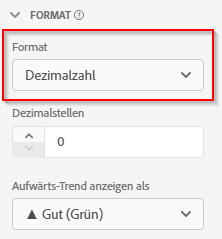

# Formatierungs-Komponenteneinstellungen

Mit „Format“ können Sie bestimmen, wie eine bestimmte Metrik angezeigt wird.

| Einstellung | Beschreibung |
| --- | --- |
| **[!UICONTROL Format]** | Hier können Sie die Formatierung einer Metrik als Dezimal, Zeit, Prozent oder Währung angeben. |
| **[!UICONTROL Dezimalstellen]** | Nicht sichtbar bei Schemadatentypen des Typs „Ganzzahl“. Hier können Sie die Anzahl der Dezimalstellen angeben, die eine Metrik anzeigt. |
| **[!UICONTROL Datum]** | Hiermit können Sie bestimmen, wie das „date-time“-Feld angezeigt werden soll, wenn es als Dimension in Berichten verwendet wird. [Weitere Informationen](https://experienceleague.adobe.com/docs/analytics-platform/using/cja-dataviews/data-views-usecases.html?lang=de#date) |
| **[!UICONTROL Date-Time]** | Hiermit können Sie bestimmen, wie das „date-time“-Feld angezeigt werden soll, wenn es als Dimension in Berichten verwendet wird. [Weitere Informationen](https://experienceleague.adobe.com/docs/analytics-platform/using/cja-dataviews/data-views-usecases.html?lang=de#date) |
| **[!UICONTROL Währung]** | Hiermit können Sie festlegen, in welcher Währung die Metrik angezeigt werden soll. Diese Option gilt nicht für Währungsumrechnungen, sondern lediglich zur Formatierung der Benutzeroberfläche. |
| **[!UICONTROL Aufwärts-Trend anzeigen als]** | Hier können Sie angeben, ob bei dieser Metrik ein Aufwärts-Trend gut (grün) oder schlecht (rot) ist. |
| **[!UICONTROL Wert „True“]** und **[!UICONTROL Wert „False“]** | Nur bei booleschen Schemadatentypen sichtbar. Ermöglicht die Anpassung der Bezeichnung des Dimensionselements für die Werte `true` und `false`. |

{style=&quot;table-layout:auto&quot;}
