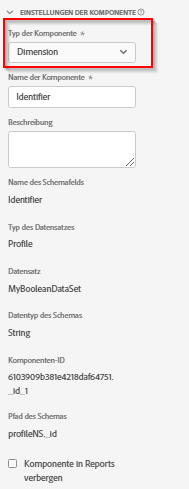

# Einstellungen der Komponente

Kerneinstellungen, die eine Komponente verwendet.

| Einstellung | Beschreibung/Verwendungsfall |
| --- | --- |
| [!UICONTROL Typ der Komponente] | Erforderlich. Ermöglicht es Ihnen, eine Komponente von Metrik in Dimension zu ändern oder umgekehrt. Durch Änderung dieses Dropdown-Menüs wird die Komponente in den entsprechenden eingeschlossenen Komponentenbereich verschoben. |
| [!UICONTROL Name der Komponente] | Erforderlich. Hier können Sie den benutzerfreundlichen Namen angeben, der in Analysis Workspace angezeigt wird. Sie können eine Komponente umbenennen, um ihr einen spezifischen Namen für die Datenansicht zu geben. |
| [!UICONTROL Beschreibung] | Optional, jedoch empfohlen. Stellt Informationen über die Komponente für andere Benutzer bereit. |
| [!UICONTROL Tags] | Optional. Ermöglicht das Taggen der Komponente mit benutzerdefinierten oder vordefinierten Tags zur einfacheren Suche/Filterung in der Analysis Workspace-Benutzeroberfläche. |
| [!UICONTROL Feldname] | Der Name des Schemafelds. |
| [!UICONTROL Typ des Datensatzes] | Erforderlich. Ein nicht bearbeitbares Feld, das anzeigt, von welchem Datensatztyp (Ereignis, Suche oder Profil) die Komponente stammt. |
| [!UICONTROL Datensatz] | Ein nicht bearbeitbares Feld, das anzeigt, aus welchem Datensatz die Komponente stammt. Dieses Feld kann mehrere Datensätze enthalten. |
| [!UICONTROL Datentyp des Schemas] | Ein nicht bearbeitbares Feld, das den Datentyp der Komponente anzeigt.  Sie können zwar einen beliebigen unterstützten Schemafeldtyp in Platform verwenden, jedoch werden in CJA nicht alle Feldtypen unterstützt. Die folgenden Datentypen werden unterstützt: `Integer`, `Int`, `Long`, `Double`, `Float`, `Number`, `Short`, `Byte`, `String` und `Boolean`. Derzeit ist in Such-Datensätzen nur der Schemadatentyp `String` zulässig. |
| [!UICONTROL Komponenten-ID] | Erforderlich. Die [CJA-API](https://adobe.io/cja-apis/docs) verwendet dieses Feld, um auf die Komponente zu verweisen. Jede Komponente in einer Datenansicht muss eindeutig sein. Adobe generiert automatisch eine ID für jede Komponente. Sie können jedoch auf das Bearbeitungssymbol klicken und die Komponenten-ID ändern. Durch das Ändern der Komponenten-ID werden alle vorhandenen Workspace-Projekte, die diese Komponente enthalten, beschädigt. Während jede Komponente eine eindeutige ID in einer Datenansicht benötigt, können Sie dieselbe Komponenten-ID in anderen Datenansichten verwenden. Wenn Sie dieselbe Komponenten-ID in anderen Datenansichten verwenden, können Sie Workspace-Projekte über Datenansichten hinweg kompatibel machen. |
| [!UICONTROL Pfad des Schemas] | Erforderlich. Ein nicht bearbeitbares Feld, das den Schema-Pfad anzeigt, von dem die Komponente stammt. |
| [!UICONTROL Komponente in Reports verbergen] | Ermöglicht das Kuratieren der Komponente aus der Datenansicht für Benutzer ohne Administratorrechte. Administratoren können weiterhin darauf zugreifen, indem sie in einem Analysis Workspace-Projekt auf [!UICONTROL Alle Komponenten anzeigen] klicken. |
