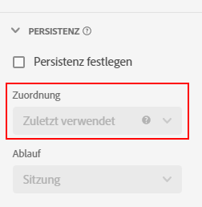

# [!UICONTROL Persistenz]-Komponenteneinstellungen

[!UICONTROL Persistenz] ist die Fähigkeit, dass ein bestimmter Dimensionswert sich über das Ereignis hinaus auf eine Metrik beziehen kann. Dafür wird eine Kombination aus Zuordnung und Gültigkeit verwendet.

* Mit **Zuordnung** können Sie festlegen, welcher Wert beibehalten wird, wenn mehrere Dimensionselemente gleichzeitig in einer Spalte beibehalten werden können.
* Mit **Gültigkeit** können Sie festlegen, wie lange ein Dimensionselement über das Ereignis hinaus bestehen bleibt, für das es festgelegt ist.

[!UICONTROL Persistenz] ist nur für Dimensionen verfügbar und rückwirkend für die Daten, auf die sie angewendet wird. Es handelt sich um eine sofortige Datenumwandlung, die vor der Anwendung von Filtern oder anderen Analysevorgängen erfolgt.

| Einstellung | Beschreibung |
| --- | --- |
| [!UICONTROL Persistenz festlegen] | Aktivieren Sie die Persistenz für die Dimension. Wenn die Persistenz nicht aktiviert ist, bezieht sich die Dimension nur auf Metriken, die im selben Ereignis vorhanden sind. Diese Einstellung ist standardmäßig aktiviert. |
| [!UICONTROL Zuordnung] | Hier können Sie das Zuordnungsmodell angeben, das für eine Dimension für Persistenz verwendet wird. Die Optionen sind: [!UICONTROL Zuletzt verwendet], [!UICONTROL Original], [!UICONTROL Instanz], [!UICONTROL Alle]. Seit dem 28. Oktober 2021 wird ein Lookback-Fenster von bis zu 90 Tagen zur Einstellung [!UICONTROL Zuordnung] hinzugefügt. |
| [!UICONTROL Ablauf] | Hier können Sie das Persistenzfenster für eine Dimension angeben. Die Optionen sind: [!UICONTROL Sitzung] (Standard), [!UICONTROL Person], [!UICONTROL Benutzerdefinierte Zeit], [!UICONTROL Metrik]. Möglicherweise brauchen Sie die Option, dass die Dimension bei einem Kauf ablaufen soll (z. B. interne Suchbegriffe oder andere Merchandising-Verwendungsfälle). Die maximale Gültigkeitsdauer, die Sie einstellen können, beträgt 90 Tage. Wenn Sie die Zuordnung [!UICONTROL Alle] auswählen, ist nur die Gültigkeit [!UICONTROL Sitzung] oder [!UICONTROL Person] verfügbar. |

{style=&quot;table-layout:auto&quot;}

## [!UICONTROL Zuordnungs]-Einstellungen

Details zu den verfügbaren Zuordnungseinstellungen.

* **[!UICONTROL Zuletzt verwendet]**: behält den letzten (nach Zeitstempel) in der Dimension vorhandenen Wert bei. Alle nachfolgenden Werte, die innerhalb des Gültigkeitszeitraums der Dimension auftreten, ersetzen den vorherigen Wert. Wenn „Kein Wert als Wert behandeln“ für diese Dimension unter [Optionen für keinen Wert](no-value-options.md) aktiviert ist, überschreiben leere Werte vorherige Werte. Betrachten Sie beispielsweise die folgende Tabelle mit der Zuordnung [!UICONTROL Zuletzt verwendet] und der Gültigkeit [!UICONTROL Sitzung]:

   | Dimension | Treffer 1 | Treffer 2 | Treffer 3 | Treffer 4 | Treffer 5 |
   | --- | --- | --- | --- | --- | --- |
   | Datensatzwerte |  | C | B |  | A |
   | Zuletzt verwendete Zuordnung |  | C | B | B | A |

* **[!UICONTROL Original]**: Behält den ursprünglichen Wert nach Zeitstempel bei, der innerhalb der Dimension für die Dauer des Gültigkeitszeitraums vorhanden ist. Wenn diese Dimension einen Wert hat, wird er nicht überschrieben, wenn bei einem nachfolgenden Ereignis ein anderer Wert auftritt. Betrachten Sie beispielsweise die folgende Tabelle mit der Zuordnung [!UICONTROL Original] und der Gültigkeit [!UICONTROL Sitzung]:

   | Dimension | Treffer 1 | Treffer 2 | Treffer 3 | Treffer 4 | Treffer 5 |
   | --- | --- | --- | --- | --- | --- |
   | Datensatzwerte |  | C | B |  | A |
   | Originale Zuordnung |  | C | C | C | C |

* **[!UICONTROL Alle]**: Funktioniert ähnlich wie das Attributionsmodell [!UICONTROL Partizipation] für Metriken. Behält alle Werte bei, damit jeder Wert im Reporting vollständig für die Metrik angerechnet wird. Betrachten Sie beispielsweise die folgende Tabelle mit der Zuordnung [!UICONTROL Alle] und der Gültigkeit [!UICONTROL Sitzung]:

   | Dimension | Treffer 1 | Treffer 2 | Treffer 3 | Treffer 4 | Treffer 5 |
   | --- | --- | --- | --- | --- | --- |
   | Datensatzwerte | A | B | C |  | A |
   | Zuordnung Alle | A | A,B | A,B,C | A,B,C | A,B,C |

* **[!UICONTROL Erster bekannter]** und **[!UICONTROL Letzter bekannter]**: (19. Januar 2022) Diese beiden Zuordnungsmodelle erfüllen die Anwendungsfälle der Dimensionen „Einstieg“ und „Ausstieg“. Sie wenden den ersten oder letzten beobachteten Wert für eine Dimension innerhalb eines bestimmten Persistenzbereichs (Sitzung, Person oder benutzerspezifischer Zeitraum mit Lookback) auf alle Ereignisse innerhalb des angegebenen Bereichs an. Beispiel:

   | Dimension | Treffer 1 | Treffer 2 | Treffer 3 | Treffer 4 | Treffer 5 |
   | --- | --- | --- | --- | --- | --- |
   | Zeitstempel (Min.) | 1 | 2 | 3 | 6 | 7 |
   | Ausgangswerte |  | C | B |  | A |
   | Erster bekannter | C | C | C | C | C |
   | Letzter bekannter | A | A | A | A | A |

## [!UICONTROL Gültigkeits]-Einstellungen

Details zu den verfügbaren Gültigkeitseinstellungen.

* **Sitzung**: Läuft nach einer Sitzung ab. Standardgültigkeitsfenster.
* **Person**: Läuft am Ende des Reporting-Fensters ab.
* **Benutzerdefinierte Zeit**: Läuft nach einer festgelegten Zeitspanne ab (bis zu 90 Tage). Diese Ablaufoption ist nur für die Zuordnungsmodelle „Original“ und „Zuletzt verwendet“ verfügbar. Bei Verwendung der zeitbasierten Gültigkeitsdauer werden auch Werte vor dem Beginn des Reporting-Fensters (bis zu 90 Tage) berücksichtigt.
* **Metrik**: Wenn diese Metrik in einem Treffer angezeigt wird, läuft der Wert in der Dimension sofort ab. Sie können jede beliebige Metrik als Gültigkeitsende für diese Dimension verwenden. Diese Gültigkeitsoption ist nur für die Zuordnungseinstellungen „Original“ und „Zuletzt verwendet“ verfügbar.

## [!UICONTROL Binding-Dimension]

Ein Dropdown-Menü, mit dem Sie die Persistenz eines Dimensionswerts an Dimensionswerte in einer anderen Dimension binden können. Gültige Dropdown-Optionen umfassen andere Dimensionen, die in der Datenansicht enthalten sind.

Siehe Beispiele für die effektive Verwendung von Bindungsdimensionen in [Verwenden von Bindungsdimensionen und Metriken in CJA](../../use-cases/data-views/binding-dimensions-metrics.md).

## [!UICONTROL Binding-Metrik]

Ein Dropdown-Menü, in dem Sie eine Metrik auswählen können, die als bindender Trigger fungiert. Zu den gültigen Dropdown-Optionen gehören die Metriken, die in der Datenansicht enthalten sind.

Diese Einstellung wird nur angezeigt, wenn die Binding-Dimension im Objekt-Array niedriger ist als die Komponente. Wenn in einem Ereignis eine Bindungsmetrik vorhanden ist, werden Dimensionswerte von der Ereignisebene auf die untere Schemaebene der Bindungsdimension kopiert.

Siehe das zweite Beispiel unter [Verwenden von Bindungsdimensionen und Metriken in CJA](../../use-cases/data-views/binding-dimensions-metrics.md) für weitere Informationen zur effektiven Verwendung von Bindungsmetriken.
