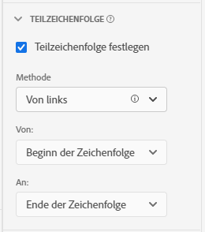

# Einstellungen der [!UICONTROL Teilzeichenfolge]-Komponente

Mit Einstellungen der [!UICONTROL Teilzeichenfolge]-Komponente können Sie mehrere Methoden zur Zeichenfolgenmanipulation verwenden, um die gewünschten Dimensionselemente in Berichten zu erhalten.

[!UICONTROL Teilzeichenfolge] ist nur für Dimensionen verfügbar und gilt rückwirkend für die Daten, auf die sie angewendet wird. Es handelt sich um eine sofortige Datenumwandlung, die vor der Anwendung von Filtern oder anderen Analysevorgängen erfolgt.

## Von links/rechts

Hiermit stellen Sie einen Teil einer Zeichenfolge je nach ihrer Position an den Beginn oder das Ende einer Zeichenfolge. Die Methoden **[!UICONTROL Von links]** und **[!UICONTROL Von rechts]** verfügen über zwei Dropdown-Listen: **[!UICONTROL Von]** (wo die Ausgabe beginnt) und **[!UICONTROL Bis]** (wo die Ausgabe endet).

* **[!UICONTROL Zeichenfolgen-Start]**: Der Beginn der Zeichenfolge.
* **[!UICONTROL Zeichenfolge-Ende]**: Das Ende der Zeichenfolge.
* **[!UICONTROL Position]**: Eine statische Anzahl von Zeichen je nach Methode von links oder rechts.
* **[!UICONTROL Zeichenfolge]**: Ordnen Sie ein Zeichen oder eine Zeichenfolge zu, um den Beginn oder das Ende einer Zeichenfolge anzugeben. In diesem Dropdown-Menü werden auch zusätzliche Optionen angezeigt:
   * **[!UICONTROL Übereinstimmung]**: Die zuzuordnende Zeichenfolge. Wenn die Eingabe nicht mit diesem Feld übereinstimmt, werden [keine Wertoptionen](no-value-options.md) angewendet.
   * **[!UICONTROL Index]**: Die **[!UICONTROL Übereinstimmungskriterien]** können in einer Zeichenfolge mehrmals vorkommen. Diese Ganzzahl bestimmt, welche Übereinstimmung je nach Methode die Ausgabe starten oder beenden soll. Beispiel: Ein Index von `1` stellt die erste Übereinstimmung dar. Wenn der Index höher ist als die Anzahl der verfügbaren Übereinstimmungen, werden [keine Wertoptionen](no-value-options.md) angewendet.
   * **[!UICONTROL Zeichenfolge einschließen]**: Ist dieses Kontrollkästchen aktiviert, wird die **[!UICONTROL Übereinstimmungszeichenfolge]** in der Ausgabe einbezogen.
* **[!UICONTROL Länge]**: Eine Ganzzahl, die angibt, wie hoch die einzubeziehende Zeichenzahl nach der Startposition der Ausgabe sein soll. Nur verfügbar in der Dropdown-Liste **[!UICONTROL Bis]**.

## Trennzeichen

Verwenden Sie diese Methode für Felder, die ein Trennzeichen einsetzen, um mehrere Zeichenfolgenwerte zu trennen. Sie können entweder ein einzelnes Element extrahieren, das als Ausgabe verwendet werden soll, oder die Zeichenfolge in ein Objekt-Array-Schemaelement konvertieren.

* **[!UICONTROL Kriterium]**: Hiermit geben Sie an, wie Sie die durch Trennzeichen getrennte Werteliste handhaben möchten.
   * **[!UICONTROL Von links]**: Starten Sie am Beginn der durch Trennzeichen getrennten Liste und zählen Sie weiter.
   * **[!UICONTROL Von rechts]**: Beginnen Sie am Ende der durch Trennzeichen getrennten Liste und zählen Sie rückwärts.
   * **[!UICONTROL In Array konvertieren]**: Hiermit wird diese Dimension so gehandhabt, als wäre sie ein Objekt-Array-Schemaelement.
* **[!UICONTROL Trennzeichen]**: Das Trennzeichen, das vom Feld verwendet wird.
* **[!UICONTROL Index]**: Nur vorhanden, wenn das Kriterium „Von links/rechts“ ist. Die Elementnummer, als ob sie sich in einem Array befände. Wenn die Zeichenfolgeneingabe beispielsweise `"Fox,Turtle,Rabbit,Wolf"` mit einem Index von 3 ist, ist die Ausgabe `"Rabbit"`. Wenn der Index höher ist als die Anzahl der durch Trennzeichen getrennten Elemente, werden [Keine Wertoptionen](no-value-options.md) angewendet.

## URL-Analyse

Zur Verwendung mit Feldern, die URLs enthalten. Wenn die Beispiel-URL `https://example.com/store/index.html?cid=campaign#cart` verwendet wird, sind die folgenden Optionen verfügbar:

* **[!UICONTROL Protokoll abrufen]**: Das Protokoll der URL wird abgerufen. Zum Beispiel `"https://"`.
* **[!UICONTROL Host abrufen]**: Der Host der URL wird abgerufen. Zum Beispiel `"example.com"`.
* **[!UICONTROL Pfad abrufen]**: Der Pfad der URL wird abgerufen. Zum Beispiel `"store/index.html"`.
* **[!UICONTROL Wert der Abfragezeichenfolge abrufen]**: Der Wert wird aus einer einzelnen Abfragezeichenfolge abgerufen. Setzen Sie den gewünschten Parameter der Abfragezeichenfolge in das Feld **[!UICONTROL Abfrageschlüssel]**. Wenn die obige URL mit dem Abfrageschlüssel `"cid"` verwendet wird, ist die Ausgabe `"campaign"`.
* **[!UICONTROL Hash-Wert abrufen]**: Der Hash-Wert der URL wird abgerufen. Zum Beispiel `"cart"`.

Wenn die Eingabe keine gültige URL ist oder die gewünschte URL-Komponente nicht vorhanden ist, werden [Keine Wertoptionen](no-value-options.md) angewendet.

## Zuschneiden

Entfernt Leerzeichen oder Sonderzeichen aus der Zeichenfolge.

* **[!UICONTROL Leerzeichen zuschneiden]**: Ist dieses Kontrollkästchen aktiviert, werden alle Leerzeichen am Beginn und am Ende der Zeichenfolge entfernt.
* **[!UICONTROL Sonderzeichen zuschneiden]**: Ist dieses Kontrollkästchen aktiviert, wird das Eingabefeld **[!UICONTROL Sonderzeichen]** angezeigt. Alle Zeichen in diesem Feld werden aus der Ausgabe entfernt. Multi-Byte-Zeichen werden nicht unterstützt.

## Regex

Wenden Sie reguläre Ausdrücke auf eine Dimension an, um den gewünschten Wert abzurufen.

* **[!UICONTROL Regex]**: Die Formel für reguläre Ausdrücke.
* **[!UICONTROL Ausgabeformat]**: Ein optionales Feld, mit dem Sie Text hinzufügen oder die Regex-Untergruppenausgabe neu anordnen können. Wenn dieses Feld leer ist, ist die Zeichenfolgenausgabe der ausgewertete Regex-Ausdruck.
* **[!UICONTROL Groß-/Kleinschreibung]**: Ist dieses Kontrollkästchen aktiviert, muss beim regulären Ausdruck die Groß-/Kleinschreibung beachtet werden.

CJA verwendet eine Untergruppe der Perl-Regex-Syntax. Wenn die Eingabe nicht mit dem regulären Ausdruck übereinstimmt und das **[!UICONTROL Ausgabeformat]** leer ist, werden [keine Wertoptionen](no-value-options.md) angewendet. Die folgenden Ausdrücke werden unterstützt:

| Ausdruck | Beschreibung |
| --- | --- |
| `a` | Ein einzelnes Zeichen: `a`. |
| `a|b` | Ein einzelnes Zeichen: `a` oder `b`. |
| `[abc]` | Ein einzelnes Zeichen: `a`, `b` oder `c`. |
| `[^abc]` | Ein beliebiges einzelnes Zeichen, außer: `a`, `b` oder `c`. |
| `[a-z]` | Ein beliebiges einzelnes Zeichen im Bereich `a`–`z`. |
| `[a-zA-Z0-9]` | Ein beliebiges einzelnes Zeichen im Bereich `a`–`z`, `A`–`Z` oder im Ziffernbereich `0`–`9`. |
| `^` | Entspricht dem Zeilenanfang. |
| `$` | Entspricht dem Zeilenende. |
| `\A` | Beginn der Zeichenfolge. |
| `\z` | Ende der Zeichenfolge. |
| `.` | Entspricht einem beliebigen Zeichen. |
| `\s` | Beliebiges Whitespace-Zeichen. |
| `\S` | Beliebiges Zeichen, außer Whitespace-Zeichen. |
| `\d` | Beliebige Ziffer. |
| `\D` | Beliebiges Zeichen, außer Ziffern. |
| `\w` | Beliebige Buchstaben, Zahlen oder Unterstriche. |
| `\W` | Beliebiges Zeichen, das nicht in Wörtern zulässig ist. |
| `\b` | Beliebige Wortgrenze. |
| `\B` | Beliebiges Zeichen, das keine Wortgrenze ist. |
| `\<` | Wortbeginn. |
| `\>` | Wortende. |
| `(...)` | Alles dazwischen wird erfasst. |
| `(?:...)` | Nicht-kennzeichnende Erfassung. Verhindert, dass in der Ausgabezeichenfolge auf die Übereinstimmung verwiesen wird. |
| `a?` | Null oder eins von `a`. |
| `a*` | Null oder mehr von `a`. |
| `a+` | Eines oder mehr von `a`. |
| `a{3}` | Genau 3 von `a`. |
| `a{3,}` | 3 oder mehr von `a`. |
| `a{3,6}` | Zwischen 3 und 6 von `a`. |

Ausgabe-Platzhalter werden ebenfalls unterstützt. Sie können diese Sequenzen im **[!UICONTROL Ausgabeformat]** beliebig oft und in beliebiger Reihenfolge verwenden, um die gewünschte Zeichenfolgenausgabe zu erlangen.

| Ausgabe-Platzhaltersequenz | Beschreibung |
| --- | --- |
| `$&` | Gibt aus, was mit dem gesamten Ausdruck übereinstimmt. |
| `$n` | Gibt aus, was mit dem n-ten Unterausdruck übereinstimmt. Beispiel: `$1` gibt den ersten Unterausdruck aus. |
| ``$` `` | Gibt den Text zwischen dem Ende der letzten gefundenen Übereinstimmung (oder dem Beginn des Textes aus, wenn keine vorherige Übereinstimmung gefunden wurde) und dem Beginn der aktuellen Übereinstimmung aus. |
| `$+` | Gibt aus, was mit dem letzten markierten Unterausdruck im regulären Ausdruck übereinstimmt. |
| `$$` | Gibt das Zeichenfolgenzeichen `"$"` aus. |

## Video zu Bindungsdimensionen

Im Folgenden finden Sie ein Video zu Bindungsdimensionen:

>[!VIDEO](https://video.tv.adobe.com/v/342694/?quality=12)
