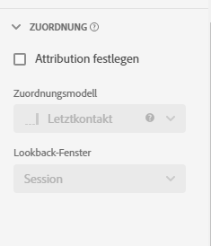
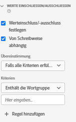
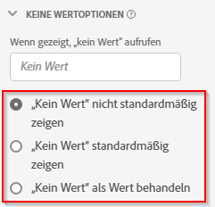
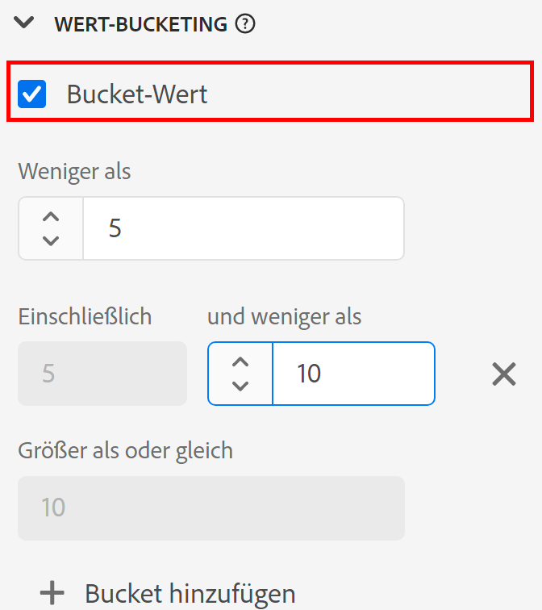
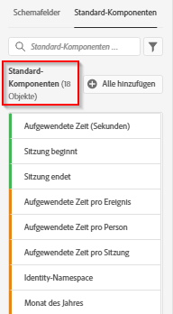

# Neue Datenansicht erstellen

Das Erstellen einer Datenansicht umfasst entweder das Erstellen von Metriken und Dimensionen aus Schemaelementen oder die Verwendung von Standardkomponenten. Die Erstellung von Metriken oder Dimensionen bietet Ihnen eine enorme Flexibilität. Bisher wurde davon ausgegangen, dass bei Datensätzen in Adobe Experience Platform Zeichenfolgenfelder als Dimensionen und numerische Felder als Metriken verwendet wurden. Um diese Felder zu ändern, mussten Sie Ihr Schema in Platform bearbeiten. Die Benutzeroberfläche „Datenansichten“ ermöglicht jetzt eine [freiere Definition von Metriken und Dimensionen](/help/data-views/data-views.md). Weitere Anwendungsfälle finden Sie unter [Anwendungsfälle für Datenansichten](/help/data-views/data-views-usecases.md).

## 1. Einstellungen und Container für Datenansichten konfigurieren

1. Gehen Sie in Customer Journey Analytics zur Registerkarte **[!UICONTROL Datenansichten]**.
2. Klicken Sie auf **[!UICONTROL Hinzufügen]**, um eine neue Datenansicht zu erstellen und deren Einstellungen zu konfigurieren.

| Einstellung | Beschreibung/Verwendungsfall |
| --- | --- |
| [!UICONTROL Verbindung] | In diesem Feld wird die Datenansicht mit der zuvor eingerichteten Verbindung verknüpft, die einen oder mehrere Adobe Experience Platform-Datensätze enthält. |
| [!UICONTROL Name] | Geben Sie der Datenansicht einen Namen. Dies ist ein Pflichtfeld. |
| [!UICONTROL Beschreibung] | Eine detaillierte Beschreibung ist nicht zwingend erforderlich, wird jedoch empfohlen. |
| [!UICONTROL Zeitzone] | Wählen Sie die Zeitzone aus, in der Ihre Daten angezeigt werden sollen. |
| [!UICONTROL Tags] | [!UICONTROL Mit Tags können Sie Ihre Datenansichten in Kategorien organisieren.] |
| [!UICONTROL Behälter] | Sie können Ihre Container hier umbenennen, um zu bestimmen, wie sie in jedem Workspace-Projekt erscheinen sollen, das auf dieser Datenansicht basiert. [!UICONTROL Container] werden in Filtern und Fallout/Fluss usw. verwendet, um zu definieren, wie breit oder schmal der Umfang oder Kontext ist. [Weitere Infos](https://experienceleague.adobe.com/docs/analytics-platform/using/cja-components/cja-filters/filters-overview.html?lang=de#filter-containers) |
| [!UICONTROL Name des Personen-Containers...] | [!UICONTROL Person] (Standard). Der [!UICONTROL Person]-Container enthält sämtliche Besuche und Seitenansichten für Besucher innerhalb eines bestimmten Zeitrahmens. Sie können diesen Container in „Benutzer“ oder einen anderen von Ihnen bevorzugten Begriff umbenennen. |
| [!UICONTROL Der Name des Sitzungs-Containers lautet...] | [!UICONTROL Sitzung] (Standard). Mit dem Sitzungs-Container können Seiteninteraktionen, Kampagnen oder Konversionen für eine bestimmte [!UICONTROL Sitzung] identifiziert werden. Sie können diesen Container in „Besuch“ oder einen anderen von Ihnen bevorzugten Begriff umbenennen. |
| [!UICONTROL Der Name des Ereignis-Containers ist...] | [!UICONTROL Ereignis] (Standard). Der [!UICONTROL Ereignis]-Container definiert, welche Seitenereignisse von einem Filter eingeschlossen oder ausgeschlossen werden sollen. |

Als Nächstes können Sie Metriken und Dimensionen aus Schemaelementen erstellen. Sie können auch Standardkomponenten verwenden.

## 2. Erstellen von Metriken und Dimensionen aus Schemaelementen

1. Klicken Sie unter [!UICONTROL Customer Journey Analytics] > [!UICONTROL Datenansichten] auf die Registerkarte [!UICONTROL Komponenten].

Links oben sehen Sie die [!UICONTROL Verbindung], die die Datensätze und die [!UICONTROL Schemafelder] unten enthält. Bedenken Sie Folgendes:

* Die bereits enthaltenen Komponenten sind die erforderlichen Standardkomponenten (vom System generiert).
* Adobe wendet standardmäßig den Filter **[!UICONTROL Enthält Daten]** an, so dass nur Schemafelder erscheinen, die Daten enthalten. Wenn Sie nach einem Feld suchen, das keine Daten enthält, entfernen Sie den Filter.

1. Ziehen Sie nun ein Schema, z. B. [!UICONTROL pageTitle], aus der linken Leiste in den Bereich „Metriken“ oder „Dimensionen“.

   Sie können dasselbe Schema mehrmals in die Bereiche „Dimensionen“ oder „Metriken“ ziehen und dieselbe Dimension oder Metrik auf unterschiedliche Weise konfigurieren.
Beispielsweise können Sie im Feld **[!UICONTROL pageTitle]** eine Dimension namens „Produktseiten“ und eine weitere Dimension „Fehlerseiten“ usw. erstellen, indem Sie den **[!UICONTROL Komponentennamen]** rechts umbenennen. Vom Feld **[!UICONTROL pageTitle]** aus können Sie auch Metriken aus einem Zeichenfolgenwert erstellen. Sie können beispielsweise eine oder mehrere Metriken für **[!UICONTROL Bestellungen]** mit unterschiedlichen Attributionseinstellungen und unterschiedlichen Ein-/Ausschlusswerten erstellen.

   

   >[!NOTE]
   >
   >Sie können ganze Schema-Feldordner aus der linken Leiste ziehen, wobei sie automatisch in herkömmliche Bereiche sortiert werden. Die Zeichenfolgenfelder werden im Abschnitt [!UICONTROL Dimensionen] und die Zahlen im Abschnitt [!UICONTROL Metriken] angezeigt. Sie können auch auf **[!UICONTROL Alle hinzufügen]** klicken, wodurch alle Schemafelder hinzugefügt werden.

1. Nachdem Sie die Komponente ausgewählt haben, werden auf der rechten Seite eine Reihe von Einstellungen angezeigt. Konfigurieren Sie die Komponente mithilfe der unten beschriebenen Einstellungen.

### Komponenteneinstellungen konfigurieren

| Einstellung | Beschreibung/Verwendungsfall |
| --- | --- |
| [!UICONTROL Typ der Komponente] | Erforderlich. Ermöglicht es Ihnen, eine Komponente von Metrik in Dimension zu ändern oder umgekehrt. |
| [!UICONTROL Name der Komponente] | Erforderlich. Hier können Sie den benutzerfreundlichen Namen angeben, der in Analysis Workspace angezeigt werden soll. Sie können eine Komponente umbenennen, um ihr einen für die Datenansicht spezifischen Namen zu geben. |
| [!UICONTROL Beschreibung] | Optional, aber empfohlen, um für andere Benutzer Informationen über die Komponente bereitzustellen. |
| [!UICONTROL Tags] | Optional. Ermöglicht das Taggen der Komponente mit benutzerdefinierten oder vordefinierten Tags zur einfacheren Suche/Filterung in der Analysis Workspace-Benutzeroberfläche. |
| [!UICONTROL Feldname] | Der Name des Schemafelds. |
| [!UICONTROL Typ des Datensatzes] | Erforderlich. Ein nicht bearbeitbares Feld, das anzeigt, von welchem Datensatztyp (Ereignis, Suche oder Profil) die Komponente stammt. |
| [!UICONTROL Datensatz] | Erforderlich. Ein nicht bearbeitbares Feld, das anzeigt, von welchem Feldtyp die Komponente stammt (z. B. String, Integer). Dieses Feld kann mehrere Datensätze enthalten. |
| [!UICONTROL Datentyp des Schemas] | Gibt an, ob es sich bei der Komponente um eine Zeichenfolge, eine Ganzzahl usw. handelt.  Sie können zwar einen beliebigen unterstützten Schemafeldtyp in Platform verwenden, jedoch werden in CJA nicht alle Feldtypen unterstützt. Die folgenden Datentypen werden unterstützt: `Integer`, `Int`, `Long`, `Double`, `Float`, `Number`, `Short`, `Byte`, `String` und `Boolean`. Beachten Sie, dass derzeit nur Zeichenfolgen in Suchdatensätzen zulässig sind. |
| [!UICONTROL Komponenten-ID] | Erforderlich. Die [CJA-API](https://adobe.io/cja-apis/docs) verwendet dieses Feld, um auf die Komponente zu verweisen. Sie können auf das Bearbeitungssymbol klicken und diese Komponenten-ID ändern. Durch das Ändern dieser Komponenten-ID werden jedoch alle vorhandenen Workspace-Projekte, die diese Komponente enthalten, beschädigt. Wenn Sie jemals eine andere Datenansicht erstellen, die ein anderes Feld für eine pageTitle-Dimension verwendet, können Sie diese umbenennen und die Dimension datenansichtübergreifend kompatibel machen. |
| [!UICONTROL Pfad des Schemas] | Erforderlich. Ein nicht bearbeitbares Feld, das den Schema-Pfad anzeigt, von dem die Komponente stammt. |
| [!UICONTROL Komponente in Reports verbergen] | Standard = aus. Ermöglicht es Ihnen, die Komponente aus der Datenansicht auszublenden, wenn sie im Reporting verwendet wird. Dies wirkt sich nicht auf Berechtigungen aus, sondern nur auf die Kuratierung von Komponenten. Mit anderen Worten, Sie können die Komponente im Reporting für Nicht-Administratoren ausblenden. Administratoren können weiterhin darauf zugreifen, indem sie in einem Analysis Workspace-Projekt auf [!UICONTROL Alle Komponenten anzeigen] klicken. |

### Formateinstellungen konfigurieren

Die Formateinstellungen gelten nur für Metriken.

| Einstellung | Beschreibung/Verwendungsfall |
| --- | --- |
| [!UICONTROL Format] | Hier können Sie die Formatierung einer Metrik als Dezimal, Zeit, Prozent oder Währung angeben. |
| [!UICONTROL Dezimalstellen] | Hier können Sie die Anzahl der Dezimalstellen angeben, die eine Metrik anzeigen soll. |
| [!UICONTROL Aufwärts-Trend anzeigen als] | Hier können Sie angeben, ob bei dieser Metrik ein Aufwärtstrend als gut (grün) oder schlecht (rot) zu betrachten ist. |
| [!UICONTROL Währung] | Diese Einstellung wird nur angezeigt, wenn die ausgewählte Metrik vom Format [!UICONTROL Währung] ist. Es steht eine Liste von Währungsoptionen zur Verfügung. Standardmäßig ist keine Währung festgelegt. Auf diese Weise können Sie im Reporting den Umsatz in der Währung Ihrer Wahl darstellen. Dies ist keine Währungskonvertierung, sondern nur eine Formatierungsoption der Benutzeroberfläche. |

### Konfigurieren der Attributionseinstellungen

| Einstellung | Beschreibung/Verwendungsfall |
| --- | --- |
| [!UICONTROL Attribution festlegen] | Hier können Sie die Attributionseinstellungen angeben, die Sie bei Verwendung dieser Metrik standardmäßig anwenden möchten. Dieser Standard kann in einer [!UICONTROL Freiformtabelle] oder in einer berechneten Metrik überschrieben werden. |
| [!UICONTROL Attributionsmodell] | Ermöglicht die Angabe eines Standardzuordnungsmodells – nur aktiv, wenn Sie die Einstellung [!UICONTROL Nicht standardmäßiges Attributionsmodell verwenden] aktivieren. Die Standardeinstellung ist [!UICONTROL Letztkontakt]. Die Optionen sind: Erstkontakt, Letztkontakt, Linear, Teilnahme, Same Touch, U-Shaped, J Curve, Inverse J, Time Decay, Benutzerdefiniert, Algorithmisch. Einige dieser Optionen erstellen zusätzliche Felder, die ausgefüllt werden müssen, z. B. „Benutzerdefiniert“ oder „Time Decay“. Sie können mehrere Metriken mit demselben Feld erstellen. Dies bedeutet, dass Sie z. B. eine Umsatzmetrik für den [!UICONTROL Letztkontakt] und eine Umsatzmetrik für den [!UICONTROL Erstkontakt] haben können, die jedoch beide auf demselben Umsatzfeld im Schema basieren. |
| [!UICONTROL Lookback-Fenster] | Ermöglicht es Ihnen, ein standardmäßiges Rückblickfenster für eine Metrik festzulegen – nur aktiv, wenn Sie die Einstellung [!UICONTROL Nicht standardmäßiges Attributionsmodell verwenden] aktivieren. Die Optionen sind: [!UICONTROL Person] (Reporting-Fenster), [!UICONTROL Sitzung], [!UICONTROL Benutzerdefiniert]. Wenn [!UICONTROL Benutzerdefiniert] ausgewählt ist, können Sie auch eine beliebige Anzahl von Tagen/Wochen/Monaten usw. auswählen. (bis zu 90 Tage), genau wie [!UICONTROL Attribution IQ]. Sie können über mehrere Metriken verfügen, die dasselbe Schema verwenden, jedoch jeweils ein separates Rückblickfenster. |

### Einstellungen zum Einschließen/Ausschließen von Werten konfigurieren

Mit dieser Einstellung können Sie die zugrunde liegenden Daten für das Reporting zur Zeit der Abfrage ändern. Es ist nicht dasselbe wie ein Filter. Aber Filter werden diese neue Dimension akzeptieren, ebenso wie Pfade und Attributionen.

Sie können beispielsweise eine Dimension aus dem Feld „pageTitle“ erstellen, sie aber als „Fehlerseiten“ bezeichnen und jede Seite einschließen, die [!UICONTROL das Wort] „error“ enthält.

| Einstellung | Beschreibung/Verwendungsfall |
| --- | --- |
| [!UICONTROL Von Schreibweise abhängig] | Standard = Ein. Diese Einstellung gilt nur für den Abschnitt [!UICONTROL Werte einschließen/ausschließen]. Damit können Sie angeben, ob bei der Regel zum Ein-/Ausschließen, die Sie anwenden, die Groß-/Kleinschreibung beachtet werden soll. |
| [!UICONTROL Übereinstimmung] | Hier können Sie angeben, welche Werte Sie vor der Attribution und den Filtern für das Reporting berücksichtigen möchten (z. B. nur Werte mit dem Wort „Fehler“). Sie können wählen zwischen: **[!UICONTROL Wenn alle Kriterien erfüllt sind]** oder **[!UICONTROL Wenn ein Kriterium erfüllt ist]**. |
| [!UICONTROL Kriterien] | Hier können Sie die Übereinstimmungslogik angeben, die auf eine bestimmte Filterregel angewendet werden soll.<ul><li>**Zeichenfolge**: Enthält die Wortgruppe, Enthält einen Begriff, Enthält alle Begriffe, Enthält keinen Begriff, Enthält die Wortgruppe nicht, Ist gleich, Ist nicht gleich, Beginnt mit, Endet mit</li><li>**Dezimalzahl/Ganzzahl**: gleich, ungleich, größer als, kleiner als, größer oder gleich, kleiner oder gleich</li><li>**Datum**: gleich, ungleich, ist später als, ist früher als, liegt zwischen</li></ul> |
| [!UICONTROL Übereinstimmungsoperand] | Hiermit können Sie den Übereinstimmungsoperanden angeben, auf den der Übereinstimmungsoperator angewendet werden soll.<ul><li>**Zeichenfolge**: Textfeld</li><li>**Dezimalzahl/Ganzzahl**: Textfeld mit Pfeilen nach oben/unten für numerische Werte</li><li>**Datum**: Auswahl der Tagesgranularität (Kalender)</li><li>**Datum Uhrzeit**: Auswahl der Datums- und Uhrzeitgranularität</li></ul> |
| [!UICONTROL Regel hinzufügen] | Hier können Sie einen zusätzlichen Übereinstimmungsoperator und -operanden angeben. |

### Verhaltenseinstellungen konfigurieren

Hier können Sie angeben, wie sich eine Metrik in Berichten verhalten soll.

| Einstellung | Beschreibung/Verwendungsfall |
| --- | --- |
| [!UICONTROL Werte zählen] | Nur für boolesche Metriken können Sie mit dieser Einstellung angeben, ob Sie als Metrikwert [!UICONTROL Count True], [!UICONTROL Count False] oder [!UICONTROL Count True oder False] verwenden möchten. Der Standardwert ist [!UICONTROL Count True]. Dadurch erhalten Sie den tatsächlichen Wert einer Metrik, z. B. „50“, wenn ein Bestellwert von 50 vorhanden war. |
| [!UICONTROL Instanzen zählen] | Hier können Sie festlegen, ob ein numerisches Feld oder ein Datumsfeld, das als Metrik verwendet wird, zählen soll, wie oft es gesetzt wurde, anstatt den Wert selbst.  Ob Sie die Instanzen eines numerischen Felds aufaddieren möchten und einfach die Anzahl der *Festlegungen* eines Felds aufaddieren möchten, anstatt dessen tatsächlichen Wert zu nutzen. Dies ist beispielsweise hilfreich, um eine [!UICONTROL Bestellmetrik] aus einem [!UICONTROL Umsatzfeld] zu erstellen. Wenn der Umsatz festgelegt wurde, geht es darum, anstelle des numerischen Umsatzbetrags eine einzelne Bestellung zu zählen. |
| [!UICONTROL Kleinbuchstabe] | *Neu*  - Für Dimensionen vom Typ &quot;Zeichenfolge&quot;. Mit dieser Einstellung können Sie steuern, ob bei Dimensionswerten in Customer Journey Analytics zwischen Groß- und Kleinschreibung unterschieden wird. Dies ermöglicht die Deduplizierung von Zeilen mit demselben Wert, jedoch einer anderen Groß-/Kleinschreibung. Wenn Sie **[!UICONTROL Kleinbuchstaben]** aktivieren, werden alle Instanzen einer Dimension mit demselben Wert als Kleinbuchstaben gemeldet. Dieser Screenshot zeigt, was passiert, wenn Sie **not** [!UICONTROL Kleinbuchstaben] aktivieren. Beachten Sie, dass &quot;liverpool&quot;, &quot;Liverpool&quot;und &quot;LIVERPOOL&quot;bei der Berichterstellung zu drei separaten Zeileneinträgen führen:  |

### Einstellungen für [!UICONTROL Optionen ohne Werte] konfigurieren

Einstellungen für [!UICONTROL Optionen ohne Werte] sind im Reporting identisch mit dem Wert [!UICONTROL Nicht festgelegt] oder [!UICONTROL Keiner]. In der Benutzeroberfläche „Datenansichten“ können Sie für jede Komponente jeweils festlegen, wie diese Werte im Reporting behandelt werden sollen. Sie können [!UICONTROL Kein Wert] auch in etwas umbenennen, das Ihrer Umgebung besser entspricht, z. B. [!UICONTROL Null], [!UICONTROL Nicht festgelegt] oder etwas anderes.

Beachten Sie außerdem, dass das, was Sie in diesem Feld angeben, von der Benutzeroberfläche für eine spezielle Behandlung des Zeileneintrags [!UICONTROL Kein Wert] im Reporting verwendet werden kann, wie in der Einstellung [!UICONTROL Optionen ohne Werte] beschrieben.

| Einstellung | Beschreibung/Verwendungsfall |
| --- | --- |
| [!UICONTROL Wenn gezeigt, „kein Wert“ aufrufen...] | Hier können Sie **[!UICONTROL Kein Wert]** in etwas anderes umbenennen. |
| [!UICONTROL Standardmäßig nicht „Kein Wert“ anzeigen] | Zeigt diesen Wert im Reporting nicht an. |
| [!UICONTROL Standardmäßig „Kein Wert“ anzeigen] | Zeigt diesen Wert im Reporting an. |
| [!UICONTROL „Kein Wert“ als Wert behandeln] | Diese Einstellung ersetzt leere Werte in den Daten durch den Text, den Sie unter [!UICONTROL Wenn angezeigt, rufen Sie Kein Wert auf ...]. Wenn Sie beispielsweise Mobilgerätetypen als Dimension haben, können Sie das Element **[!UICONTROL Kein Wert]** in „Desktop“ umbenennen. Beachten Sie, dass beim Ändern dieses Felds in einen benutzerdefinierten Wert der benutzerdefinierte Wert als legitimer Zeichenfolgenwert behandelt wird. Wenn Sie daher den Wert &quot;Rot&quot;in dieses Feld eingeben, werden alle Instanzen der Zeichenfolge &quot;Rot&quot;in den Daten selbst unter dem von Ihnen angegebenen Zeileneintrag rolliert. |

### Persistenzeinstellungen konfigurieren

Weitere Informationen finden Sie beim Thema [Persistenz](/help/data-views/persistence.md).

| Einstellung | Beschreibung/Verwendungsfall |
| --- | --- |
| [!UICONTROL Persistenz festlegen] | Schlüssel umschalten |
| [!UICONTROL Zuordnung] | Hier können Sie das Zuordnungsmodell angeben, das für eine Dimension für Persistenz verwendet wird. Die Optionen sind: [!UICONTROL Zuletzt verwendet], [!UICONTROL Original], [!UICONTROL Instanz], [!UICONTROL Alle]. Wenn ein Wert beibehalten werden soll (ähnlich wie bei eVars im herkömmlichen Analytics), legen Sie ihn hier fest. Der einzige wichtige Unterschied besteht darin, dass die maximale Persistenz, die Sie einstellen können, 90 Tage beträgt. Außerdem ist [!UICONTROL Niemals ablaufen lassen] keine Option. |
| [!UICONTROL Ablauf] | Hier können Sie das Persistenzfenster für eine Dimension angeben. Die Optionen sind: [!UICONTROL Sitzung] (Standardeinstellung), [!UICONTROL Person], [!UICONTROL Zeit], [!UICONTROL Metrik]. Möglicherweise brauchen Sie die Option, dass die Dimension bei einem Kauf ablaufen soll (z. B. interne Suchbegriffe oder andere Merchandising-Verwendungsfälle). [!UICONTROL Metrik] ermöglicht Ihnen, eine der definierten Metriken als Ablaufdatum für diese Dimension anzugeben (z. B. eine [!UICONTROL Kaufmetrik]). **Hinweis**: Sie können keine benutzerdefinierte Gültigkeit für eine Dimension festlegen, wenn Sie für die Zuordnung [!UICONTROL Alle] auswählen. |

### Einstellungen für die Wertebereiche konfigurieren

Ein Wertebereich von „zwischen 5 und bis zu 10“ wird beispielsweise im Reporting von Workspace als eine Zeile „5 bis 10“ angezeigt.

| Einstellung | Beschreibung/Verwendungsfall |
| --- | --- |
| [!UICONTROL Bucket-Wert] | Ermöglicht das Erstellen einer zusammengefassten Version einer numerischen Dimension. Auf diese Weise können Sie im Reporting über Umsatzbereiche oder andere numerische Werte als Dimension berichten. |
| [!UICONTROL Bis zu] | Hier können Sie die Grenzen des ersten numerischen Dimensionsbehälters angeben. Dies gilt nur für numerische Dimensionen. |
| [!UICONTROL Zwischen und bis zu] | Hier können Sie die Grenzen der nachfolgenden numerischen Dimensionsbehälter angeben. |
| [!UICONTROL Bucket hinzufügen] | Ermöglicht das Hinzufügen eines weiteren Behälters zu numerischen Dimensionsbehältern. |

### Verwenden Sie [!UICONTROL Standardkomponenten]

Neben der Erstellung von Metriken und Dimensionen aus Schemaelementen können Sie auch Standardkomponenten in Ihren Datenansichten verwenden.

[!UICONTROL Standardkomponenten] sind Komponenten, die nicht aus Datensatz-Schemafeldern, sondern vom System generiert werden. Einige Systemkomponenten sind in jeder Datenansicht erforderlich, um die Reporting-Funktionen in Analysis Workspace zu erleichtern, wohingegen andere Systemkomponenten optional sind.

Diese erforderlichen Standardkomponenten werden standardmäßig jeder Datendatei-Ansicht hinzugefügt.

| Name der Komponente | Dimension oder Metrik | Hinweise |
| --- | --- | --- |
| [!UICONTROL Personen] | Metrik | Diese Metrik basiert auf der in einer [!UICONTROL Verbindung] angegebenen Personen-ID. |
| [!UICONTROL Sitzungen] | Metrik | Diese Metrik basiert auf den unten angegebenen Sitzungseinstellungen. |
| [!UICONTROL Ereignisse] | Metrik | Diese Metrik stellt die Anzahl der Zeilen aus allen Ereignis-Datensätzen in einer [!UICONTROL Verbindung] dar. |
| [!UICONTROL Tag] | Dimension | Die Dimension „Tag“ zeigt den Tag an, an dem eine bestimmte Metrik aufgetreten ist. Das erste Dimensionselement ist der erste Tag im Datumsbereich und das letzte Dimensionselement der letzte Tag im Datumsbereich. |
| [!UICONTROL Woche] | Dimension | Die Dimension „Woche“ zeigt die Woche an, in der eine bestimmte Metrik aufgetreten ist. Das erste Dimensionselement ist die erste Woche im Datumsbereich und das letzte Dimensionselement die letzte Woche im Datumsbereich. |
| [!UICONTROL Monat] | Dimension | Die Dimension „Monat“ zeigt den Monat an, in dem eine bestimmte Metrik aufgetreten ist. Das erste Dimensionselement ist der erste Monat im Datumsbereich und das letzte Dimensionselement der letzte Monat im Datumsbereich. |
| [!UICONTROL Quartal] | Dimension | Die Dimension „Quartal“ zeigt das Quartal an, in dem eine bestimmte Metrik aufgetreten ist. Das erste Dimensionselement ist das erste Quartal im Datumsbereich und das letzte Dimensionselement das letzte Quartal im Datumsbereich. |
| [!UICONTROL Jahr] | Dimension | Die Dimension „Jahr“ zeigt das Jahr an, in dem eine bestimmte Metrik aufgetreten ist. Das erste Dimensionselement ist das erste Jahr im Datumsbereich und das letzte Dimensionselement das letzte Jahr im Datumsbereich. |
| [!UICONTROL Stunde] | Dimension | Die Dimension „Stunde“ zeigt die Stunde an, in der eine bestimmte Metrik aufgetreten ist (abgerundet). Das erste Dimensionselement ist die erste Stunde im Datumsbereich und das letzte Dimensionselement die letzte Stunde im Datumsbereich. |
| [!UICONTROL Minute] | Dimension | Die Dimension „Minute“ zeigt die Minute an, in der eine bestimmte Metrik aufgetreten ist (abgerundet). Das erste Dimensionselement ist die erste Minute im Datumsbereich und das letzte Dimensionselement die letzte Minute im Datumsbereich. |

### Optionale Standardkomponenten

Optionale Standardkomponenten sind auf dem Tab **[!UICONTROL Standardkomponenten]** verfügbar.

| Name der Komponente | Dimension oder Metrik | Hinweise |
| --- | --- | --- |
| [!UICONTROL Sitzung beginnt] | Metrik | Diese Metrik zählt die Anzahl der Ereignisse, die das erste Ereignis einer Sitzung waren. Bei Verwendung in einer Filterdefinition (wie beispielsweise „[!UICONTROL Sitzung beginnt] existiert“) wird nur das erste Ereignis jeder Sitzung gefiltert. |
| [!UICONTROL Sitzung endet] | Metrik | Diese Metrik zählt die Anzahl der Ereignisse, die das letzte Ereignis einer Sitzung waren. Ähnlich wie [!UICONTROL Sitzung beginnt] kann dies auch in einer Filterdefinition verwendet werden, um bis zum letzten Ereignis jeder Sitzung zu filtern. |
| [!UICONTROL Aufgewendete Zeit (Sekunden)] | Metrik | Die Metrik [!UICONTROL Aufgewendete Zeit] addiert die Zeit zwischen zwei verschiedenen Werten für eine Dimension. |
| [!UICONTROL Aufgewendete Zeit pro Ereignis] | Dimension | [!UICONTROL Aufgewendete Zeit pro Ereignis] fasst die Metrik [!UICONTROL Aufgewendete Zeit] in [!UICONTROL Ereignis]-Buckets zusammen. |
| [!UICONTROL Aufgewendete Zeit pro Sitzung] | Dimension | [!UICONTROL Aufgewendete Zeit pro Sitzung] erfasst die Metrik [!UICONTROL Aufgewendete Zeit] in [!UICONTROL Sitzungs]-Buckets. |
| [!UICONTROL Aufgewendete Zeit pro Person] | Dimension | [!UICONTROL Aufgewendete Zeit pro Person]  fasst die Metrik [!UICONTROL Aufgewendete Zeit] in [!UICONTROL Personen]-Buckets zusammen. |
| [!UICONTROL Batch-ID] | Dimension | Stellt den Experience Platform-Batch dar, zu dem ein [!UICONTROL Ereignis] gehört hat. |
| [!UICONTROL Datensatz-ID] | Dimension | Stellt den Experience Platform-Datensatz dar, zu dem ein [!UICONTROL Ereignis] gehört hat. |

## Verwenden Sie die Funktion [!UICONTROL Duplizieren].

Das Duplizieren von Metriken oder Dimensionen und das anschließende Ändern spezifischer Einstellungen ist eine einfache Möglichkeit, mehrere Metriken oder Dimensionen aus einem einzelnen Schemafeld zu erstellen. Wählen Sie einfach die Einstellung [!UICONTROL Duplizieren] unter dem Namen der Metrik oder Dimension oben rechts aus. Ändern Sie dann die neue Metrik oder Dimension und speichern Sie sie unter einem Namen, der sie besser beschreibt.

### Filtern von Schemafeldern und Dimensionen/Metriken

Sie können die Schemafelder in der linken Leiste nach folgenden Datentypen filtern:

Sie können auch nach Datensätzen filtern und danach, ob ein Schemafeld Daten enthält oder ob es sich um eine Identität handelt. Standardmäßig wird der Filter **[!UICONTROL Enthält Daten]** auf alle Ansichten angewendet.

## Hinzufügen eines globalen Filters zu Ihrer Datenansicht

Sie können Filter hinzufügen, die für die gesamte Datenansicht gelten. Dieser Filter wird auf alle Berichte angewendet, die Sie in Workspace ausführen.

1. Klicken Sie auf die Registerkarte [!UICONTROL Einstellungen] in [!UICONTROL Datenansichten].
1. Ziehen Sie einen Filter aus der Liste in das Feld [!UICONTROL Filter hinzufügen] in der linken Leiste.
