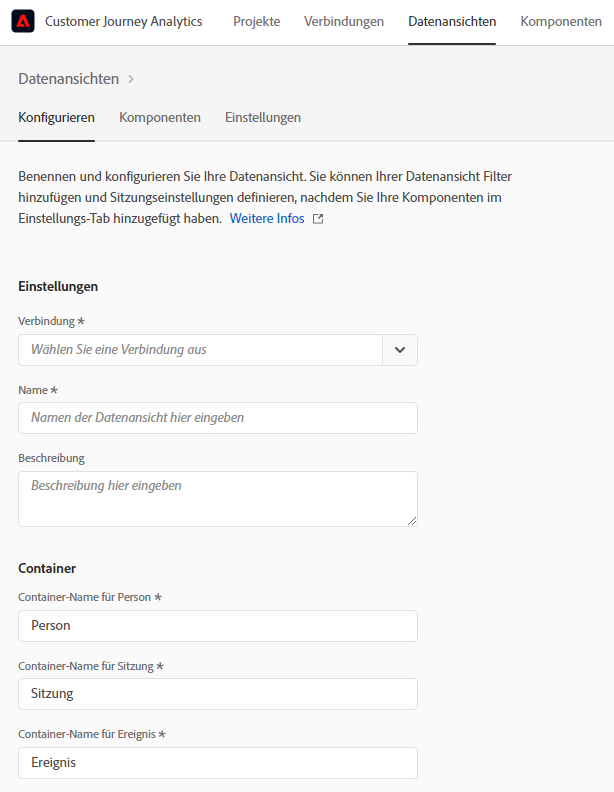
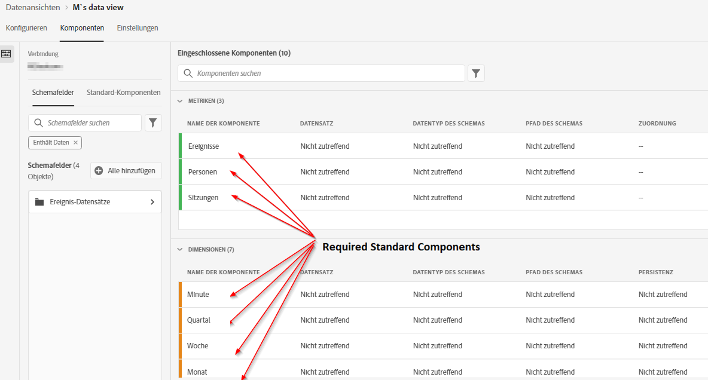
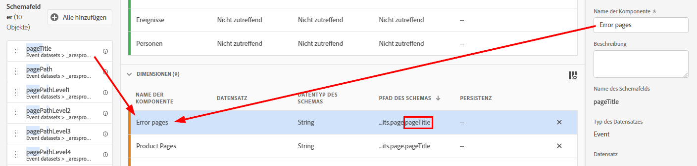
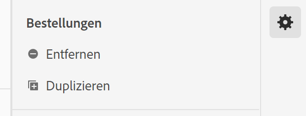
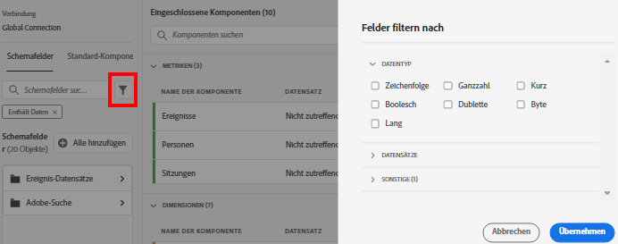
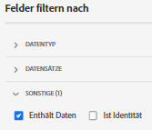

# Erstellen oder Bearbeiten einer Datenansicht

Das Erstellen einer Datenansicht umfasst entweder das Erstellen von Metriken und Dimensionen aus Schemaelementen oder die Verwendung von Standardkomponenten. Die meisten Schemaelemente können je nach den Anforderungen Ihres Unternehmens entweder eine Dimension oder eine Metrik sein. Nachdem Sie ein Schemaelement in eine Datenansicht gezogen haben, werden rechts Optionen angezeigt, mit denen Sie anpassen können, wie die Dimension oder Metrik in CJA funktioniert.

## Erstellen einer Datenansicht

1. Melden Sie sich bei [Customer Journey Analytics](https://analytics.adobe.com) an und gehen Sie zur Registerkarte **[!UICONTROL Datenansichten]**.
2. Klicken Sie auf **[!UICONTROL Hinzufügen]**, um eine Datenansicht zu erstellen, oder klicken Sie auf eine vorhandene Datenansicht, um sie zu bearbeiten.

### Datenansichtseinstellungen

Stellt übergreifende Einstellungen für die Datenansicht bereit.

| Einstellung | Beschreibung |
| --- | --- |
| [!UICONTROL Verbindung] | In diesem Feld wird die Datenansicht mit der zuvor eingerichteten Verbindung verknüpft, die einen oder mehrere Adobe Experience Platform-Datensätze enthält. |
| [!UICONTROL Name] | Erforderlich. Der Name der Datenansicht. Dieser Wert wird in der Dropdown-Liste oben rechts in Analysis Workspace angezeigt. |
| [!UICONTROL Beschreibung] | Optional. Adobe empfiehlt eine detaillierte Beschreibung, damit Benutzer verstehen, warum die Datenansicht vorhanden ist und für wen sie konzipiert ist. |

### Behälter

Gibt den Namen der Container für die Datenansicht an. Container-Namen werden häufig in [Filtern](/help/components/filters/filters-overview.md#Filter-containers) verwendet.

| Einstellung | Beschreibung |
| --- | --- |
| [!UICONTROL Container-Name für Person] | [!UICONTROL Person] (Standard). Der Container [!UICONTROL Person] enthält sämtliche Sitzungen und Ereignisse für Besucher innerhalb eines bestimmten Zeitraums. Wenn Ihr Unternehmen einen anderen Begriff verwendet (z. B. „Besucher“ oder „Benutzer“), können Sie den Container hier umbenennen. |
| [!UICONTROL Container-Name für Sitzung] | [!UICONTROL Sitzung] (Standard). Mit dem Sitzungs-Container können Seiteninteraktionen, Kampagnen oder Konversionen für eine bestimmte [!UICONTROL Sitzung] identifiziert werden. Sie können diesen Container in „Besuch“ oder einen anderen von Ihrem Unternehmen bevorzugten Begriff umbenennen. |
| [!UICONTROL Container-Name für Ereignis] | [!UICONTROL Ereignis] (Standard). Der Container [!UICONTROL Ereignis] definiert einzelne Ereignisse in einem Datensatz. Wenn Ihr Unternehmen einen anderen Begriff verwendet (z. B. „Hits“ oder „Seitenansichten“), können Sie den Container hier umbenennen. |

### Kalender

Gibt das Kalenderformat an, dem die Datenansicht folgen soll. Sie können mehrere Datenansichten basierend auf derselben [Verbindung](/help/connections/create-connection.md) haben und ihnen unterschiedliche Kalendertypen oder Zeitzonen zuweisen. Diese Datenansichten können es Teams, die verschiedene Kalendertypen verwenden, ermöglichen, ihre jeweiligen Anforderungen mit denselben zugrunde liegenden Daten zu erfüllen.

| Einstellung | Beschreibung |
| --- | --- |
| [!UICONTROL Zeitzone] | Wählen Sie die Zeitzone aus, in der Ihre Daten angezeigt werden sollen. Wenn Sie eine Zeitzone auswählen, die mit der Sommerzeit arbeitet, werden die Daten automatisch entsprechend angepasst. Im Frühling, wenn die Uhren eine Stunde vor gestellt werden, besteht eine Lücke von einer Stunde. Im Herbst, wenn die Uhren eine Stunde zurück gestellt werden, wird während der Sommerzeit eine Stunde wiederholt. |
| [!UICONTROL Kalendertyp] | Bestimmen Sie, wie die Wochen des Monats gruppiert werden. **Gregorianisch:** Standardkalenderformat. Die Quartale werden nach Monat gruppiert. **4-5-4 Einzelhandel:** Ein standardisierter 4-5-4 Einzelhandelskalender. Der erste und der letzte Monat des Quartals enthalten 4 Wochen, während der zweite Monat des Quartals 5 Wochen umfasst. **Benutzerspezifisch (4-5-4):** Ähnlich wie der 4-5-4-Kalender mit dem Unterschied, dass Sie den ersten Tag des Jahres und das Jahr auswählen können, in dem die „zusätzliche“ Woche liegt. **Benutzerspezifisch (4-4-5):** Der erste und zweite Monat jedes Quartals enthalten 4 Wochen, während die letzte Woche jedes Quartals 5 Wochen umfasst. **Benutzerspezifisch (5-4-4):** Der erste Monat jedes Quartals umfasst 5 Wochen, während der zweite und dritte Monat jedes Quartals 4 Wochen umfassen. |
| [!UICONTROL Erster Monat des Jahres] und [!UICONTROL Erster Wochentag] | Sichtbar für den gregorianischen Kalender. Geben Sie an, in welchem Monat das Kalenderjahr beginnen soll und an welchem Tag jede Woche beginnen soll. |
| [!UICONTROL Erster Tag des aktuellen Jahres] | Für benutzerdefinierte Kalendertypen sichtbar. Geben Sie an, an welchem Tag des Jahres das aktuelle Jahr beginnen soll. Der Kalender formatiert automatisch den ersten Wochentag auf Grundlage dieses Werts. |
| [!UICONTROL Jahr mit „zusätzlicher“ Woche] | Bei den meisten 364-tägigen Kalendern (52 Wochen von jeweils 7 Tagen) sammeln sich jedes Jahr verbleibende Tage, bis sie eine zusätzliche Woche bilden. Diese zusätzliche Woche wird dann zum letzten Monat des Jahres hinzugefügt. Geben Sie an, zu welchem Jahr die zusätzliche Woche hinzugefügt werden soll. |

## Festlegen der Komponenten einer Datenansicht

Als Nächstes können Sie Metriken und Dimensionen aus Schemaelementen erstellen. Sie können auch Standardkomponenten verwenden.

1. Melden Sie sich bei [Customer Journey Analytics](https://analytics.adobe.com) an und gehen Sie auf die Registerkarte **[!UICONTROL Datenansichten]**.
1. Klicken Sie auf **[!UICONTROL Hinzufügen]**, um eine Datenansicht zu erstellen, oder klicken Sie auf eine vorhandene Datenansicht, um sie zu bearbeiten.
1. Klicken Sie auf die Registerkarte **[!UICONTROL Komponenten]**.

   

   Links oben sehen Sie die [!UICONTROL Verbindung], die die Datensätze und die [!UICONTROL Schemafelder] unten enthält. Beachten Sie, dass es sich bei den bereits eingeschlossenen Komponenten um für alle Datenansichten standardmäßige erforderliche (vom System generierte) Komponenten handelt. Adobe wendet standardmäßig auch den Filter **[!UICONTROL Enthält Daten]** an, sodass nur Schemafelder erscheinen, die Daten enthalten. Wenn Sie ein Feld wünschen, das keine Daten enthält, entfernen Sie diesen Filter.

1. Ziehen Sie ein Schemafeld, z. B. `pageTitle`, aus der linken Leiste in den Bereich „Metriken“ oder „Dimensionen“.

   Sie können dasselbe Schema mehrmals in die Bereiche „Dimensionen“ oder „Metriken“ ziehen und dieselbe Dimension oder Metrik auf unterschiedliche Weise konfigurieren. Beispielsweise können Sie im Feld `pageTitle` eine Dimension namens „Produktseiten“ und eine weitere Dimension „Fehlerseiten“ erstellen, indem Sie rechts verschiedene [Komponenteneinstellungen](component-settings/overview.md) nutzen.

   

   Wenn Sie einen Ordner mit Schemafeldern aus der linken Leiste ziehen, werden diese automatisch in typische Abschnitte unterteilt. Zeichenfolgenfelder landen im Abschnitt [!UICONTROL Dimensionen] und numerische Schematypen landen im Abschnitt [!UICONTROL Metriken]. Sie können auch auf **[!UICONTROL Alle hinzufügen]** klicken, dann werden alle Schemafelder zu ihren jeweiligen Speicherorten hinzugefügt.

1. Nachdem Sie die Komponente ausgewählt haben, wird auf der rechten Seite eine Reihe von Einstellungen angezeigt. Konfigurieren Sie die Komponente mit [Komponenteneinstellungen](component-settings/overview.md). Die verfügbaren Komponenteneinstellungen hängen davon ab, ob es sich bei der Komponente um eine Dimension/Metrik und um den Schemadatentyp handelt. Zu den Einstellungen gehören:

   * [[!UICONTROL Attribution]](component-settings/attribution.md)
   * [[!UICONTROL Verhalten]](component-settings/behavior.md)
   * [[!UICONTROL Format]](component-settings/format.md)
   * [[!UICONTROL Werte einschließen/ausschließen]](component-settings/include-exclude-values.md)
   * [[!UICONTROL Deduplizierung der Metrik]](component-settings/metric-deduplication.md)
   * [[!UICONTROL Keine Wertoptionen]](component-settings/no-value-options.md)
   * [[!UICONTROL Persistenz]](component-settings/persistence.md)
   * [[!UICONTROL Wert-Bucketing]](component-settings/value-bucketing.md)

## Duplizieren von Metriken oder Dimensionen

Das Duplizieren von Metriken oder Dimensionen und das anschließende Ändern spezifischer Einstellungen ist eine einfache Möglichkeit, mehrere Metriken oder Dimensionen aus einem einzelnen Schemafeld zu erstellen. Wählen Sie die Einstellung [!UICONTROL Duplizieren] unter dem Namen der Metrik oder Dimension oben rechts aus. Ändern Sie dann die neue Dimension oder Metrik und speichern Sie sie unter einem aussagekräftigeren Namen.

## Filtern von Schemafeldern oder Datensätzen

Sie können die Schemafelder in der linken Leiste nach folgenden Datentypen filtern:

Sie können auch nach Datensätzen filtern und danach, ob ein Schemafeld Daten enthält oder ob es sich um eine Identität handelt. Standardmäßig wendet Adobe den Filter **[!UICONTROL Enthält Daten]** zunächst auf alle Ansichten an.

## Einstellungen Registerkarte

1. Melden Sie sich bei [Customer Journey Analytics](https://analytics.adobe.com) an und gehen Sie zur Registerkarte **[!UICONTROL Datenansichten]**.
1. Klicken Sie auf **[!UICONTROL Hinzufügen]**, um eine Datenansicht zu erstellen, oder klicken Sie auf eine vorhandene Datenansicht, um sie zu bearbeiten.
1. Klicken Sie auf die Registerkarte **[!UICONTROL Erweiterungen]**.

### Globaler Filter

Sie können Filter hinzufügen, die für die gesamte Datenansicht gelten. Dieser Filter wird auf alle Berichte angewendet, die Sie in Arbeitsbereich ausführen. Ziehen Sie einen Filter aus der Liste in das Feld [!UICONTROL Filter hinzufügen] in der linken Leiste.

### Sitzungseinstellungen

Legen Sie den Zeitraum der Inaktivität zwischen Ereignissen fest, bevor eine Sitzung abläuft und eine neue gestartet wird.

Ein Zeitraum ist erforderlich. Sie können optional auch den Start einer neuen Sitzung erzwingen, wenn ein Ereignis eine bestimmte Metrik enthält.

Nachdem alle gewünschten Einstellungen angegeben wurden, klicken Sie auf **[!UICONTROL Speichern und beenden]**.
