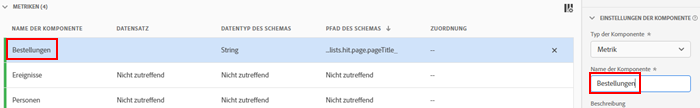
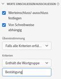
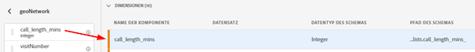

# Anwendungsfälle von Ansichten

Die Möglichkeiten für

## Erstellen einer Bestellmetrik aus einem Seitentitel-(String-)Schema-Feld

Wenn Sie beispielsweise eine Ansicht erstellen, können Sie eine Metrik [!UICONTROL Bestellungen] aus einem [!UICONTROL pageTitle]-Schema erstellen, das eine Zeichenfolge ist. Im Folgenden werden die Schritte beschrieben:

1. Ziehen Sie auf der Registerkarte Komponenten den Abschnitt [!UICONTROL pageTitle] in den Abschnitt [!UICONTROL Metriken] unter [!UICONTROL Einbezogene Komponenten].
   
1. Markieren Sie nun die Metrik, die Sie gerade eingezogen haben, und benennen Sie sie unter [!UICONTROL Komponenteneinstellungen] rechts um:
   
1. Öffnen Sie das Dialogfeld [!UICONTROL Werte] einschließen/ausschließen auf der rechten Seite und geben Sie Folgendes an:
   

   Der Satz &quot;Bestätigung&quot;gibt an, dass es sich um eine Bestellung handelt. Nach Überprüfung aller Seitentitel, bei denen diese Kriterien erfüllt sind, wird für jede Instanz &quot;1&quot;gezählt. Das Ergebnis ist eine neue Metrik (keine berechnete Metrik). Es funktioniert mit Attribution IQ, Filtern und überall sonst können Sie Standardmetriken verwenden.
1. Sie können ein Zuordnungsmodell für diese Metrik weiter angeben, z. B. [!UICONTROL Letztkontakt] mit einem [!UICONTROL Rückblickfenster] von [!UICONTROL Sitzung].
Sie können auch eine weitere [!UICONTROL Metrik &quot;Bestellungen]&quot;aus demselben Feld erstellen und ein anderes Zuordnungsmodell angeben, z. B. [!UICONTROL Erstkontakt] und ein anderes [!UICONTROL Lookback-Fenster], z. B. [!UICONTROL 30 Tage].

## Ganzzahlen als Dimensionen verwenden

Zuvor wurden ganze Zahlen in CJA automatisch als Metriken behandelt. Jetzt können numerische Zeichen (einschließlich benutzerdefinierter Ereignis aus Adobe Analytics) als Dimensionen behandelt werden. Siehe folgendes Beispiel:

1. Ziehen Sie die Ganzzahl [!UICONTROL call_length_min] in den Abschnitt [!UICONTROL Dimensionen] unter [!UICONTROL Einbezogene Komponenten]:
   

1. Sie können jetzt [!UICONTROL Wertaufschlüsselung] hinzufügen, um diese Dimension in Berichte in zusammengefasster Form darzustellen. Andernfalls würde jede Instanz dieser Dimension als Zeilenelement in Workspace angezeigt.
   
