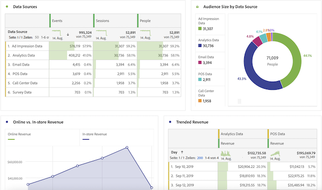
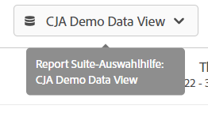

# CJA-Benutzerhandbuch für Adobe Analytics-Benutzer

>[!NOTE]
>
>Diese Seite befindet sich im Aufbau.

Ihr Unternehmen beginnt mit der Beschäftigung von Customer Journey Analytics. Als Anwender, der mit Adobe Analytics vertraut ist, haben Sie bereits einen tollen Vorsprung. Beim Arbeiten mit Customer Journey Analytics werden Sie einige große Unterschiede und Ähnlichkeiten bemerken. Auf dieser Seite werden die Dinge erläutert, die sich nicht geändert haben, sowie einige der wichtigsten Unterschiede. Wir erklären Ihnen auch, wie Sie weitere Informationen zu neuen Konzepten erhalten und weitere Schritte unternehmen können, um IHRE Journey zu vereinfachen und erfolgreicher zu gestalten.

## Was sich nicht geändert hat

Vieles, was Sie auf der Berichtsseite kennen, hat sich nicht geändert.

* Sie können weiterhin die [Analysis Workspace](/help/analysis-workspace/home.md) um Ihre Daten zu analysieren. Workspace funktioniert genauso wie im herkömmlichen Adobe Analytics.
* Sie haben auch dieselbe Version von [Adobe Analytics-Dashboards](/help/mobile-app/home.md) zur Verfügung. Dashboards (auch Mobile App genannt) funktionieren genauso wie herkömmliche Adobe Analytics.
* [Report Builder](/help/report-builder/report-buider-overview.md) hat eine neue Schnittstelle und läuft jetzt auf PCs, Macs und der Web-Version von Excel.

Was die Berichterstellung angeht, ist, dass Sie Zugriff auf viel mehr kanalübergreifende Daten haben, die analysiert werden können. Im Folgenden finden Sie ein Beispiel für einige Visualisierungen, die kanalübergreifende Datenquellen enthalten:

## Neue Architektur

Customer Journey Analytics erhält seine Daten von Adobe Experience Platform. Mit Experience Platform können Sie Kundendaten und -inhalte aus beliebigen Systemen oder Kanälen zentralisieren und standardisieren sowie mithilfe von Datenwissenschaft und maschinellem Lernen die Gestaltung und Bereitstellung personalisierter Erlebnisse verbessern.

Kundendaten in Platform werden als Datensätze gespeichert, die aus einem Schema und Datenstapeln bestehen. Weitere Informationen zu Platform finden Sie unter [Übersicht über die Adobe Experience Platform-Architektur](https://experienceleague.adobe.com/docs/platform-learn/tutorials/intro-to-platform/basic-architecture.html?lang=en).

Ihr CJA-Administrator hat [Verbindungen](/help/connections/create-connection.md) auf Datensätze in Platform. Sie haben dann [Datenansichten](/help/data-views/data-views.md) innerhalb dieser Verbindungen. Stellen Sie sich Datenansichten ähnlich wie Virtual Report Suites vor. Datenansichten sind die Grundlage für die Berichterstellung in Customer Journey Analytics. Das Konzept einer Report Suite existiert nicht mehr.

## Neue Konzepte und Terminologie

Verschiedene Funktionen in CJA wurden im Vergleich zum herkömmlichen Adobe Analytics umbenannt und neu gestaltet, um sie an Branchenstandards anzupassen. Einige aktualisierte Begriffe umfassen Segmente, Virtual Report Suites, Klassifizierungen, Kundenattribute und Container-Namen. Vertraute Konzepte wie eVars und Props existieren nicht mehr, zusammen mit den Einschränkungen, die sie auferlegten.

## (Virtual) Report Suites sind jetzt &quot;Datenansichten&quot;.

[!UICONTROL Datenansichten] Nehmen Sie das Konzept der Virtual Report Suites so auf, wie es heute existiert, und erweitern Sie es auf [zusätzliche Datenkontrollen aktivieren](/help/data-views/create-dataview.md) über Verbindungen zur Verfügung gestellt werden. Dadurch sind Zeitzonen- und Sitzungs-Timeout-Intervalle konfigurierbar. Sie können auch Attributions- und Ablaufeigenschaften für einzelne Dimensionen dynamisch anwenden. Beachten Sie, dass diese rückwirkend auf alle Daten angewendet werden.

**Was Sie tun müssen**:

* Beachten Sie, dass Sie in Workspace mit der Report Suite-Auswahl, die Sie jetzt verwenden, aus den Datenansichten wählen können, die Ihr Admin für Sie freigegeben hat:

   

* Machen Sie sich mit den vielen [Anwendungsfälle für Datenansichten](/help/data-views/data-views-usecases.md).

## Keine eVars und Props mehr

[!UICONTROL eVars], [!UICONTROL Props] und [!UICONTROL Ereignisse] im herkömmlichen Sinne von Adobe Analytics existieren in [!UICONTROL Customer Journey Analytics] nicht mehr. Es gibt unbegrenzte Schemaelemente (Dimensionen, Metriken, Listenfelder). Alle Zuordnungseinstellungen, die Sie bisher während des Datenerfassungsprozesses angewendet haben, werden jetzt bei der Abfrage angewendet. Ihr CJA-Administrator hat Datenansichten erstellt.

**Was Sie tun müssen**:

* Machen Sie sich mit den vielen Möglichkeiten vertraut, mit denen diese Schemaelemente zum Drilldown in Ihre Daten verwendet werden können.

## Segmente sind jetzt &quot;Filter&quot;

[!UICONTROL Customer Journey Analytics] verwendet keine eVars, Props oder Ereignisse mehr und verwendet stattdessen ein AEP-Schema. Das bedeutet, dass keines der vorhandenen Segmente mit [!UICONTROL Customer Journey Analytics]. Außerdem wurden &quot;Segmente&quot;in &quot;Filter&quot;umbenannt.

Derzeit können Sie keine Inhalte freigeben/veröffentlichen [!UICONTROL Filter] ([!UICONTROL Segmente]) von [!DNL Customer Journey Analytics] zur Experience Platform von Unified Profile oder anderen Experience Cloud-Anwendungen. Diese Funktion wird derzeit entwickelt.

**Was Sie tun müssen**:

* Wenn Sie vorhandene Adobe Analytics-Segmente in Customer Journey Analytics verschieben möchten, zeigen Sie [dieses Video](https://experienceleague.adobe.com/docs/customer-journey-analytics-learn/tutorials/moving-adobe-analytics-segments-to-customer-journey-analytics.html?lang=de).
* Erstellen Sie andernfalls die Filter in Customer Journey Analytics neu.

## Berechnete Metriken

[!UICONTROL Customer Journey Analytics] verwendet keine eVars, Props oder Ereignisse mehr und verwendet stattdessen ein AEP-Schema. Das bedeutet, dass keine der vorhandenen berechneten Metriken mit [!UICONTROL Customer Journey Analytics].

**Was Sie tun müssen**:

* Wenn Sie berechnete Adobe Analytics-Metriken in Customer Journey Analytics verschieben möchten, zeigen Sie [dieses Video](https://experienceleague.adobe.com/docs/customer-journey-analytics-learn/tutorials/moving-your-calculated-metrics-from-adobe-analytics-to-customer-journey-analytics.html?lang=de).
* Andernfalls können Sie die berechneten Metriken in Customer Journey Analytics neu erstellen.

## Report Suite-übergreifende Daten

Vorhandene Implementierungen aus mehreren Datensätzen können in Experience Platform kombiniert werden. Die Verbindungen und Datenansichten, die auf diesen Datensätzen basieren, können Daten kombinieren, die zuvor in separaten Report Suites vorhanden waren.

**Was Sie tun müssen**:

## Sitzungs- und Variablenpersistenzeinstellungen

[!UICONTROL Customer Journey Analytics] alle diese Einstellungen zur Berichtszeit anwenden, und diese Einstellungen sind jetzt live in [Datenansichten](/help/data-views/component-settings/persistence.md). Änderungen an diesen Einstellungen sind jetzt rückwirkend. Sie können mehrere Versionen verwenden, indem Sie mehrere Datenansichten verwenden!

**Was Sie tun müssen**:

## Classifications sind jetzt &quot;Lookup-Datensätze&quot;

## Kundenattribute sind jetzt &quot;Profil-Datensätze&quot;.

## Container wurden umbenannt in

Sie legen einen Container für [jede von Ihnen erstellte Datenansicht](https://experienceleague.adobe.com/docs/analytics-platform/using/cja-dataviews/create-dataview.html?lang=en#containers).
* **Trefferbehälter sind jetzt &#39;Ereignis&#39;-Container**. Der Container [!UICONTROL Person] enthält sämtliche Sitzungen und Ereignisse für Besucher innerhalb eines bestimmten Zeitraums.
* **Besuchebehälter sind jetzt Sitzungs-Container**. Mit dem Sitzungs-Container können Seiteninteraktionen, Kampagnen oder Konversionen für eine bestimmte [!UICONTROL Sitzung] identifiziert werden.
* **Besuchercontainer sind jetzt [!UICONTROL Person] container**. Der Container [!UICONTROL Person] enthält sämtliche Sitzungen und Ereignisse für Besucher innerhalb eines bestimmten Zeitraums.

**Was Sie tun müssen**:

Sie haben die Möglichkeit, einen beliebigen Container umzubenennen, um ihn an die Anforderungen Ihres Unternehmens anzupassen.

## `Uniques Exceeded`Einschränkungen

[!UICONTROL In Customer Journey Analytics] gibt es keine Beschränkungen hinsichtlich eindeutiger Werte, sodass Sie sie nicht beachten müssen.
