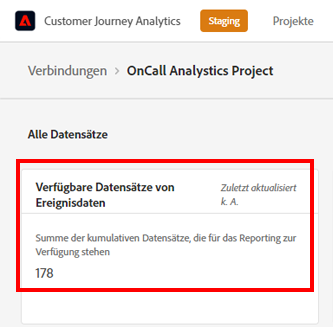
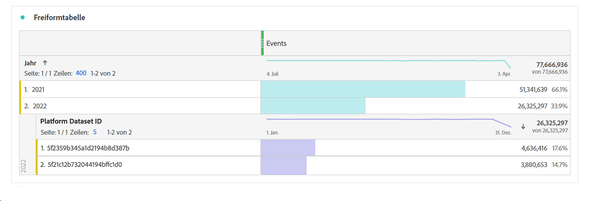

# Häufig gestellte Fragen

[!UICONTROL Customer Journey Analytics] (CJA) ist ein Analytics-Produkt der nächsten Generation. Im Folgenden finden Sie Antworten auf häufig gestellte Fragen zu CJA. Weitere Informationen finden Sie unter [Customer Journey Analytics-Funktionsunterstützung](/help/getting-started/aa-vs-cja/cja-aa.md).

## 1. Voraussetzungen {#prerequisites}

| Frage | Antwort |
| --- | --- |
| Benötige ich [!UICONTROL Private Device Graph] oder [!UICONTROL Device Coop] für [!UICONTROL Customer Journey Analytics]? | Nein, [!UICONTROL Private Device Graph] oder [!UICONTROL Device Coop] sind für [!UICONTROL Customer Journey Analytics] nicht erforderlich. Sie werden aktuell noch nicht unterstützt. |
| Benötige ich eine [!UICONTROL Experience Cloud ID] (ECID) für [!UICONTROL Customer Journey Analytics]? | Nein, [!UICONTROL Customer Journey Analytics] unterstützt alle IDs in einem Datensatz, unabhängig davon, ob es sich um eine [!UICONTROL ECID] oder eine andere ID handelt. |
| Wie gehe ich vor, wenn ich meine Daten vor [!UICONTROL Customer Journey Analytics] einem ETL-Prozess (Extract, Transform, Load) unterziehen muss? | Customer Journey Analytics enthält Funktionen zur [Datenvorbereitung](https://experienceleague.adobe.com/docs/experience-platform/data-prep/api/overview.html?lang=de), mit denen Ihre Daten transformiert werden, bevor Sie in den Data Lake von Adobe Experience Platform überschrieben werden. Wenn Sie einen ETL-Prozess benötigen, nachdem die Daten aufgenommen wurden, stehen Ihnen über den [Abfrage-Service von Adobe Experience Platform](https://experienceleague.adobe.com/docs/platform-learn/tutorials/queries/understanding-query-service.html?lang=de#queries) einige begrenzte Optionen zur Verfügung. Hierfür könnten jedoch zusätzliche Gebühren anfallen. |

{style=&quot;table-layout:auto&quot;}

## 2. Daten zusammenfügen (Cross-Channel Analytics) {#stitching}

| Frage | Antwort |
| --- | --- |
| Kann [!UICONTROL Customer Journey Analytics] Daten über Geräte oder über Datensätze hinweg zusammenfügen? | Ja. [!UICONTROL Customer Journey Analytics] verfügt über eine Lösung zum Zusammenfügen (Stitching) von Daten namens [Cross-Channel Analytics](https://experienceleague.adobe.com/docs/analytics-platform/using/cja-connections/cca/overview.html?lang=de) (CCA). Damit können Sie die Personen-ID eines Datensatzes neu eingeben, was eine nahtlose Kombination mehrerer Datensätze ermöglicht. |
| Wird das Zusammenfügen von anonymen Verhaltens- mit authentifizierten Verhaltensdaten unterstützt? | Ja. [Cross-Channel Analytics](https://experienceleague.adobe.com/docs/analytics-platform/using/cja-connections/cca/overview.html?lang=de) untersucht Benutzerdaten aus authentifizierten und nicht authentifizierten Sitzungen und generiert eine zusammengefügte ID. |
| Wie funktioniert „Replay“ in CCA? | CCA gibt Daten basierend auf eindeutigen Kennungen wieder, die CCA gelernt hat. Bei einem Replay werden zu einer Verbindung neu hinzugefügte Geräte per Stitching zusammengefügt. [Weitere Informationen](https://experienceleague.adobe.com/docs/analytics-platform/using/cja-connections/cca/replay.html?lang=de#step-1%3A-live-stitching) |
| Wie funktioniert das Zusammenfügen historischer Daten (Aufstockung) in CCA? | Bei der erstmaligen Aktivierung stellt Adobe eine Aufstockung der zusammengefügten Daten bereit, die bis zum Beginn des Vormonats zurückreicht (bis zu 60 Tage). Um diese Aufstockung durchführen zu können, muss die vorübergehende ID in den nicht zusammengefügten Daten aus dem so weit zurückreichenden Zeitfenster vorhanden sein. [Weitere Informationen](https://experienceleague.adobe.com/docs/analytics-platform/using/cja-connections/cca/overview.html?lang=de#enable-cross-channel-analytics) |
| Welches Verhalten wird bei nicht zugeordneten Profildatensätzen erwartet? | **Beispielszenario**: Sie können zwei Datensätze in eine CJA-Verbindung einbinden, indem Sie `CRMid` als Personen-ID verwenden. Einer ist ein Web-Ereignis-Datensatz mit `CRMid` in allen Datensätzen. Der andere Datensatz ist ein CRM-Profildatensatz. 40 % des CRM-Datensatzes verfügen über `CRMid`, das im Web-Ereignis-Datensatz vorhanden ist. Für die anderen 60 % ist es nicht im CRM-Datensatz vorhanden. Werden diese Datensätze im Reporting in Analysis Workspace angezeigt?
 **Antwort**: Profilzeilen, für die keine Ereignisse verknüpft sind, werden in Customer Journey Analytics gespeichert. Sie können sie jedoch erst dann in Analysis Workspace sehen, wenn ein mit dieser ID verknüpftes Ereignis angezeigt wird. |

{style=&quot;table-layout:auto&quot;}

## 3. Daten in [!UICONTROL Customer Journey Analytics] einbringen {#ingest}

| Frage | Antwort |
| --- | --- |
| Kann ich Daten aus verschiedenen [!UICONTROL Adobe Experience Platform]-Sandboxen in einer [!UICONTROL Customer Journey Analytics]-Verbindung kombinieren? | Nein, Sie können nicht über Sandboxes hinweg auf Daten zugreifen. Sie können nur Datensätze kombinieren, die sich innerhalb derselben Sandbox befinden. [Weitere Informationen](https://experienceleague.adobe.com/docs/analytics-platform/using/cja-connections/create-connection.html?lang=de#select-sandbox-and-datasets) |
| Wie werden in [!UICONTROL Customer Journey Analytics] Online-Daten mit Offline-Daten verbunden? | Solange die Personen-ID zwischen Datensätzen übereinstimmt, kann [!UICONTROL Customer Journey Analytics] Filter, Attributionen, Flüsse, Fallout usw. verbinden. über Datensätze hinweg miteinander verbinden. |
| Wie integriere ich meine Offline-Daten in [!UICONTROL Customer Journey Analytics]? | Mit Ihrer Berechtigung zur Nutzung von Customer Journey Analytics können Sie Daten in Experience Platform aufnehmen. Sie können dann zu diesen Daten und Datenansichten in [!UICONTROL Customer Journey Analytics] Verbindungen herstellen, um in Analysis Workspace Berichte zu generieren. Das Datenerfassungs-Team der Experience Platform bietet bei Bedarf Empfehlungen oder eine Beratung für Sie an. |
| Wie integriere ich [!UICONTROL Adobe Analytics]-Daten in [!UICONTROL Customer Journey Analytics]? | [!UICONTROL Adobe Analytics]-Daten können über [Adobe Analytics Source Connector](https://experienceleague.adobe.com/docs/experience-platform/sources/connectors/adobe-applications/analytics.html?lang=de) mit Experience Platform verbunden werden. Die meisten [!UICONTROL Adobe Analytics]-Felder werden im XDM-Format übermittelt, andere Felder sind aber noch nicht verfügbar. |
| Wie lange dauert es, bis Datensatzelemente in einer Datenansicht zusammengefasst werden? | Ein paar Stunden für eine erste Ansicht und ein paar Tage, um die Daten der letzten 13 Monate aufzustocken. |
| Sind PII-Daten notwendig, um Verbindungen zwischen den Daten herzustellen? | Nein, Sie können eine beliebige ID verwenden, einschließlich eines Hash einer Kunden-ID, bei der es sich nicht um personenbezogene Daten handelt. |
| Welche Beschränkungen gibt es für die Aufnahme vergangener oder künftiger Daten/Zeitstempel in CJA-Ereignisdatensätze? | <ul><li>Für vergangene Daten/Zeitstempel: bis zu 10 Jahre alte Ereignisdaten.</li><li>Für zukünftige Daten/Zeitstempel: Ereignisdaten (prädiktiv) bis zu einem Monat in der Zukunft.</li></ul> |

{style=&quot;table-layout:auto&quot;}

## 4. Latenzaspekte {#latency}

>[!NOTE]
>In CJA gibt es keine feste Datengröße; daher kann die Adobe sich nicht auf eine standardmäßige Erfassungszeit festlegen. Wir arbeiten aktiv daran, diese Latenzen durch neue Updates und Aufnahmeoptimierung zu reduzieren.

| Frage | Antwort |
| --- | --- |
| Wie hoch ist die erwartete Latenz für [!UICONTROL Customer Journey Analytics] auf [!UICONTROL Adobe Experience Platform]? | <ul><li>Live-Daten oder -Ereignisse: Werden innerhalb von 90 Minuten verarbeitet und aufgenommen, sobald Daten in AEP verfügbar sind. (Batch-Größe > 50 Millionen Zeilen: länger als 90 Minuten.)</li><li>Kleine Aufstockungen – z. B. ein Lookup-Datensatz mit 10 Millionen Zeilen: innerhalb von 7 Tagen<li>Große Aufstockungen – z. B. 500 Milliarden Zeilen: 30 Tage</li></ul> |

## 5. Festlegen eines rollierenden Fensters für die [!UICONTROL Verbindungs]-Datenspeicherung {#data-retention}

Mit der Einstellung [**[!UICONTROL Rollierendes Datenfenster aktivieren ]**](https://experienceleague.adobe.com/docs/analytics-platform/using/cja-connections/create-connection.html?lang=de#create-connection) können Sie die CJA-Datenspeicherung als rollierendes Fenster in Monaten (3 Monate, 6 Monate usw.) definieren. Sie wird auf einer [!UICONTROL Verbindungs]-Ebene, nicht auf einer [!UICONTROL Datensatz]-Ebene festgelegt. Die Datenaufbewahrung basiert auf Zeitstempeln für Ereignis-Datensätze und gilt nur für Ereignis-Datensätze. Für Profil- oder Lookup-Datensätze gibt es keine Datenspeicherungseinstellung, da keine entsprechenden Zeitstempel vorhanden sind.

Der Hauptvorteil besteht darin, dass Sie nur Daten speichern oder Berichte dazu erstellen, die anwendbar und nützlich sind, und ältere Daten löschen, die nicht mehr nützlich sind. Dies hilft Ihnen, Ihre vertraglichen Beschränkungen einzuhalten und das Risiko bezüglich Kostendeckung zu reduzieren.

## 6. Auswirkungen des Löschens von Datenkomponenten {#deletion}

In Bezug auf das Löschen von Daten sollten folgende sechs Komponenten beachtet werden: Sandbox, Schema, Datensatz, Verbindung, Datenansicht und Arbeitsbereich-Projekte. Im Folgenden sind einige Szenarien für das Löschen der jeweiligen Komponenten aufgeführt:

| Aktion | Auswirkung |
| --- | --- |
| Löschen einer Sandbox in [!UICONTROL Adobe Experience Platform] | Durch das Löschen einer Sandbox wird der Datenfluss aller [!UICONTROL Customer Journey Analytics]-Verbindungen zu Datensätzen in dieser Sandbox angehalten. Derzeit werden [!UICONTROL Verbindungen] in CJA, die zur gelöschten Sandbox bestehen, nicht automatisch gelöscht. |
| Löschen eines Schemas in [!UICONTROL Adobe Experience Platform], aber nicht der mit diesem Schema verbundenen Datensätze | [!UICONTROL Adobe Experience Platform] erlaubt nicht das Löschen von [!UICONTROL Schemata], denen ein oder mehrere [!UICONTROL Datensätze] zugeordnet sind. Ein Administrator mit den entsprechenden Berechtigungen kann jedoch zuerst die Datensätze und dann das Schema löschen. |
| Löschen eines Datensatzes im Data Lake von [!UICONTROL Adobe Experience Platform] | Durch das Löschen eines Datensatzes im Data Lake von Adobe Experience Platform wird der Datenfluss von diesem Datensatz zu allen Customer Journey Analytics-Verbindungen, die diesen Datensatz enthalten, angehalten. Daten aus diesem Datensatz werden automatisch aus zugehörigen Customer Journey Analytics-Verbindungen gelöscht. |
| Löschen eines Datensatzes in [!UICONTROL Customer Journey Analytics] | Wenden Sie sich an Ihren Adobe Account Manager, um den Prozess zum Löschen eines Datensatzes innerhalb einer gespeicherten Verbindung zu starten. |
| Löschen von einem Batch aus einem Datensatz (in [!UICONTROL Adobe Experience Platform]) | Wenn ein Batch in einem [!UICONTROL Adobe Experience Platform]-Datensatz gelöscht wird, wird er auch aus allen Customer Journey Analytics-Verbindungen entfernt, die diesen Batch enthalten. Customer Journey Analytics wird über das Löschen von Batches in [!UICONTROL Adobe Experience Platform] benachrichtigt. |
| Löschen von einem Batch, **während er** in [!UICONTROL Customer Journey Analytics] aufgenommen wird | Wenn in dem Datensatz nur ein Batch vorhanden ist, erscheinen keine Daten oder nur teilweise Daten aus diesem Batch in [!UICONTROL Customer Journey Analytics]. Die Aufnahme wird zurückgesetzt. Wenn es in dem Datensatz beispielsweise 5 Batches gibt und 3 davon bereits aufgenommen wurden, als der Datensatz gelöscht wurde, erscheinen die Daten dieser 3 Batches in [!UICONTROL Customer Journey Analytics]. |
| Löschen einer Verbindung in [!UICONTROL Customer Journey Analytics] | Eine Fehlermeldung weist darauf hin, dass<ul><li>für die gelöschte Verbindung erstellte Datenansichten nicht mehr funktionieren.</li><li> Ebenso funktionieren alle Arbeitsbereich-Projekte nicht mehr, die von den Datenansichten der gelöschten Verbindung abhängig sind.</li></ul> |
| Löschen einer Datenansicht in [!UICONTROL Customer Journey Analytics] | Eine Fehlermeldung weist darauf hin, dass kein Arbeitsbereich-Projekt mehr funktioniert, das von dieser gelöschten Datenansicht abhängt. |

## 7. Überlegungen beim Zusammenführen von Report Suites in Customer Journey Analytics {#merge-reportsuite}

Wenn Sie planen, Adobe Analytics-Daten über den [Adobe Analytics-Quell-Connector](https://experienceleague.adobe.com/docs/experience-platform/sources/connectors/adobe-applications/analytics.html?lang=de) zu erfassen, sollten Sie diese Auswirkungen beim Zusammenführen von 2 oder mehr Adobe Analytics-Report Suites berücksichtigen.

| Problem | Hinweis |
| --- | --- |
| Variablen | Variablen wie [!UICONTROL eVars] werden möglicherweise nicht in allen Report Suites angezeigt. Beispielsweise kann eVar1 in Report Suite 1 auf **[!UICONTROL Seite]** verweisen. In Report Suite 2 kann eVar1 auf **[!UICONTROL Interne Kampagne]** verweisen, was zu gemischten und ungenauen Berichten führt. |
| Zahlen für [!UICONTROL Sitzungen] und [!UICONTROL Personen] | Sie werden über Report Suites hinweg dedupliziert. Daher stimmen die Zahlen möglicherweise nicht überein. |
| Deduplizierung der Metrik | Dedupliziert Instanzen einer Metrik (z. B. [!UICONTROL Bestellungen]), wenn mehrere Zeilen dieselbe Transaktions-ID aufweisen (z. B. [!UICONTROL Kauf-ID]). Dadurch wird verhindert, dass Schlüsselmetriken zu häufig gezählt werden. Daher sind die Summen von Metriken wie [!UICONTROL Bestellungen] möglicherweise nicht über Report Suites hinweg korrekt. |
| Währung | Die Währungsumrechnung wird in CJA noch nicht unterstützt. Wenn die Report Suites, die Sie zusammenführen möchten, unterschiedliche Basiswährungen verwenden, können Probleme auftreten. |
| [!UICONTROL Persistenz] | [Persistenz](../data-views/component-settings/persistence.md) erstreckt sich über Report Suites hinweg, was sich auf [!UICONTROL Filter], [!UICONTROL Attribution] usw. auswirkt. Zahlen werden möglicherweise nicht richtig addiert. |
| [!UICONTROL Klassifizierungen] | [!UICONTROL Klassifizierungen] werden beim Zusammenführen von Report Suites nicht automatisch dedupliziert. Wenn Sie mehrere Klassifizierungsdateien in einem einzigen [!UICONTROL Such]-Datensatz kombinieren, können Probleme auftreten. |

## 8. Herkömmliche [!UICONTROL Adobe Analytics]-Komponenten

| Frage | Antwort |
| --- | --- |
| Kann ich [!UICONTROL Filter] ([!UICONTROL Segmente]) von [!DNL Customer Journey Analytics] für Experience Platform Unified Profile oder andere Experience Cloud-Programme freigeben/veröffentlichen? | Noch nicht, wir arbeiten aber aktuell daran, diese Funktion bald bereitstellen zu können. |
| Was ist mit meiner alten [!UICONTROL eVar]-Einstellung passiert? | [!UICONTROL eVars], [!UICONTROL Props] und [!UICONTROL Ereignisse] im herkömmlichen Sinne von Adobe Analytics existieren in [!UICONTROL Customer Journey Analytics] nicht mehr. Es gibt unbegrenzte Schemaelemente (Dimensionen, Metriken, Listenfelder). Alle Zuordnungseinstellungen, die Sie bisher während des Datenerfassungsprozesses angewendet haben, werden jetzt bei der Abfrage angewendet. |
| Wo sind jetzt meine Einstellungen für die Sitzungs- und Variablenpersistenz? | [!UICONTROL Customer Journey Analytics] verwendet alle diese Einstellungen zur Berichtszeit. Diese Einstellungen sind jetzt in Datenansichten verfügbar. Änderungen an diesen Einstellungen sind jetzt rückwirkend. Jetzt sind mehrere Versionen verfügbar, indem Sie mehrere Datenansichten verwenden. |
| Was passiert mit den bereits vorhandenen Segmenten/berechneten Metriken? | [!UICONTROL Customer Journey Analytics] verwendet keine eVars, Props oder Ereignisse mehr und verwendet stattdessen ein AEP-Schema. Das bedeutet, dass keine der vorhandenen Segmente oder Berechnungsmetriken mit [!UICONTROL Customer Journey Analytics] kompatibel sind. |
| Wie werden in [!UICONTROL Customer Journey Analytics] `Uniques Exceeded`-Einschränkungen behandelt? | [!UICONTROL In Customer Journey Analytics] gibt es keine Beschränkungen hinsichtlich eindeutiger Werte, sodass Sie sie nicht beachten müssen. |
| Kann ich als bestehender [!DNL Data Workbench]-Kunde jetzt zu [!UICONTROL Customer Journey Analytics] wechseln? | Das hängt von Ihrem Anwendungsfall ab. Bitte wenden Sie sich an Ihr Adobe Account Team. Möglicherweise eignen sich Ihre aktuellen Anwendungsfälle gut für Customer Journey Analytics. |

{style=&quot;table-layout:auto&quot;}

## 9. Verbindungsgröße schätzen {#estimate-size}

Möglicherweise benötigen Sie Informationen zur aktuellen Anzahl von Datenzeilen in [!UICONTROL Customer Journey Analytics]. Gehen Sie **für jede der von Ihrem Unternehmen erstellten Verbindungen** wie folgt vor, um genaue Informationen zur Nutzung der Ereignisdatensätze (Datenzeilen) in Ihrem Unternehmen zu erhalten.

1. Rufen Sie in [!UICONTROL Customer Journey Analytics] den Tab **[!UICONTROL Verbindungen]** auf.

   Dadurch wird eine Liste aller Ihrer aktuellen Verbindungen angezeigt.

1. Klicken Sie auf einen Verbindungsnamen, um zum Verbindungs-Manager zu gelangen.

1. Fügen Sie für alle erstellten Verbindungen die **[!UICONTROL verfügbaren Ereignisdaten]** hinzu. (Je nach Größe Ihrer Verbindung kann es eine Weile dauern, bis die Anzahl angezeigt wird.)

   

1. Sobald Sie über die Summe aller Ereignisdatenzeilen verfügen, suchen Sie im Customer Journey Analytics-Vertrag, den Ihr Unternehmen mit Adobe unterzeichnet hat, nach der Berechtigung für „Datenzeilen“.

   Dadurch erhalten Sie die maximale Anzahl von Datenzeilen, die im Kundenauftrag genehmigt wurden. Wenn die Anzahl der Datenzeilen, die sich aus Schritt 3 ergaben, größer ist als diese Zahl, besteht eine Überschreitung des Limits.

1. Um dieses Problem zu beheben, haben Sie mehrere Möglichkeiten:

   * Ändern Sie Ihre [Datenspeicherungseinstellungen](https://experienceleague.adobe.com/docs/analytics-platform/using/cja-connections/manage-connections.html?lang=de#set-rolling-window-for-connection-data-retention).
   * [Löschen Sie alle nicht verwendeten Verbindungen](https://experienceleague.adobe.com/docs/analytics-platform/using/cja-overview/cja-faq.html?lang=de#implications-of-deleting-data-components).
   * [Löschen Sie einen Datensatz in AEP](https://experienceleague.adobe.com/docs/analytics-platform/using/cja-overview/cja-faq.html?lang=de#implications-of-deleting-data-components).
   * Wenden Sie sich an Ihren Kundenbetreuer von Adobe, um eine Lizenz für eine zusätzliche Kapazität zu erwerben.

## 10. Über die Limits bei der Verwendung {#overage}

Nutzungsbeschränkungen werden von Adobe regelmäßig überwacht und durchgesetzt. „Datenzeilen“ sind die täglichen durchschnittlichen Datenzeilen, die innerhalb von Customer Journey Analytics für die Analyse verfügbar sind.

Nehmen wir beispielsweise an, Ihr Vertrag berechtigt Sie zu einer Million Datenzeilen. Angenommen, Sie laden am 1. Tag der Verwendung von Customer Journey Analytics zwei Millionen Datenzeilen hoch. Am Tag 2 löschen Sie 1 Million Zeilen und behalten diese Nutzung für den Rest Ihrer Lizenzvereinbarung bei (d. h. maximal eine Million Datenzeilen). Abhängig von Ihren Vertragsbedingungen können Ihnen für Tag 1 anteilige zusätzliche Nutzungsgebühren entstehen, da Sie die Lizenzberechtigung für „Datenzeilen“ überschritten haben.

## 11. Diskrepanzen bei Daten erkennen {#discrepancies}

In einigen Fällen kann es vorkommen, dass die Gesamtanzahl der von Ihrer Verbindung erfassten Ereignisse sich von der Anzahl der Zeilen im Datensatz in [!UICONTROL Adobe Experience Platform] unterscheidet. In diesem Beispiel enthält der Datensatz „B2B Impression“ 7650 Zeilen, der Datensatz enthält jedoch 3830 Zeilen in [!UICONTROL Adobe Experience Platform]. Es kann mehrere Gründe für Diskrepanzen geben. Die folgenden Schritte können für die Diagnose hilfreich sein:

1. Schlüsseln Sie diese Dimension nach **[!UICONTROL Platform Datensatz-ID]** auf. Sie werden feststellen, dass es zwei Datensätze mit derselben Größe, aber unterschiedlichen **[!UICONTROL Platform Datensatz-IDs]** gibt. Jeder Datensatz enthält 3.825 Aufzeichnungen. Das bedeutet, dass [!UICONTROL Customer Journey Analytics] fünf Datensätze aufgrund fehlender Personen-IDs oder fehlender Zeitstempel ignoriert hat:

   

1. Wenn wir uns dies in [!UICONTROL Adobe Experience Platform] anschauen, gibt es keinen Datensatz mit der ID „5f21c12b732044194bffc1d0“. Jemand hat also diesen Datensatz bei der Erstellung der ersten Verbindung aus [!UICONTROL Adobe Experience Platform] gelöscht. Später wurde er erneut zu Customer Journey Analytics hinzugefügt, es wurde jedoch eine andere [!UICONTROL Platform-Datensatz-ID] von [!UICONTROL Adobe Experience Platform] generiert.

Weitere Informationen über die [Implikationen beim Löschen von Datensätzen und Verbindungen](https://experienceleague.adobe.com/docs/analytics-platform/using/cja-overview/cja-faq.html?lang=de#implications-of-deleting-data-components) erhalten Sie in [!UICONTROL Customer Journey Analytics] und [!UICONTROL Adobe Experience Platform].
