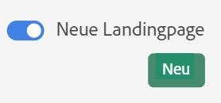
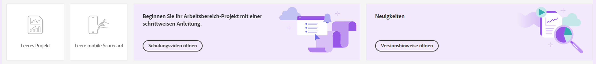

# Landingpage von Customer Journey Analytics

Auf der Landingpage für Customer Journey Analytics finden Sie eine Startseite des Projektmanagers und einen Lernabschnitt, der Ihnen bei den ersten Schritten hilft.

>[!VIDEO](https://video.tv.adobe.com/v/334278/?quality=12)

## Zugriff auf die neue Landingpage {#access-landing}

Nachdem Sie sich bei Adobe Experience Cloud und Customer Journey Analytics angemeldet haben, aktivieren Sie die [!UICONTROL Neue Landingpage - Beta] Schaltfläche in der unteren linken Ecke umschalten. Der Zugriff auf die Umschalter-Schaltfläche ist benutzerspezifisch für jedes Unternehmen und nicht unternehmensspezifisch.

Sie können

* Erweitern Sie die [!UICONTROL Projekte] in den Vollbildmodus. Um die Tabelle zu erweitern, klicken Sie einfach auf das Hamburger Menüsymbol. Durch diese Aktion werden die Registerkarten in der linken Leiste reduziert.
* Passen Sie die Spaltenbreite an, indem Sie das Spaltentrennzeichen ziehen.
* Ordnen Sie die fixierten Elemente neu an. Um die fixierten Elemente nach oben und unten zu verschieben, klicken Sie auf das Auslassungszeichen neben dem fixierten Element und wählen Sie **[!UICONTROL Nach oben]** oder **[!UICONTROL Nach unten]**.

## Navigieren Sie zur Registerkarte [!UICONTROL Projekte]. {#navigate-projects}

[!UICONTROL Projekte] fungieren als Startseite von [!UICONTROL Arbeitsbereich]. Hier werden alle Arbeitsbereich-Projekte angezeigt, einschließlich der mobilen Scorecards. **[!UICONTROL Projekte]** sind Dinge, die Sie erstellt haben oder die jemand anderes für Sie erstellt und freigegeben hat. [!UICONTROL Projekte] beziehen sich auch auf leere Projekte und leere mobile Scorecards.

>[!NOTE]
>
>Einige der folgenden Einstellungen bleiben sowohl während der Sitzung als auch sitzungsübergreifend bestehen (werden gespeichert). Beispiele: Auf welcher Registerkarte Sie sich befinden, welche Filter ausgewählt wurden, welche Spalten ausgewählt wurden und welche Sortierrichtung die Spalte hat. Suchergebnisse werden jedoch nicht beibehalten.

| UI-Element | Definition |
| --- | --- |
| ... Mehr | Ermöglicht es Ihnen, [!UICONTROL Tutorials anzuzeigen] und [Benutzereinstellungen zu bearbeiten](/help/analyze/analysis-workspace/user-preferences.md). |
| **[!UICONTROL Neu erstellen]** modal is back | Wenn Sie auf **[!UICONTROL Neu erstellen]** In Workspace haben Sie erneut die Wahl zwischen einem [!UICONTROL Leeres Projekt] und [!UICONTROL Leere mobile Scorecard]. Sie können auch aus beliebigen Vorlagen wählen, die Ihr Unternehmen erstellt hat. |
| [!UICONTROL Weniger/mehr anzeigen] | Blendet das Anzeigen des Banners ein oder aus:  |
| [!UICONTROL Leeres Projekt] | Erstellt ein leeres [Arbeitsbereich-Projekt](https://experienceleague.adobe.com/docs/analytics/analyze/analysis-workspace/home.html?lang=de), das Sie füllen können. |
| [!UICONTROL Leere mobile Scorecard] | Erstellt eine leere [mobile Scorecard](https://experienceleague.adobe.com/docs/analytics/analyze/mobapp/curator.html?lang=de), die Sie füllen können. |
| [!UICONTROL Schulungs-Tutorial öffnen] | Öffnet das Arbeitsbereich-Tutorial, das neue Benutzer schrittweise durch die Erstellung eines Projekts führt. |
| [!UICONTROL Versionshinweise öffnen] | Öffnet die neuesten Versionshinweise zu Adobe Experience Cloud. |
| Filtersymbol | Sie können nach Tags, Report Suites, Eigentümern, Typen und anderen Kriterien filtern (Meine, Für mich freigegeben, Favoriten und Genehmigt) |
| Suchleiste | Die Suche umfasst nun alle Spalten in der Tabelle. |
| Auswahlfeld | Wenn Sie neben einem oder mehreren Projekten auf dieses Kästchen klicken, werden die Projektverwaltungsaktionen angezeigt, die Sie ausführen können: Löschen, Taggen, Einfügen, Genehmigen, Freigeben, Umbenennen, Kopieren und Exportieren als CSV. Sie sind möglicherweise nicht berechtigt, alle diese Aktionen durchzuführen. |
| [!UICONTROL Favoriten] | Beim Favorisieren eines Projekts wird es mit einem Stern als Favorit markiert, wonach Sie filtern können. |
| [!UICONTROL Name] | Der Name des Projekts. |
| Infosymbol (i) | Wenn Sie auf das Infosymbol klicken, werden die folgenden Informationen zu diesem Projekt angezeigt: Typ, Projektrolle, Eigentümer, Beschreibung und für wen es freigegeben ist. Es zeigt auch an, wer dieses Projekt [bearbeiten oder duplizieren](https://experienceleague.adobe.com/docs/analytics-platform/analysis-workspace/curate-share/share-projects.html) kann. |
| Auslassungspunkte (...) | Durch Klicken auf die Auslassungspunkte neben einem Projekt werden die Projektverwaltungsaktionen angezeigt, die Sie ausführen können: Löschen, Taggen, Einfügen, Genehmigen, Freigeben, Umbenennen, Kopieren und Exportieren als CSV. Beachten Sie, dass Sie möglicherweise nicht über die erforderlichen Berechtigungen für alle diese Aktionen verfügen. |
| [!UICONTROL Typ] | Gibt an, ob es sich um ein Arbeitsbereich-Projekt oder eine mobile Scorecard handelt. |
| [!UICONTROL Tags] | Sie können Berichte taggen, um sie in Gruppen zu organisieren. |
| [!UICONTROL Projektrolle] | Projektrollen beziehen sich darauf, ob Sie Projekteigentümer sind und ob Sie berechtigt sind, das Projekt zu bearbeiten oder zu duplizieren. |
| [!UICONTROL Datenansicht] | Tabellen und Visualisierungen innerhalb eines Bedienfelds leiten Daten aus der Datenansicht ab, die oben rechts im Bedienfeld ausgewählt wurde. Die Datenansicht bestimmt außerdem, welche Komponenten in der linken Leiste verfügbar sind. Je nach Anwendungsfällen Ihrer Analyse können Sie in einem Projekt eine oder mehrere Datenansichten verwenden. Die Liste der Datenansichten ist nach Relevanz sortiert. Die Adobe definiert die Relevanz, basierend darauf, wie kürzlich und häufig die Datenansicht vom aktuellen Benutzer verwendet wurde und wie häufig die Datenansicht innerhalb des Unternehmens verwendet wird. |
| [!UICONTROL Inhaber] | Die Person, die das Projekt erstellt hat. |
| [!UICONTROL Freigegeben für] | Für wen wurde dieses Projekt freigegeben? |
| [!UICONTROL Zuletzt geändert] | Zeitpunkt der letzten Änderung dieses Projekts. |
| [!UICONTROL Zuletzt geöffnet] | Wann dieses Projekt zuletzt von Ihnen geöffnet wurde. |
| [!UICONTROL Eingeplant] | Legen Sie fest auf [!UICONTROL on] wenn ein Projekt geplant ist oder **[!UICONTROL Aus]** , wenn dies nicht der Fall ist. Klicken Sie auf **[!UICONTROL on]** -Link können Sie Informationen zum geplanten Projekt anzeigen. Sie können auch [den Projektplan bearbeiten](/help/analyze/analysis-workspace/curate-share/t-schedule-report.md) wenn Sie Projektinhaber sind. |
| [!UICONTROL Projekt-ID] | Die Projekt-ID kann zum Debugging von Projekten verwendet werden. |
| [!UICONTROL Längster Datumsbereich] | Längere Datumsbereiche erhöhen die Projektkomplexität und können die Verarbeitungs- und Ladezeiten erhöhen. |
| [!UICONTROL Anzahl der Abfragen] | Eine höhere Anzahl von Projektabfragen erhöht die Projektkomplexität und kann die Verarbeitungs- und Ladezeiten erhöhen. |
| Symbol &quot;Tabelle anpassen&quot; | (Oben rechts) Wenn Sie Spalten aus der Projektliste hinzufügen oder entfernen möchten, können Sie dies tun, indem Sie sie auswählen oder deaktivieren. |
| &lt; (Schaltfläche „Zurück“) | Über diese Schaltfläche in einem Workspace-Projekt gelangen Sie zurück zu Ihrer letzten Landingpage-Konfiguration. Die Seitenkonfiguration, die Sie beim Verlassen der Landingpage hatten, bleibt auch bei der Rückkehr erhalten. |

## Navigieren Sie zur Registerkarte „Lernen“. {#navigate-learning}

Die Seite „Lernen“ enthält praktische Videoführungen und -Tutorials sowie Links zur Dokumentation.

* Die Tour [!UICONTROL Arbeitsbereich-Grundlagen] führt Sie direkt zu Arbeitsbereich und zeigt Ihnen das Arbeitsbereich-Layout und wo Sie die häufigsten Aktionen finden/durchführen können. Diese Tour kann auch jederzeit direkt in Arbeitsbereich über das QuickInfo-Pop-over in der Kopfzeile des Bedienfelds neu gestartet werden.
* Durch Klicken auf ein Video/eine Tour wird ein Tag **[!UICONTROL Angezeigt]** hinzugefügt. Mit diesem Tag können Sie Ihren Fortschritt durch den Lerninhalt verfolgen. Sie können auf das Tag klicken und es wird ausgeblendet, falls Sie den Inhalt noch nicht abgeschlossen haben.
* Die Schaltfläche **[!UICONTROL Weitere Informationen]** im Video-Modal bietet Zugriff auf eine Adobe Experience League-Dokumentationsseite mit weiteren Hilfeinhalten zu dem Video, das Sie gerade angesehen haben.  **[!UICONTROL Weitere Videos anzeigen]** führt Sie zur vollständigen YouTube-Playlist für Analysis Workspace.

## Häufig gestellte Fragen zu Landingpages. {#landing-faq}

| Frage | Antwort |
| --- | --- |
| Gibt es eine maximale Anzahl von Projekten, die ich anheften kann? | Nein, es gibt keine Begrenzung für die Anzahl der Projekte, die Sie anheften können. |
| Können Administratoren diese Landingpage für ihre Benutzer bestimmen? | Nein, Administratoren können die Landingpage nicht im Namen von Benutzern angeben. Die einzelnen Benutzer müssen den Umschalter selbst aktivieren. |