# Integrieren von Attribution AI mit CJA

[Attribution AI](https://experienceleague.adobe.com/docs/experience-platform/intelligent-services/attribution-ai/overview.html?lang=de) ist Teil von Adobe Experience Platform Intelligent Services und bietet einen mehrere Kanäle umfassenden algorithmischen Attributions-Service, der den Einfluss und die inkrementelle Auswirkung von Kundeninteraktionen auf bestimmte Ergebnisse berechnet. Mit Attribution AI können Marketing-Experten die Ausgaben für Marketing und Werbung messen und optimieren, indem sie die Auswirkungen einzelner Kundeninteraktionen in einzelnen Phasen der Customer Journey untersuchen.

Attribution AI kann mit Customer Journey Analytics (CJA) integriert werden, sodass mit Attribution AI Modelle anhand von Marketing-Touchpoints und Konversionsdatenquellen von Kunden ausgeführt werden können. CJA importiert dann die Ausgabe dieser Modelle als Datensatz oder kann in den Rest Ihrer CJA-Datensätze integriert werden. Attribution AI-aktivierte Datensätze können dann in Datenansichten und Berichten in CJA genutzt werden.

Attribution AI unterstützt 3 Experience Platform-Schemas: Erlebnisereignis, Adobe Analytics und Kundenerlebnisereignis.

Attribution AI verfügt über zwei Kategorien von Scores: algorithmische und regelbasierte.

## Algorithmische Scores

Algorithmische Scores umfassen inkrementelle und beeinflusste Scores.

* **[!UICONTROL Beeinflusste] Scores** teilen 100 % der Konversion auf die Marketing-Kanäle auf.
* **[!UICONTROL Inkrementelle] Scores** berücksichtigen auch einen Konversions-Basiswert, der auch ohne Marketing erreicht werden hätte können. Dieser Basiswert ergibt sich aus KI-Beobachtungen von Mustern, Saisonalität usw., die durch den Marken-Erkennungswert, die Markenloyalität und Mundpropaganda entstehen. Der verbleibende Anteil wird auf die Marketing-Kanäle aufgeteilt.

## Regelbasierte Scores

Regelbasierte Scores umfassen

* **[!UICONTROL Erstkontakt]**: 100 % werden dem Touchpoint zugeschrieben, der zuerst im Attributions-Lookback-Fenster angezeigt wird.
* **[!UICONTROL Letztkontakt]**: 100 % werden dem Touchpoint zugeschrieben, der zuletzt vor der Konversion aufgetreten ist.
* **[!UICONTROL Linear]**: Gibt jedem Touchpoint vor der Konversion dieselbe Gewichtung.
* **[!UICONTROL U-förmig]**: Der ersten und letzten Interaktion werden je 40 % zugeschrieben. Die verbleibenden 20 % werden auf alle dazwischen liegenden Touchpoints aufgeteilt. Bei Konversionen mit einem einzigen Touchpoint werden diesem 100 % zugeschrieben. Bei Konversionen mit zwei Touchpoints werden jedem 50 % zugeschrieben.
* **[!UICONTROL Time-Decay]**: Folgt einem exponentiellen Abfall mit einem benutzerdefinierten Halbwertszeit-Parameter, wobei der Standardwert 7 Tage ist. Die Gewichtung der einzelnen Kanäle hängt von der Zeit ab, die zwischen dem Beginn des Touchpoints und der letztendlichen Konversion verstrichen ist. Die Formel, die zur Bestimmung der Gewichtung verwendet wird, lautet `2^(-t/halflife)`, wobei `t` die Zeit zwischen einem Touchpoint und einer Konversion ist. Alle Touchpoints werden dann auf 100 % normalisiert.

## Workflow

Einige der Schritte werden in Adobe Experience Platform ausgeführt, bevor die Ausgabe in CJA verwendet wird. Die Ausgabe besteht aus einem Datensatz mit einem angewendeten Attribution AI-Modell.

### Schritt 1: Erstellen einer Attribution AI-Instanz

Erstellen Sie in Experience Platform eine Attribution AI-Instanz, indem Sie wie [hier](https://experienceleague.adobe.com/docs/experience-platform/intelligent-services/attribution-ai/user-guide.html?lang=de) beschrieben Daten auswählen und zuordnen, Ereignisse definieren und Ihre Daten trainieren.

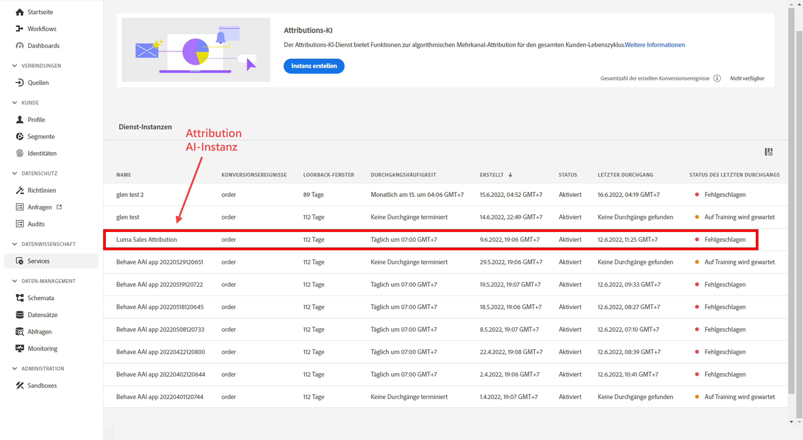

### Schritt 2: Einrichten einer CJA-Verbindung zu Attribution AI-Datensätzen

In Customer Journey Analytics können Sie jetzt [eine oder mehrere Verbindungen](/help/connections/create-connection.md) zu Experience Platform-Datensätzen erstellen, die für Attribution AI vorbereitet wurden. Diese Datensätze werden wie im folgenden Beispiel mit dem Präfix „Attribution AI Scores“ dargestellt:

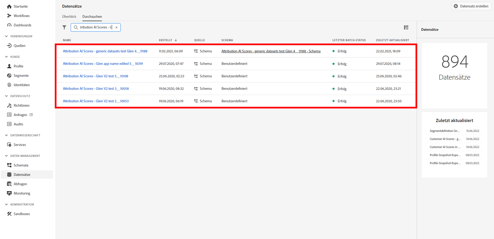

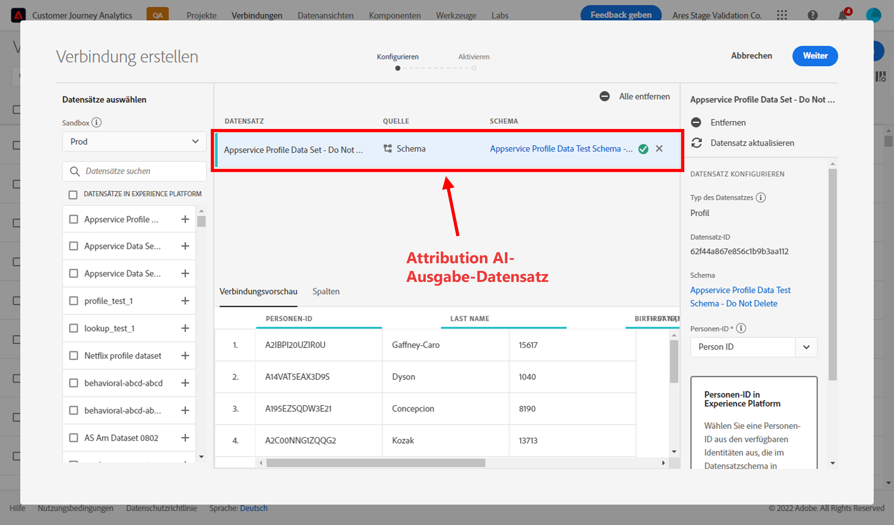

### Schritt 3: Erstellen von Datenansichten basierend auf diesen Verbindungen

Erstellen Sie in Customer Journey Analytics: [eine oder mehrere Datenansichten](/help/data-views/create-dataview.md), die die Attribution AI-XDM-Felder enthalten.

Hier finden Sie die XDM-Schemafelder für Touchpoints:

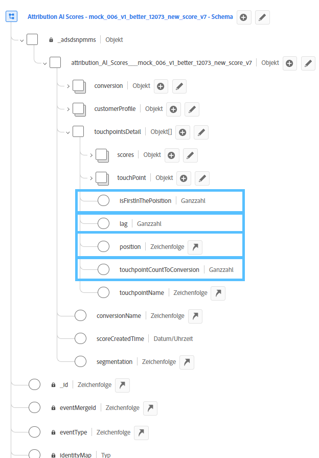

Hier finden Sie die XDM-Schemafelder für die Konversion:

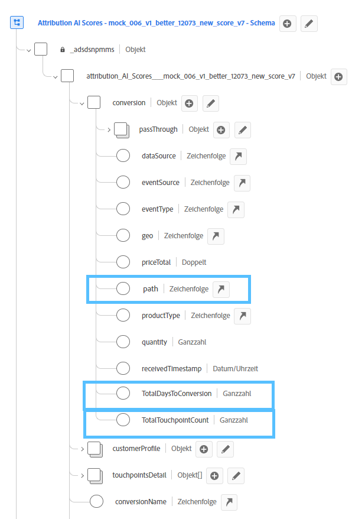

### Schritt 4: Erstellen eines Berichts zu AAI-Daten in CJA Workspace

In einem CJA Workspace-Projekt können Sie Metriken wie „AAI-Bestellungen“ und Dimensionen wie „AAI-Kampagnenname“ oder „AAI-Marketing-Kanal“ abrufen.

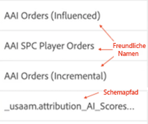

Die Rohwertausgabe in AAI hat ein verschachteltes Schema, bei dem der Pfad zu den Feldern so lang sein kann, dass er den größten Teil des Platzes in Tabellen oder Visualisierungen einnimmt. Zur Verkürzung wird der [!UICONTROL Anzeigename] in Customer Journey Analytics automatisch generiert und gemäß den folgenden Regeln genutzt:

* Alle Felder haben das Präfix „AAI“
* Für Touchpoint-Felder:
   * Felder, die Teil des XDM-Punktwerts sind, werden in CJA als `AAI T {field name}` angezeigt.
   * Felder, die als Passthrough-Spalte enthalten sind, werden in CJA als `AAI T PT {field name}` angezeigt.
* Für Konversionsfelder:
   * Felder, die Teil des XDM-Punktwerts sind, werden in CJA als `AAI C {field name}` angezeigt.
   * Felder, die als Passthrough-Spalte enthalten sind, werden in CJA als `AAI C PT {field name}` angezeigt.

**Bestellungen mit beeinflussten und inkrementellen Scores**

Hier sehen wir ein Workspace-Projekt mit AAI-Daten, in dem Bestellungen mit beeinflussten und inkrementellen Scores zu sehen sind. Schlüsseln Sie eine beliebige Dimension auf, um die Attribution nach Kampagne, Produktgruppe, Benutzersegment, Geografie usw. darzustellen.

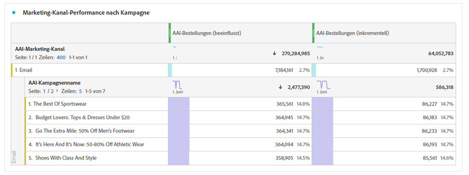

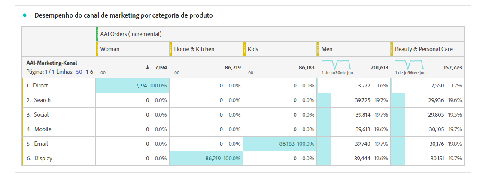

**Marketing-Performance**

Vergleichen Sie die Touchpoint-Attribution zwischen verschiedenen Attributionsmodellen:

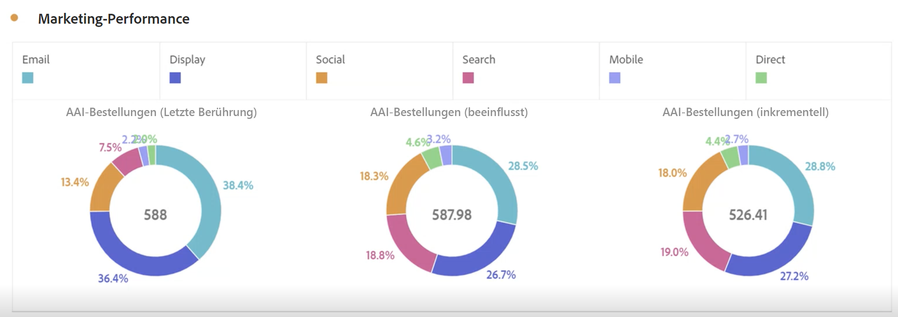

**Kanalinteraktion**

Verstehen Sie die Kanalinteraktion mithilfe eines Venn-Diagramms, um zu erkennen, welcher Kanal am effektivsten mit anderen Kanälen verwendet werden kann:

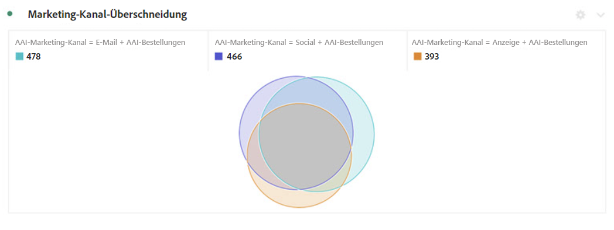

**Top-Pfade zur Konversion**

Diese Tabelle zeigt die wichtigsten Konversionspfade (dedupliziert), die Sie bei der Erstellung und Optimierung von Touchpoints unterstützen:

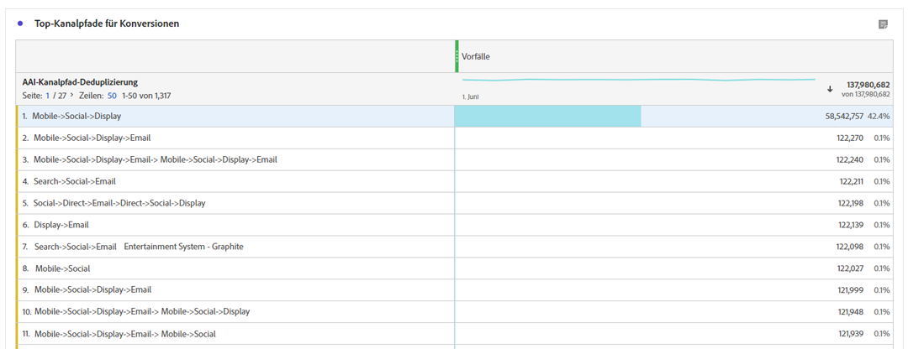

**Vorlaufzeit bis zur Konversion**

Hier finden Sie die Vorlaufzeit für die Konversion, wenn ein Touchpoint im Mix enthalten ist. Dies hilft bei der Optimierung der Vorlaufzeit:

## Unterschiede zwischen den Attributionsfunktionen von Attribution AI und CJA

Die folgende Tabelle zeigt einige Funktionsunterschiede:

| Funktionalität | Attribution AI | CJA-Attribution |
| --- | --- | --- |
| Führt inkrementelle Attribution durch | Ja | Nein |
| Ermöglicht Benutzern, das Modell anzupassen | Ja | Ja |
| Wendet Attribution kanalübergreifend an (Hinweis: AAI verwendet nicht dieselben verknüpften Daten wie CJA.) | Ja | Ja |
| Beinhaltet beeinflusste Werte | Ja | Ja |
| Ermöglicht ML-Modellierung | Ja | Ja |
| Regionale Attributionsmodelle | Ja | Ja |
| Kann Marketing-Touchpoints in einem Modell konfigurieren | Ja | Nein |

{style="table-layout:auto"}
