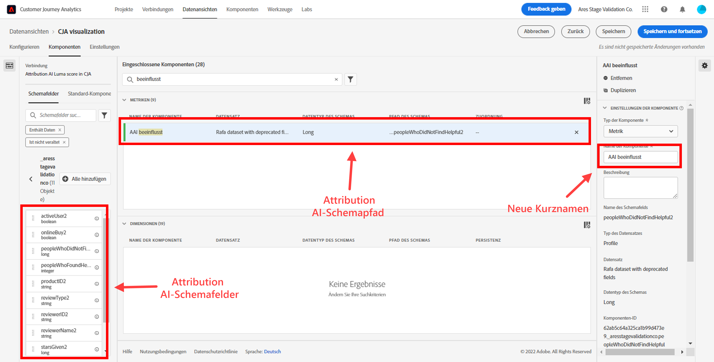

# Integrieren von Attribution AI mit CJA

[Attribution AI](https://experienceleague.adobe.com/docs/experience-platform/intelligent-services/attribution-ai/overview.html?lang=de) ist Teil von Adobe Experience Platform Intelligent Services und bietet einen mehrere Kanäle umfassenden algorithmischen Attributions-Service, der den Einfluss und die inkrementelle Auswirkung von Kundeninteraktionen auf bestimmte Ergebnisse berechnet. Mit Attribution AI können Marketing-Experten die Ausgaben für Marketing und Werbung messen und optimieren, indem sie die Auswirkungen einzelner Kundeninteraktionen in einzelnen Phasen der Customer Journey untersuchen.

Attribution AI kann in Customer Journey Analytics (CJA) integriert werden, soweit Attribution AI Modelle für die Marketing-Touchpoints und Konversionsdatenquellen von Kunden ausführt. CJA importiert dann die Ausgabe dieser Modelle als Datensatz oder kann in den Rest Ihrer CJA-Datensätze integriert werden. Attribution AI-Datensätze können dann in Datenansichten und Berichten in CJA genutzt werden.

Attribution AI unterstützt 3 Experience Platform-Schemas: Erlebnisereignis, Adobe Analytics und Kundenerlebnisereignis.

Attribution AI verfügt über zwei Kategorien von Werten: algorithmische und regelbasierte.

## Algorithmische Werte

Algorithmische Werte umfassen inkrementelle und beeinflusste Werte.

* **[!UICONTROL Beeinflusst] Bewertungen** 100 % des Konversionsguthabens auf Marketingkanäle aufteilen.
* **[!UICONTROL Inkrementell] Bewertungen** berücksichtigen Sie zunächst eine Konversionsgrundlinie, die Sie auch ohne Marketing erreicht hätten. Diese Grundlinie hängt von KI-Beobachtungen von Mustern, Saisonabhängigkeit usw. ab, die aufgrund der bestehenden Markenerkennung, -loyalität und der Mundpropaganda erfolgen. Der verbleibende Anteil wird auf die Marketing-Kanäle aufgeteilt.

## Regelbasierte Werte

Regelbasierte Werte umfassen

* **[!UICONTROL Erstkontakt]** 100 % werden dem Touchpoint zugeschrieben, der zuerst im Attributions-Lookback-Fenster angezeigt wird.
* **[!UICONTROL Letztkontakt]** 100 % werden dem Touchpoint zugeschrieben, der zuletzt vor der Konvertierung aufgetreten ist.
* **[!UICONTROL Linear]** gibt jedem Touchpoint, der zu einer Konversion geführt hat, die gleiche Gewichtung.
* **[!UICONTROL U-förmig]** der ersten Interaktion 40 % zugeschrieben, der letzten Interaktion 40 % und den verbleibenden 20 % auf alle dazwischen liegenden Touchpoints aufgeteilt. Bei Konversionen mit einem einzigen Touchpoint werden diesem 100 % zugeschrieben. Bei Konversionen mit zwei Touchpoints werden jedem 50 % zugeschrieben.
* **[!UICONTROL Zeitverfall]** folgt einem exponentiellen Abfall mit einem benutzerdefinierten Parameter für die Halbwertszeit, wobei der Standardwert 7 Tage beträgt. Die Gewichtung der einzelnen Kanäle hängt von der Zeit ab, die zwischen dem Beginn des Touchpoints und der letztendlichen Konversion verstrichen ist. Die Formel, die zur Bestimmung der Gewichtung verwendet wird, lautet `2^(-t/halflife)`, wobei `t` die Zeit zwischen einem Touchpoint und einer Konversion ist. Alle Touchpoints werden dann auf 100 % normalisiert.

## Workflow

Einige der Schritte werden in Adobe Experience Platform ausgeführt, bevor die Ausgabe in CJA verwendet wird. Die Ausgabe besteht aus einem Datensatz mit einem angewendeten Attribution AI-Modell.

### Schritt 1: Erstellen einer Attribution AI-Instanz

Erstellen Sie in Experience Platform eine Attribution AI-Instanz, indem Sie wie [hier](https://experienceleague.adobe.com/docs/experience-platform/intelligent-services/attribution-ai/user-guide.html?lang=de) beschrieben Daten auswählen und zuordnen, Ereignisse definieren und Ihre Daten trainieren.

### Schritt 2: Einrichten einer CJA-Verbindung zu Attribution AI-Datensätzen

In Customer Journey Analytics können Sie jetzt [eine oder mehrere Verbindungen erstellen](/help/connections/create-connection.md) zu Experience Platform-Datensätzen, die für Attribution AI instrumentiert wurden. Diese Datensätze werden mit dem Präfix &quot;Attribution AI Scores&quot;angezeigt, wie im folgenden Beispiel:

### Schritt 3: Erstellen von Datenansichten basierend auf diesen Verbindungen

In Customer Journey Analytics: [eine oder mehrere Datenansichten erstellen](/help/data-views/create-dataview.md) die die Attribution AI-XDM-Felder enthalten.

Hier finden Sie die XDM-Schemafelder für Touchpoints:

Hier finden Sie die XDM-Schemafelder zur Konvertierung:

### Schritt 4: Bericht zu AAI-Daten in CJA Workspace

In einem CJA Workspace-Projekt können Sie Metriken wie &quot;AAI-Bestellungen&quot;und Dimensionen wie &quot;AAI-Kampagnenname&quot;oder &quot;AAI-Marketingkanal&quot;abrufen.

>[!IMPORTANT]
>
>Diese Dimensionen und Metriken werden auf diese Weise nicht nativ benannt. Dies sind &quot;Anzeigenamen&quot;. Die [Namenskonvention in Attribution AI](https://experienceleague.adobe.com/docs/experience-platform/intelligent-services/attribution-ai/input-output.html?lang=en#attribution-ai-output-data) folgt dem Schemapfad. Es wird empfohlen, die langen AAI-Schemapfadnamen in kurze, benutzerfreundlichere Namen (Dimensionen/Metriken) in CJA umzubenennen. Sie können dies in **[!UICONTROL Datenansichten]** > **[!UICONTROL Datenansicht bearbeiten]** > **[!UICONTROL Komponenten]** tab > **[!UICONTROL Schemafelder]** -> Klicken Sie auf ein Schemafeld -> **[!UICONTROL Komponentenname]**.

**Bestellungen mit beeinflussten und inkrementellen Ergebnissen**

Hier sehen wir ein Workspace-Projekt mit AAI-Daten, das Bestellungen mit beeinflussten und inkrementellen Werten anzeigt. Führen Sie einen Drilldown zu einer beliebigen Dimension durch, um die Attribution zu verstehen, indem Sie: Kampagne, Produktgruppe, Benutzersegment, Geografie usw.

**Marketing-Performance**

Vergleich und Kontrast der Touchpoint-Attribution zwischen verschiedenen Attributionsmodellen:

**Kanalinteraktion**

Verstehen Sie die Kanalinteraktion, um mithilfe eines Venn-Diagramms zu sehen, welcher Kanal am effektivsten mit anderen Kanälen verwendet werden kann:

**Top-Pfade zur Konversion**

Diese Tabelle zeigt die wichtigsten Konversionspfade (dedupliziert), die Sie bei der Erstellung und Optimierung von Touchpoints unterstützen:

**Vorlaufzeit bis Konversion**

Hier sehen wir die Vorlaufzeit für die Konversion, wenn ein Touchpoint in der Mischung enthalten ist. Dies hilft bei der Optimierung der Vorlaufzeit:

## Unterschiede zwischen Attribution AI und Attribution IQ

Wann sollten Sie also Attribution AI-Daten anstatt [Attribution IQ](/help/analysis-workspace/attribution/overview.md), eine native CJA-Funktion, verwenden? Die folgende Tabelle zeigt einige Funktionsunterschiede:

| Funktionalität | Attribution AI | Attribution IQ |
| --- | --- | --- |
| Führt inkrementelle Attribution durch | Ja | Nein |
| Ermöglicht Benutzern, das Modell anzupassen | Ja | Ja |
| Wendet Attribution kanalübergreifend an (Hinweis: AAI verwendet nicht dieselben verknüpften Daten wie CJA.) | Ja | Ja |
| Umfasst beeinflusste Bewertungen | Ja | Ja |
| Ermöglicht ML-Modellierung | Ja | Ja |
| Regionale Attributionsmodelle | Ja | Ja |
| Kann Marketing-Touchpoints in einem Modell konfigurieren | Ja | Nein |

{style=&quot;table-layout:auto&quot;}
