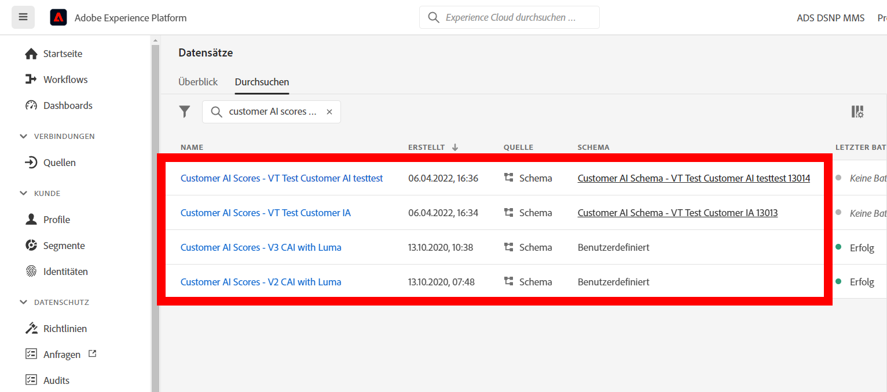
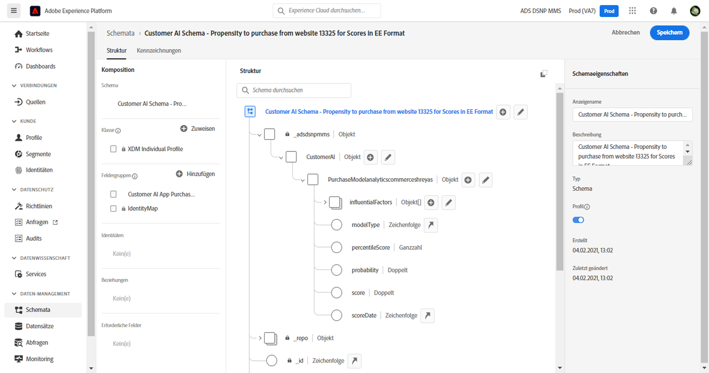

# Integrieren von Customer AI mit CJA

>[!NOTE]
>
>Diese Seite befindet sich im Aufbau.

[Customer AI](https://experienceleague.adobe.com/docs/experience-platform/intelligent-services/customer-ai/overview.html?lang=en)bietet als Teil von Adobe Experience Platform Intelligent Services Marketing-Experten die Möglichkeit, Kundenprognosen auf individueller Ebene zu generieren.

Mithilfe von Einflussfaktoren kann Customer AI vorhersagen, was ein Kunde wahrscheinlich tun wird und warum. Darüber hinaus können Marketing-Experten von Prognosen und Einblicken durch Customer AI profitieren, um Kundenerlebnisse durch Bereitstellung der am besten geeigneten Angebote und Botschaften zu personalisieren.

Customer AI analysiert einen der folgenden Datensätze, um Abwanderungs- oder Konversionsneigungswerte vorherzusagen:

* Adobe Analytics-Daten mit dem Analytics-Quell-Connector
* Adobe Audience Manager-Daten mit dem Audience Manager-Quell-Connector
* Datensatz für Erlebnisereignisse (EE)
* Datensatz für Kundenerlebnis-Ereignisse (CEE)

Customer AI kann in Customer Journey Analytics (CJA) integriert werden, soweit für Customer AI aktivierte Datensätze in Datenansichten und Berichten in CJA genutzt werden können.

## Workflow

Einige der Schritte werden in Adobe Experience Platform ausgeführt, bevor Sie mit der Ausgabe in CJA arbeiten.

### Schritt 1: Herunterladen von Customer AI-Werten

Das Herunterladen von Customer AI-Werten erfolgt über eine Kombination aus Experience Platform-API-Aufrufen, wie beschrieben. [here](https://experienceleague.adobe.com/docs/experience-platform/intelligent-services/customer-ai/getting-started.html?lang=en#downloading-customer-ai-scores).

### Schritt 2: Definieren von Eingabe- und Ausgabe-KI für Kunden

Dieser Vorgang wird im Abschnitt [Eingabe und Ausgabe in Customer AI](https://experienceleague.adobe.com/docs/experience-platform/intelligent-services/customer-ai/input-output.html?lang=en) Dokumentation.

### Schritt 3: Konfigurieren einer Customer AI-Instanz

Nachdem Sie Ihre Daten vorbereitet und alle Ihre Anmeldedaten und Schemata eingerichtet haben, führen Sie die folgenden Schritte aus: [Konfigurieren einer Customer AI-Instanz](https://experienceleague.adobe.com/docs/experience-platform/intelligent-services/customer-ai/user-guide/configure.html?lang=en) Handbuch.

### Schritt 4: Einrichten einer CJA-Verbindung zu Customer AI-Datensätzen

In Customer Journey Analytics können Sie jetzt [eine oder mehrere Verbindungen erstellen](/help/connections/create-connection.md) in Experience Platform von Datensätzen, die für Customer AI instrumentiert wurden. Diese Datensätze werden mit dem Präfix &quot;Customer AI Scores&quot;angezeigt, wie im folgenden Beispiel:

Jede Prognose, z. B. &quot;Wahrscheinlichkeit einer Aktualisierung des Kontos&quot;, entspricht einem Datensatz.

Hier ist ein Beispiel für ein XDM-Schema, das CJA als Teil eines vorhandenen oder neuen Datensatzes einbringen würde:

(Beachten Sie, dass das Beispiel ein Profildatensatz ist. derselbe Satz von Schemaobjekten wäre Teil eines Erlebnisereignis-Datensatzes, den CJA erfassen würde. Der Datensatz &quot;Erlebnisereignis&quot;würde Zeitstempel als Bewertungsdatum enthalten.) Jeder Kunde, der in diesem Modell bewertet wird, hätte eine Punktzahl, ein score-Datum usw. zugeordnet werden.

### Schritt 5: Erstellen von Datenansichten basierend auf diesen Verbindungen

In Customer Journey Analytics können Sie jetzt Datenansichten mit den Dimensionen erstellen, die als Teil der von Ihnen eingerichteten Verbindung hinzugefügt wurden.