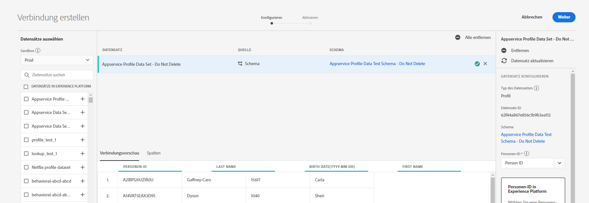
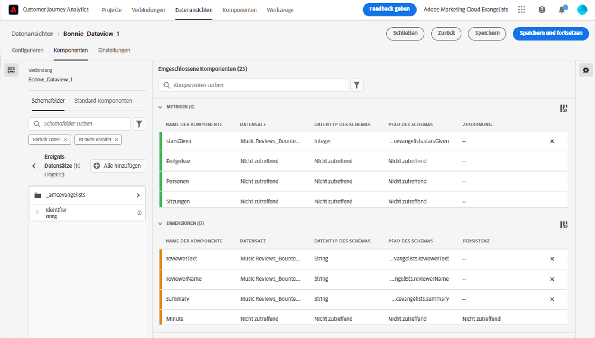
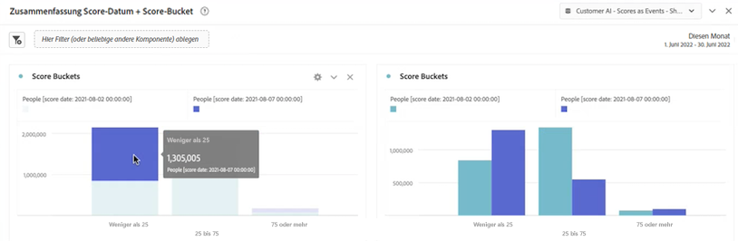
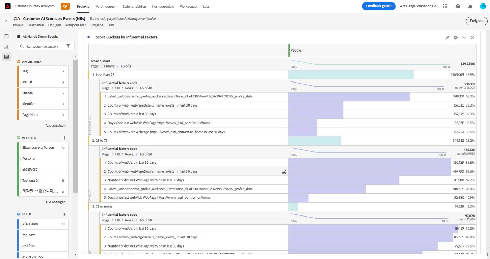
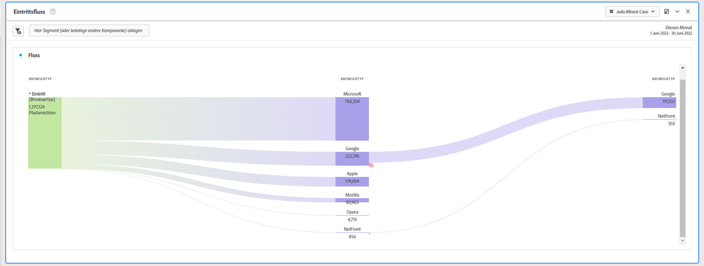
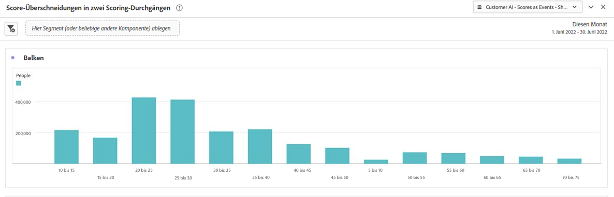
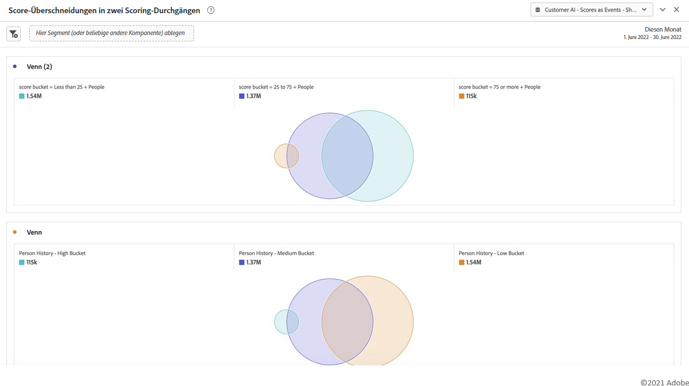

# Integrieren von Customer AI mit CJA

>[!NOTE]
>
>Diese Funktion wird am 25. Mai 2022 veröffentlicht.

[Customer AI](https://experienceleague.adobe.com/docs/experience-platform/intelligent-services/customer-ai/overview.html?lang=en)bietet als Teil von Adobe Experience Platform Intelligent Services Marketing-Experten die Möglichkeit, Kundenprognosen auf individueller Ebene zu generieren.

Mithilfe von Einflussfaktoren kann Customer AI vorhersagen, was ein Kunde wahrscheinlich tun wird und warum. Darüber hinaus können Marketing-Experten von Prognosen und Einblicken durch Customer AI profitieren, um Kundenerlebnisse durch Bereitstellung der am besten geeigneten Angebote und Botschaften zu personalisieren.

Customer AI stützt sich bei der Tendenzauswertung auf individuelle Verhaltensdaten und Profildaten. Customer AI ist insofern flexibel, als es mehrere Datenquellen aufnehmen kann, einschließlich Adobe Analytics, Adobe Audience Manager, Kundenerlebnis-Ereignisdaten und Erlebnisereignisdaten. Wenn Sie den AEP-Data Connector verwenden, um Adobe Audience Manager- und Adobe Analytics-Daten einzubringen, übernimmt das Modell automatisch die standardmäßigen Ereignistypen, um das Modell zu trainieren und zu bewerten. Wenn Sie Ihren eigenen Erlebnisereignis-Datensatz ohne standardmäßige Ereignistypen einfügen, müssen alle relevanten Felder als benutzerdefinierte Ereignisse oder Profilattribute zugeordnet werden, wenn Sie ihn im Modell verwenden möchten. Dies kann im Konfigurationsschritt Customer AI erfolgen. &#x200B;

Customer AI kann in Customer Journey Analytics (CJA) integriert werden, soweit für Customer AI aktivierte Datensätze in Datenansichten und Berichten in CJA genutzt werden können. Mit dieser Integration können Sie

* **Tendenzwerte für ein Segment von Benutzern im Zeitverlauf verfolgen**. Anwendungsbeispiel: Wie hoch ist die Wahrscheinlichkeit, dass ein Hotelkunde ein Showticket am Konzertplatz des Hotels kauft?
* **Analysieren, welche Erfolgsereignisse oder Attribute mit Tendenzwerten verknüpft sind**. &#x200B;Anwendungsbeispiel: Ich möchte die Attribute oder Erfolgsereignisse verstehen, die mit Tendenzwerten verknüpft sind.
* **Folgen Sie dem Einstiegsfluss für die Neigung von Kunden zu verschiedenen Scoring-Läufen.**. Anwendungsbeispiel: Ich möchte Menschen verstehen, die anfangs wenig Neigung hatten und im Laufe der Zeit zu Nutzern mit hoher Neigung wurden. &#x200B;
* **Die Verteilung der Neigung**. Anwendungsfall: Ich möchte die Verteilung der Tendenzwerte auf meine Segmente verstehen. &#x200B;Beispiel: Ein Einzelhändler möchte eine spezifische Promotion für 50 US-Dollar pro Produkt durchführen.  Sie möchten möglicherweise nur eine sehr begrenzte Promotion durchführen, die auf Budget zurückzuführen ist, usw. Sie analysieren die Daten und entscheiden, nur die 80 %+ &#x200B; ihrer Kunden als Ziel festzulegen.
* **Betrachten Sie die Tendenz, im Laufe der Zeit eine Aktion für eine bestimmte Kohorte durchzuführen.**. Anwendungsfall: Ich möchte eine bestimmte Kohorte im Laufe der Zeit verfolgen. Dies ähnelt der ersten, Sie können jedoch eine bestimmte Kohorte im Laufe der Zeit verfolgen&#x200B; Beispiel für Gastgewerbe: Ein Marketingexperte kann seine Bronzestufe im Laufe der Zeit im Vergleich zu ihrer Silberstufe oder der Silberstufe im Vergleich zu ihrer Goldstufe nachverfolgen. Dann können sie die Neigung jeder Kohorte sehen, das Hotel im Laufe der Zeit zu buchen. &#x200B;

## Workflow

Einige der Schritte werden in Adobe Experience Platform ausgeführt, bevor Sie mit der Ausgabe in CJA arbeiten.

### Schritt 1: Konfigurieren einer Customer AI-Instanz

Nachdem Sie Ihre Daten vorbereitet und alle Ihre Anmeldedaten und Schemata eingerichtet haben, führen Sie die folgenden Schritte aus: [Konfigurieren einer Customer AI-Instanz](https://experienceleague.adobe.com/docs/experience-platform/intelligent-services/customer-ai/user-guide/configure.html?lang=en) Handbuch.

### Schritt 2: Einrichten einer CJA-Verbindung zu Customer AI-Datensätzen

In Customer Journey Analytics können Sie jetzt [eine oder mehrere Verbindungen erstellen](/help/connections/create-connection.md) in Experience Platform von Datensätzen, die für Customer AI instrumentiert wurden. Jede Prognose, z. B. &quot;Wahrscheinlichkeit einer Aktualisierung des Kontos&quot;, entspricht einem Datensatz. Diese Datensätze werden mit dem Präfix &quot;Customer AI Scores&quot;angezeigt, wie im folgenden Beispiel:

Hier ist ein Beispiel für ein XDM-Schema, das CJA als Teil eines vorhandenen oder neuen Datensatzes einbringen würde:

(Beachten Sie, dass das Beispiel ein Profildatensatz ist. derselbe Satz von Schemaobjekten wäre Teil eines Erlebnisereignis-Datensatzes, den CJA erfassen würde. Der Datensatz &quot;Erlebnisereignis&quot;würde Zeitstempel als Bewertungsdatum enthalten.) Jeder Kunde, der in diesem Modell bewertet wird, hätte eine Punktzahl, ein score-Datum usw. zugeordnet werden.

### Schritt 3: Erstellen von Datenansichten basierend auf diesen Verbindungen

In Customer Journey Analytics können Sie jetzt mit [Datenansichten erstellen](/help/data-views/create-dataview.md) mit den Dimensionen (z. B. Bewertung, Bewertungsdatum, Wahrscheinlichkeit usw.) und Metriken, die als Teil der von Ihnen eingerichteten Verbindung eingebunden wurden.

### Schritt 4: Bericht zu CAI-Werten in Workspace

In CJA Workspace können Sie jetzt ein neues Projekt erstellen und Visualisierungen abrufen.

Im Folgenden finden Sie ein Beispiel für ein Workspace-Projekt mit CAI-Daten, &#x200B; in einem gestapelten Balkendiagramm Trends für Tendenzwerte für ein Benutzersegment im Zeitverlauf:

In der folgenden Tabelle finden Sie die Gründe für die Verwendung von &#x200B; für ein Segment mit hoher oder niedriger Neigung:

Dieses Flussdiagramm zeigt den Einstiegsfluss für die Neigung von Kunden zu verschiedenen Scoring-Läufen &#x200B;:

Dieses Balkendiagramm zeigt die Verteilung der Tendenzwerte &#x200B;:

Dieses Venn-Diagramm zeigt die Tendenzüberschneidungen bei verschiedenen Scoring-Läufen:

