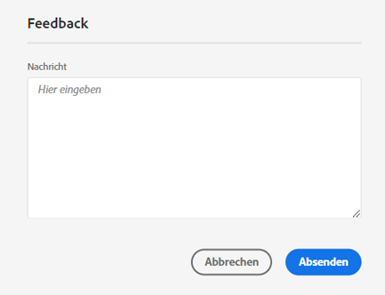
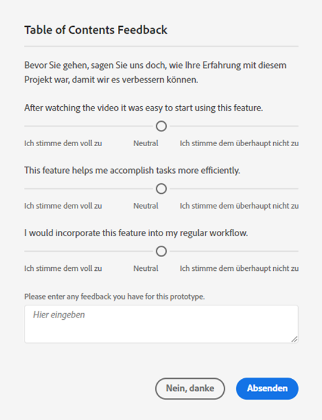

# [!UICONTROL Labs]-Benutzerhandbuch

>[!NOTE]
>
>Diese Funktion ist derzeit in [begrenzte Tests](/help/release-notes/releases.md).

[!UICONTROL Labs] ermöglicht eine schnellere Prototypisierung von Ideen in der Frühphase. Es handelt sich dabei um eine Kombination von Werkzeugen und Prozessen, die die Entwicklung transparent und kundenorientiert beschleunigt. Es ermöglicht es Benutzern, sich mit neuen Technologien zu beschäftigen, wertvolle Einblicke zu erhalten und die Entwicklung künftiger Funktionen und Prioritäten zu beeinflussen. Sie können Labs verwenden, um frühzeitigen Zugriff auf Customer Journey Analytics-Innovationen (CJA) zu erhalten und zukünftige Funktionen im Rahmen Ihrer eigenen geschäftlichen Anwendungsfälle und Daten zu bewerten.

## Voraussetzungen

[!UICONTROL Labs] wird automatisch für alle Administratoren aktiviert. Andere Teammitglieder sollten sich an ihre Produktadministratoren wenden und Zugriff anfordern.

Wenn Sie dies noch nicht getan haben, lesen und unterzeichnen Sie die entsprechenden Vordrucke der Geheimhaltungsvereinbarung und der Geschäftsbedingungen.

## Zugriff auf das [!UICONTROL Labs]-Portal

So greifen Sie auf [!UICONTROL Labs] zu:

1. Wenn Sie noch keinen Zugriff auf [!UICONTROL Workspace] und [!UICONTROL Labs] haben, bitten Sie Ihren Administrator um Berechtigungen.

1. Klicken Sie in CJA auf die **[!UICONTROL Labs]** Registerkarte.

## Prototyp bewerten

So starten und bewerten Sie einen Prototyp:

1. Klicken Sie auf dem Bildschirm [!UICONTROL Labs] auf die Schaltfläche **[!UICONTROL Starten]** des Prototyps, den Sie sehen möchten. Wenn der Prototyp gestartet wird, sehen Sie seinen Namen oben links in der Prototypumgebung.

   Screenshot hier hinzufügen

1. Sehen Sie sich ein Video an, in dem der Prototyp hervorgehoben wird, indem Sie rechts oben auf dem Bildschirm auf **[!UICONTROL Video ansehen]** klicken. Klicken Sie nach Abschluss des Videos auf **[!UICONTROL Schließen]**.

   Screenshot hier hinzufügen

1. Arbeiten Sie mit dem Prototyp. Beim Arbeiten in der Prototypumgebung:

* In der Prototypumgebung erstellte Projekte können nicht gespeichert oder freigegeben werden.

* In einem Prototyp können Sie die Daten mit allen Dimensionen, Metriken, Segmenten und Visualisierungen auswerten, auf die Sie sonst in Workspace zugreifen können.

* Änderungen, die Sie in einem Prototyp vornehmen, wirken sich nicht auf die Datenerfassung oder -verarbeitung aus.

* Änderungen, die durch Erstellung oder Änderung von Segmenten, berechneten Metriken und Warnhinweisen vorgenommen werden, bleiben außerhalb der Prototypumgebung erhalten.

## Feedback hinterlassen

1. Klicken Sie auf **[!UICONTROL Feedback geben]**, um bei der Arbeit mit dem Prototyp jederzeit Feedback im Nachrichtenfeld einzugeben.

   

1. Klicken Sie auf **[!UICONTROL Senden]**, um Ihr Feedback zu übermitteln.

1. Wenn Sie einen anderen Prototyp testen oder die Prototypumgebung verlassen möchten, klicken Sie oben rechts im Bildschirm auf **[!UICONTROL Prototyp verlassen]** und füllen Sie die kurze Umfrage zum Prototyp aus. Änderungen, die an einem Prototypprojekt vorgenommen wurden, gehen beim Verlassen der Prototypumgebung verloren.

   

1. Klicken Sie auf **[!UICONTROL Senden]**, um zum Hauptportal „Vorschau“ zurückzukehren.

## CJA Labs-Prototypen

* Ursprüngliche Spracheinblicke: Bietet eine natürliche Zusammenfassung aller Daten, die Sie in einer Freiformtabelle analysieren.
* Visualisierungsempfehlung: Empfiehlt Visualisierungen, die sich gut mit Ihren Daten verbinden.

## Zusätzliche Informationen

* Einige Prototypen in [!UICONTROL Labs] Customer Journey Analytics-Features werden, andere nicht. Ihr Feedback trägt zur Entscheidung bei. Prüfen Sie daher die Prototypen und teilen Sie Adobe mit, wie nützlich Sie sie finden.
* Labs steht allen SKU-Berechtigungen zur Verfügung.
