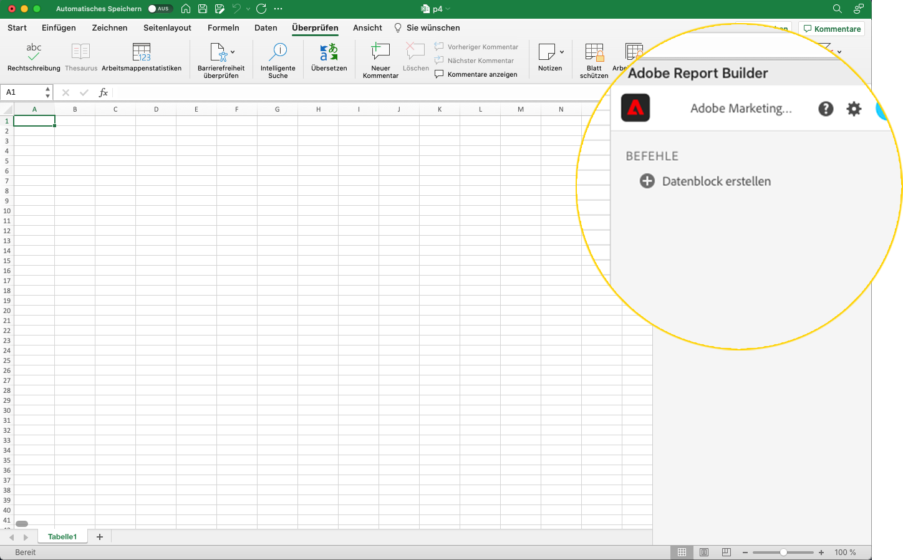
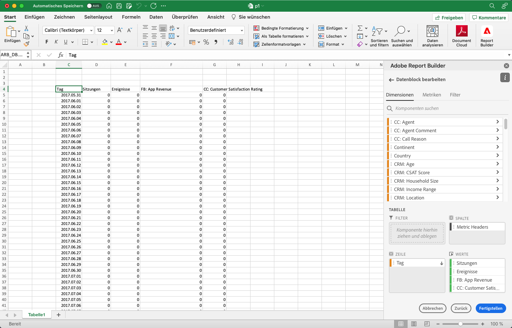
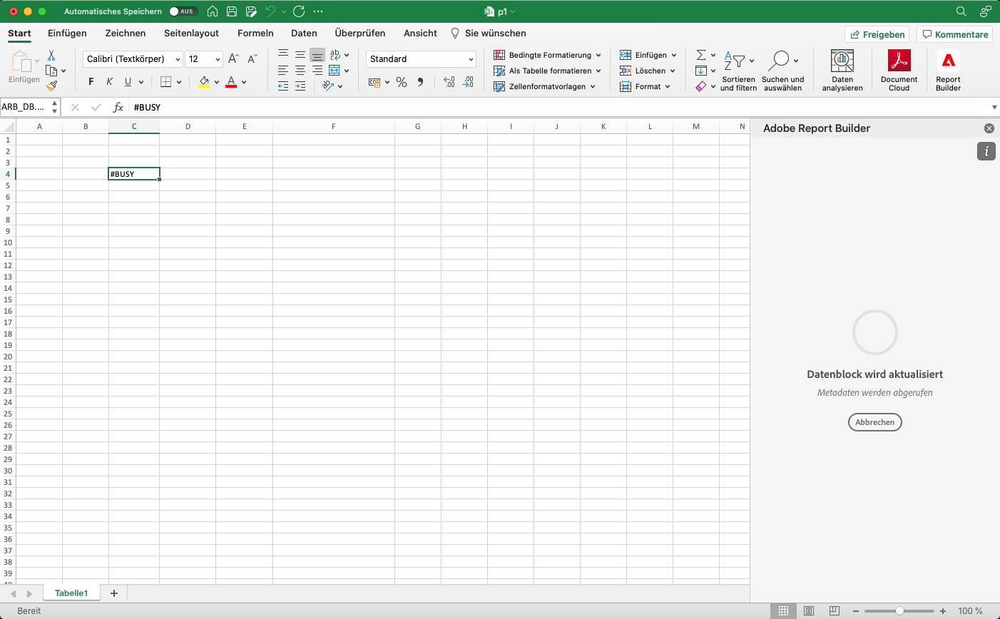
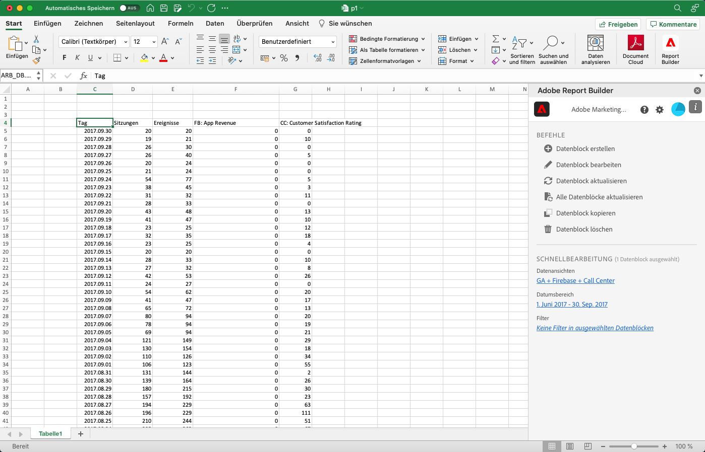

# Datenblock erstellen

Ein *Datenblock* ist die Datentabelle, die von einer einzelnen Datenanforderung erstellt wird. Eine Report Builder-Arbeitsmappe kann mehrere Datenblöcke enthalten. Wenn Sie einen Datenblock erstellen, konfigurieren Sie ihn zunächst und erstellen Sie dann den Build.

## Datenblock konfigurieren

Konfigurieren Sie die anfänglichen Datenblockparameter für die Position des Datenblocks, die Datenansichten und einen Datumsbereich.

1. Klicken Sie auf **Datenblock erstellen**.

   

1. Legen Sie den **Speicherort des Datenblocks** fest.

   Die Option „Datenblock-Speicherort“ definiert den Speicherort des Arbeitsblatts, an dem Report Builder die Daten zu Ihrem Arbeitsblatt hinzufügt.

   Um den Speicherort des Datenblocks anzugeben, wählen Sie eine einzelne Zelle im Arbeitsblatt aus oder geben Sie eine Zellenadresse ein, z. B. a3, \\\$a3, a\\\$3 oder sheet1!a2. Die angegebene Zelle ist die obere linke Ecke des Datenblocks, wenn die Daten abgerufen werden.

1. Wählen Sie die **Datenansichten** aus.

   Mit der Option „Datenansichten“ können Sie eine Datenansicht aus einem Dropdown-Menü auswählen oder auf eine Datenansicht aus einer Zellenposition verweisen.

1. Legen Sie den **Datumsbereich** fest.

   Mit der Option „Datumsbereich“ können Sie einen Datumsbereich auswählen. Datumsbereiche können fest oder rollierend sein. Weitere Informationen zu den Datumsbereichsoptionen finden Sie unter [Einen Datumsbereich auswählen](select-date-range.md).

1. Klicken Sie auf **Weiter**.

   

   Nach der Konfiguration des Datenblocks können Sie Dimensionen, Metriken und Filter auswählen, um Ihren Datenblock zu erstellen. Die Registerkarten „Dimensionen“, „Metriken“ und „Filter“ werden über dem Bereich „Tabellen-Builder“ angezeigt.
<!--
    
  -->

## Datenblock erstellen

Um den Datenblock zu erstellen, wählen Sie Berichtkomponenten aus und passen Sie dann das Layout an.

1. Fügen Sie Dimensionen, Metriken und Filter hinzu.

   Scrollen Sie in den Komponentenlisten oder verwenden Sie das Feld **Suchen**, um Komponenten zu finden. Ziehen Sie Komponenten per Drag &amp; Drop in den Tabellenbereich oder doppelklicken Sie auf einen Komponentennamen in der Liste, um die Komponente automatisch zum Tabellenbereich hinzuzufügen.

   Doppelklicken Sie auf eine Komponente, um sie einem Standardabschnitt der Tabelle hinzuzufügen.

   - Dimensionskomponenten werden zum Bereich „Zeile“ oder zum Bereich „Spalte“ hinzugefügt, wenn bereits eine Dimension in den Spalten vorhanden ist.
   - Datumskomponenten werden dem Abschnitt „Spalte“ hinzugefügt.
   - Filterkomponenten werden dem Abschnitt „Filter“ hinzugefügt.

1. Ordnen Sie die Elemente im Tabellenbereich an, um das Layout Ihres Datenblocks anzupassen.

   Ziehen Sie Komponenten per Drag &amp; Drop in den Tabellenbereich, um sie neu anzuordnen, oder klicken Sie mit der rechten Maustaste auf einen Komponentennamen und wählen Sie im Optionsmenü die Option aus.

   Wenn Sie Komponenten zur Tabelle hinzufügen, wird eine Vorschau des Datenblocks an der Stelle des Datenblocks im Arbeitsblatt angezeigt. Das Layout der Datenblock-Vorschau wird automatisch aktualisiert, wenn Sie in der Tabelle Elemente hinzufügen, verschieben oder entfernen.

   

1. Klicken Sie auf **Beenden**.

   Eine Verarbeitungsmeldung wird angezeigt, während die Analysedaten abgerufen werden.

   

   Report Builder ruft die Daten ab und zeigt den abgeschlossenen Datenblock im Arbeitsblatt an.

   
