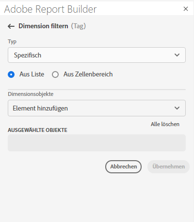
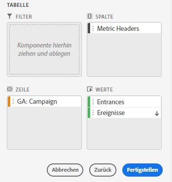
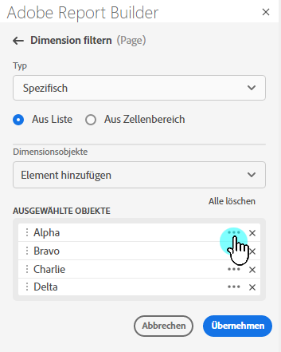
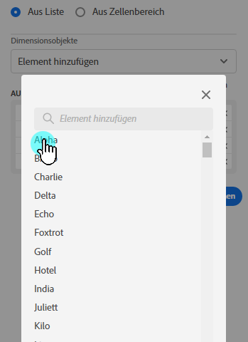
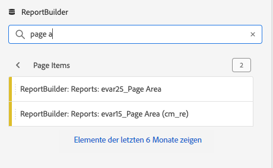
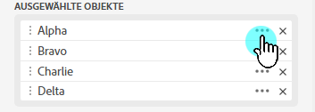
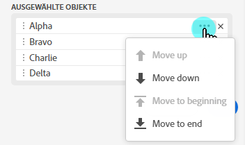
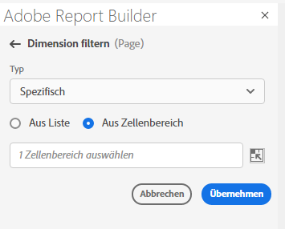
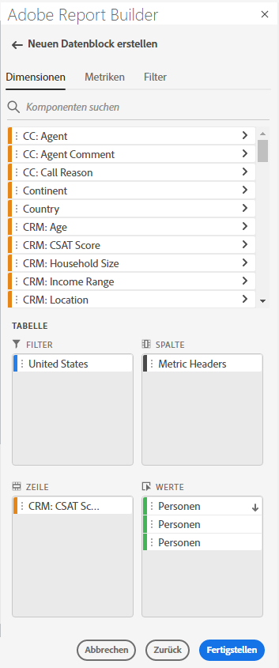

# Dimensionen filtern

Standardmäßig gibt jedes Dimensionselement in der Tabelle die 10 wichtigsten Elemente für diese Dimension zurück.

So ändern Sie die für jede Dimension zurückgegebenen Dimensionselemente

1. Wählen Sie einen Datenblock aus und klicken Sie im Bedienfeld „Befehle“ auf „Datenblock bearbeiten“.

1. Klicken Sie auf „Weiter“, um die Registerkarte „Dimensionen“ anzuzeigen.

1. Klicken Sie auf das Symbol **...** neben einem Komponentennamen in der Tabelle.

   

1. Wählen Sie **Filterdimension** im Popup-Menü aus, um den Bereich **Filterdimension** anzuzeigen.

1. Wählen Sie **Am beliebtesten** oder **Spezifisch**.

   

1. Wählen Sie je nach ausgewähltem Filtertyp die gewünschten Optionen aus.

1. Klicken Sie auf **Anwenden**, um den Filter hinzuzufügen.

   Report Builder zeigt eine Benachrichtigung zur Bestätigung des hinzugefügten Filters an.

Um angewendete Filter anzuzeigen, bewegen Sie den Mauszeiger über eine Dimension. Dimensionen mit angewendeten Filtern zeigen rechts neben dem Namen der Dimension ein Filtersymbol an.

## Filtertyp

Es gibt zwei Möglichkeiten, Dimensionselemente zu filtern: „Am beliebtesten“ und „Spezifisch“.

## Am beliebtesten

Mit der Option „Am beliebtesten“ können Sie Dimensionselemente basierend auf Metrikwerten dynamisch filtern. Die beliebteste Filterung gibt die am höchsten bewerteten Dimensionselemente basierend auf Metrikwerten zurück. Standardmäßig werden die ersten 10 Dimensionselemente aufgelistet, sortiert nach der ersten Metrik, die zum Datenblock hinzugefügt wurde.

### Seiten- und Zeilenoptionen

Verwenden Sie die Felder **Seite** und **Zeilen**, um Daten in sequenzielle Gruppen oder Seiten zu unterteilen. Auf diese Weise können Sie andere Rangzeilenwerte als die höchsten Werte in Ihren Bericht ziehen. Diese Funktion ist besonders nützlich, um Daten über die Zeilenbegrenzung von 50.000 hinaus abzurufen.

#### Standardeinstellungen für Seite und Zeilen

- Seite = 1
- Zeilen = 10

Die Standardeinstellungen für Seite und Zeilen geben an, dass jede Seite 10 Datenzeilen enthält. Seite 1 gibt die 10 wichtigsten Elemente zurück, Seite 2 die nächsten 10 Elemente usw.

In der folgenden Tabelle finden Sie Beispiele für Seiten- und Zeilenwerte sowie die resultierende Ausgabe.

| Seite | Zeile  | Ausgabe |
|------|--------|----------------------|
| 1 | 10 | Die 10 beliebtesten Elemente |
| 2 | 10 | Elemente 11-20 |
| 1 | 100 | Die 100 beliebtesten Elemente |
| 2 | 100 | Elemente 101-200 |
| 2 | 50.000 | Elemente 50.001-100.000 |

#### Mindest- und Höchstwerte

- Startseite: Min. = 1, Max.: 50 Mio.
- Anzahl Zeilen: Min. = 1, Max.: 50.000

### „Kein Wert“ einschließen

In Customer Journey Analytics sammeln einige Dimensionen den Eintrag „kein Wert“. Mit diesem Filter können Sie diese Werte aus Berichten ausschließen. Sie können beispielsweise eine Klassifizierung wie die Klassifizierung „Produktname“ basierend auf dem Produkt-SKU-Schlüssel erstellen. Wenn eine bestimmte Produkt-SKU nicht mit ihrer spezifischen Produktnamenklassifizierung eingerichtet wurde, wird der Produktnamenwert auf „kein Wert“ gesetzt.

Einschließen von „**Kein Wert**“ ist standardmäßig ausgewählt. Deaktivieren Sie diese Option, um Einträge ohne Wert auszuschließen.

### Nach Kriterien filtern

Sie können Dimensionselemente danach filtern, ob alle Kriterien erfüllt sind oder ob überhaupt Kriterium erfüllt ist.

So legen Sie Filterkriterien fest

1. Wählen Sie einen aus der Dropdownliste „Operator“ aus.

   

1. Geben Sie einen Wert in das Suchfeld ein.

1. Klicken Sie auf „Zeile hinzufügen“, um die Auswahl zu bestätigen und ein weiteres Kriterienelement hinzuzufügen.

1. Klicken Sie auf das Löschsymbol, um ein Kriterienelement zu entfernen.

   Sie können bis zu 10 Kriterienelemente einbeziehen.

### Filter und Sortierreihenfolge ändern

Neben der Metrik zum Filtern und Sortieren des Datenblocks wird ein Pfeil angezeigt. Die Pfeilrichtung gibt an, ob die Metrik am größten > am wenigsten oder am wenigsten > am größten sortiert wird.

Um die Sortierrichtung zu ändern, klicken Sie auf den Pfeil neben der Metrik. 

So ändern Sie die zum Filtern und Sortieren des Datenblocks verwendete Metrik:

1. Bewegen Sie den Mauszeiger über die gewünschte Metrikkomponente im Tabellen-Builder, um zusätzliche Optionen anzuzeigen.

2. Klicken Sie auf den Pfeil der gewünschten Metrik. 

   

## Spezifische Filter

Mit der Option „Spezifisch“ können Sie für jede Dimension eine feste Liste von Dimensionselementen erstellen. Verwenden Sie den Filtertyp **Spezifisch**, um die genauen Dimensionselemente anzugeben, die in Ihren Filter aufgenommen werden sollen. Sie können Elemente aus einer Liste oder aus einem Zellenbereich auswählen.

### Aus Liste

1. Wählen Sie die Option **Aus Liste** aus, um nach Dimensionselementen zu suchen und diese auszuwählen.

   Wenn Sie die Option **Aus Liste** auswählen, wird die Liste mit Dimensionselementen gefüllt, wobei die meisten Ereignisse zuerst auftreten.

   

   Die Liste **Verfügbare Elemente** wird von Dimensionselementen mit den meisten Ereignissen zu den Elementen mit den geringsten Werten sortiert.

1. Geben Sie einen Suchbegriff in das Feld **Element hinzufügen** ein, um die Liste zu durchsuchen.

1. Um nach einem Element zu suchen, das in den letzten 90 Tagen nicht enthalten war, klicken Sie auf **Elemente für die letzten 6 Monate anzeigen**, um die Suche zu erweitern.

   

   Wenn die Daten der letzten sechs Monate geladen sind, aktualisiert Report Builder den Link zu **Elemente für die letzten 18 Monate anzeigen**.

1. Wählen Sie ein Dimensionselement aus.

   Ausgewählte Dimensionselemente werden automatisch zur Liste **Ausgewählte Elemente** hinzugefügt.

   

   Um ein Element aus der Liste zu löschen, klicken Sie auf das Löschsymbol, um das Element aus der Liste zu entfernen.

   Um ein Element in der Liste zu verschieben, ziehen Sie es per Drag &amp; Drop oder klicken Sie auf „…“, um das Menü zum Verschieben anzuzeigen.

   

1. Klicken Sie auf **Anwenden**

   Report Builder aktualisiert die Liste, um die angewendeten spezifischen Filter anzuzeigen.

### Aus Zellenbereich

Wählen Sie die Option **Aus Zellenbereich** aus, um einen Zellenbereich auszuwählen, der die Liste der abzugleichenden Dimensionselemente enthält.

Beachten Sie bei der Auswahl eines Zellenbereichs die folgenden Einschränkungen:

- Der Bereich muss über mindestens eine Zelle verfügen.
- Der Bereich kann nicht mehr als 50.000 Zellen umfassen.
- Der Bereich muss sich in einer einzigen unterbrechungsfreien Zeile oder Spalte befinden.

Ihre Auswahl kann leere Zellen oder Zellen mit Werten enthalten, die nicht mit einem bestimmten Dimensionselement übereinstimmen.

### Auf der Registerkarte „Dimensionen“ im Tabellen-Builder

Klicken Sie auf der Registerkarte **Dimensionen** auf das Pfeilsymbol neben einem Dimensionsnamen, um die Liste der Dimensionselemente anzuzeigen.

Sie können Elemente per Drag &amp; Drop in die **Tabelle** ziehen oder auf einen Elementnamen doppelklicken, um ihn zum **Tabellen**-Builder hinzuzufügen.
