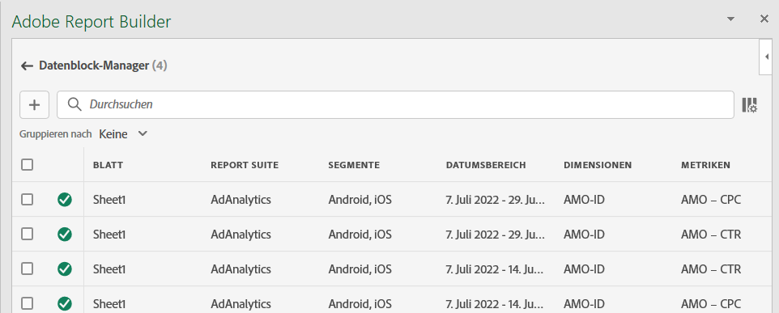
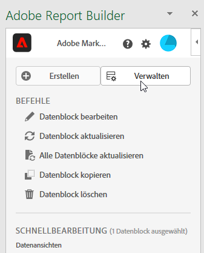
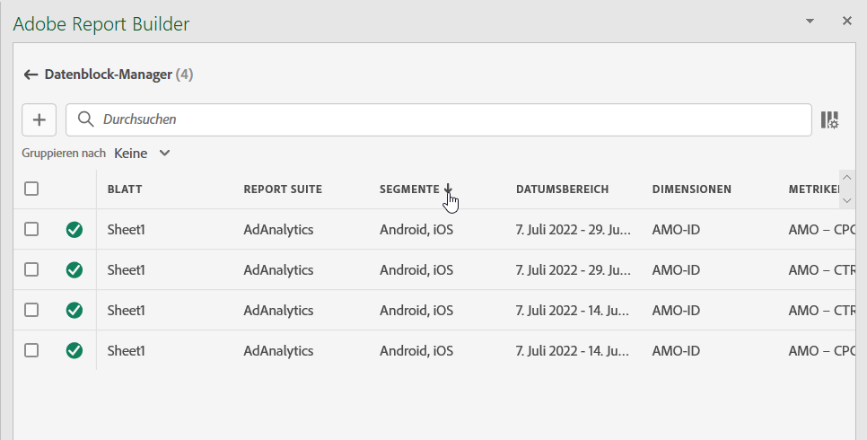
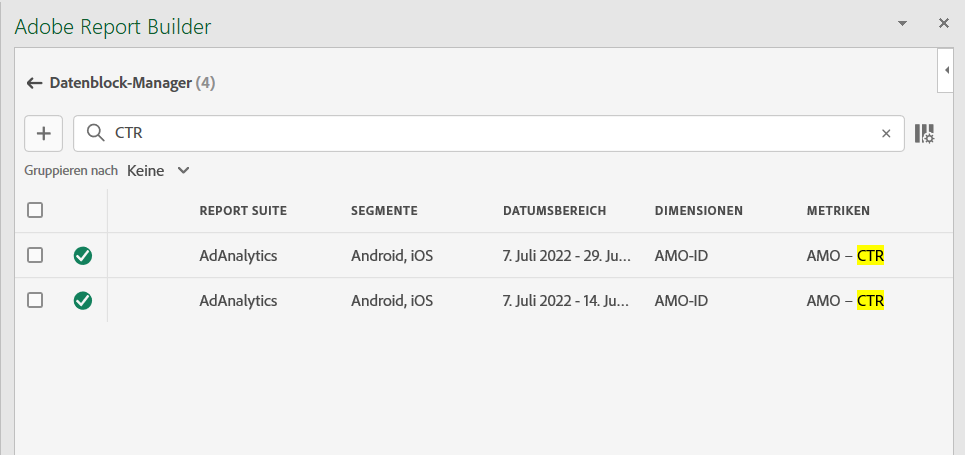
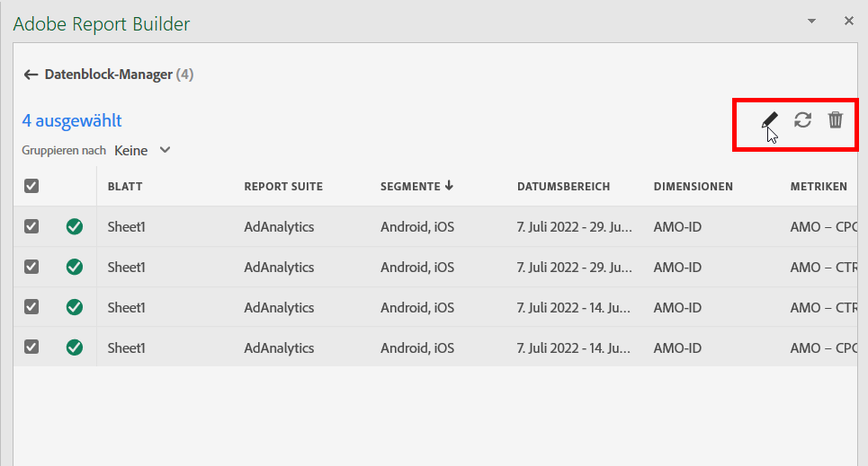
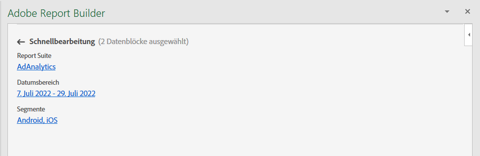
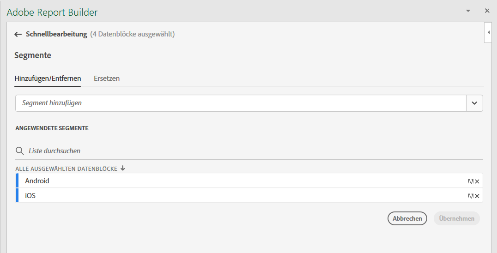
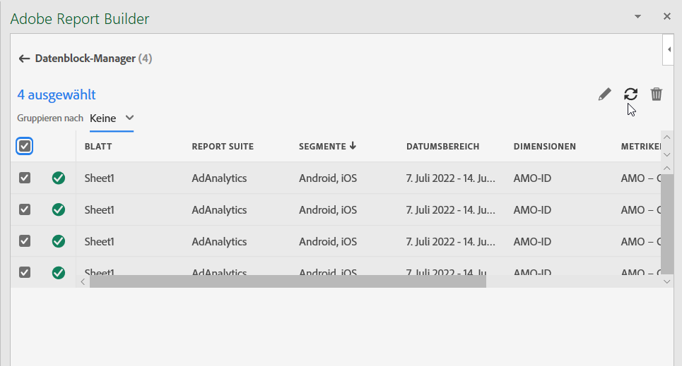
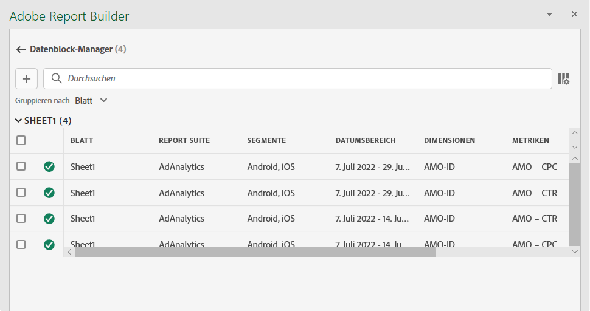
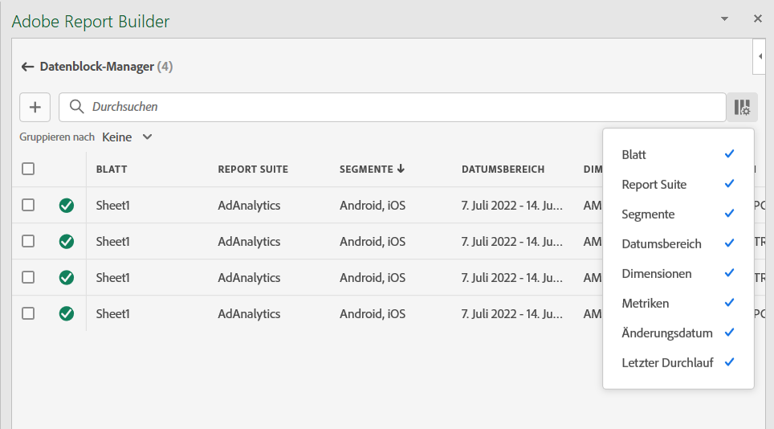

# Verwalten von Datenblöcken in Report Builder

Mit dem Datenblock-Manager können Sie alle Datenblöcke einer Arbeitsmappe anzeigen und verwalten. Der Datenblock-Manager bietet Such-, Filter- und Sortierfunktionen, mit denen Sie bestimmte Datenblöcke schnell finden können. Nach Auswahl eines oder mehrerer Datenblöcke können Sie diese bearbeiten, löschen oder aktualisieren.

## Anzeigen von Datenblöcken

Klicken Sie auf **Verwalten**, um eine Liste aller Datenblöcke in einer Arbeitsmappe anzuzeigen.

Der Datenblock-Manager listet alle in einer Arbeitsmappe vorhandenen Datenblöcke auf. 

## Sortieren der Datenblockliste

Sie können die Datenblockliste nach einer angezeigten Spalte sortieren. Sie können die Datenblockliste beispielsweise nach Report Suites, Filtern, Datumsbereich und anderen Variablen sortieren.

Um die Datenblockliste zu sortieren, klicken Sie auf eine Spaltenüberschrift.

## Durchsuchen der Datenblockliste

Verwenden Sie das Suchfeld, um in der Datenblocktabelle eine Suche durchzuführen. Sie können beispielsweise nach Metriken suchen, die in den Datenblöcken oder in der Report Suite enthalten sind. Sie können auch nach Datumsangaben suchen, die in den Spalten „Datumsbereich“, „Änderungsdatum“ oder „Datum des letzten Durchgang“ angezeigt werden.

## Bearbeiten von Datenblöcken

Sie können die Datenansicht, den Datumsbereich oder die auf einen oder mehrere Datenblöcke angewendeten Filter bearbeiten.

Beispielsweise können Sie einen vorhandenen Filter in einem oder mehreren Datenblöcken durch einen neuen Filter ersetzen.

1. Wählen Sie die zu aktualisierenden Datenblöcke aus. Sie können das Kontrollkästchen auf der obersten Ebene aktivieren, um alle Datenblöcke auszuwählen. Sie können aber auch einzelne Datenblöcke auswählen.

   

1. Klicken Sie auf das Bearbeitungssymbol, um das Fenster „Schnellbearbeitung“ anzuzeigen.

   

1. Wählen Sie einen Filter-Link aus, um Datenansichten, Datumsbereiche oder Filter zu aktualisieren.

   

## Aktualisieren von Datenblöcken

Klicken Sie auf das Aktualisierungssymbol, um die Datenblöcke in der Liste zu aktualisieren.

Um zu überprüfen, ob ein Datenblock aktualisiert wurde, rufen Sie das Aktualisierungsstatus-Symbol auf. Ein Häkchen in einem grünen Kreis  gibt an, dass die Aktualisierung des Datenblocks erfolgreich war. Bei einem Datenblock, der nicht aktualisiert werden konnte, wird das Warnsymbol  angezeigt.  Dadurch lässt sich leicht erkennen, ob Datenblöcke Fehler aufweisen.

## Löschen von Datenblöcken

Klicken Sie auf das Papierkorbsymbol, um einen ausgewählten Datenblock zu löschen.

## Gruppieren von Datenblöcken

Sie können Datenblöcke mithilfe des Dropdown-Menüs **Gruppieren nach** gruppieren. Alternativ können Sie auch auf einen Spaltentitel klicken. Um Datenblöcke nach Spalten zu sortieren, klicken Sie auf den Spaltentitel. Um Datenblöcke nach Gruppen zu gruppieren, wählen Sie einen Gruppennamen aus dem Dropdown-Menü **Gruppieren nach** aus. Der folgende Screenshot zeigt ein Beispiel für nach Blatt gruppierte Datenblöcke. Darin sind Datenblöcke zu sehen, die nach Blatt 1 und Blatt 2 gruppiert sind.  Dies ist beispielsweise nützlich, wenn ein Anwendungsfall zum Ersetzen von Filtern ausgeführt werden soll. Wenn auf jeden Datenblock mehrere Filter angewendet werden, ist es hilfreich, eine Gruppe zu erstellen, die alle Datenblöcke enthält, die Sie ersetzen möchten. Dann können Sie sie einfach gemeinsam auswählen und alle gleichzeitig bearbeiten.

## Ändern der Ansicht von Datenblock-Manager

Sie können auswählen, welche Spalten im Fenster „Datenblock-Manager“ angezeigt werden sollen.

Klicken Sie auf das -Symbol der Spaltenliste, um auszuwählen, welche Spalten im Datenblock-Manager aufgeführt werden. Wählen Sie einen Spaltennamen aus, um die entsprechende Spalte anzuzeigen. Heben Sie die Auswahl des Spaltennamens auf, um die Spalte aus der Ansicht zu entfernen.

