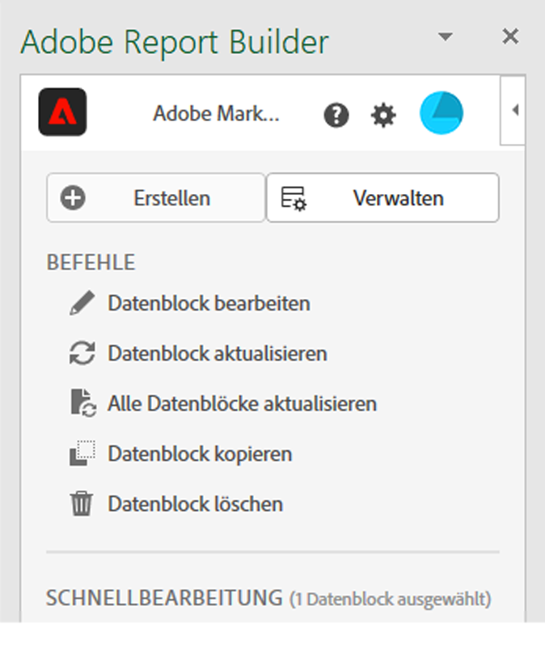
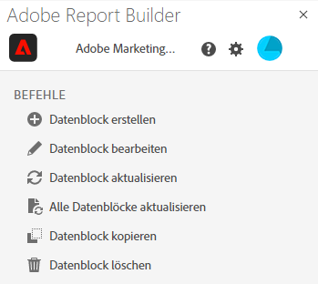
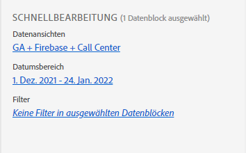
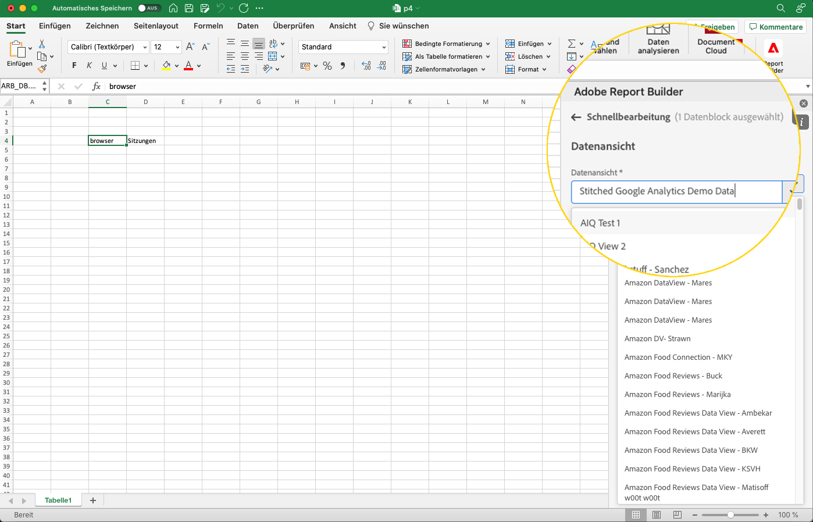

# Report Builder-Hub

Use the Report Builder hub to create, update, delete, and manage data blocks.

Der Report Builder-Hub enthält die Schaltflächen Erstellen und Verwalten , die Liste BEFEHLE und die Bedienfelder SCHNELLE BEARBEITUNG .




## Erstellen und Verwalten von Schaltflächen

Verwenden Sie die Schaltflächen Erstellen oder Verwalten , um neue Datenblöcke zu erstellen oder vorhandene Datenblöcke zu verwalten.

## Bedienfeld „Befehle“

Verwenden Sie das Bedienfeld „Befehle“, um auf Befehle zuzugreifen, die mit den ausgewählten Zellen oder einer vorherigen Aktion kompatibel sind.



### Befehle

| Angezeigte Befehle | Verfügbar wenn… | Zweck |
|------|------------------|--------|
| Datenblock erstellen | Eine oder mehrere Zellen sind in der Arbeitsmappe ausgewählt. | Dient zum Erstellen eines Datenblocks |
| Datenblock bearbeiten | Die ausgewählte Zelle bzw. der ausgewählte Zellenbereich ist nur Teil eines Datenblocks. | Dient zum Bearbeiten eines Datenblocks |
| Datenblock aktualisieren | Die Auswahl enthält mindestens einen Datenblock. Mit dem Befehl werden nur die Datenblöcke in der Auswahl aktualisiert. | Wird zum Aktualisieren eines oder mehrerer Datenblöcke verwendet |
| Alle Datenblöcke aktualisieren | Die Arbeitsmappe enthält einen oder mehrere Datenblöcke. | Wird zum Aktualisieren aller Datenblöcke in der Arbeitsmappe verwendet |
| Datenblock kopieren | Die ausgewählte Zelle oder der ausgewählte Zellbereich ist Teil eines oder mehrerer Datenblöcke. | Dient zum Kopieren eines Datenblocks |
| Datenblock löschen | Die ausgewählte Zelle bzw. der ausgewählte Zellenbereich ist nur Teil eines Datenblocks. | Dient zum Löschen eines Datenblocks |

## Bedienfeld „Schnellbearbeitung“

Wenn Sie einen oder mehrere Datenblöcke in einem Arbeitsblatt auswählen, zeigt Report Builder das Bedienfeld „Schnellbearbeitung“ an. Sie können das Bedienfeld „Schnellbearbeitung“ verwenden, um Parameter in einem Datenblock zu ändern oder Parameter in mehreren Datenblöcken gleichzeitig zu ändern.



Die mithilfe der Schnellbearbeitungs-Bereiche vorgenommenen Änderungen gelten für alle ausgewählten Datenblöcke.

### Datenansichten

Datenblöcke rufen Daten aus einer ausgewählten Datenansicht ab. Wenn mehrere Datenblöcke in einem Arbeitsblatt ausgewählt sind und sie keine Daten aus derselben Datenansicht abrufen, zeigt der Link für **Datenansichten** *Mehrere* an.

Wenn Sie die Datenansicht ändern, übernehmen alle Datenblöcke in der Auswahl die neue Datenansicht. Komponenten im Datenblock werden mit der neuen Datenansicht abgeglichen, die beispielsweise auf einer ID basiert, die mit ```evars``` übereinstimmt). Wenn eine Komponente nicht in einem Datenblock gefunden wird, wird eine Warnmeldung angezeigt und die Komponente wird aus dem Datenblock entfernt.

Um die Datenansicht zu ändern, wählen Sie eine neue Datenansicht aus dem Dropdown-Menü aus.



### Datumsbereich

**Datumsbereich** zeigt den Datumsbereich für die ausgewählten Datenblöcke an. Wenn mehrere Datenblöcke mit mehreren Datumsbereichen ausgewählt sind, zeigt der Link für **Datumsbereich** *Mehrere* an.

### Filter

Der Link für **Filter** zeigt eine zusammenfassende Liste der Filter an, die von den ausgewählten Datenblöcken verwendet werden. Wenn mehrere Datenblöcke mit mehreren angewendeten Filtern ausgewählt sind, zeigt der Link für **Filter** *Mehrere* an.
