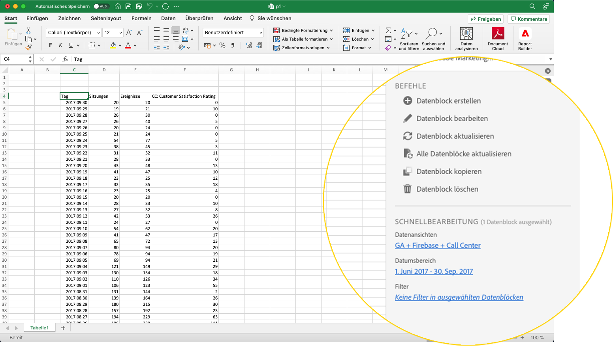

# Report Builder-Hub

Verwenden Sie den Report Builder-Hub, um Datenblöcke zu erstellen, zu aktualisieren oder zu löschen.

Der Report Builder-Hub enthält die Bedienfelder &quot;BEFEHLE&quot;und &quot;SCHNELL BEARBEITEN&quot;.



## Bedienfeld &quot;BEFEHLE&quot;

Verwenden Sie das Bedienfeld BEFEHLE , um auf Befehle zuzugreifen, die mit den ausgewählten Zellen oder einer vorherigen Aktion kompatibel sind.


### Befehle

| Angezeigte Befehle | Verfügbar ab ... | Zweck |
|------|------------------|--------|
| Datenblock erstellen | Eine oder mehrere Zellen sind in der Arbeitsmappe ausgewählt. | Dient zum Erstellen eines Datenblocks |
| Datenblock bearbeiten | Die ausgewählte Zelle bzw. der ausgewählte Zellenbereich ist nur Teil eines Datenblocks. | Dient zum Bearbeiten eines Datenblocks |
| Datenblock aktualisieren | Die Auswahl enthält mindestens einen Datenblock. Mit dem Befehl werden nur die Datenblöcke in der Auswahl aktualisiert. | Wird zum Aktualisieren eines oder mehrerer Datenblöcke verwendet |
| Alle Datenblöcke aktualisieren | Die Arbeitsmappe enthält einen oder mehrere Datenblöcke. | Wird zum Aktualisieren ALLER Datenblöcke in der Arbeitsmappe verwendet |
| Datenblock kopieren | Die ausgewählte Zelle oder der ausgewählte Zellbereich ist Teil eines oder mehrerer Datenblöcke. | Wird zum Kopieren eines Datenblocks verwendet |
| Datenblock löschen | Die ausgewählte Zelle bzw. der ausgewählte Zellenbereich ist nur Teil eines Datenblocks. | Wird zum Löschen eines Datenblocks verwendet |

## SCHNELLBEARBEITUNGSBEREICH

Wenn Sie einen oder mehrere Datenblöcke in einem Arbeitsblatt auswählen, zeigt Report Builder das Bedienfeld SCHNELLE BEARBEITUNG an. Sie können das Bedienfeld QUICK EDIT verwenden, um Parameter in einem Datenblock zu ändern oder Parameter in mehreren Datenblöcken gleichzeitig zu ändern.


Die mithilfe der Abschnitte Schnellbearbeitung vorgenommenen Änderungen gelten für alle ausgewählten Datenblöcke.

### Datenansichten

Datenblöcke rufen Daten aus einer ausgewählten Datenansicht ab. Wenn mehrere Datenblöcke in einem Arbeitsblatt ausgewählt sind und keine Daten aus derselben Datenansicht abgerufen werden, zeigt der Link **Datenansichten** *Mehrere* an.

Wenn Sie die Datenansicht ändern, übernehmen alle Datenblöcke in der Auswahl die neue Datenansicht. Komponenten im Datenblock werden basierend auf der ID mit der neuen Datenansicht abgeglichen, z. B. mit ```evars```. Wenn eine Komponente nicht in einem Datenblock gefunden wird, wird eine Warnmeldung angezeigt und die Komponente wird aus dem Datenblock entfernt.

Um die Datenansicht zu ändern, wählen Sie eine neue Datenansicht aus dem Dropdown-Menü aus.


### Datumsbereich

**Der Datumsbereich** zeigt den Datumsbereich für die ausgewählten Datenblöcke an. Wenn mehrere Datenblöcke mit mehreren Datumsbereichen ausgewählt sind, zeigt der Link **Datumsbereich** *Mehrere* an.

### Filter

Der Link **Filter** zeigt eine zusammenfassende Liste der Filter an, die von den ausgewählten Datenblöcken verwendet werden. Wenn mehrere Datenblöcke mit mehreren angewendeten Filtern ausgewählt sind, zeigt der Link **Filter** *Mehrere* an.
