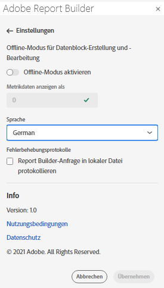
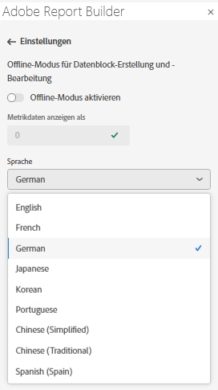

# Report Builder-Einstellungen

Verwenden Sie den Bereich **Einstellungen** , um Einstellungen auf Anwendungsebene zu konfigurieren, z. B. die von der Benutzeroberfläche angezeigte Sprache oder ob sie im Offline-Modus funktionieren soll oder nicht. Die Einstellungen werden sofort angewendet und für alle zukünftigen Sitzungen festgelegt, bis sie geändert werden.

So ändern Sie die Report Builder-Einstellungen

1. Klicken Sie auf das Symbol **Einstellungen**.

1. Nehmen Sie Änderungen am Offline-Modus vor, wählen Sie eine Sprache aus oder aktivieren Sie die Protokolleinstellungen für die Fehlerbehebung .

1. Klicken Sie auf **Übernehmen**.

   

## Offline-Modus

Beim Erstellen und Bearbeiten eines Datenblocks im Offline-Modus werden keine Daten abgerufen. Stattdessen werden Simulationsdaten verwendet, damit Sie schnell einen Datenblock erstellen und bearbeiten können, ohne auf die Ausführung der Anfrage warten zu müssen. Wenn Sie wieder online sind, aktualisiert der Befehl *Datenblock aktualisieren* oder *Alle Datenblöcke aktualisieren* die von Ihnen erstellten Datenblöcke mit den tatsächlichen Daten.

So aktivieren Sie den Offline-Modus

1. Klicken Sie auf das Symbol **Einstellungen**.

1. Wählen Sie **Offline-Modus aktivieren** aus.

1. Geben Sie eine positive Ganzzahl in das Feld **Metrikdaten anzeigen als** ein.

1. Klicken Sie auf **Übernehmen**.

## Sprache

Sie können die Sprache für die Benutzeroberfläche des Report Builders auswählen. Alle unterstützten Adobe Analytics-Sprachen sind verfügbar.

So wählen Sie die in der Benutzeroberfläche von Report Builder verwendete Sprache aus

1. Klicken Sie auf Einstellungen.

1. Wählen Sie eine Sprache aus dem Dropdown-Menü **Sprache** aus.

   

1. Klicken Sie auf **Übernehmen.**

## Fehlerbehebung

Verwenden Sie die Einstellung Fehlerbehebung , um alle Client-/Server-Daten in einer lokalen Datei zu protokollieren. Verwenden Sie diese Option, um Support-Tickets zu lösen.

Um die Option &quot;Fehlerbehebung&quot;zu aktivieren, wählen Sie **Report Builder-Anforderung in lokale Datei protokollieren** aus.
