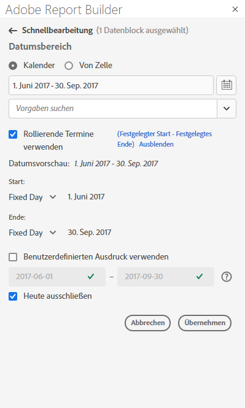
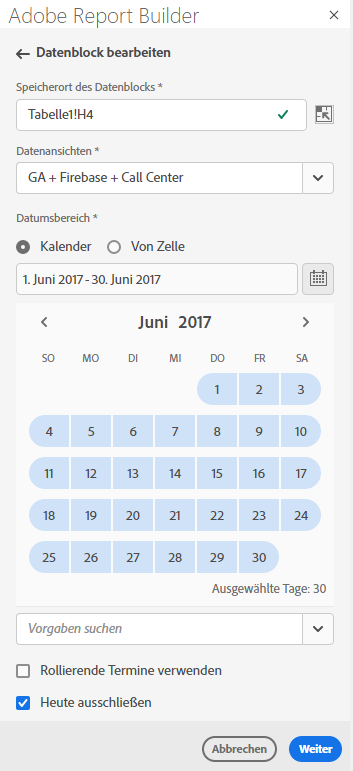
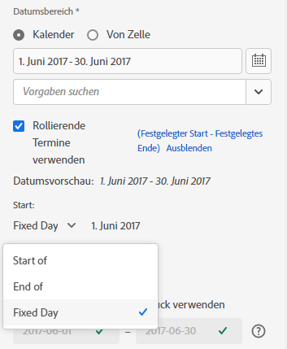
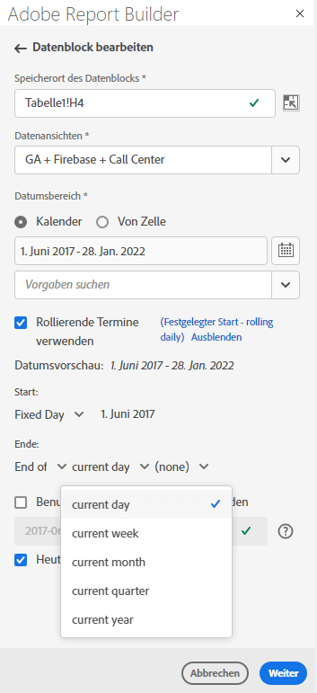
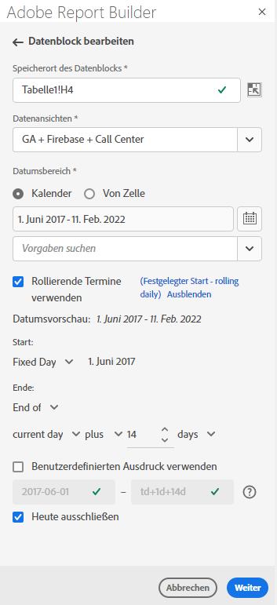
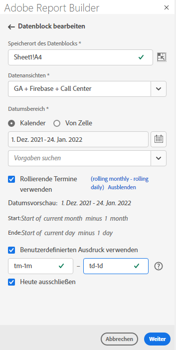
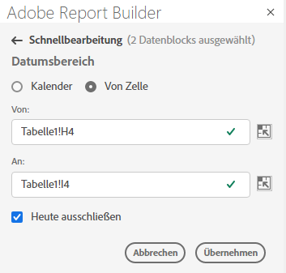

# Datumsbereich auswählen

Um den Datumsbereich eines vorhandenen Datenblocks zu ändern, wählen Sie „Datenblock bearbeiten“ aus oder verwenden Sie das Bedienfeld „Schnellbearbeitung“.

Verwenden Sie die folgenden Optionen, um einen Datumsbereich für einen Datenblock zu ändern.

**Kalender**

Mit dem Kalender können Sie statische oder rollierende Datumswerte mit den folgenden Optionen erstellen:

- Feld „Datumsbereich“
- Kalender
- Dropdown-Menü „Voreinstellung“
- Modus „Rollierendes Datum“
- Ausdrücke anpassen


**Von Zelle**

Mit der Option „Von Zelle“ können Sie auf Daten verweisen, die in Zellen eines Arbeitsblatts eingegeben wurden.

Sie können den aktuellen Tag für einen beliebigen Datumsbereich ausschließen.



## Verwenden des Kalenders

Wenn Sie den **Kalender** verwenden, zeigt das Datumsbereichsfeld den aktuellen Datumsbereich für die Datenblockanfrage an. Sie können Datumsangaben direkt in das Datumsbereichsfeld eingeben oder eine Datenbereichsauswahl-Option verwenden.

### Feld „Datumsbereich“

So geben Sie Daten direkt in das Datumsbereichsfeld ein

1. Klicken Sie auf das Datumsbereichsfeld neben dem Kalendersymbol.

1. Geben Sie das Start- und Enddatum für Ihren Datumsbereich ein.

### Kalender

So wählen Sie Datumsangaben mithilfe des Kalenders aus

1. Klicken Sie auf das Kalendersymbol, um einen monatlichen Kalender anzuzeigen.

1. Klicken Sie auf ein Startdatum.

1. Klicken Sie auf ein Enddatum.

Um einen Datumsbereich rückwärts festzulegen, klicken Sie zuerst auf das Enddatum und dann auf das Startdatum.



### Dropdown-Menü „Voreinstellung“

Das Dropdown-Menü „Voreinstellung“ enthält einen Standardsatz vordefinierter Datumsbereiche und Datumsbereichskomponenten für eine von Ihnen gespeicherte Datenansicht oder eine für Sie freigegebene Datenansicht.

### Rollierende Datumswerte

Mit der Option „Rollierende Datumswerte“ können Sie einen Datumsbereich mithilfe rollierender Datumswerte auswählen.

1. Wählen Sie die Option **Rollierende Datumswerte verwenden** aus.

1. Wählen Sie einen rollierenden Ausdruck für Ihr Start- und Enddatum aus.

   

   **Beginn von** – Ermöglicht die Auswahl des Anfangs eines Tages, einer Woche, eines Monats, eines Quartals oder eines Jahres.

   **Ende von** – Ermöglicht die Auswahl des Endes eines Tages, einer Woche, eines Monats, eines Quartals oder eines Jahres.

   **Fester Tag** – Ermöglicht das Festlegen eines Start- oder Enddatums, während das andere Datum rollierend ist.

1. Wählen Sie als rollierenden Zeitraum Tag, Woche, Monat, Quartal oder Jahr aus.

   

1. Fügen Sie Tage, Wochen, Monate, Quartale oder Jahre ab dem rollierenden Datum hinzu oder subtrahieren Sie diese.

   

1. Klicken Sie auf „Weiter“, um den Datenbereich zu definieren.

   Verwenden Sie die Datumsvorschau, um zu bestätigen, dass der resultierende Datumsbereich der gewünschte Bereich ist.

### Benutzerdefinierte Ausdrücke

Mit der Option für benutzerdefinierte Ausdrücke können Sie den Datumsbereich ändern, indem Sie einen benutzerdefinierten Ausdruck erstellen oder eine arithmetische Formel eingeben.

1. Wählen Sie **Rollierende Datumswerte verwenden** aus.

1. Wählen Sie **Benutzerdefinierte Ausdrücke verwenden** aus.

   Wenn Sie die Option **Benutzerdefinierte Ausdrücke verwenden** auswählen, sind die standardmäßigen Steuerelemente für rollierende Datumsbereiche deaktiviert.

   

1. Geben Sie einen benutzerdefinierten Ausdruck ein.

   Eine Beispielliste mit benutzerdefinierten Ausdrücken finden Sie unter **Datumsausdrücke**.

1. Verwenden Sie die Datumsvorschau, um zu überprüfen, ob der resultierende Datumsbereich der gewünschte Bereich ist.

#### Erstellen eines benutzerdefinierten Ausdrucks

1. Geben Sie eine **Datumsreferenz** ein.

1. Fügen Sie **Datumsoperatoren** hinzu, um das Datum in die Vergangenheit oder in die Zukunft zu verschieben.

Sie können einen benutzerdefinierten Datumsausdruck eingeben, der mehrere Operatoren enthält, z. B. ```tm-11m-1d```.

#### Datumsreferenzen

In der folgenden Tabelle sind Beispiele für Datumsreferenzen aufgeführt.

| Datumsreferenz | Typ | Beschreibung |
|----------------|--------------|----------------------------|
| 1/1/10 | Statisches Datum | Im ISO-Datumsformat eingegeben |
| td | Rollierendes Datum | Beginn des aktuellen Tages |
| tw | Rollierendes Datum | Beginn der aktuellen Woche |
| tm | Rollierendes Datum | Beginn des aktuellen Monats |
| tq | Rollierendes Datum | Beginn des aktuellen Quartals |
| ty | Rollierendes Datum | Beginn des laufenden Jahres |

#### Datumsoperatoren

In der folgenden Tabelle sind Beispiele für Datumsoperatoren aufgeführt.

| Datumsoperatoren | Einheit | Beschreibung |
|----------------|---------|--------------------|
| +6d | Tag | Hinzufügen von 6 Tagen zur Datumsreferenz |
| +1w | Woche | Hinzufügen einer ganzen Woche zur Datumsreferenz |
| -2m | Monat | Abziehen von 2 vollständigen Monaten von der Datumsreferenz |
| -4q | Quartal | Abziehen von 4 Quartalen von der Datumsreferenz |
| -1y | Jahr | Abziehen von 1 Jahr von der Datumsreferenz |

#### Datumsausdrücke

In der folgenden Tabelle sind Beispiele für Datumsausdrücke aufgeführt.

| Datumsausdruck | Bedeutung |
|-----------------|--------------------------------------|
| td-1w | Erster Tag der letzten Woche |
| tm-1d | Letzter Tag des vorherigen Monats |
| td-52w | Derselbe Tag vor 52 Wochen |
| tm-11m-1d | Letzter Tag des gleichen Monats im letzten Jahr |
| „2020-09-06“ | 9. Sept. 2020 |

## Datumsbereich aus Zelle

Der Datumsbereich kann in Zellen eines Arbeitsblatts angegeben werden. Verwenden Sie die Option **Datumsbereich aus Zelle**, um das Start- und Enddatum des Datenblocks aus ausgewählten Zellen auszuwählen. Wenn Sie die Option **Aus Zelle** auswählen, zeigt das Bedienfeld die Felder **Von** und **Bis** an, in die Sie eine Zellenposition eingeben können.



## Heute ausschließen

Wählen Sie die Option **Heute ausschließen** aus, um den aktuellen Tag aus einem ausgewählten Datumsbereich auszuschließen. Wenn Sie sich dafür entscheiden, den heutigen Tag einzubeziehen, werden möglicherweise unvollständige Daten für heute abgerufen.

Wenn die Option **Heute ausschließen** ausgewählt ist, wird der aktuelle Tag aus allen Datumsbereichsmodi ausgeschlossen, einschließlich Kalender, rollierenden Datumsangaben oder benutzerdefinierten Ausdrücken.

## Gültige Datumsbereiche

In der folgenden Liste werden die gültigen Datumsbereichsformate beschrieben.

- Das Start- und das Enddatum müssen im folgenden Format angegeben werden: YYYY-MM-DD

- Das Startdatum muss vor dem Enddatum liegen oder damit übereinstimmen. Bei beiden Daten kann es sich um Daten in der Zukunft handeln.

- Bei Verwendung rollierender Datumswerte muss das Startdatum heute oder in der Vergangenheit liegen. Wenn **Heute ausschließen** aktiviert ist, muss es sich um ein Datum in der Vergangenheit handeln.

- Sie können einen statischen Datumsbereich für die Zukunft erstellen. Beispielsweise müssen Sie möglicherweise ein künftiges Datum für den Start einer Marketing-Kampagne in der nächsten Woche festlegen. Mit dieser Option wird ein Arbeitsmappen-Monitoring für eine Kampagne im Voraus erstellt.

## Datumsbereich ändern

Sie können den Datumsbereich eines vorhandenen Datenblocks bearbeiten, indem Sie im Bedienfeld „Befehle“ die Option „Datenblock bearbeiten“ auswählen oder indem Sie im Bedienfeld „Schnellbearbeitung“ den Datumsbereichs-Link auswählen.

**Datenblock bearbeiten** – Ermöglicht die Bearbeitung mehrerer Datenblock-Parameter, einschließlich Datumsbereich, für einen einzelnen Datenblock.

**Schnellbearbeitung: Datumsbereich** – Ermöglicht die Bearbeitung des Datumsbereichs eines oder mehrerer Datenblöcke.

So bearbeiten Sie den Datumsbereich im Bedienfeld „Schnellbearbeitung“

1. Wählen Sie Zellen in einem oder mehreren Datenblöcken in einem Arbeitsblatt aus.

1. Klicken Sie auf den Link **Datumsbereich** im Bedienfeld „Schnellbearbeitung“.

1. Wählen Sie den Datumsbereich mit einer der Datumsauswahloptionen aus.

1. Klicken Sie auf **Anwenden**.


Report Builder wendet den neuen Datumsbereich auf alle Datenblöcke in der Auswahl an.
