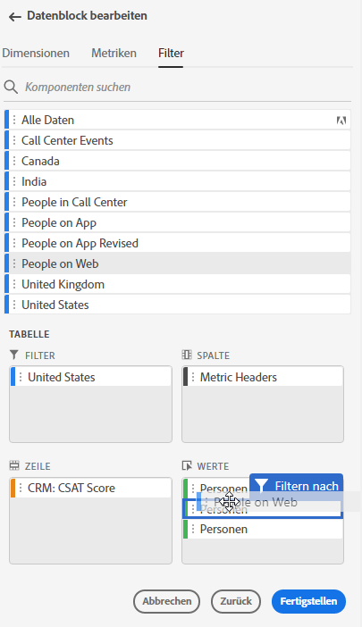
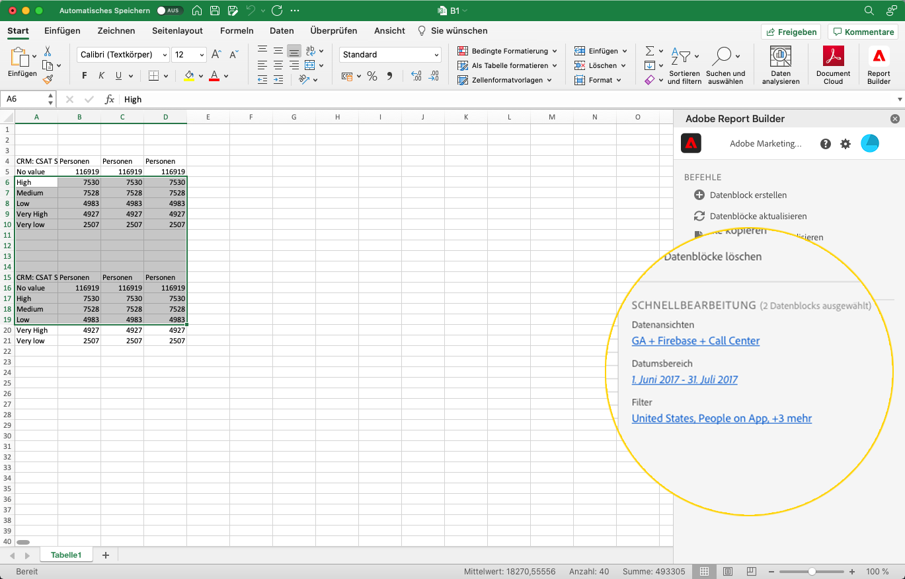
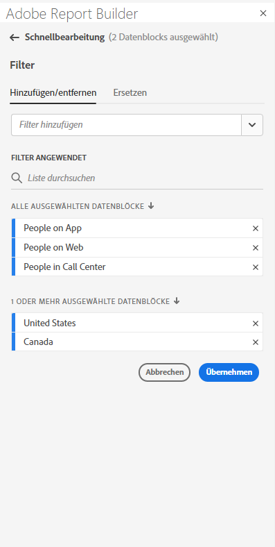
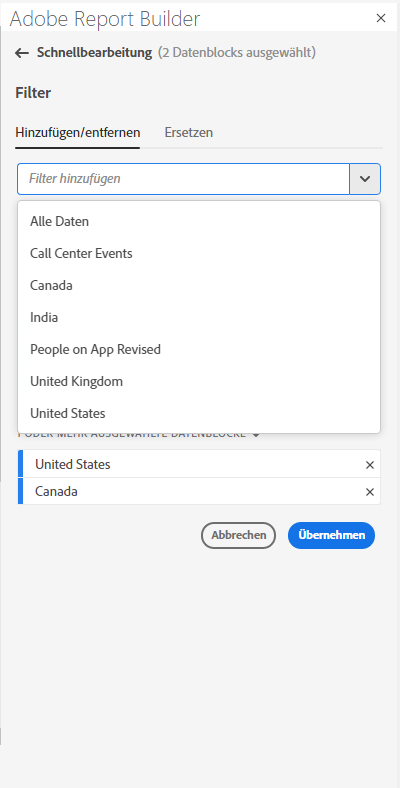
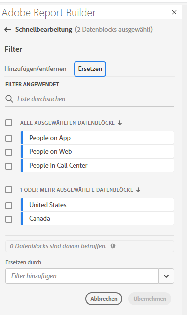
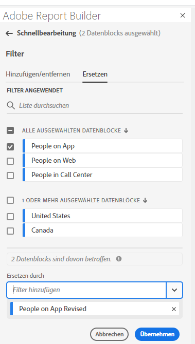

# Arbeiten mit Filtern in Report Builder

Sie können Filter anwenden, wenn Sie einen neuen Datenblock erstellen oder wenn Sie im Bedienfeld &quot;COMMANDS&quot;die Option **Datenblock bearbeiten** auswählen.

## Filter auf Datenblöcke anwenden

Um einen Filter auf den gesamten Datenblock anzuwenden, doppelklicken Sie auf einen Filter oder ziehen Sie Filter aus der Komponentenliste in den Bereich Filter der Tabelle.

## Filter auf einzelne Metriken anwenden

Um Filter auf einzelne Metriken anzuwenden, ziehen Sie einen Filter auf eine Metrik in der Tabelle. Sie können auch auf **... klicken.** rechts neben einer Metrik im Tabellenbereich und wählen Sie dann **Filtermetrik** aus. Um angewendete Filter anzuzeigen, bewegen Sie den Mauszeiger über eine Metrik im Tabellenbereich oder wählen Sie sie aus. Metriken mit angewendeten Filtern zeigen ein Filtersymbol an.

<!--  -->

## Schnellbearbeitungs-Filter

Sie können im Bereich Schnellbearbeitung Filter für vorhandene Datenblöcke hinzufügen, entfernen oder ersetzen.

Wenn Sie einen Zellenbereich im Arbeitsblatt auswählen, zeigt der Link **Filter** im Bereich Schnellbearbeitung eine Zusammenfassungsliste der Filter an, die von den Datenblöcken in dieser Auswahl verwendet werden.

So bearbeiten Sie Filter über das Bedienfeld &quot;Schnellbearbeitung&quot;

1. Wählen Sie einen Zellenbereich aus einem oder mehreren Datenblöcken aus.

   

1. Klicken Sie auf den Link Filter , um den Bereich Schnellbearbeitung - Filter zu öffnen.

   

### Filter hinzufügen oder entfernen

Mithilfe der Optionen Hinzufügen/Entfernen können Sie Filter hinzufügen oder entfernen.

1. Wählen Sie die Registerkarte **Hinzufügen/Entfernen** im Bereich Schnellbearbeitungsfilter .

   Alle auf die ausgewählten Datenblöcke angewendeten Filter werden im Bereich Schnellbearbeitungsfilter aufgeführt. Filter, die auf alle Datenblöcke in der Auswahl angewendet werden, werden unter der Überschrift **Auf alle ausgewählten Datenblöcke angewendet** aufgeführt. Filter, die auf einige, aber nicht alle Datenblöcke angewendet werden, werden unter der Überschrift **Auf einen oder mehrere ausgewählte Datenblöcke** angewendet.

   Wenn in den ausgewählten Datenblöcken mehrere Filter vorhanden sind, können Sie mithilfe des Suchfelds **Filter hinzufügen** nach bestimmten Filtern suchen.

   

1. Fügen Sie Filter hinzu, indem Sie Filter aus dem Dropdown-Menü **Filter hinzufügen** auswählen.

   Die Liste durchsuchbarer Filter enthält alle Filter, die für die Datenansichten, die in einem oder mehreren der ausgewählten Datenblöcke vorhanden sind, sowie alle Filter, die in der Organisation global verfügbar sind.

   Durch Hinzufügen eines Filters wird der Filter auf alle Datenblöcke in der Auswahl angewendet.

1. Um Filter zu entfernen, klicken Sie auf das Löschsymbol **x** rechts neben den Filtern in der Liste **Angewendete Filter** .

1. Klicken Sie auf **Anwenden** , um Änderungen zu speichern und zum Hub-Bedienfeld zurückzukehren.

   Report Builder zeigt eine Meldung zur Bestätigung der angewendeten Filteränderungen an.

### Filter ersetzen

Sie können einen vorhandenen Filter durch einen anderen Filter ersetzen, um zu ändern, wie die Daten gefiltert werden.

1. Wählen Sie die Registerkarte **Replace** im Bereich Quick edit-filters .

   

1. Suchen Sie mithilfe des Suchfelds **Suchliste** nach bestimmten Filtern.

1. Wählen Sie einen oder mehrere Filter aus, die Sie ersetzen möchten.

1. Suchen Sie im Feld Ersetzen durch nach einem oder mehreren Filtern.

   Wenn Sie einen Filter auswählen, wird dieser der Liste **Ersetzen durch**... hinzugefügt.

   

1. Klicken Sie auf **Übernehmen**.

   Report Builder aktualisiert die Filterliste entsprechend der Ersetzung.
