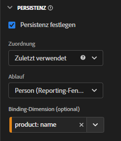
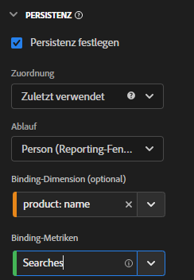

# Verwenden von Bindungsdimensionen und Metriken in CJA

Customer Journey Analytics bietet mehrere Möglichkeiten, Dimensionswerte über den Treffer hinaus beizubehalten, für den sie festgelegt wurden. Eine der Persistenzmethoden, die Adobe anbietet, wird als Bindung bezeichnet. In früheren Versionen von Adobe Analytics wurde dieses Konzept als Merchandising bezeichnet.

Sie können Bindungsdimensionen zwar mit Ereignisdaten der obersten Ebene verwenden, dieses Konzept empfiehlt sich jedoch am meisten bei der Arbeit mit [Arrays von Objekten](object-arrays.md). Sie können eine Dimension einem Teil eines Objekt-Arrays zuordnen, ohne sie auf alle Attribute in einem bestimmten Ereignis anzuwenden. Sie können beispielsweise einen Suchbegriff einem Produkt in Ihrem Warenkorb-Objekt-Array zuordnen, ohne diesen Suchbegriff an das gesamte Ereignis zu binden.

## Beispiel 1: Bindungsdimensionen verwenden, um zusätzliche Produktattribute einem Kauf zuzuordnen

Sie können Dimensionselemente innerhalb eines Objekt-Arrays an eine andere Dimension binden. Wenn das gebundene Dimensionselement angezeigt wird, ruft CJA die gebundene Dimension zurück und fügt sie im Ereignis für Sie ein. Betrachten Sie die folgende Customer Journey:

1. Ein Besucher sieht sich eine Produktseite auf einer Waschmaschine an.

   ```json
   {
       "PersonID": "1",
       "product_views": 1,
       "product": [
           {
               "name": "Washing Machine 2000",
               "color": "white",
               "type": "front loader",
           },
       ],
       "timestamp": 1534219229
   }
   ```

1. Der Besucher sieht sich dann eine Produktseite auf einem Trockner an.

   ```json
   {
       "PersonID": "1",
       "product_views": 1,
       "product": [
           {
               "name": "Dryer 2000",
               "color": "neon orange",
           },
       ],
       "timestamp": 1534219502
   }
   ```

1. Letztlich tätigen sie einen Kauf. Die Farbe der einzelnen Produkte war nicht im Kaufereignis enthalten.

   ```json
   {
       "PersonID": "1",
       "orders": 1,
       "product": [
           {
               "name": "Washing Machine 2000",
               "price": 1600,
           },
           {
               "name": "Dryer 2000",
               "price": 499
           }
       ],
       "timestamp": 1534219768
   }
   ```

Wenn Sie den Umsatz nach Farbe ohne Bindungsdimension betrachten möchten, wird die Dimension `product.color` Beibehaltung und fehlerhafte Zuordnung der Farbe des Trockners:

| product.color | Umsatz |
| --- | --- |
| Neonorange | 2099 |

Sie können den Data View Manager aufrufen und die Produktfarbe an den Produktnamen binden:



Wenn Sie dieses Persistenzmodell festlegen, nimmt CJA den Produktnamen bei jedem Festlegen der Produktfarbe zur Kenntnis. Wenn bei einem nachfolgenden Ereignis für diesen Besucher derselbe Produktname erkannt wird, wird auch die Produktfarbe übernommen. Dieselben Daten, wenn Sie die Produktfarbe an den Produktnamen binden, sehen in etwa wie folgt aus:

| product.color | Umsatz |
| --- | --- |
| weiß | 1600 |
| Neonorange | 499 |

## Beispiel 2: Bindungsmetriken verwenden, um Suchbegriffe mit einem Produktkauf zu verknüpfen

Eine der gängigsten Merchandising-Methoden in Adobe Analytics besteht darin, einen Suchbegriff an ein Produkt zu binden, sodass jeder Suchbegriff für das entsprechende Produkt angerechnet wird. Betrachten Sie die folgende Customer Journey:

1. Ein Besucher gelangt zu Ihrer Site und sucht „Boxhandschuhe“. Die Suchmetrik wird um 1 inkrementiert und die drei wichtigsten Suchergebnisse werden angezeigt.

   ```json
   {
       "PersonID": "1",
       "page_name": "Search results",
       "search": "1",
       "search_term": "boxing gloves",
       "product": [
           {
               "name": "Beginner gloves",
           },
           {
               "name": "Tier 3 gloves",
           },
           {
               "name": "Professional gloves",
           }
       ]
   }
   ```

2. Er findet ein Paar Handschuhe, die ihm gefallen, und fügt sie zu seinem Warenkorb hinzu.

   ```json
   {
       "PersonID": "1",
       "page_name": "Shopping cart",
       "cart_add": "1",
       "product": [
           {
               "name": "Tier 3 gloves",
           }
       ]
   }
   ```

3. Der Besucher sucht dann nach „Tennisschläger“. Die Suchmetrik wird um 1 inkrementiert und die drei wichtigsten Suchergebnisse werden angezeigt.

   ```json
   {
       "PersonID": "1",
       "page_name": "Search results",
       "search": "1",
       "search_term": "tennis racket",
       "product": [
           {
               "name": "Shock absorb racket",
           },
           {
               "name": "Women's open racket",
           },
           {
               "name": "Extreme racket",
           }
       ]
   }
   ```

4. Er findet einen Schläger, der ihm gefällt, und fügt ihn seinem Warenkorb hinzu.

   ```json
   {
       "PersonID": "1",
       "page_name": "Shopping cart",
       "cart_add": "1",
       "product": [
           {
               "name": "Tier 3 gloves",
           },
           {
               "name": "Shock absorb racket",
           }
       ]
   }
   ```

5. Der Besucher sucht ein drittes Mal, diese Mal „Schuhe“. Die Suchmetrik wird um 1 inkrementiert und die drei wichtigsten Suchergebnisse werden angezeigt.

   ```json
   {
       "PersonID": "1",
       "page_name": "Search results",
       "search": "1",
       "search_term": "shoes",
       "product": [
           {
               "name": "Men's walking shoes",
           },
           {
               "name": "Tennis shoes",
           },
           {
               "name": "Skate shoes",
           }
       ]
   }
   ```

6. Er findet ein Paar Schuhe, die ihm gefallen, und fügt sie zu seinem Warenkorb hinzu.

   ```json
   {
       "PersonID": "1",
       "page_name": "Shopping cart",
       "cart_add": "1",
       "product": [
           {
               "name": "Tier 3 gloves",
           },
           {
               "name": "Shock absorb racket",
           },
           {
               "name": "Skate shoes",
           }
       ]
   }
   ```

7. Der Besucher durchläuft den Checkout-Prozess und kauft diese drei Artikel.

   ```json
   {
       "PersonID": "1",
       "page_name": "Thank you for your purchase",
       "purchase": "1",
       "product": [
           {
               "name": "Tier 3 gloves",
               "price": "89.99"
           },
           {
               "name": "Shock absorb racket",
               "price": "34.99"
           },
           {
               "name": "Skate shoes",
               "price": "79.99"
           }
       ]
   }
   ```

Wenn Sie ein Zuordnungsmodell verwenden, das keine bindende Dimension mit dem Suchbegriff enthält, weisen alle drei Produkte den Umsatz nur einem einzigen Suchbegriff zu. Wenn Sie beispielsweise die ursprüngliche Zuordnung mit der Suchbegriffdimension verwendet haben:

| search_term | Umsatz |
| --- | --- |
| Boxhandschuhe | $ 204.97 |

Wenn Sie die Zuordnung &quot;Zuletzt verwendet&quot;mit der Suchbegriffdimension verwendet haben, weisen alle drei Produkte weiterhin den Umsatz einem einzelnen Suchbegriff zu:

| search_term | Umsatz |
| --- | --- |
| Schuhe | $ 204.97 |

Bei diesem Beispiel geht es um nur einen Besucher. Viele Besucher, die nach verschiedenen Elementen suchen, können Suchbegriffe verschiedenen Produkten zuordnen, was es schwierig macht festzustellen, welche Suchergebnisse tatsächlich die besten sind.

CJA erkennt automatisch die Beziehung zwischen der ausgewählten Dimension und der Bindungsdimension. Wenn sich die Bindungsdimension in einem Objekt-Array befindet, während die ausgewählte Dimension auf einer höheren Ebene liegt, ist eine Bindungsmetrik erforderlich. Eine Bindungsmetrik dient als Trigger für eine Bindungsdimension, sodass sie sich nur an Ereignisse bindet, bei denen die Bindungsmetrik vorhanden ist.

In dieser Beispielimplementierung enthält die Suchergebnisseite immer eine Suchbegriffdimension und eine Suchmetrik. Wir können Suchbegriffe an den Produktnamen binden, wann immer die Suchmetrik vorhanden ist.



Wenn Sie die Suchbegriffdimension auf dieses Persistenzmodell festlegen, wird die folgende Logik ausgeführt:

* Wenn die Suchbegriffdimension festgelegt ist, überprüfen Sie, ob der Produktname vorhanden ist.
* Wenn der Produktname nicht vorhanden ist, führen Sie keine Aktionen aus.
* Wenn der Produktname vorhanden ist, überprüfen Sie, ob die Suchmetrik vorhanden ist.
* Wenn die Suchmetrik nicht vorhanden ist, führen Sie keine Aktionen aus.
* Wenn die Suchmetrik vorhanden ist, binden Sie den Suchbegriff an alle Produktnamen in diesem Ereignis. Es kopiert sich selbst auf die gleiche Ebene wie der Produktname für dieses Ereignis. In diesem Beispiel wird er als product.search_term behandelt.
* Wenn derselbe Produktname in einem nachfolgenden Ereignis angezeigt wird, wird der gebundene Suchbegriff auch an dieses Ereignis weitergeleitet.

In Analysis Workspace würde der resultierende Bericht in etwa wie folgt aussehen:

| search_term | Umsatz |
| --- | --- |
| Boxhandschuhe | $ 89.99 |
| Tennisschläger | $34.99 |
| Schuhe | $79.99 |

## Beispiel 3: Binden des Videosuchbegriffs an das Benutzerprofil

Sie können einen Suchbegriff an ein Benutzerprofil binden, damit die Persistenz zwischen Profilen vollständig getrennt bleibt. Ihre Organisation führt beispielsweise einen Streaming-Dienst aus, bei dem ein Konto mehrere Profile haben kann. Der Besucher hat ein untergeordnetes Konto und ein Erwachsenenkonto.

1. Das Konto meldet sich unter dem untergeordneten Konto an und sucht nach einer Kinderfernsehsendung. Beachten Sie Folgendes: `"AccountID"` is `2` , um das untergeordnete Profil darzustellen.

   ```json
   {
       "PersonID": "7078",
       "AccountID": "2",
       "Searches": "1",
       "search_term": "kids TV show"
   }
   ```

1. Sie finden die Show &quot;Orangey&quot; und spielen sie, damit ihr Kind sie sehen kann.

   ```json
   {
       "PersonID": "7078",
       "AccountID": "2",
       "ShowName": "Orangey",
       "VideoStarts": "1"
   }
   ```

1. Später an diesem Abend wechselt die übergeordnete Person zu ihrem Profil und sucht nach neuen erwachsenen Inhalten, die sie sehen kann. Beachten Sie Folgendes: `"AccountID"` is `1` um das Profil für Erwachsene zu repräsentieren. Beide Profile gehören zum selben Konto, das durch dasselbe repräsentiert wird. `"PersonID"`.

   ```json
   {
       "PersonID": "7078",
       "AccountID": "1",
       "Searches": "1",
       "search_term": "inappropriate adult movie"
   }
   ```

1. Die Show &quot;Game of Dethrones&quot; finden und genießen Sie ihren Abend dabei.

   ```json
   {
       "PersonID": "7078",
       "AccountID": "1",
       "ShowName": "Game of Dethrones",
       "VideoStarts": "1"
   }
   ```

1. Am nächsten Tag setzen sie die Fernsehsendung &quot;Orangey&quot; für ihr Kind fort. Sie müssen nicht suchen, da sie jetzt bereits über die Show informiert sind.

   ```json
   {
       "PersonID": "7078",
       "AccountID": "2",
       "ShowName": "Orangey",
       "VideoStarts": "1"
   }
   ```

Wenn Sie ein Zuordnungsmodell ohne bindende Dimension verwenden, wird die `"inappropriate adult movie"` Suchbegriff wird der letzten Ansicht der Kinder-Fernsehsendung zugeordnet. Wenn Sie jedoch `search_term` nach `AccountID`, werden die Suchvorgänge jedes Profils in ihr eigenes Profil isoliert, das den korrekten Suchergebnissen zugeordnet wird.

## Beispiel 4: Bewerten Sie das Browse- oder Suchverhalten in einer Einzelhandelseinstellung.

1. Ein Besucher sucht nach `"camera"`. Beachten Sie, dass auf dieser Seite keine Produkte festgelegt sind.

   ```json
   {
       "search_term": "camera",
       "product_finding_method": "search"
   }
   ```

1. Er klickt auf eine Kamera, die ihm gefällt, und fügt sie zum Warenkorb hinzu.

   ```json
   {
       "Product": [
           {
               "name": "DSLR Camera"
           }
       ],
       "CartAdd": "1"
   }
   ```

1. Der Besucher durchsucht dann die Gürtelkategorie für Männer, ohne eine Suche durchzuführen. Beachten Sie, dass auf dieser Seite keine Produkte festgelegt sind.

   ```json
   {
       "category": "Men's belts",
       "product_finding_method": "browse"
   }
   ```

1. Sie klicken auf den Bauch, den sie mögen, und fügen ihn ihrem Warenkorb hinzu.

   ```json
   {
       "Product": [
           {
               "name": "Ratchet belt"
           }
       ],
       "CartAdd": "1"
   }
   ```

1. Sie durchlaufen den Checkout-Prozess und kaufen diese beiden Artikel.

   ```json
   {
       "Product": [
           {
               "name": "DSLR Camera",
               "price": "399.99"
           },
           {
               "name": "Ratchet belt",
               "price": "19.99"
           }
       ],
       "Purchase": "1"
   }
   ```

Wenn die Persistenz auf die neueste Zuordnung ohne bindende Dimension eingestellt ist, werden alle 419,98 USD des Umsatzes dem Wert `browse` Suchmethode. Wenn die Persistenz mithilfe der ursprünglichen Zuordnung ohne bindende Dimension festgelegt wird, werden alle 419,98 USD des Umsatzes dem `search` Suchmethode.

Wenn Sie jedoch `product_finding_method` zur Metrik &quot;Zusatz zum Warenkorb&quot;hinzu, ordnet der resultierende Bericht jedes Produkt der korrekten Suchmethode zu.

| Methode zur Produktsuche | Umsatz |
| --- | --- |
| Suche | 399,99 |
| durchsuchen | 19,99 |
