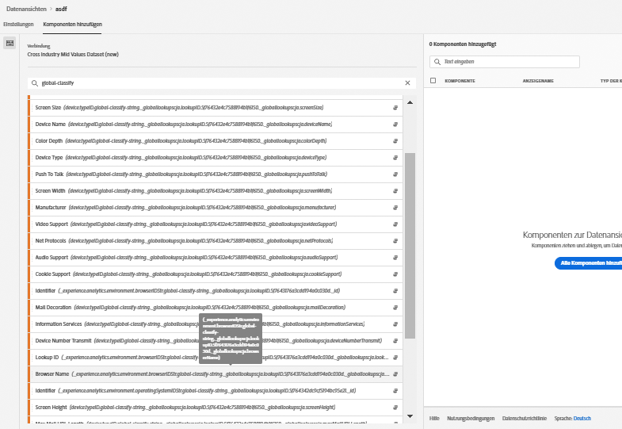
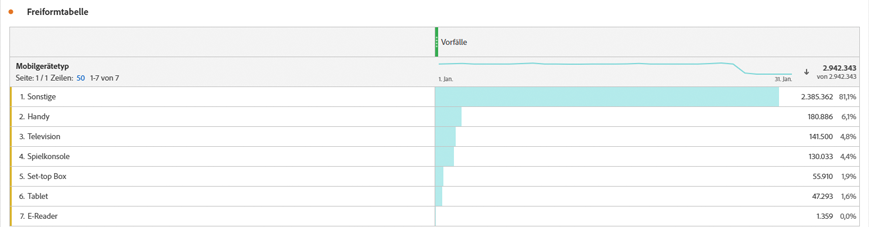

# hinzufügen globale Suche in Ihren Datensätzen

Globale Suchvorgänge verbessern die Möglichkeit von Customer Journey Analytics, Berichte zu bestimmten Dimensionen/Attributen zu erstellen, die für sich genommen nicht nützlich sind, aber bei der Verknüpfung mit anderen Daten nützlich sind. Beispiele sind Attribute von Mobilgeräten und Attribute von OS- und Browserabmessungen, wie z. B. Versionsnummern des Browsers. Eine &quot;Globale Suche&quot;ähnelt einem Suchtelefondatensatz (im traditionellen Adobe Analytics als Classifications bezeichnet). Globale Suchvorgänge sind jedoch für alle Experience Cloud-Organisationen verfügbar. Globale Suchen werden automatisch auf alle Ereignis-Datensätze angewendet, die bestimmte XDM-Schema-Felder enthalten (siehe unten für die jeweiligen Felder).
Für jeden Schema-Speicherort, den Adobe klassifiziert, gibt es einen globalen Abfragedatensatz. Sie können globale Nachschlagedatasets mit dem Analytics-Quell-Connector oder anderen benutzerdefinierten Datensätzen verwenden, die diese akzeptieren können.

Im traditionellen Adobe Analytics werden diese Dimensionen eigenständig angezeigt, während Sie in CJA diese Dimensionen aktiv einbeziehen müssen, wenn Sie Daten-Ansichten erstellen. Wenn ein Benutzer im Arbeitsablauf &quot;Verbindungen&quot;ein Dataset auswählt, das als eins mit einem Schlüssel für globale Suchen gekennzeichnet ist, dann weiß die Benutzeroberfläche der Ansichten, dass alle globalen Suchdimensionen, die für den Berichte verfügbar sind, einbezogen werden müssen. Der Arbeitsablauf für die Ansichten von Daten weiß, dass diese globalen Suchdimensionen wie für die Ansicht der Daten verfügbar sind. Die Lookup-Dateien werden automatisch auf dem neuesten Stand gehalten und stehen für alle Regionen und Konten zur Verfügung. Sie werden in regionsspezifischen Organisationen gespeichert, die mit dem Kunden verbunden sind.

## Globale Suche mit Adobe Data Connector-Datensätzen verwenden

Globale Nachschlagedatasets werden zur Berichtzeit automatisch angewendet. Wenn Sie den [Analytics Data Connector](https://experienceleague.adobe.com/docs/experience-platform/sources/connectors/adobe-applications/analytics.html?lang=en#connectors) verwenden und eine Dimension einbringen, für die die Adobe eine globale Suche bereitstellt, wird diese globale Suche automatisch angewendet. Wenn ein Ereignis-Datensatz die Felder [XDM](https://experienceleague.adobe.com/docs/experience-platform/xdm/home.html?lang=en) enthält, können globale Suchen darauf angewendet werden.

## Globale Suche mit benutzerdefinierten Datensätzen verwenden

Der Ereignis-Datensatz muss einen Schlüssel enthalten, der mit den globalen Suchdatensätzen kompatibel ist. Solange Sie die richtigen XDM-Felder ausfüllen, indem Sie einige unserer standardmäßigen [Adobe Experience Platform-Schema-Mixins](https://experienceleague.adobe.com/docs/experience-platform/xdm/mixins/event/environment-details.html?lang=en#mixins) hinzufügen, können Sie benutzerdefinierte Datensätze mit globalen Suchen verwenden.

## Verfügbare globale Suchfelder

* `browser`
   * `browser`,  `group_id`,  `id`
* `browser_group`
   * `browser_group`, `id`
* `os`
   * `os`,  `group_id`,  `id`
* `os_group`
   * `os_group`,  `id`
* `mobile_audio_support - multi`
* `mobile_color_depth`
* `mobile_cookie_support`
* `mobile_device_name`
* `mobile_device_number_transmit`
* `mobile_device_type`
* `mobile_drm - multi`
* `mobile_image_support - multi`
* `mobile_information_services`
* `mobile_java_vm - multi`
* `mobile_mail_decoration`
* `mobile_manufacturer`
* `mobile_max_bookmark_url_length`
* `mobile_max_browser_url_length`
* `mobile_max_mail_url_length`
* `mobile_net_protocols - multi`
* `mobile_os`
* `mobile_push_to_talk`
* `mobile_screen_height`
* `mobile_screen_size`
* `mobile_screen_width`
* `mobile_video_support - multi`

## Bericht zu globalen Suchdimensionen

Um einen Bericht über die globalen Suchdimensionen zu erstellen, müssen Sie diese hinzufügen, wenn Sie eine Ansicht der Daten in Customer Journey Analytics erstellen:

Anschließend werden die Nachschlagedaten in Workspace angezeigt:

