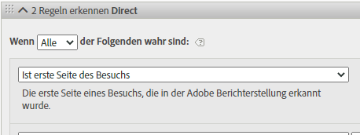
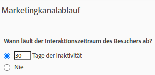

# Verwenden von Marketing-Kanal-Dimensionen in Adobe Experience Platform

Wenn Ihr Unternehmen [Analytics Data Connector](https://docs.adobe.com/content/help/de-DE/experience-platform/sources/connectors/adobe-applications/analytics.html) verwendet, um Report Suite-Daten in Customer Journey Analytics zu importieren, können Sie in Customer Journey Analytics eine Verbindung konfigurieren, um Berichte über die Dimensionen des Marketing-Kanals zu erstellen.

## Voraussetzungen

* Report Suite-Daten müssen bereits mit [Analytics Data Connector](https://docs.adobe.com/content/help/de-DE/experience-platform/sources/connectors/adobe-applications/analytics.html) in Adobe Experience Platform importiert worden sein. Andere Datenquellen werden nicht unterstützt, da Marketing-Kanäle auf Verarbeitungsregeln in einer Analytics Report Suite angewiesen sind.
* Verarbeitungsregeln für den Marketing-Kanal müssen bereits eingerichtet sein. Siehe [Verarbeitungsregeln für Marketing-Kanäle](https://docs.adobe.com/content/help/de-DE/analytics/components/marketing-channels/c-rules.html) im Handbuch zu Analytics-Komponenten.

## Marketing-Kanal: Schema-Elemente

Nachdem Sie Analytics Data Connector für eine gewünschte Report Suite eingerichtet haben, wird ein XDM-Schema für Sie erstellt. Dieses Schema enthält alle Analytics-Dimensionen und -Metriken als Rohdaten. Diese Rohdaten enthalten keine Attribution oder Persistenz. Stattdessen durchläuft jedes Ereignis die Verarbeitungsregeln des Marketing-Kanals und zeichnet die erste Regel auf, die es erfüllt. Beim Erstellen einer Datenansicht in Customer Journey Analytics legen Sie Attribution und Persistenz fest.

1. [Erstellen Sie eine Verbindung](/help/connections/create-connection.md), die einen Datensatz enthält, der auf Analytics Data Connector basiert.
2. [Erstellen Sie eine Datenansicht](/help/data-views/create-dataview.md) mit folgenden Dimensionen:
   * **`channel.typeAtSource`**: entspricht der [Marketing-Kanal](https://docs.adobe.com/content/help/de-DE/analytics/components/dimensions/marketing-channel.html)-Dimension.
   * **`channel._id`**: entspricht dem [Marketing-Kanal-Detail](https://docs.adobe.com/content/help/de-DE/analytics/components/dimensions/marketing-detail.html).
3. Weisen Sie jeder Dimension das gewünschte Attributionsmodell und die gewünschte Persistenz zu. Wenn Sie sowohl die First Touch- als auch die Last Touch-Dimension verwenden möchten, ziehen Sie jede Marketing-Kanal-Dimension mehrmals in den Komponentenbereich. Weisen Sie jeder Dimension das gewünschte Attributionsmodell und die gewünschte Persistenz zu. Adobe empfiehlt außerdem, jeder Dimension einen Anzeigenamen zu geben, um die Verwendung in Workspace zu vereinfachen.
4. Erstellen Sie die Datenansicht.

Die Dimensionen Ihres Marketing-Kanals stehen jetzt in Analysis Workspace zur Verfügung.

## Unterschiede in der Verarbeitung und der Architektur

>[!IMPORTANT]
>
>Es gibt mehrere grundlegende Datenunterschiede zwischen Report Suite-Daten und Platform-Daten. Adobe empfiehlt dringend, die Verarbeitungsregeln für den Marketing-Kanal Ihrer Report Suite anzupassen, um eine korrekte Datenerfassung in Platform zu erleichtern.

Die Marketing-Kanal-Einstellungen funktionieren bei Platform-Daten und Report Suite-Daten unterschiedlich. Beachten Sie beim Einrichten von Marketing-Kanälen für Customer Journey Analytics die folgenden Unterschiede:

* **Ist erste Seite des Besuchs**: Dieses Regelkriterium ist in verschiedenen Standarddefinitionen des Marketing-Kanals üblich. Jede Verarbeitungsregel, die dieses Kriterium enthält, wird in Platform ignoriert (andere Kriterien in derselben Regel sind weiterhin gültig). Sitzungen werden zum Zeitpunkt der Datenabfrage und nicht zum Zeitpunkt der Datenerfassung festgelegt. Dadurch wird verhindert, dass Platform dieses spezifische Regelkriterium verwendet. Adobe empfiehlt, das Kriterium „Ist erste Seite des Besuchs“ aus jeder Marketing-Kanal-Verarbeitungsregel zu entfernen.

   

* **Last Touch-Kanal überschreiben**: Diese Einstellung im Marketing-Kanal-Manager verhindert normalerweise, dass bestimmte Kanäle eine Last Touch-Kanal-Gutschrift erhalten. Platform ignoriert diese Einstellung, sodass breite Kanäle wie „Direkt“ oder „Intern“ Metriken möglicherweise auf unerwünschte Art zuordnen können. Adobe empfiehlt, Kanäle zu entfernen, bei denen „Last Touch-Kanal überschreiben“ deaktiviert ist.
   * Sie können den Marketing-Kanal „Direkt“ im Marketing-Kanal-Manager löschen und sich dann auf das Dimensionselement „Kein Wert“ von Customer Journey Analytics für diesen Kanal verlassen. Sie können dieses Dimensionselement auch in „Direkt“ umbenennen oder das Dimensionselement beim Konfigurieren einer Datenansicht vollständig ausschließen.
   * Alternativ können Sie eine Marketing-Kanal-Klassifizierung erstellen und jeden Wert für sich selbst klassifizieren, mit Ausnahme der Kanäle, die Sie in Customer Journey Analytics ausschließen möchten. Sie können diese Klassifizierungsdimension dann beim Erstellen einer Datenansicht anstelle von `channel.typeAtSource` verwenden.

   

* **Ablauf des Marketing-Kanals**: Mit dieser Einstellung für den Interaktionszeitraum wird der Zeitraum der Inaktivität festgelegt, bevor ein Besucher einen neuen First Touch-Kanal in den Report Suite-Daten abrufen kann. Platform verwendet eigene Attributionseinstellungen, sodass diese Einstellung in Customer Journey Analytics vollständig ignoriert wird.

   

## Vergleiche von Daten aus Customer Journey Analytics und herkömmlichem Analytics

Da sich die Architektur von Adobe Experience Platform von einer herkömmlichen Analytics Report Suite unterscheidet, wird eine Übereinstimmung der Ergebnisse nicht garantiert. Sie können jedoch die folgenden Tipps nutzen, um diesen Vergleich zu erleichtern:

* Vergewissern Sie sich, dass die oben aufgeführten Unterschiede in der Architektur Ihren Vergleich nicht beeinträchtigen. Dazu gehört das Entfernen von Kanälen, die den Last Touch-Kanal nicht überschreiben, und das Entfernen von Regelkriterien, die dem ersten Treffer eines Besuchs (Sitzung) entsprechen.
* Überprüfen Sie, ob für Ihre Verbindung dieselbe Report Suite wie für herkömmliches Analytics verwendet wird. Wenn Ihre Customer Journey Analytics-Verbindung mehrere Report Suites mit eigenen Verarbeitungsregeln für Marketing-Kanäle enthält, ist es nicht einfach, diese mit herkömmlichem Analytics zu vergleichen. Sie müssten dann für jede Report Suite eine separate Verbindung für den Datenvergleich erstellen.
* Vergewissern Sie sich, dass Sie die gleichen Datumsbereiche vergleichen und dass die Zeitzoneneinstellung in Ihrer Datenansicht mit der Zeitzone der Report Suite übereinstimmt.
* Verwenden Sie beim Anzeigen von Report Suite-Daten ein benutzerspezifisches Attributionsmodell. Verwenden Sie beispielsweise die Dimension [Marketing-Kanal](https://experienceleague.adobe.com/docs/analytics/components/dimensions/marketing-channel.html?lang=de-DE) für Metriken mit nicht standardmäßigem Attributionsmodell. Adobe rät davon ab, die Standarddimensionen [First Touch-Kanal](https://experienceleague.adobe.com/docs/analytics/components/dimensions/first-touch-channel.html?lang=de-DE) oder [Last Touch-Kanal](https://experienceleague.adobe.com/docs/analytics/components/dimensions/last-touch-channel.html?lang=de-DE) zu vergleichen, da sie auf Attributionen beruhen, die in der Report Suite erfasst wurden. Customer Journey Analytics stützt sich nicht auf die Attributionsdaten einer Report Suite. Stattdessen werden diese berechnet, wenn ein Customer Journey Analytics-Bericht ausgeführt wird.
* Einige Metriken bieten aufgrund von Architektur-Unterschieden zwischen Report Suite-Daten und Platform-Daten keinen angemessenen Vergleich. Dies könnte beispielsweise Besuche/Sitzungen, Besucher/Personen und Instanzen/Ereignisse betreffen.
