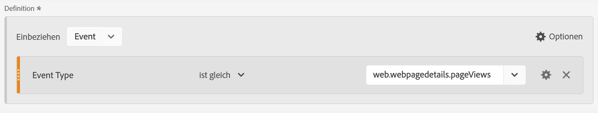
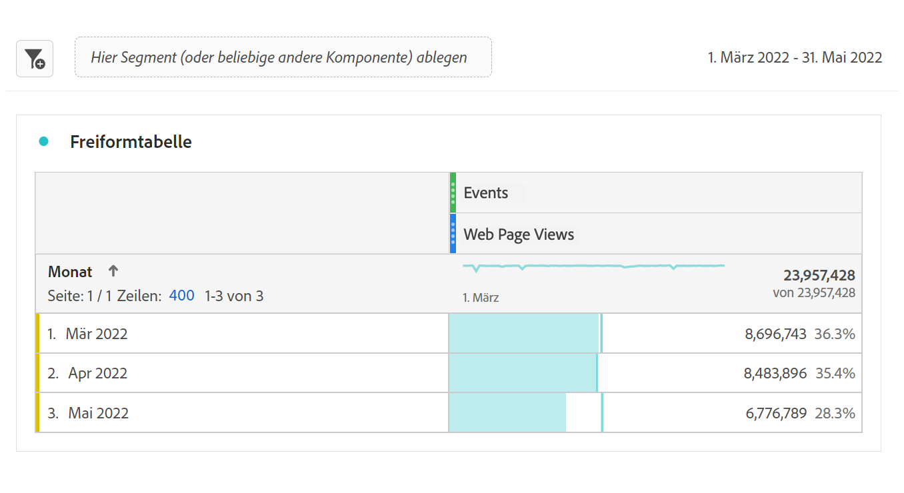
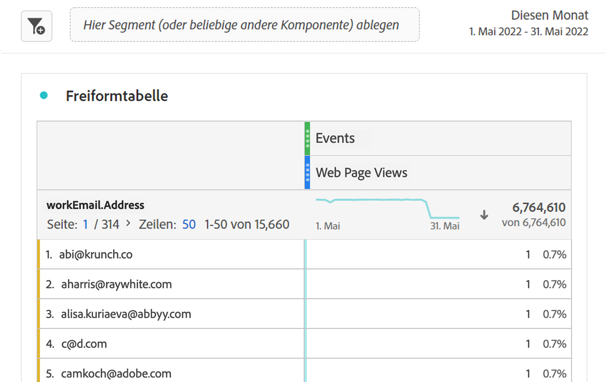

# Aufnahme von Marketo-B2B-Daten in AEP und Berichterstellung in CJA

Sie können die neu verfügbaren Marketo B2B-Datensätze in Adobe Experience Platform (AEP) nutzen, um B2B-Marketern wertvolle Analyse- und Berichterstellungslösungen bereitzustellen. Erstellen Sie dann einen Bericht zu diesen Datensätzen in Customer Journey Analytics (CJA).

## Schritt 1: Zuordnen von Marketo-Quelldatenfeldern zu ihren XDM-Zielen

Ordnen Sie die [Personen](https://experienceleague.adobe.com/docs/experience-platform/sources/connectors/adobe-applications/mapping/marketo.html?lang=en#persons) und [Tätigkeiten](https://experienceleague.adobe.com/docs/experience-platform/sources/connectors/adobe-applications/mapping/marketo.html?lang=en#activities) in die entsprechenden XDM-Schema-Zielfelder.

## Schritt 2: Marketo-Daten in AEP erfassen

Verwenden Sie die [Marketo Engage-Connector](https://experienceleague.adobe.com/docs/experience-platform/sources/connectors/adobe-applications/marketo/marketo.html?lang=en) , um B2B-Daten aus Marketo in die Experience Platform zu übertragen und mithilfe von Anwendungen, die mit Platform verbunden sind, auf dem neuesten Stand zu halten.

## Schritt 3: Einrichten einer Verbindung zu diesem Datensatz in CJA

Um über Experience Platform-Datensätze zu berichten, müssen Sie zunächst eine Verbindung zwischen den Datensätzen in Experience Platform und CJA herstellen. Weitere Informationen finden Sie unter [Verbindung erstellen](https://experienceleague.adobe.com/docs/analytics-platform/using/cja-connections/create-connection.html?lang=de).

## Schritt 4: Eine oder mehrere Datenansichten erstellen

A [Datenansicht](/help/data-views/data-views.md) ist ein für Customer Journey Analytics spezifischer Container, mit dem Sie bestimmen können, wie Daten aus einer Verbindung interpretiert werden. Sie enthält alle in Analysis Workspace verfügbaren Dimensionen und Metriken - in diesem Fall Metriken und Dimensionen, die spezifisch für Marketo sind. Sie gibt auch an, aus welchen Spalten diese Dimensionen und Metriken ihre Daten beziehen. Datenansichten werden in Vorbereitung auf das Reporting in Analysis Workspace definiert.

## Schritt 5: Bericht in Analysis Workspace

Ein Anwendungsfall, den Sie untersuchen können, ist: Wie viele Webseitenbesuche durch Leads hatten wir im April/Juni 2020?

1. Öffnen [Analysis Workspace](/help/analysis-workspace/home.md) und erstellen Sie ein neues Projekt.

1. Erstellen Sie eine [filter](/help/components/filters/create-filters.md) für Webseitenansichten wie folgt - Ereignistyp = web.webpageDetails.pageViews :

   

1. Ziehen Sie in die Freiformtabelle den von Ihnen erstellten Filter - Webseitenansichten und ziehen Sie dann in den Datumsbereich Monat . So erhalten Sie jeden Monat Webseitenbesuche nach Leads:

   

1. Oder ziehen Sie die folgenden Dimensionen ein: Personen-Schlüssel oder geschäftliche E-Mail-Adresse. Dadurch erhalten Sie die Webseitenbesuche jedes Leads:

   
